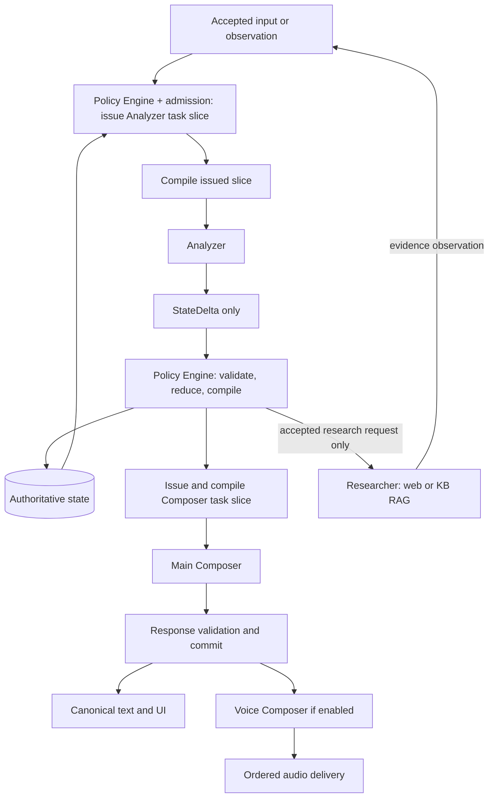

# Analyzer, Policy Engine, and Composer

Pattern ID: `analyzer-policy-composer`\
Version: `2.4`
Status: `reference-default`\
Owner: Cascade AI Architect

## Selection

Use this as the preferred starting architecture for stateful conversational
agents: an Analyzer proposes state changes, deterministic policy code accepts
them and compiles context, and a Composer produces the response. The voice
variant adds a Voice Composer; research is optional. This is Cascade's design
default for this scope, not a measured claim of universal superiority.

Keep these logical boundaries even when calls share a model, process, or
deployment. Start without research, voice, a broker, or separate services unless
the target needs them. For stateless transforms or fixed deterministic tasks,
record why a simpler design is sufficient. An existing coherent architecture
requires an explicit adoption or adaptation decision rather than migration by
default. Use [the template](../assets/analyzer-policy-composer.template.md)
alongside the complete fourteen-block blueprint.

In the machine packet use `topology.kind: model_pipeline` for two or more
runtime-routed model roles. Index deterministic policy/state/context functions
as workflows and tool-free model roles with `tools: []`. A positive tool-call
budget is a ceiling, never a requirement to call a tool. This additive schema
support requires a validator version that knows `model_pipeline`; older
installed validators must report incompatibility rather than relabel it as a
manager or self-directed tool loop.

## Flow and ownership

The Policy Engine is deterministic application code, not a model or a prompt.
With admission, it owns validation, state-reduction, routing and issuance of
role- and task-specific policy/state slices. Trusted projection helpers implement
that selection; the Context Compiler only formats the issued slice and approved
prompt assets. These functions share one application owner and need not be
separate services. This applies before the initial Analyzer call as well as to
Composer, Researcher, Voice and separately authorized frontend views.

| Component | Reads | Produces | Authority |
|---|---|---|---|
| Analyzer | Accepted event, scoped state, evidence, extraction contract | `StateDelta` | Proposals only; no user answer, persistence, direct research call, or domain tool execution |
| Policy Engine / runtime | Delta, authoritative state, versioned policy, authenticated scope | Accepted state revision, decision receipt, context projections, authorized work requests | Sole state commit, memory write, routing, and authorization owner |
| Main Composer | `ComposerContext` | `ResponseCandidate` | Sole model author of canonical meaning; approved fixed runtime status phrases are the narrow documented exception; no state/memory writes or tools |
| Voice Composer | Validated canonical answer and delivery controls | Presentation/segmentation output for the voice adapter | Presentation only; no independent facts, delivery confirmation, policy decisions, research, or tools |
| Researcher | One authorized `ResearchRequest` | `ResearchResult` evidence | Read-only retrieval inside the supplied scope; no answer publication or state commit |

An action executor, when the product needs side effects, consumes only runtime-
authorized commands and returns receipts as observations. It is an adapter, not
an additional agent by default. A proposed action, successful generation, or
spoken claim never proves that the action happened.
The voice adapter/client produces playback observations; runtime validates and
records delivery receipts. A model cannot certify that its own output was heard.

## Optional graph authoring across roles

Use [graph workflow authoring](graph-workflow-authoring.md) as the recommended
review option when dependencies, routing or evidence branches need to be made
explicit. The existing synchronous pipeline already supplies a static graph;
adoption does not add services, a scheduler or model roles.

Treat slice issuance, context rendering, proposal admission, transaction commit,
route enforcement and release enforcement as runtime-owned steps. Required
semantic interpretation and evidence-support checks remain explicit LLM or
qualified-reviewer assessments; deterministic validation alone cannot prove them.
Analyzer proposes;
Composer produces a candidate; neither owns the edges that authorize effects.
Compile a separate current context for each model step. Composer receives
admitted findings and required unresolved work, not raw Analyzer proposals as
accepted facts. A missing input returns to the issuer through the existing gap
path; the formatter and Composer do not acquire store or retrieval authority.

If independent research branches are selected, runtime binds their membership,
deadlines and allowed partial/failure outcomes. The join collects observations
with provenance; results still pass through Analyzer and admission before
Composer use. Revalidate late results before admission; reject duplicate,
cancelled or ineligible results without invalidating valid current context.
Only admitted changes to relevant state, evidence, permissions or dependencies
invalidate affected context. Dynamic research expansion is
optional and bounded by the same admission and shared budgets.

Carry these selected decisions together into workflow, context and prompt briefs.
Keep pattern 2.4 and existing wire contracts; this is an authoring option, not
an additional registered transport profile or a measured performance claim.

## Claims and the Analyzer boundary

Apply [the semantic decision boundary](semantic-decision-boundary.md).
Analyzer interprets text into typed proposals; code consumes admitted fields.
Never infer intent, claim meaning, negation, approval or routing from plain-text
regexes or keywords, including a shortcut before Analyzer or a fallback after
invalid output. Semantic ambiguity is resolved or reported by the model; code
checks the explicit status and domain rules without pretending to verify meaning.

Use [StateDelta, policy data, and role projections](state-delta-policy-projection.md)
for the detailed wire contract, record update semantics, projection rules, and
checkpointed memory behavior. `PolicyDefinition` owns rules; `PolicyData` owns
collected values; `PolicyEvaluation` owns derived decisions. Only runtime may
commit them within their declared writer boundaries.

The adapter binds each parsed semantic proposal to runtime-owned `schema_version`,
`event_id`, `turn_id`, `base_revision`, `idempotency_key` and authenticated scope.
Advertise only the semantic proposal schema to Analyzer; hidden envelope fields
are not model output requirements. Reject attempts to supply runtime-owned fields
rather than accepting model authority. See the [transport boundary](event-projections-and-context-format.md#analyzer-output-profiles).
Accept only typed, allowlisted
operations such as `change_policy_data`, `propose_claim`, `supersede_claim`, `resolve_question`,
`propose_memory`, `request_research`, `propose_action`, `resolve_choice`,
and `propose_plan_change`. No arbitrary JSON
path writes, raw replacement state, policy edits, or executable instructions.

A claim carries a stable semantic key, subject/predicate/typed value, exact
source locator and span or media timestamps, source digest/version, observation
time, applicable scope, and support classification. Preserve literal values,
negation, units, uncertainty, and speaker attribution. Normalize in a separate
field; never silently replace the original. Separate `observed`, `reported`,
`inferred`, `disputed`, `superseded`, and `unknown`; model confidence is neither
truth nor authorization. Do not extract facts from filler or unfinished speech.

The Analyzer proposes claim classification. Runtime checks decide admissibility;
domain verification or user confirmation supplies any stronger truth claim.
Keep contradictory observations and their provenance. Corrections supersede a
specific claim through policy, not by overwriting history. Material ambiguity
creates a pending question. Risky codes, identifiers, measurements, and similar
spans require the target's confirmation rule before dependent actions.

Research demand is itself a delta operation: a knowledge gap plus a proposed
bounded query. If no knowledge gap needs retrieval, emit no `request_research`
operation. An absent request means zero research jobs and zero retrieval calls.
The Analyzer cannot place work directly on a queue.

A delta can contain many direct updates and many analysis blocks. Each block
contains independently selectable parts; each part may return several semantic
candidates with their own atomic update groups. Policy Engine validates and
selects them under registered cardinality and conflict rules. Unresolved
alternatives create a question/defer/review result instead of writing all values.

## State and policy compilation

Keep authoritative state outside model history. Separate domain facts, claim
ledger, pending questions, task/action intents, research lifecycle, memory
references, per-instance policy data and evaluations, response records, and
delivery state. A generated
or played response cannot modify domain facts. Transport callbacks update only
their allowlisted delivery fields through the runtime.

For each event, the runtime performs:

1. Authenticate and bind scope; deduplicate the event and validate the schema.
2. Assemble bounded Analyzer context from the current revision and allowed
   evidence. Invoke the Analyzer with no tool or persistence capability.
3. Validate its delta, exact source references, permitted operations, and
   `base_revision`. Reject or re-analyze stale proposals; never blindly merge.
4. Evaluate versioned policies against current authority and proposed state.
   Stage accepted operations and cross-group invariants with a decision receipt.
   Group dependent operations so a partial rejection cannot publish dependents.
5. Commit current state, receipt and pending work in one transaction/CAS.
   Build role contexts directly from that committed snapshot. Event journaling
   and persisted read models are optional. Use an outbox when an
   external queue needs it; recover undispatched intents even without a broker.
   Deduplicate both enqueue and consume. Projection failure after commit does not
   roll back accepted state; retry projection or return a context gap.
6. Before dispatch, recheck cancellation, permissions, policy version, and
   relevant revision. On research completion, route the evidence back through
   the Analyzer and Policy Engine. Recompile context after accepted changes.
7. Validate the Composer candidate against its context identity, allowed claims,
   actions, and required uncertainty. Commit one canonical answer per response
   revision, then release text, UI, and optional speech for delivery.

Each policy declares ID/version, authority source, applicable scope, condition,
effect, priority, obligations, reason, and affected state/context fields. The
minimum policy families are source trust, claim admission, state transition,
authorization/confirmation, retrieval, memory, context disclosure, output,
delivery, and budgets/recovery. Effects include `ALLOW`, `DENY`, `REQUIRE_INPUT`,
`REQUIRE_CONFIRMATION`, `REDACT`, and `DEFER`.

Hard authorization and safety constraints cannot be weakened by preferences,
retrieved text, model output, or a later timestamp. Explicit denials win at equal
scope; missing required authority and unresolved policy conflicts block the
affected operation. Use typed rules for conditions, not prose interpreted by a
model at enforcement time. Semantic assessments may be observations, never the
final permission authority. Record matched rules and reasons; invalidate their
dependent decisions/context when source, state, permission, or policy changes.

## Context compilation

`ComposerContext` contains `context_id`, `state_revision`, policy/source
digests, purpose, accepted claims with evidence references, pending questions,
permitted response acts, required disclosures/confirmations, verified action
receipts, locale/channel, output schema, token budget, and expiry. It is a
minimal projection, not the raw delta, full transcript, or entire memory store.

Analyzer and Main Composer receive separate top-level `IdentityContext`,
`ContinuityContext`, and `NextStepContext` projections. The Composer reference
default includes a compact formatted window of up to 20 accepted conversation
turns, short recent memory over at most that window, independently selected task/durable
memory, and every current-task next
step authorized for disclosure to that role. Identity expands beyond its minimal
actor/session binding for allowed personalization, identity questions, first-contact
introductions or required capability disclosures. Researcher and Voice Composer do not inherit continuity or next-step
blocks by default; each receives only its smaller purpose-bound identity data.

Put trusted instructions and typed controls in separate fields from untrusted
source excerpts. Select by scope, purpose, authority, relevance, and freshness;
apply redaction and budget limits before handoff. Keep critical policies and
unresolved conflicts when compacting; if they cannot fit, return a bounded gap
instead of silently dropping them. Use the same policy rules for the initial
Analyzer context and for result-triggered re-analysis.

The Main Composer can express only permitted response acts using admitted
claims. Missing information returns a typed composition gap to the runtime; it
does not trigger direct retrieval or invent a value. Context or policy expiry
requires revalidation before publication. Schema and reference checks establish
structural eligibility; factual entailment and faithful phrasing still require
semantic evaluation. Do not describe deterministic checks as proof of meaning.

The baseline buffers and validates the whole response before external release.
Provider token streaming is internal until that gate passes. A target that needs
incremental publication must define a separate chunk protocol: each released
prefix is validated against current dependencies, ordered and irrevocable, with
response/segment identities, cancellation and partial-delivery receipts. Later
validation cannot retract already visible text or heard speech. Do not enable
raw token forwarding merely to meet a first-token latency target.

## Memory lifecycle

| Layer | Contents | Read/write rules |
|---|---|---|
| Working state | Current task, accepted claims, pending actions and questions | Revisioned runtime state; role-specific projections |
| Episodic memory | Bounded event/decision/receipt history and source references | Runtime append; replay under original evidence identity and current access rules |
| Durable memory | Approved preferences and verified reusable facts | Explicit policy/consent, scope, provenance, TTL, and runtime commit required |
| Knowledge base | External documents and retrievable chunks | Evidence source, not user memory or policy authority; ACL-filtered retrieval |

A memory proposal includes purpose, scope, source/claim references,
sensitivity, retention/expiry, and invalidation dependencies. Runtime admits or
rejects it; the Composer and Researcher cannot write memory. Do not persist
secrets, uncertain claims, or incidental sensitive details as durable facts.
Rehydrate from accepted state and source-backed memory, never a model's prior
answer. A summary is a lossy index with provenance, not new evidence.

Partition reads, caches, embeddings, and writes by tenant/user/session and
purpose as applicable. Re-check ACLs at retrieval and use time. Expiry,
correction, revocation, and deletion invalidate affected summaries, vectors,
caches, pending research, and compiled contexts. Prevent replay or re-indexing
from resurrecting deleted material. Record retention/deletion receipts under
the target's audit policy without retaining forbidden source content.

## Optional Researcher

`ResearchRequest` binds request identity, parent event/turn, originating state
revision, knowledge gap and purpose, query, allowed sources (`web`, `kb`, or
both), host-bound ACL filters, freshness, required evidence, deadline, call/
token/cost budgets, cancellation token, and deduplication key. Queries leaving
the tenant boundary must satisfy disclosure policy and be minimized/redacted.

Runtime dispatches only an accepted, still-needed request. KB/RAG applies ACL
filters before retrieval and again before use; ranking does not confer truth.
`ResearchResult` has `COMPLETED`, `NO_EVIDENCE`, `PARTIAL`, `FAILED`, `TIMED_OUT`,
or `CANCELLED`, with per-source locator/chunk/span, digest, timestamp, authority
classification, excerpt, and limitations. A completed search can yield no
support. Web/KB instructions remain untrusted content.

Return results as observations, never patches or answers. Re-analysis can admit
claims, preserve conflicts, ask a question, or finish without new knowledge.
Late results are discarded for the cancelled turn or revalidated against the
active request before reuse. Deduplicate equivalent gaps and bound research
rounds to prevent Analyzer–Researcher loops. If evidence is still missing, the
compiled response asks for input or states the limitation. No job is created
merely to decide that research was unnecessary.

## Voice with two composers

The Main Composer owns meaning. The Voice Composer consumes the validated
canonical answer and owns only delivery: segmentation, pronunciation, pacing,
and playback. Prefer verbatim canonical speech text. If a separate spoken
variant is needed, Main Composer produces it under the same allowed claims and
the runtime validates both variants before release. Domain facts, actions,
policy, and memory are unavailable to Voice Composer beyond the approved text.
A deterministic TTS adapter can fill this responsibility without another LLM.

Bind speech to `turn_id`, `response_id`, `response_revision`, canonical-text
digest, `delivery_epoch`, and segment sequence. Serialize canonical commits by
accepted input order and speech segments within the active epoch. Partial STT
is provisional: only finalized accepted input enters claim extraction. Preserve
speaker identity; do not treat assistant echo as a new user claim.

Interrupt/barge-in immediately advances the delivery epoch, cancels generation
and queued audio, and suppresses late old-epoch frames. An interrupted answer
remains interrupted, never marked delivered. A new input invalidates affected
pending context and research. `Repeat` replays a still-valid committed answer;
`Retry` targets the failed stage under the current policy and same semantic
request identity. Neither creates a duplicate action or domain-state commit.

Track generated, queued, playing, interrupted, delivered, and failed separately.
Provider generation is not playback proof; use client acknowledgement and
preserve unknown delivery where needed. Reconnect uses revision/epoch checks,
not unconditional buffered replay. Optional latency acknowledgements must be
policy-approved fixed phrases with no task facts or promises. Measure STT,
analysis, policy, composition, first audio, and interrupt-stop latency separately.
Use the [interim response contract](interim-responses.md) for optional Composer
selection or direct delivery of an approved fixed phrase through Voice Composer.
Both paths retain response validation, checkpoint dedupe and stale-delivery gates.

## Acceptance and evidence

Target designs must bind these cases to actual interfaces and finite budgets:

| Case | Required observation |
|---|---|
| Answerable from accepted state | No research request/job/call; one canonical response |
| Missing current fact | One admitted bounded request; result re-enters analysis before composition |
| Invalid or forbidden delta | No forbidden state change, dispatch, or context disclosure |
| Duplicate/stale turn or result | Idempotent outcome or explicit stale rejection; no lost update |
| Conflicting, inferred, or ambiguous claims | Provenance and uncertainty retained; dependent action gated |
| Prompt injection or wrong-tenant RAG hit | No authority escalation, cross-scope retrieval/use, or disclosure |
| Memory correction/deletion or ACL revocation | Dependent memory/context invalidated; no resurrection |
| Policy changes during work | Old decision/context revalidated before dispatch/publication |
| Tool timeout with unknown side effect | Unknown outcome retained; reconcile receipt before retry |
| Voice interrupt, retry, repeat, echo, and reconnect | Order and attribution preserved; no stale audio or duplicate action |
| Research failure or exhausted budget | Bounded partial/question/blocked result; no recursive loop |
| Unsupported Composer assertion | Candidate withheld or corrected; semantic verdict recorded separately |

Trace accepted inputs, deltas, revisions, policy decisions, context manifests,
research lifecycle, response commits, tool and delivery receipts, budgets, and
terminal reasons with redaction. Pin architecture, schema, prompt, policy,
source, and model identities. Test deterministic invariants separately from
model semantics, provider transport, and physical acoustic behavior. A template
or schema pass proves none of those runtime outcomes.

## Implementation and completeness

Pattern 2.4 adopts [event projections, checkpoint grouping and compact model text](event-projections-and-context-format.md).
Analyzer emits JSON StateDelta; deterministic admission commits accepted changes,
Policy Engine/admission issues role/task policy-state slices under access,
freshness and budget rules, and Context Compiler formats only those issued inputs.
Keep stable role/catalog prompt segments
ahead of dynamic context with a supported cache boundary. Apply the extension's
authoring checklist when generating roles, workflows or prompt briefs.
The [simple modular/vertical-slice profile](simple-modular-agent.md) is the default;
CQRS, persisted read views and event sourcing are explicit optional extensions.

Read the [coverage and implementation assessment](implementation-and-completeness.md)
for all fourteen behavior blocks, remaining target adapters, adoption scenarios
and the baseline comparison. Validate the [wire contracts](agent-contracts.schema.json)
with the packaged offline validator before adopting a target profile.

## Basis and alternatives

This contract is derived from the maintainer's requested authority split.
External references support building blocks, not the exact pattern's superiority:

- [Anthropic: Building effective agents](https://www.anthropic.com/engineering/building-effective-agents)
  supports simple composable workflows and explicit intermediate gates. Its
  tooling discussion is historical; no framework recommendation is inferred.
- [LangGraph: Graph API](https://docs.langchain.com/oss/python/langgraph/graph-api)
  describes state updates and reducers, useful for implementing the runtime
  boundary without putting state authority in prompt history.
- [LangGraph: Memory](https://docs.langchain.com/oss/python/concepts/memory)
  distinguishes thread state from longer-lived memory.
- [OpenAI Agents SDK: Voice pipeline](https://openai.github.io/openai-agents-python/voice/pipeline/)
  documents a chained speech/agent workflow; the two-composer authority split
  and stale-audio rules here are Cascade design requirements.

Reviewed on 2026-09-04. Compare the default with a single-call baseline using
grounding, unauthorized changes, latency, cost, recovery, and voice delivery
evidence before calling a target implementation better.
