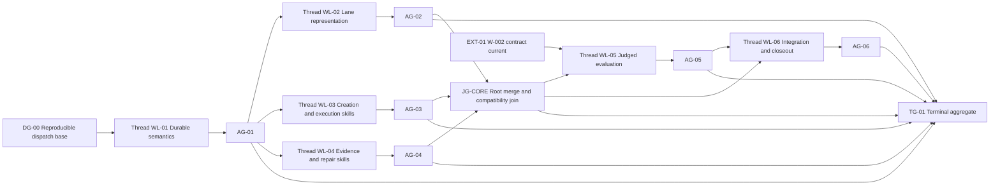

# Work Lane: W-003

Status: `COMPLETE`
Planning Status: `IMPLEMENTED`
Plan Revision: `24`
Owner: `agent-engineer`
Created: 2026-07-22
Lane Model: `orchestrator-workers-dependency-waves`
Next Gate: none; `CG-TG-04` accepted
Graph Revision: `4` — final embedded revision, `FROZEN` and `SUPERSEDED_BY CG-001`
Coordination Graph: `docs/work/graphs/CG-001-w003-coordination-graph.md`, revision `4`

## Revision 24 Complete Current-Fragment Disposition Amendment

At the plan-23 fixed point `5f384aa4...`, Standards and Spec passed, but
architecture found that the top-level current ledger delegated omitted
fragment dispositions back to the Historical Revision 6 table.

The user's standing instruction authorizes bounded WL-12 review attempt
`21/21`. `CG-AM-21` leaves graph revision 4, current IDs, producer evidence,
actors, topology, validation authority, transition quarantine, and canary
budget unchanged. `CG-RP-23` invalidates all three plan-23 reviews for
acceptance, enumerates every current fragment disposition in the top-level
Plan-24 ledger, and marks every Historical Revision 6 fragment row explicitly
event-time and `NO_RESUME`.

## Historical Revision 23 Historical-Fragment Repair-Authority Amendment

At the plan-22 fixed point `4a3aeaf6...`, Standards and Spec passed, but
architecture found one residual present-tense reopen rule in the Historical
Revision 6 fragment narrative.

The user's standing instruction authorizes bounded WL-12 review attempt
`20/20`. `CG-AM-20` leaves graph revision 4, current IDs, producer evidence,
actors, topology, validation authority, transition quarantine, and canary
budget unchanged. `CG-RP-22` invalidates all three plan-22 reviews for
acceptance, converts the residual rule and table heading to event-time history,
and routes every present fragment drift/reopen decision only through the
top-level current ledger and `CG-AG-17`.

## Historical Revision 22 Fragment-Ledger Direct-Cutover Amendment

At the plan-21 fixed point `5ac3d93f...`, Spec passed, but architecture and
Standards found that the current `GF-004@1`/`GF-008@1` actor, test, evaluator,
and gate bindings still lived inside the Historical Revision 6 fragment
ledger.

The user's standing instruction authorizes bounded WL-12 review attempt
`19/19`. `CG-AM-19` left graph revision 4, current IDs, producer evidence,
actors, topology, validation authority, transition quarantine, and canary
budget unchanged. `CG-RP-21` invalidated all three plan-21 reviews for
acceptance and directly cut current fragment authority over to a new
top-level Plan-22 ledger. The Historical Revision 6 rows retain only their
event-time `CG-AG-15/16` bindings.

## Historical Revision 21 Historical-Scope Bridge Removal Amendment

At the plan-20 fixed point `9b17c012...`, all three independent reviews
rejected one redundant present-tense “current Plan-19 route” bridge still
nested beneath Historical Revision 6.

The user's standing instruction authorizes bounded WL-12 review attempt
`18/18`. `CG-AM-18` left graph revision 4, current IDs, producer evidence,
actors, topology, validation authority, transition quarantine, and canary
budget unchanged. `CG-RP-20` invalidated all three plan-20 reviews for
acceptance and deleted that redundant bridge. Current routing remained
authoritative only in the top-level current contract and `CG-001` Current
Frontier.

## Historical Revision 20 Drift-Proof Current-Route Pointer Amendment

At the plan-19 fixed point `844818ee...`, the independent Spec review passed,
but architecture and Standards rejected one stale Plan-18 qualifier in the
otherwise quarantined `CG-TR-15` current-route pointer.

The user's standing instruction authorizes bounded WL-12 review attempt
`17/17`. `CG-AM-17` left graph revision 4, current IDs, producer evidence,
actors, topology, validation authority, transition quarantine, and canary
budget unchanged. `CG-RP-19` invalidated all three plan-19 reviews for
acceptance and removes the drift-prone plan number: the row now points only to
the canonical Current Frontier route.

## Historical Revision 19 Current-Validation Authority Amendment

At the plan-18 fixed point `946a3760...`, the transition-history quarantine
passed, but all three independent reviews rejected stale Plan-17 labels in the
current exact-test and Validation Plan authority. Standards also found that
the live command contract was nested beneath Historical Revision 6 and that
Compact Resume still named task revision 15.

The user's standing instruction authorizes bounded WL-12 review attempt
`16/16`. `CG-AM-16` left graph revision 4, current IDs, producer evidence,
actors, topology, and canary budget unchanged. `CG-RP-18` invalidates all
three plan-18 reviews for acceptance, promoted the exact current test/evaluator
binding to a top-level Plan-19 section, and bound Validation Plan and Compact
Resume to Plan 19 / task revision 17.

## Historical Revision 18 Transition-History Quarantine Amendment

At the plan-17 fixed point `5b51ff82...`, the deterministic batch passed and
the independent architecture and Spec reviews passed, but the required
Standards review failed. Three event-time rows in the authoritative
Coordination Graph transition table still exposed actionable-looking legacy
routes: `CG-BR-01`, `CG-TR-09`, and `CG-TR-15`.

The user's standing instruction authorizes bounded WL-12 review attempt
`15/15`. `CG-AM-15` left graph revision 4, current IDs, producer evidence,
actors, topology, and canary budget unchanged. `CG-RP-17` invalidates all
three plan-17 reviews for acceptance and changed only those retained
transition-history projections: each is explicitly historical and
`NO_RESUME`, and present execution is routed only through
`CG-AG-17 -> CG-AG-18 -> CG-TG-04`.

## Historical Revision 17 Residual Legacy-Slice Quarantine Amendment

At the plan-16 fixed point `89ed364c...`, all deterministic checks passed, but
all three independent reviews rejected the remaining current-looking
`SL-05A/B/C` implementation, traceability, repair, and risk routes.
Architecture also found `CG-BATCH-02` still exposing a repair route, while
Spec found revision 7 still describing HEAD `230d67a...` as current.

The user's standing instruction authorizes bounded WL-12 review attempt
`14/14`. `CG-AM-14` left graph revision 4, current IDs, producer evidence,
actors, topology, and canary budget unchanged. `CG-RP-16` invalidates all
three plan-16 reviews for acceptance, froze SL-05A-C and CG-BATCH-02 as
historical/superseded/`NO_RESUME`, creates current slice projection `SL-18`
for T-18/CG-AG-18 only, and marked revision 7 historical.

## Historical Revision 16 Legacy-WL05 Isolation And T17 Binding Amendment

At the plan-15 fixed point `c66faf80...`, all deterministic checks passed, but
architecture and Spec found that the current T-17 ownership row still bound
plan 14/task revision 12. Standards additionally found that the retained
workline/task checklist and WL-05 implementation section still exposed legacy
T-05A/B/C and AG-05 as executable-looking current instructions.

The user's standing instruction authorizes bounded WL-12 review attempt
`13/13`. `CG-AM-13` leaves graph revision 4, current IDs, producer evidence,
fragments, and canary budget unchanged. `CG-RP-15` invalidates all three
plan-15 reviews for acceptance, binds T-17 to plan 16/task revision 14, and
marks every legacy T-05A/B/C, WL-05, MQ-05, and AG-05 projection as historical,
superseded where applicable, and `NO_RESUME`. The sole current WL-05 route is
`T-18 / CG-AG-18` after `CG-AG-17`.

Before the plan-16 fixed point was reviewed, the active branch advanced through
existing commits `0e59787...` and `40433de...`, which materialized the prior
W-003 documentation state on the branch and its remote. Plan 16 preserves
those commits, changes no topology or canary budget, and binds all current
T-17 evidence to HEAD `40433dea641b32b964e314ce37dc024f6da5b79e` plus one
current unstaged diff digest. Historical receipts remain bound to their
original HEADs.

## Historical Revision 15 Current Validation Authority Amendment

At the plan-14 fixed point `39038553...`, architecture and Spec passed.
Standards found the unqualified main Validation Plan still projecting legacy
AG-05, 309 scenarios, 18 self-tests, no spend authority, and no architecture
review as current. The prompt, ownership, tool, docs-impact, queue, and
no-runtime boundaries passed.

The user's standing instruction authorizes bounded WL-12 review attempt
`12/12`. `CG-AM-12` leaves graph revision 4, current IDs, producer evidence,
fragments, and canary budget unchanged. `CG-RP-14` invalidates all three
plan-14 reviews for acceptance and replaces only that validation projection
with current `CG-BATCH-05 / CG-IV-03 / CG-AG-17`, the three reviews, and gated
`CG-AG-18 / CG-TG-04`.

## Historical Revision 14 Complete Legacy-Authority Isolation Amendment

At the plan-13 fixed point `697f4f92...`, architecture and Spec found the
historical P-WL01..06 checklist still nested inside current root prompt
authority. Standards also found unqualified WL-06 ownership/tool permissions
in the lane. The plan-12 docs-impact and P-ROOT-CONTROL defects were repaired;
all other requested graph, evidence, route, and no-runtime boundaries passed.

The user's standing instruction authorizes bounded WL-12 review attempt
`11/11`. `CG-AM-11` leaves graph revision 4, current IDs, producer evidence,
fragments, and canary budget unchanged. `CG-RP-13` invalidates all three
plan-13 reviews for acceptance and isolates every remaining named legacy
checklist, write scope, and tool grant from current T-17/T-18 authority.

## Historical Revision 13 Final Historical-Route Quarantine Amendment

At the plan-12 fixed point `2372d37c...`, architecture passed. Standards found
two unqualified current routing rows that still selected historical
`T-06A/R-06A`, and Spec found the retained `P-ROOT-CONTROL` worker-dispatch
checklist nested inside the current-root prompt section. All other requested
current/history, graph, evidence, and no-runtime boundaries passed.

The user's standing instruction authorizes bounded WL-12 review attempt
`10/10`. `CG-AM-10` leaves graph revision 4, current IDs, producer evidence,
fragments, and canary budget unchanged. `CG-RP-12` invalidates all three
plan-12 reviews for acceptance and limits repair to routing current docs impact
through `SB-CURRENT-CLOSE/T-17` and moving the old root dispatch checklist into
explicit `NO_DISPATCH/NO_RESUME` history.

## Historical Revision 12 Current-Prompt Authority Amendment

At the plan-11 fixed point `0c14304f...`, all deterministic checks passed, but
architecture, Standards, and Spec reviews agreed that current T-17/T-18 prompt
bindings were structurally nested under the frozen historical worker bank and
still appeared to inherit `P-WORKER`. The reviews also found stale task
revision text and two retained WL-06/SB-CLOSE rows that remained
executable-looking.

The user's standing instruction authorizes bounded WL-12 review attempt `9/9`.
`CG-AM-09` leaves graph revision 4, current IDs, producer evidence, fragments,
and canary budget unchanged. `CG-RP-11` invalidates all three plan-11 reviews
for acceptance and limits repair to current prompt authority, stale revision
labels, and explicit `HISTORICAL_BLOCKED; SUPERSEDED; NO_RESUME` treatment of
the retained WL-06 closeout route.

## Historical Revision 11 Prompt-And-Closeout Freeze Amendment

At the plan-10 fixed point `8b66d068...`, architecture passed while Standards
and Spec found that the retained worker prompt bank and WL-06 closeout sections
still looked executable, and that `CG-E-18` did not name its readiness
condition. Plan 11 freezes those packet/trace surfaces, adds current T-17/T-18
prompt and CR-08/CR-10 ownership, and makes the readiness rule explicit.

The user's standing instruction authorizes bounded WL-12 review attempt `8/8`.
`CG-AM-08` leaves graph revision 4, current IDs, producer evidence, fragments,
and canary budget unchanged; `CG-RP-10` invalidates all three plan-10 reviews
for acceptance.

## Historical Revision 10 Historical-Route Freeze Amendment

At the plan-9 fixed point `d96e6193...`, architecture passed while Standards
and Spec found that retained revision-6/revision-5 records still expressed
executable current/resume semantics. Plan 10 freezes those edges, gates,
terminal, and packet directives as historical and routes present execution
only through `CG-AG-17 -> CG-AG-18 -> CG-TG-04`.

The user's standing instruction authorizes bounded WL-12 review attempt `7/7`.
`CG-AM-07` leaves graph revision 4, all current IDs, producer evidence,
fragment bindings, and the canary budget unchanged; `CG-RP-09` invalidates all
three plan-9 reviews for acceptance.

## Historical Revision 9 Current-Route Repair Amendment

All three plan-8 fixed-point reviews at digest `7f5a0322...` failed on
remaining current-route projection drift. The converged repair set is limited
to Plan-9 authority labels, current WL-05/WL-11/WL-14 traceability, packet
resume and closeout routing, and the current integrated/terminal projections.
Accepted producers, commands, fragments, actors, evaluators, graph topology,
and the separately gated canary remain unchanged.

The user's standing instruction to continue until done authorizes bounded
WL-12 review attempt `6/6`. Plan revision advances to 9; Coordination Graph
revision remains 4 because no topology, dependency, actor, owner, gate, or
canary-budget field changes. `CG-AM-06` and `CG-RP-08` retain all three failed
plan-8 receipts and invalidate them for acceptance.

## Historical Revision 8 Final Review Repair Amendment

The first plan-7 fixed-point review at digest `6ea7ea41...` produced one
independent architecture `PASS` and required Standards/Spec `FAIL` receipts.
The failures identify stale current/historical labeling, one incomplete
omission row, and current consumer projections only; accepted producers,
commands, fragment actor/evaluator resolution, and graph topology remain
unchanged.

The user’s standing instruction to continue until done authorized bounded
WL-12 review attempt `5/5`. Plan revision advanced to 8 because the
current projection and omission definitions change. Coordination Graph
revision remains 4 because no workline, dependency, actor, owner, gate, or
topology changes. `CG-AM-05` preserves `CG-AG-17/18`, `CG-BATCH-05/06`,
`CG-IV-03`, and `CG-TG-04`; failed plan-7 reviews remain historical evidence.

## Historical Revision 7 Current-Head Recovery Amendment

The user explicitly authorized continuation through the terminal gate after
revision-6 attempt `3/3` exhausted. `CG-AM-04` advances the plan to revision 7
and the Coordination Graph to revision 4 because the selected-fragment actor,
test, evaluator, and terminal-gate contracts are now complete and the active
fixed point changed from HEAD `a14a9bc...` plus an unstaged materialization to
clean committed HEAD `230d67a15db0d9e2fc25df8e0772ff506862d265`.

Revision 7 historically preserved all accepted producer transports and failures.
It creates never-reused replacement gates `CG-AG-17`, `CG-AG-18`,
`CG-BATCH-05`, `CG-BATCH-06`, `CG-IV-03`, and `CG-TG-04`. `WL-12` receives
one then-current bounded repair/review attempt `4/4`; `WL-05` received one
then-current canary attempt `4/4` only after `CG-AG-17` accepted.

That historical committed fixed point does not retroactively authorize the earlier commit
or convert historical no-commit receipts into current evidence. Revision-7
integrated evidence bound then-current HEAD `230d67a...` plus the then-current unstaged
repair digest, proves the accepted producer content/preserved adaptations, and
used the active root as the evidence locus. Revision 7 is `NO_RESUME`; current
authority is Plan 24/task revision 22 at HEAD `40433de...`.

## Historical Revision 6 Repair Amendment

The user authorized implementation after the terminal-canary blocker report.
Revision 6 historically preserved legacy `WL-05` attempts `1/2` and `2/2`.
It changed the repair workline and gate contracts, so `CG-AM-03` advanced the
Coordination Graph to revision 3 and introduced never-reused replacement gates.

| Workline | Outcome | Owner / Existing Worktree | Allowed Writes | Requires | Produces | Attempt / Max |
|---|---|---|---|---|---|---:|
| `WL-13` | make the product-visible-proof versus read-only evidence-impact route boundary unambiguous | `W003-WL13` / `/private/tmp/cascade-w003-wl09-r5-cg1` | `CODEX.md`; `.codex/agents/orchestrator/AGENT.md`; `.codex/skills/functional-qa/SKILL.md`; `.codex/skills/validate-change/SKILL.md` | preserved `CG-AG-09`; failed traces A1/A2 | reviewed immutable transport; `CG-AG-13` | `1/2` |
| `WL-14` | define current-support versus future-handoff output semantics and bind the current 331-scenario catalog to one immutable harness transport | `W003-WL14` / `/private/tmp/cascade-w003-wl11-r5-cg1` | `scripts/run_harness_evals.py`; `evals/harness/skill-cases.json`; `evals/harness/interactions.json`; `evals/harness/scenarios.generated.json` | preserved `CG-AG-08`, `CG-AG-09`; failed trace A2; current active-root skill-case source and `HX-047..051` | reviewed immutable transport; `CG-AG-14` | `1/2` |
| `WL-12` | historically materialize WL-13/WL-14 without committing and establish the then-current fixed point | root `agent-engineer` / active worktree | CG-001 state plus exact accepted repair paths | `CG-AG-13`, `CG-AG-14` | `CG-MQ-13`, `CG-MQ-14`, `CG-BATCH-03`, `CG-IV-02`, `CG-AG-15` | `3/3` |
| `WL-05` | historically execute one replacement `HX-031` target and, only if eligible, both independent judges | root authorized runner / active worktree | `.artifacts/harness-evals/<historical-run-id>` only | hypothetical accepted `CG-AG-15`; then-current catalog/source/profile/rubrics | `CG-BATCH-04`, `CG-AG-16` | `3/3` |

Historical revision-6 boundaries:

- `WL-13` and `WL-14` are parallel-safe because their writes are disjoint.
- The active-root `skill-cases.json` is an explicit read-only producer input for
  `WL-14`. The worker may copy that exact file into its owned transport after
  recording byte identity; it may not reinterpret or expand the skill cases.
- Worker success proposes `REVIEW`; root alone accepts gates and mutates
  CG-001.
- Root materializes accepted transports without staging or committing the
  active branch. Exact byte identity may satisfy an already-present WL-14 path,
  but an unbound root diff never substitutes for its transport.
- `CG-TG-03` replaces the exhausted `CG-TG-02` terminal contract. The old
  terminal, gates, batches, traces, and fixed-point reviews remain immutable
  historical evidence.
- The historical replacement canary had one attempt only. A mechanical failure
  ended revision-6 execution at `BLOCKED`; no fourth target attempt was
  authorized by that revision.
- Evaluation and both required judges run only after target eligibility passes.

### Revision 6 Graph-Fragment Composition Ledger

This ledger applies the new composition contract to the revision-6 repair
without retroactively rewriting revision-4/5 history.

| Fragment | Disposition | Activation / Omission Reason | Port Bindings | Actor / Skills | Tests / Evaluator / Gate |
|---|---|---|---|---|---|
| `GF-004@1` shared contract | `SELECTED; EVENT_TIME; NO_RESUME` | Event-time Revision 6 route ownership and target-output semantics were shared by skill/role consumers and the harness runner. | conditional `product.acceptance` was not activated because Cascade has no product runtime; provided `shared.contract = R6-ROUTE-OUTPUT-CONTRACT` to WL-13, WL-14, and the historical canary | event-time root `agent-engineer`; historical `architecture-review`, `plan-change`, and `implement-change` routes | retained Revision 6 commands/reviews; event-time root evaluated historical `CG-AG-15/16`; `NO_RESUME` |
| `GF-008@1` integration wiring | `SELECTED; EVENT_TIME; NO_RESUME` | Event-time Revision 6 producer outputs were combined and validated together. | required historical `implementation.output = {bd8104ac..., 36a067c5...}`; provided historical `integration.accepted = CG-AG-15` | event-time root `agent-engineer`; historical `implement-change`, `validate-change`, and conditional `architecture-review` | retained Revision 6 fixed-point evidence; event-time root evaluated historical `CG-AG-15`; `NO_RESUME` |
| `GF-001@1`, `GF-002@1`, `GF-003@1` | `NOT_APPLICABLE; EVENT_TIME; NO_RESUME` | Event-time Revision 6 decision: no new product definition, UI/UX design, or prototype/mockup was created by this harness-contract repair. | no ports emitted or required | none | no product/design/mockup tests or gates; `NO_RESUME` |
| `GF-005@1`, `GF-006@1`, `GF-007@1` | `NOT_APPLICABLE; EVENT_TIME; NO_RESUME` | Event-time Revision 6 decision: no backend service, frontend client, or data migration surface existed in Cascade. | no ports emitted or required | none | no backend/frontend/migration tests or gates; `NO_RESUME` |
| `GF-009@1` | `NOT_APPLICABLE; EVENT_TIME; NO_RESUME` | Event-time Revision 6 decision: HX-031 was an agent-harness canary under the preserved W-002 contract, not a public-start product journey. | no ports emitted or required | none | no E2E-fragment test or gate; retained canary details exist only in the separate W-002 non-fragment contract below; `NO_RESUME` |
| `GF-101@1`, `GF-102@1`, `GF-103@1` | `NOT_APPLICABLE; EVENT_TIME; NO_RESUME` | Event-time Revision 6 decision: no security, accessibility, or visual surface changed and no activation condition was present. | no assurance overlay ports | none | no phantom assurance gates; `NO_RESUME` |

At event time, selected required ports were fully bound and omitted fragments
contributed no actors, skills, tests, evidence, or gates. Event-time transport
or shared-contract drift would have reopened only the selected fragment and
named consumers. This ledger is `NO_RESUME`; every present fragment
drift/reopen decision belongs only to the top-level current ledger and
`CG-AG-17`.

| Historical Selected Instance / Explicit Non-Fragment Gate | Event-Time Primary Workline | Criteria / Boundary Trace | Historical Produced Evidence / Consumer |
|---|---|---|---|
| `GF-004@1 / R6-ROUTE-OUTPUT-CONTRACT` | `WL-13`, `WL-14` | `GW-005`, `GW-011`, `GW-016`, `GW-022`; `BND-05`, `BND-08` | accepted producer reviews -> `GF-008@1` and `CG-AG-16` |
| `GF-008@1` | `WL-12` | `CR-17`, `CR-18`, `CR-20`; `BND-09`; `DEF-23..25` | materialization and integrated evidence -> `CG-AG-15` |
| W-002 harness canary contract | `WL-05` | `GW-005`, `GW-011`, `GW-016`, `GW-022`; `BND-05` | eligible target plus two judge receipts -> `CG-AG-16` and `CG-TG-03` |

## Current Plan 24 Fragment Composition Ledger

| Fragment | Disposition | Current Port Bindings | Current Actor / Skills | Current Tests / Evaluator / Gate |
|---|---|---|---|---|
| `GF-004@1` shared contract | `SELECTED` | `product.acceptance` remains not activated because Cascade has no product runtime; `shared.contract = R6-ROUTE-OUTPUT-CONTRACT` feeds current WL-12 and gated WL-05 canary consumers | root `agent-engineer`; `architecture-review`, `plan-change`, and `implement-change` only as bound by the current repair/validation route | six workflow-pack builds, validator, catalog, self-test, runtime audit, Python compile, diff hygiene, and independent architecture/Standards/Spec reviews; root evaluates `CG-AG-17` |
| `GF-008@1` integration wiring | `SELECTED` | requires accepted `implementation.output = {bd8104ac..., 36a067c5...}` plus materialization lineage; provides `integration.accepted = CG-AG-17` | root `agent-engineer` as sole coordination/materialization owner; current `implement-change`, `validate-change`, and `architecture-review` bindings | active-root HEAD `40433de...` plus current repair digest; exact current batch and three independent review axes; root evaluates `CG-AG-17` |
| `GF-001@1`, `GF-002@1`, `GF-003@1` | `NOT_APPLICABLE` | no current product-definition, UI/UX-design, or prototype/mockup activation; no ports emitted or required | none | no product/design/mockup tests, evaluators, or gates |
| `GF-005@1`, `GF-006@1`, `GF-007@1` | `NOT_APPLICABLE` | Cascade still has no backend service, frontend client, or data-migration surface; no ports emitted or required | none | no backend/frontend/migration tests, evaluators, or gates |
| `GF-009@1` | `NOT_APPLICABLE` | the current HX-031 obligation remains a separately governed W-002 agent-harness canary, not a public-start product journey; no fragment ports emitted or required | none | no E2E-fragment test or gate; the explicit non-fragment canary contract is `CG-AG-18 -> CG-TG-04` |
| `GF-101@1`, `GF-102@1`, `GF-103@1` | `NOT_APPLICABLE` | no current security, accessibility, or visual activation condition is present; no assurance-overlay ports emitted or required | none | no security/accessibility/visual evaluators or gates |

This top-level ledger is the complete current disposition authority. It does
not inherit any disposition, actor, port, test, evaluator, gate, or repair
rule from Historical Revision 6.

## Current Plan 24 Exact Test And Evaluator Binding

All commands run from `REPOSITORY_ROOT` with Python
from the current shell, no application server, no browser fixture, no external
service, and read-only model target/judges except ignored artifacts under
`.artifacts/harness-evals/`.

| Obligation | Exact Commands | Evidence Locus | Evaluator Authority |
|---|---|---|---|
| workflow context compatibility | `python3 scripts/build_pattern_context_pack.py --pack workflow`; repeat with `--section graph-shaped-work`, `graph-state-authority`, `dependency-readiness`, `evidence-gates`, `partial-repair`, and `graph-revision-cross-lane` | active-root command output bound to HEAD plus diff digest | root command executor; independent architecture and Standards reviewers assess contract fit |
| structural and harness determinism | `python3 scripts/validate_cascade_codex.py`; `python3 scripts/run_harness_evals.py catalog --check`; `python3 scripts/run_harness_evals.py self-test`; `python3 scripts/run_harness_evals.py audit --runtime`; `python3 -m py_compile scripts/validate_cascade_codex.py scripts/run_harness_evals.py`; `git diff --check` | active-root integrated fixed point | root command executor; independent Standards and Spec reviewers; root gate owner |
| current canary | `python3 scripts/run_harness_evals.py run --scenario HX-031 --limit 1 --repetitions 1 --model-profile planning --reasoning-effort high --timeout 180 --run-id <current-run-id>`; if eligible, `evaluate --run-dir <run-dir>` then `judge --run-dir <run-dir>`; finally `coverage --allow-incomplete` | one immutable ignored run directory plus current coverage JSON | runner owns eligibility; separate harness-evaluator outcome and trajectory profiles own semantic judgments; root aggregates `CG-BATCH-06` |

## Revision 5 Authority Cutover

`OH-W003-CG001-01` is the accepted direct handoff from this lane's final
embedded graph revision 4 to the first-class Coordination Graph `CG-001`;
current authority is `CG-001@4` after plan-24 amendment `CG-AM-21`.
The complete cutover and worker transport set is materialized by root, so CG-001 exclusively
owns cross-workline topology, readiness, dispatch, gates, the Materialization
Queue, batches, integrated evidence, repair propagation, amendments, Current
Frontier, and terminal aggregation.

This file remains authoritative for W-003 planning definitions, criteria,
workline outcomes, traceability, replanning history, and retained evidence.
Every embedded execution graph, gate table, merge queue, frontier, transition,
or repair record below is frozen revision-4 history unless it explicitly
references current `CG-001` authority as a derived projection. It must not be mutated as a
fallback cross-workline authority.

Revision 5 adds `WL-07` through `WL-12`. It preserves accepted legacy
`WL-01` through `WL-04`, keeps `WL-05 / AG-05` blocked because both declared
`HX-031` target attempts failed mechanical eligibility and judges are
`NOT_RUN`, and records
`WL-06 SUPERSEDED_BY WL-12` without retroactively accepting `AG-06` or
`TG-01`. Worker commits are immutable transports; only root may make accepted
changes appear in the designated active worktree, and that materialization
does not authorize a commit on the current branch.

## Request

Prepare several connected implementation plans for adopting graph-shaped workflow
mechanics without compiling a graph runtime or replacing Cascade's model/tool
loops. Preserve enough definitions, dependencies, evidence rules, failure routes,
and file-level detail for implementation to begin directly from this packet.

## Intended Behavior

Cascade should continue to use skills as prose execution contracts and local
agent loops for reasoning and tool use. For complex work, the existing workflow
context pack provides reusable graph-shaped rules. A lane packet may hold a
lane-local Task Graph; cross-workline state belongs only in a first-class
Coordination Graph under `docs/work/graphs/`.

The mechanics must provide:

1. dependency readiness before work begins;
2. evidence joins before a node or lane is accepted;
3. partial repair that reopens affected work while preserving unrelated accepted
   work;
4. graph revision history when task topology changes;
5. a compact current frontier that survives handoff and compaction;
6. an explicit opt-out for atomic work that does not benefit from graph-shaped
   coordination;
7. one authoritative state writer and typed node, gate, and external
   dependencies;
8. version-bound evidence, deterministic invalidation, bounded retries, and
   cross-lane dependency behavior.

## Assumptions

- No graph framework, scheduler, database, compiler, or executable workflow DSL
  will be introduced.
- The active model continues to interpret and apply the rules.
- `docs/patterns/workflow/` owns reusable workflow policy.
- `docs/work/active.md` remains the thin active-lane registry.
- `docs/work/lanes/*.md` owns lane-local Task Graph state; first-class
  `docs/work/graphs/CG-*.md` entries own cross-workline Coordination Graph
  state.
- Existing `PASS`, `FAIL`, `BLOCKED`, `NOT_RUN`, and `GAP` evidence meanings stay
  unchanged.
- Node acceptance is stricter than output production: a produced artifact moves
  a node to review; required evidence moves it to accepted.
- The completed `W-002` judged-evaluation contracts are authoritative and must
  not be weakened. `WL-05` must reinspect them before touching overlapping eval
  files.
- Revision 2 planning/context foundation changes are accepted planning inputs;
  they are not graph-mechanics implementation evidence.
- The lane owner is the sole authority for lane-local Task Graph mutations;
  root `agent-engineer` is the sole CG-001 coordination-state/materialization
  owner. Workers return receipts or proposed transitions only.
- The user has authorized one separate Codex thread and Git branch/worktree per
  implementation workline. This root thread remains the only coordination,
  materialization, batch, terminal-gate, and lane-state owner.
- Worker dispatch starts only from one immutable, reviewed base commit that
  contains the accepted W-002 and W-003 planning foundation.

## Success Criteria

- `CR-01` — The workflow pattern contains selectively loadable rules for graph
  applicability, dependency readiness, evidence joins, partial repair, and graph
  revision.
- `CR-02` — The lane template can express an optional task graph, current frontier,
  evidence joins, repair history, and graph amendments without changing the
  context-pack schema.
- `CR-03` — Workflow skills agree on node status, legal transitions, readiness,
  acceptance, repair, and closeout behavior.
- `CR-04` — Atomic work can bypass the graph-shaped lane sections without bypassing normal
  Cascade planning or validation rules.
- `CR-05` — A failed check reopens the earliest responsible node and affected consumers;
  accepted nodes whose inputs and contracts remain unchanged are preserved.
- `CR-06` — Handoffs identify the graph revision, current frontier, unresolved joins,
  blockers, and next executable node.
- `CR-07` — Harness scenarios cover readiness, review-versus-acceptance, blocked joins,
  partial repair, atomic bypass, cycle rejection, stale evidence, frontier
  reconciliation, retry exhaustion, conflicting transitions, and cross-lane
  invalidation under the current W-002 judge contract.
- `CR-08` — Every request criterion, accepted definition, boundary contract,
  implementation slice, and required check has a traceability owner.
- `CR-09` — The implementation workline graph is cycle-free and uses per-workline
  acceptance gates; aggregate terminal gates never accept a producer needed by
  one of their own inputs.
- `CR-10` — All required Cascade validation commands pass after implementation.
- `CR-11` — Every workline executes in a separately identified thread,
  branch, and worktree with disjoint writes, an immutable base, and one root
  coordination-state/materialization owner.
- `CR-12` — Parallel work begins only after its shared semantic authority is
  accepted; `WL-02`, `WL-03`, and `WL-04` join through one cross-workline
  integration gate before evaluation begins.
- `CR-13` — Workers send typed status events and bound receipts to this root
  thread; workers never edit the canonical status board, W-003 state, or
  `active.md`.
- `CR-14` — A dirty or unanchored dispatch baseline blocks worker creation and
  cannot be bypassed by copying an incomplete working tree into worktrees.
- `CR-15` — Cross-workline Coordination Graphs are separate `docs/work/`
  entities and never add graph boilerplate to source or generated specs.
- `CR-16` — Existing lanes/worklines are reconciled before graph creation using
  only `KEEP`, `UPDATE`, `MERGE_INTO`, `SUPERSEDE_BY`,
  `RETIRE_ACTIVE_ROW`, and `BLOCKED_REVIEW` dispositions.
- `CR-17` — Dedicated-worktree output is accepted only after immutable
  transport, root-owned no-commit materialization, and current integrated
  evidence are distinguished and bound.
- `CR-18` — Batch evaluation records required shards, versions,
  missing/duplicate policy, aggregation, and partial-repair routes.
- `CR-19` — Direct cutover leaves exactly one cross-workline authority:
  W-003's embedded graph is frozen and CG-001 is current.
- `CR-20` — Accepted historical evidence is preserved without being relabeled
  as revision-5 gate acceptance. Legacy `AG-05` remains historical,
  blocked, and `NO_RESUME`; the sole current required canary is
  `CG-AG-18` after `CG-AG-17`.

## Non-Goals

- Executing or scheduling graph nodes automatically.
- Creating a second active-work registry.
- Storing live task state in `*.pack.yaml` metadata.
- Compiling textual skill references into execution edges.
- Making every skill a node in every task.
- Replacing agent reasoning and tool-use loops.
- Reworking the current judged-evaluation architecture owned by `W-002`.
- Claiming deterministic enforcement when the mechanism remains instruction- and
  document-driven.

## Definition And Decision Ledger

| ID | Definition Or Decision | Authority | Consumers | Invalidation Rule | Status |
|---|---|---|---|---|---|
| `DEF-01` | A lane is an independently tracked workstream with one owner, scope, merge boundary, and terminal validation boundary. | workflow pattern | `active.md`; lane template; orchestration | Recheck only if active-work ownership changes. | `ACCEPTED` |
| `DEF-02` | A node is one bounded obligation with a stable never-reused ID, one actor/type, named/versioned inputs, named output receipts, write scope, tool/permission requirements, retry bound, and one per-node acceptance gate. | W-003 revision 3; future graph workflow contract | lane template; execution skills; evals | Reopen consumers when any listed contract changes. | `ACCEPTED` |
| `DEF-03` | Prerequisite nodes, acceptance gates, and external conditions are different dependency types and use separate fields. | W-003 revision 3; future graph workflow contract | readiness; lane template; evals | Any mixed dependency field invalidates the affected topology. | `ACCEPTED` |
| `DEF-04` | Producing output moves a node to `REVIEW`; only its required per-node gate can move it to `ACCEPTED`. | W-003 revision 3; future graph workflow contract | implementation; validation; closeout | Reopen if required evidence is missing, stale, failed, or invalidated. | `ACCEPTED` |
| `DEF-05` | Aggregate or terminal gates verify already accepted producers. They cannot accept a producer needed by another input to the same gate. | W-003 revision 3; future graph workflow contract | planning; validation; evals | A self-dependent aggregate gate invalidates the graph revision. | `ACCEPTED` |
| `DEF-06` | A lane Task Graph owns lane-local nodes/gates; a first-class Coordination Graph owns cross-workline state. Current Frontier and `active.md` are derived projections. | workflow pattern plus `CG-001` | context; orchestration; closeout | Projection drift is repaired from the applicable graph authority before execution. | `ACCEPTED`; revised by plan 5 |
| `DEF-07` | One lane-state owner records Task Graph transitions and one named coordination-state/materialization owner records Coordination Graph, queue, batch, repair, and terminal transitions. Workers emit receipts/proposals only. | lane or Coordination Graph owner | every graph-aware skill | Ownership change increments the applicable graph revision and blocks mutation until handed off. | `ACCEPTED`; revised by plan 5 |
| `DEF-08` | Evidence is identified and bound to subject node/gate, graph revision, attempt, input versions, source or commit, producer, and production time. | evidence producer plus lane owner | validation; repair; handoff | A changed binding reopens the subject and affected consumers. | `ACCEPTED` |
| `DEF-09` | Partial repair reopens the earliest responsible node and consumers whose inputs/contracts/evidence are invalid; unrelated accepted nodes remain accepted. | validation and lane owner | repair; context; closeout | New impact evidence expands the repair set; it does not restart unrelated work. | `ACCEPTED` |
| `DEF-10` | Plan revision tracks planning knowledge/workline change. Graph revision tracks instantiated topology, dependency, actor, ownership, or gate change. Ordinary retry changes only attempt/history. | plan and lane owner | context; repair; handoff | Material changes increment the corresponding revision before further execution. | `ACCEPTED` |
| `DEF-11` | Cross-lane/workline readiness requires a named producer, accepted producer gate, current evidence, compatible version, immutable transport/presence when applicable, and non-conflicting integration/materialization ownership. | active-work plus producer lane/CG | consumer work; context; closeout | Producer reopen or evidence/transport invalidation blocks/reopens affected consumer work. | `ACCEPTED`; revised by plan 5 |
| `DEF-12` | Graph-shaped sections are optional for atomic work, but normal planning, permission, validation, and closeout rules still apply. | workflow pattern | orchestration; plan-change | Recheck when applicability rules change. | `ACCEPTED` |
| `DEF-13` | The mechanism remains instruction-driven. It does not claim runtime scheduling, transactional locking, or deterministic enforcement. | user constraint | all worklines and public docs | Any runtime/compiler proposal requires explicit replanning and approval. | `ACCEPTED` |
| `DEF-14` | Legal node and gate transitions name the transition owner, preconditions, evidence, invalidation, and deterministic block/resume route. | W-003 revision 3; future graph workflow contract | lane template; graph-aware skills; evals | An undefined transition or resume destination keeps the plan/graph invalid. | `ACCEPTED` |
| `DEF-15` | Every retryable obligation has an attempt maximum and exhaustion route; paid/live or mutating work also declares tool, cost, idempotency, permission, and cleanup bounds. | W-003 revision 3; future graph workflow contract | planning; implementation; repair; closeout | Missing bounds keep the obligation non-ready. | `ACCEPTED` |
| `DEF-16` | Every acceptance gate identifies evidence producers and evaluator/reviewer authority. Worker output never self-accepts; independent review remains required where the owning review, security, or public-contract workflow requires it. | W-003 revision 3; future graph workflow contract | evidence gates; review; validation; closeout | Missing required reviewer/evaluator evidence prevents acceptance. | `ACCEPTED` |
| `DEF-17` | A dispatch base is one immutable commit/digest containing every approved prerequisite and no unresolved user-owned change needed by a worker. All workline branches record this exact base before edits. | root coordination owner | every worker dispatch | A different or incomplete base blocks dispatch or invalidates the worker receipt. | `ACCEPTED` |
| `DEF-18` | A workline thread owns one branch/worktree, declared paths, local commits, checks, and receipts. Its commit may transport the result but never authorizes active-root merge or commit. | root assignment plus worker receipt | parallel implementation and materialization | Overlap, changed transport, or unapproved base blocks materialization and routes to root reconciliation. | `ACCEPTED`; revised by plan 5 |
| `DEF-19` | Status boards are derived; the authoritative Materialization Queue lives only in CG-001. Root alone records coordination state, queue order, batches, terminal decisions, and repair propagation. | `CG-001` owner | every worker and handoff | Worker-side board/queue edits or unbound status messages are rejected as state mutations. | `ACCEPTED`; revised by plan 5 |
| `DEF-20` | Parallel worklines may consume accepted producer gates when writes are disjoint. Local receipts remain provisional until exact transports are materialized and combined active-worktree checks pass. | current `CG-001@4` | retained producers and plan-24 current-head join | Failure reopens only responsible worklines, affected materializations, batches, and consumers. | `ACCEPTED`; current through plan 24 |
| `DEF-21` | A Coordination Graph is a first-class `docs/work/graphs/CG-XXX-*.md` entity, not a workline, lane, source/spec document, worker, or runtime. | workflow pattern | work routing and CG-001 | Any second current cross-workline authority invalidates cutover. | `ACCEPTED` |
| `DEF-22` | Reconciliation precedes graph creation and gives every inspected record exactly one canonical disposition. Titles/age are hints, not duplicate or closure evidence. | `reconcile-work-graph` | CG-001 and closeout | `BLOCKED_REVIEW` or an unmigrated consumer prevents cutover. | `ACCEPTED` |
| `DEF-23` | Materialization makes an accepted transport appear in the designated active worktree without implying branch merge or current-branch commit. | workflow and implementation skills | root owner and WL-12 | Overlap, missing transport, changed target baseline, or missing diff binding blocks acceptance. | `ACCEPTED` |
| `DEF-24` | Integrated evidence binds graph revision, producer transports, materialization IDs, target HEAD, and combined diff fingerprint. Worker-local evidence cannot prove the combined state. | validation contract | current `CG-AG-17` and `CG-TG-04`; historical `CG-AG-12/15` retained | Any binding change invalidates affected evidence. | `ACCEPTED`; current through plan 24 |
| `DEF-25` | A Batch Evaluation Matrix binds gates, transports, target/diff, definition and runner versions, shards, requirement levels, missing/duplicate policy, aggregation, and repair. | coordination graph | batch and terminal evaluators | Required missing, stale, duplicate, failed, blocked, gap, or not-run input prevents acceptance. | `ACCEPTED` |
| `DEF-26` | Direct cutover freezes prior graph authority and activates one new graph in one complete file set; historical evidence remains evidence, not current state. | `OH-W003-CG001-01` | W-003, packet, active row, context | Partial application blocks authoritative mutation until root restores one complete authority. | `ACCEPTED` |

### Node Status Vocabulary

| Status | Meaning | Legal next states |
|---|---|---|
| `PENDING` | Preconditions are not yet satisfied. | `READY`, `BLOCKED`, `SUPERSEDED` |
| `READY` | Every readiness condition is satisfied. | `IN_PROGRESS`, `BLOCKED`, `SUPERSEDED` |
| `IN_PROGRESS` | The assigned actor is executing the obligation. | `REVIEW`, `BLOCKED`, `FAILED`, `SUPERSEDED` |
| `REVIEW` | Required output exists but has not passed its acceptance join. | `ACCEPTED`, `FAILED`, `BLOCKED`, `SUPERSEDED` |
| `ACCEPTED` | Required evidence join passed. | `PENDING` only when later evidence invalidates an input; otherwise terminal |
| `FAILED` | Evidence identified a failed obligation. | `PENDING`, `BLOCKED`, `SUPERSEDED` |
| `BLOCKED` | A named precondition, permission, decision, or environment boundary prevents progress. | `PENDING` after resolution and readiness recalculation, or `SUPERSEDED` |
| `SUPERSEDED` | A later graph revision replaced unfinished work. | terminal |

### Readiness Rule

A node is `READY` only when all of these are true:

1. every ID in `Requires Nodes` is `ACCEPTED`;
2. every ID in `Requires Gates` is `ACCEPTED`;
3. every `External Condition` is explicitly satisfied and current;
4. every named/versioned input exists and is still current;
5. its objective, actor, output receipt, per-node acceptance gate, attempt
   maximum, and repair route are defined;
6. no unresolved product, design, permission, ownership, or environment blocker
   applies;
7. its file/write scope does not conflict with active work unless one merge
   owner is declared;
8. required tools and permissions are available;
9. no later graph revision has superseded the node.

Readiness is recalculated after every accepted result, blocker change, repair,
or graph amendment. The agent must not infer that a merely completed worker turn
satisfies a dependency.

### Evidence-Join Rule

- `PASS` contributes to acceptance.
- `FAIL` fails the join and identifies the responsible producer or contract.
- `BLOCKED` prevents the join from closing until its precondition exists.
- `GAP` routes to the skill that owns the missing intent, contract, or coverage.
- Required `NOT_RUN` evidence prevents acceptance; optional `NOT_RUN` evidence
  must include its optionality and reason.
- Review findings and command evidence remain distinct inputs.
- A join becomes `ACCEPTED` only after every required input is present and
  passing.

### Gate Status Vocabulary

| Status | Meaning | Legal Next States |
|---|---|---|
| `OPEN` | Required inputs are incomplete or awaiting evaluation. | `ACCEPTED`, `FAILED`, `BLOCKED` |
| `ACCEPTED` | All required, current inputs pass. | `OPEN` only when an input or binding is invalidated |
| `FAILED` | At least one required input fails. | `OPEN` after the responsible repair is recorded, or `BLOCKED` |
| `BLOCKED` | A required input cannot currently be produced or evaluated. | `OPEN` after the blocker is resolved |

Per-node gates accept one producer. Aggregate or terminal gates may combine
already accepted per-node gates, but no downstream node may depend on an
aggregate gate that also needs that downstream node's evidence.

### Gate Transitions

| From | To | Recorded By | Preconditions / Evidence | Failure / Reopen Route |
|---|---|---|---|---|
| `OPEN` | `ACCEPTED` | lane-state owner after named evaluator/reviewer result | every required, current evidence input passes | invalidate to `OPEN` if a binding changes |
| `OPEN` | `FAILED` | lane-state owner | at least one required input fails and identifies a responsible producer/contract | repair responsible work, then return to `OPEN` |
| `OPEN` | `BLOCKED` | lane-state owner | a required input cannot currently be produced/evaluated | resolve named blocker, then return to `OPEN` |
| `FAILED` | `OPEN` | lane-state owner | repair record exists and affected evidence will be reevaluated | remain `FAILED`/`BLOCKED` if preconditions still fail |
| `BLOCKED` | `OPEN` | lane-state owner | blocker resolution is recorded and inputs are current | remain `BLOCKED` if any required precondition is unresolved |
| `ACCEPTED` | `OPEN` | lane-state owner | required evidence/input/version is invalidated | reopen affected subject/consumers through Repair History |

### Partial-Repair Rule

When evidence fails:

1. classify the failure as product/runtime defect, stale test, missing contract,
   missing acceptance evidence, environment blocker, or invalid workflow state;
2. locate the earliest node responsible for the failed evidence or input;
3. reopen that node and every consumer whose input, contract, or evidence is no
   longer trustworthy;
4. preserve accepted nodes whose inputs, scope, and acceptance evidence remain
   unchanged;
5. record reopened and preserved nodes in Repair History;
6. increment an attempt for an unchanged topology, or create a graph amendment
   when nodes, dependencies, actors, ownership, or joins change;
7. recalculate the current frontier before further work starts.

### Entity, Authority, And Retention

| Entity / Field | Stable Identity | Source Of Truth | Mutable By | Derived From | Retention |
|---|---|---|---|---|---|
| Lane | `W-XXX` never reused | lane packet plus active registry status | lane owner | request and workline boundaries | preserve through closeout; remove only the active row after durable evidence |
| Node | lane-scoped `N-XX`, never reused after supersession | Task Graph | lane-state owner | accepted plan/workline | retain superseded rows or amendment references |
| Gate | lane-scoped `AG-XX` or `TG-XX`, never reused | Evidence Gates table | lane-state owner after evidence evaluation | required evidence records | retain final status and evidence refs |
| Evidence receipt | stable evidence ID | evidence artifact or command result reference | producing skill/tool; binding recorded by lane owner | node attempt and source inputs | retain reference; raw output follows its artifact policy |
| Graph revision | monotonic integer per graph | applicable Task Graph or Coordination Graph amendments | named state owner | topology/ownership/gate/materialization changes | retain every amendment delta |
| Current Frontier | no independent identity | derived projection; current cross-workline projection is in `CG-001` | applicable state owner after recomputation | authoritative nodes/worklines, gates, blockers, queues, batches, amendments | replace on every relevant transition |
| Active row | lane ID | `docs/work/active.md` | root coordination | lane status, next gate, dependencies, evidence | remove after complete evidence is preserved |
| Worker thread | `W003-WLNN` | root dispatch record plus Codex thread identity | root assigns; worker emits events | workline, graph revision, attempt, and prompt binding | preserve identity and final disposition in receipts |
| Worker branch/worktree | `agent/w003-wlNN-r4-g3` plus assigned path | Git branch/worktree and dispatch receipt | worker inside scope; root controls rebase/merge | accepted base SHA and workline write scope | retain commit lineage through gate/repair evidence |
| Root status board | W-003 thread board | derived packet/active projection | root owner only | CG-001 records, worker events, receipts, gates | update from graph authority; preserve closeout snapshot |
| Materialization queue item | graph-scoped `CG-MQ-*` | `CG-001` | root materialization owner only | accepted transport, target baseline, overlap audit, and integrated evidence | retain lifecycle, receipt, diff, and repair references |
| Legacy merge queue item | `MQ-01` through `MQ-06`, `MQ-JG` | frozen task revision 2 packet | none after `OH-W003-CG001-01` | historical branch/commit integration evidence | retain as revision-4 history; never use as current state |

### State-Mutation Contract

| Transition | Recorded By | Preconditions | Required Evidence / Receipt | Failure Or Resume Route |
|---|---|---|---|---|
| `PENDING -> READY` | lane-state owner | typed dependencies and readiness checklist pass | current input/dependency references | remain `PENDING` or become `BLOCKED` |
| `READY -> IN_PROGRESS` | lane-state owner | actor, scope, tools, permissions, attempt budget available | execution assignment | return to `PENDING` if assignment becomes invalid |
| `IN_PROGRESS -> REVIEW` | lane-state owner | expected output receipt exists | output/evidence binding | `FAILED` or `BLOCKED` when output is invalid/unavailable |
| `REVIEW -> ACCEPTED` | lane-state owner after gate evaluation | per-node gate `ACCEPTED` | all required current evidence | `FAILED`/`BLOCKED`; repair then `PENDING` |
| `IN_PROGRESS` or `REVIEW -> FAILED` | lane-state owner | execution or acceptance evidence identifies a failed obligation | failed evidence and responsible producer/contract | record repair; move to `PENDING`, `BLOCKED`, or `SUPERSEDED` |
| `FAILED -> PENDING` | lane-state owner | repair route and remaining attempt budget exist | repair event plus refreshed inputs | readiness is recalculated; never jump directly to `READY` |
| `FAILED -> BLOCKED` | lane-state owner | repair cannot proceed because a named precondition is unavailable or attempts are exhausted | blocker/exhaustion record | resolve/replan, then return to `PENDING` |
| any active state `-> BLOCKED` | lane-state owner | named unresolved prerequisite | blocker ID and prior state | resolve blocker, return to `PENDING`, recalculate readiness |
| `ACCEPTED -> PENDING` | lane-state owner | accepted input/evidence invalidated | amendment or repair record | recompute affected consumers only |
| unfinished `-> SUPERSEDED` | lane-state owner | later graph revision replaces obligation | amendment and replacement/terminal reason | terminal |

### Evidence Identity And Freshness

Every required evidence row records: evidence ID, producer, subject node/gate,
graph revision, node attempt, input/source references, source commit or digest
when available, production time, required/optional status, result, and
invalidation condition. Evidence without sufficient identity is `GAP`, not
accepted evidence.

### Retry, Resource, And Exhaustion Rule

- Every graph node declares `attempt / maximum`; absence keeps it `PENDING`.
- The default authored-lane maximum is three unchanged-topology attempts unless
  risk, cost, or an external service requires a lower explicit bound.
- Paid/live or externally mutating work must declare its own tool, cost,
  permission, idempotency, and cleanup bound before becoming `READY`.
- Exhaustion moves the node to `BLOCKED` and routes to `plan-change`, the lane
  owner, or the user; it never silently resets the attempt counter.
- A topology, actor, ownership, dependency, or gate change creates a new graph
  revision instead of consuming another unchanged-topology attempt.

### Cross-Lane Dependency Rule

A consumer lane records producer lane ID, producer gate/evidence ID, accepted
producer state (`READY_TO_MERGE` or `COMPLETE` as defined by the contract),
version/freshness, merge owner, and invalidation route. If the producer reopens,
the consumer recomputes readiness and reopens only work whose inputs are no
longer current. Lane completion does not by itself complete the overall user
goal; the root owner confirms all required terminal gates.

## Source Ledger

| Source ID | Authority / Owner | Path Or Reference | Version / Freshness | Supports | Status |
|---|---|---|---|---|---|
| `SRC-01` | user | current request and attached fixed-point review | current, 2026-07-22 | non-runtime approach; completeness failures; replan authorization | `AUTHORITATIVE` |
| `SRC-02` | Cascade runtime bridge | `AGENTS.md`; `CODEX.md`; `harness.config.yaml` | current working tree | skill-first route, commands, owners, non-runtime boundary | `AUTHORITATIVE` |
| `SRC-03` | workflow pattern | `docs/patterns/workflow/index.md`; `docs/patterns/workflow/workflow.pack.yaml` | current planning-foundation state | planning knowledge, adaptive worklines, future graph semantics and selective retrieval | `AUTHORITATIVE` |
| `SRC-04` | context-memory pattern | `docs/patterns/context-memory/index.md`; its pack metadata | current planning-foundation state | projection authority, compaction, rehydration, drift | `AUTHORITATIVE` |
| `SRC-05` | planning contract | `.codex/skills/plan-change/SKILL.md`; `templates/definition-ready-plan.md`; `checklists/planning-completeness.md` | current planning-foundation state | definition and implementation readiness gates | `AUTHORITATIVE` |
| `SRC-06` | active-work contract | `docs/work/lane-template.md`; `docs/work/active.md`; `docs/work/_index.md` | current working tree | lane state, thin registry, workline materialization | `AUTHORITATIVE` |
| `SRC-07` | context-pack contract | `docs/patterns/context-pack-schema.yaml`; `scripts/build_pattern_context_pack.py` | current working tree | selectable documents/sections without schema or compiler change | `AUTHORITATIVE` |
| `SRC-08` | workflow skill contracts | `.codex/skills/{context,orchestrate-work,plan-change,implement-change,functional-qa,review-change,validate-change,test-autorepair,closeout}/SKILL.md` | current working tree | graph creation, execution, evidence, repair, resume, closeout consumers | `AUTHORITATIVE` |
| `SRC-09` | completed W-002 evaluation contract | `docs/work/lanes/W-002-judged-harness-evals.md`; `docs/work/reports/2026-07-22-judged-harness-evaluations.md`; `evals/harness/`; `scripts/run_harness_evals.py` | completed lane; working-tree implementation | eligibility, judge, scenario, catalog, and evidence boundaries | `AUTHORITATIVE`; reinspect before `WL-05` |
| `SRC-10` | original graph proposal | private local attachment (absolute path redacted) | historical input | original direction and examples | `SUPPORTING`; shared phase-join example superseded |
| `SRC-11` | derived implementation packet | `docs/work/lanes/W-003-graph-shaped-workflow-implementation-packet.md` | task revision 22; derived from plan revision 24 and `CG-001@4`; task revisions 2 through 21 retained as history | plan-24 current-head integration/canary projection plus retained earlier receipts and materialization history | `SUPPORTING`; W-003 owns definitions and CG-001 owns current coordination state |
| `SRC-12` | user | current parallel-thread request | current, 2026-07-22 | separate workline threads/worktrees, root-thread orchestration, and status chart | `AUTHORITATIVE` |
| `SRC-13` | user | revision-5 graph-placement and reconciliation request | current, 2026-07-23 | first-class work-folder graph, clean source/spec boundary, audit/dedupe/stale retirement skill | `AUTHORITATIVE` |
| `SRC-14` | user | dedicated-worktree batch/materialization clarification | current, 2026-07-23 | root-owned no-commit materialization into current active worktree, combined validation, batch joins | `AUTHORITATIVE` |
| `SRC-15` | accepted revision-5 semantic and reconciliation producers | `4c6b3041...`; source `494649b...`, repaired dependent transport through `6c073ba` | accepted producer transports, 2026-07-23 | Coordination Graph semantics/template and audit-first reconciliation contract | `AUTHORITATIVE` for WL-10 inputs |
| `SRC-16` | accepted revision-5 execution producer | source `6ff0966...`, repaired dependent transport through `d6763d7` | accepted producer transport, 2026-07-23 | dispatch, immutable transport, materialization, batch, integrated validation, repair | `AUTHORITATIVE` for WL-10 inputs |

## Assumptions, Questions, And Rejected Paths

| ID | Type | Statement | Impact If Wrong | Resolution Route / Owner | Status |
|---|---|---|---|---|---|
| `AQ-01` | assumption | Markdown plus skill contracts remain the active mechanism; no scheduler, database, executable DSL, or graph runtime is introduced. | Would materially change state, concurrency, and validation architecture. | user plus `plan-change` | `ACCEPTED` |
| `AQ-02` | decision | Graph semantics receive a dedicated document inside the existing `workflow-core` pattern folder and pack, not a separate graph pattern or pack. | Prevents a large semantic contract from being duplicated across skills or buried in the workflow index. | `pattern-context` | `ACCEPTED` |
| `AQ-03` | rejected | One phase-wide gate accepts several producer worklines while one producer depends on another producer in that same gate. | Creates an acceptance cycle and prevents readiness. | planning completeness gate | `SUPERSEDED` |
| `AQ-04` | rejected | A worker or evidence-producing skill directly edits authoritative shared lane state. | Creates conflicting transitions and stale projections. | lane owner contract | `SUPERSEDED` |
| `AQ-05` | deferred | Add executable parsing/validation of arbitrary Markdown graph topology. | Could improve deterministic enforcement but expands beyond the requested rule/mechanics change. | future `codex-maintenance` only if prompt/eval evidence proves insufficient | `DEFERRED` |
| `AQ-06` | decision | All six selected worklines remain sections of W-003 and one `active.md` row even though each implementation workline receives a separate thread/branch/worktree. | Separate active lanes would duplicate canonical state and the root status board. | root owner | `ACCEPTED`; revised by plan revision 4 |
| `AQ-07` | decision | After `AG-01`, `WL-02`, `WL-03`, and `WL-04` may implement concurrently against the accepted semantic contract because their writes are disjoint; their compatibility is not downstream-ready until root accepts `JG-CORE`. | Removes conservative producer-to-producer serialization while preserving an evidence join before evaluation. | root owner plus `JG-CORE` | `ACCEPTED` |
| `AQ-08` | constraint | The dirty `master` at `e562ee5e3e1a7348cfc69b8fb4d55d6f83b41a59` was not a valid dispatch base because required W-002/W-003 and planning changes were uncommitted or untracked. | Worktrees created from that historical `HEAD` would omit required inputs and produce invalid receipts. | root `DG-00` | `RESOLVED` by dispatch base `28d69ec70396a31125b7b989e5066149eff8a8ae` |
| `AQ-09` | decision | Cross-workline state moves to first-class `CG-001`; W-003's embedded graph receives one final frozen amendment and no fallback authority remains. | Prevents dual state, duplicated frontiers, and divergent gate decisions. | `OH-W003-CG001-01` | `ACCEPTED` |
| `AQ-10` | decision | Existing work is reconciled with the six canonical dispositions before cutover; no title/age-only closure or deletion is allowed. | Preserves unique obligations, inbound consumers, and durable evidence. | `reconcile-work-graph` | `ACCEPTED` |
| `AQ-11` | decision | Worker commits are immutable transports; root materializes accepted deltas into the current active worktree without automatically committing it. | Makes workline changes visible together while preserving user control of the active branch. | `CG-001` | `ACCEPTED` |
| `AQ-12` | decision | Legacy `AG-05` failures remain required repair-lineage inputs; the current terminal consumes only replacement `CG-AG-18`, and no deterministic check retroactively accepts either canary gate. | Preserves the W-002 evidence contract and honest terminal boundary. | root owner | `ACCEPTED`; current through plan 24 |

## Behavior Examples

| ID | Example | Expected Evidence | Status |
|---|---|---|---|
| GW-001 | Given an atomic one-file mechanical edit, when `orchestrate-work` classifies it, then no task graph is required and normal planning/validation rules still apply. | focused routing scenario | `OPEN` |
| GW-002 | Given N-03 requires N-01 and N-02, when only N-01 is accepted, then N-03 remains `PENDING`. | lane state plus harness scenario | `OPEN` |
| GW-003 | Given a worker produces the requested diff, when no review or validation evidence exists, then its node becomes `REVIEW`, not `ACCEPTED`. | output-contract scenario | `OPEN` |
| GW-004 | Given a terminal join requires functional and command evidence, when the functional check is `BLOCKED`, then neither the node nor lane may be accepted. | blocked-join scenario | `OPEN` |
| GW-005 | Given validation fails for implementation branch B, when branch A has accepted evidence and unchanged inputs, then B and its consumers reopen while A remains accepted. | partial-repair scenario | `OPEN` |
| GW-006 | Given a retry does not change nodes or dependencies, when the failed node is retried, then the graph revision remains unchanged and the attempt is recorded. | repair-history inspection | `OPEN` |
| GW-007 | Given new evidence requires another consumer-mapping node, when the topology is amended, then the graph revision increments and preserved/invalidated evidence is explicit. | graph-amendment inspection | `OPEN` |
| GW-008 | Given a task resumes after compaction or handoff, when `context` loads the lane, then graph revision, current frontier, unresolved joins, blockers, and next ready node are restored. | context handoff scenario | `OPEN` |
| GW-009 | Given a producer and its consumer share an aggregate acceptance gate, when the consumer requires the producer to be accepted first, then planning rejects the topology as cyclic. | cycle-rejection scenario | `OPEN` |
| GW-010 | Given a graph revision reuses an existing or superseded node/gate ID, when planning checks identity, then the revision remains invalid. | identity scenario | `OPEN` |
| GW-011 | Given accepted evidence is bound to an old input version, when a graph amendment changes that input, then the evidence and affected consumers reopen while unrelated work stays accepted. | stale-evidence repair scenario | `OPEN` |
| GW-012 | Given Current Frontier disagrees with authoritative node/gate state after handoff, when `context` resumes, then it reports drift and recomputes the projection before execution. | frontier-reconciliation scenario | `OPEN` |
| GW-013 | Given a worker finishes a node, when it returns output, then it proposes a receipt/transition and the lane-state owner records any authoritative status change. | state-authority scenario | `OPEN` |
| GW-014 | Given a node reaches its maximum unchanged-topology attempts, when another retry is requested, then it becomes `BLOCKED` and routes to replanning/escalation instead of resetting. | exhaustion scenario | `OPEN` |
| GW-015 | Given an accepted gate's required evidence becomes invalid, when repair begins, then the gate reopens and only consumers with invalid inputs reopen. | gate-reopen scenario | `OPEN` |
| GW-016 | Given a consumer lane depends on accepted producer-lane evidence, when the producer reopens or changes version, then the consumer recomputes readiness and invalidates only affected work. | cross-lane scenario | `OPEN` |
| GW-017 | Given a node lacks a required permission or human approval, when readiness is evaluated, then it remains `BLOCKED` and cannot be inferred ready from other evidence. | permission-gate scenario | `OPEN` |
| GW-018 | Given two actors propose conflicting transitions, when the lane owner reconciles them, then one authoritative transition is recorded and the rejected proposal remains evidence/history, not state. | concurrent-transition scenario | `OPEN` |
| GW-019 | Given the integration branch has uncommitted required sources, when root attempts worker dispatch, then `DG-00` remains blocked and no worktree is created from the incomplete `HEAD`. | dispatch-base inspection | `OPEN` |
| GW-020 | Given `AG-01` is accepted and `WL-02`, `WL-03`, and `WL-04` have disjoint declared writes, when root dispatches dependency wave 2, then all three threads may implement concurrently from the same base. | assignment and write-scope receipts | `OPEN` |
| GW-021 | Given a worker reports local completion, when its receipt has not been reviewed, merged, and rebound to the integrated commit, then the workline remains `REVIEW` and no downstream gate becomes ready. | status-board and merge-queue inspection | `OPEN` |
| GW-022 | Given `JG-CORE` finds one skill contract incompatible with the merged lane schema, when root records the failed join, then only the responsible workline and affected consumers reopen while unrelated accepted parallel work is preserved. | integration-join repair record | `OPEN` |
| GW-023 | Given several generated/source specs have no cross-workline coordination role, when planning creates CG-001, then the specs remain unchanged and the graph references stable source IDs/paths only. | docs-impact and graph-source inspection | `OPEN` |
| GW-024 | Given existing lanes overlap by title but differ in criteria, outputs, evidence, or consumers, when reconciliation runs, then it keeps or updates them instead of merging by similarity. | disposition audit | `OPEN` |
| GW-025 | Given a completed-looking lane still has an unresolved inbound consumer or missing terminal evidence, when cleanup is requested, then `RETIRE_ACTIVE_ROW` is rejected and the blocker remains visible. | reconciliation/closeout scenario | `OPEN` |
| GW-026 | Given an accepted worker commit, when root materializes it into the current active worktree, then target HEAD remains unchanged, unrelated dirty paths are preserved, and the combined diff proves presence. | materialization receipt scenario | `OPEN` |
| GW-027 | Given an accepted transport overlaps unexplained active-root changes, when queue readiness is checked, then materialization becomes blocked without cleaning, resetting, committing, or overwriting. | dirty-target scenario | `OPEN` |
| GW-028 | Given a batch is missing one required shard or contains a duplicate required evidence ID, when aggregation runs, then the batch remains unaccepted and routes to the responsible producer. | batch policy scenario | `OPEN` |
| GW-029 | Given one combined active-worktree check fails after several worklines materialize, when repair is classified, then only the earliest responsible workline, its materialization, and affected batches/consumers reopen. | integrated partial-repair scenario | `OPEN` |
| GW-030 | Given W-003's embedded graph and CG-001 could both appear current, when cutover is evaluated, then graph mutation remains blocked until the embedded graph is frozen and the accepted handoff names CG-001 as sole authority. | direct-cutover scenario | `OPEN` |

## Feature Impact Matrix

| Feature / Flow | Source | Code Areas / Public Contracts | Touched Directly? | Protected Adjacent Behavior | Required Check | Status | Route |
|---|---|---|---|---|---|---|---|
| Selective workflow context | current request | `docs/patterns/workflow/index.md`; `workflow.pack.yaml`; context-pack builder | yes | Existing pack IDs, sections, and filtered compilation remain valid. | compile full pack and each new section | `PASS` | complete in `WL-01` |
| Lane orchestration | current request | `orchestrate-work`; `docs/work/lane-template.md`; `docs/work/active.md` | yes | Small lanes remain lightweight; examples remain non-active. | targeted scenario and validator | `PASS` | complete in `WL-02`/`WL-03` |
| Planning and execution | current request | `plan-change`; `implement-change`; `functional-qa`; `review-change` | yes | Existing behavior examples, Feature Impact Matrix, and fixed-point review remain distinct. | skill contract review and harness cases | `PASS` | complete in `WL-03`/`JG-CORE` |
| Validation and repair | current request | `validate-change`; `test-autorepair`; `closeout` | yes | Product defects never route to stale-test repair; required missing evidence never passes. | partial-repair and blocked-join cases | `PASS` | complete in `WL-04`/`JG-CORE` |
| Harness evaluation | W-002 plus current request | `evals/harness/`; runner; judge contracts | yes | Completed W-002 eligibility/judge contracts remain authoritative and unchanged. | reinspect W-002, catalog check, self-test, focused case and judgments | `PASS` | `CG-AG-18` accepted: eligible target, outcome `100`, trajectory `95`, focused coverage `1/331` |
| Runtime bridge and package docs | existing public docs | `CODEX.md`; `README.md`; `docs/structure.md` | yes | Canonical task route and thin-entrypoint policy remain unchanged. | impact scan after implementation | `PASS` | merged `R-06A` at `6c4e33e` |

## Documentation Impact And Routing

| Fact | Source | Owner Target | Action | Bloat Check | Evidence | Next Gate |
|---|---|---|---|---|---|---|
| Active implementation plan for graph-shaped workflow mechanics | plan-24 complete current-fragment dispositions | W-003 plan; `CG-001`; `docs/work/active.md` | `UPDATED` | W-003 owns definitions/history, CG-001 exclusively owns cross-workline state, and active remains thin. | plan revision 24, `CG-001@4`, accepted terminal `CG-TG-04` | done |
| Derived workline implementation packet | W-003 revision 24 plus `CG-001@4` | `docs/work/lanes/W-003-graph-shaped-workflow-implementation-packet.md` | `UPDATED` | Task/thread detail and derived status stay separate from CG authority; all legacy WL-05/SL-05A-C/T-05A-C/AG-05 execution instructions are frozen and `NO_RESUME`. | task revision 22; accepted `CG-AG-17`, `CG-AG-18`, and `CG-TG-04` | done |
| First-class Coordination Graph | W-003 revision 5 and reconciliation audit | `docs/work/graphs/CG-001-w003-coordination-graph.md` | `UPDATED` | Separate work-folder entity prevents graph boilerplate in specs and avoids duplicate lane authority. | `OH-W003-CG001-01`; canonical disposition ledger | WL-12 materialization/integrated validation |
| Reconciliation report | audit-first cutover | `docs/work/reports/2026-07-23-w003-coordination-graph-reconciliation.md` | `UPDATED` | Decision-heavy inventory/evidence disposition is durable without bloating product/spec docs. | canonical survivor, migration map, materialized transport bindings | independent review |
| Reusable graph semantics | W-003 | `docs/patterns/workflow/graph-shaped-work.md` | `UPDATED` | Dedicated document inside the existing workflow pattern preserves one semantic authority without creating another pack. | accepted `AG-01` semantic review | done |
| Selective graph-work context routing | W-003 | `docs/patterns/workflow/workflow.pack.yaml`; thin link from `index.md` | `UPDATED` | Existing `workflow-core` remains the pack; metadata stays routing-only. | full and six selected pack builds pass | done |
| Instantiated graph state and valid example | W-003 | `docs/work/lane-template.md`; `docs/work/examples/graph-shaped-lane.md` | `UPDATED` | Template owns operational fields; example proves one cycle-free instantiation; `active.md` stays thin. | accepted `AG-02` and `JG-CORE` | done |
| Product, design, brand, or application behavior | current request | none | `NO_DOC_NEEDED` | Harness workflow mechanics do not change a product UI or application contract. | repository is a harness scaffold | done |

## Boundary Contracts

| Boundary ID | Producer / Authority | Consumer | Input / Output Contract | Compatibility / Invalidation Rule | Required Check |
|---|---|---|---|---|---|
| `BND-01` | `graph-shaped-work.md` inside `workflow-core` | graph-aware skills | Selected semantic sections with stable definition IDs; pack metadata selects but does not redefine them. | Existing pack ID/schema and prior section IDs remain compatible; semantic changes invalidate affected skill/eval consumers. | full and selected pack compilation; consumer inventory |
| `BND-02` | lane Task Graph for lane-local state; CG-001 for cross-workline state | `context` and executing skills | Authoritative node/workline/gate/queue/batch state plus versioned inputs/evidence. | Current Frontier and `active.md` are derived and must be reconciled before execution. | resume/drift scenario; graph/lane inspection |
| `BND-03` | worker or execution/evidence skill | lane-state owner | Output receipt or proposed transition with node, revision, attempt, source, and evidence identity. | Producer cannot directly make shared authoritative state current; conflicting proposals route to owner reconciliation. | state-authority and concurrent-transition scenarios |
| `BND-04` | functional, review, command, and validation evidence producers | per-node acceptance gate | Required/optional evidence with freshness and invalidation rules. | Missing/stale/failed required evidence prevents acceptance and reopens affected consumers only. | join, stale-evidence, and partial-repair scenarios |
| `BND-05` | completed W-002 judge/evaluation contract | W-003 harness cases | Current eligibility, rubric, trace, catalog, and evidence-state contracts. | Reinspect before edits; W-003 extends without weakening or relabeling W-002 evidence. | catalog, self-test, focused target/judge checks |
| `BND-06` | producer lane terminal gate/evidence | consumer lane | Producer lane ID, accepted gate/evidence ID, version/freshness, merge owner, and invalidation route. | Producer reopen/version change triggers consumer readiness and repair recalculation. | cross-lane scenario |
| `BND-07` | all accepted workline gates | terminal integration gate | Docs-impact result, structural checks, eval evidence, explicit residual risks. | Required `BLOCKED`, `FAIL`, `GAP`, or `NOT_RUN` cannot close the lane. | final validation and closeout audit |
| `BND-08` | workline worker thread | root coordination-state/materialization owner | Typed event plus receipt bound to thread, branch/worktree, base/head SHA, immutable transport, plan/graph revision, attempt, writes, checks, and proposed transition. | Worker cannot accept/materialize or edit canonical state; transport/source drift invalidates the receipt. | event/receipt and transport-presence audit |
| `BND-09` | accepted immutable transports and CG-001 Materialization Queue | designated active worktree, batches, and integrated gates | Scoped applied deltas plus target HEAD, dirty inventory, combined diff fingerprint, focused and aggregate evidence. | Local passes are provisional; no automatic commit; overlap or binding change blocks/reopens affected materializations. | materialization receipts, batch matrix, integrated checks |
| `BND-10` | W-003 embedded graph revision 4 | current `CG-001@4` | complete authority handoff `OH-W003-CG001-01` plus amendments `CG-AM-02` through `CG-AM-21` with preserved/invalidated evidence maps | partial cutover or second current authority blocks all graph mutation | no-dual-authority and reference audit |

## Historical Initial Workline Discovery

This table preserves the plan-4 discovery result. Its `SELECT` dispositions
explain lineage only; they do not dispatch or resume superseded worklines.
Current execution ownership is the Selected Workline Map and `CG-001@4`.

| Candidate | Independent Outcome | Definitions / Criteria Owned | Write Scope | Dependencies | Validation Seam | Disposition / Reason |
|---|---|---|---|---|---|---|
| `C-01` | Durable graph semantics | `DEF-01` through `DEF-16`; `GW-001` through `GW-018` contract | workflow pattern document | planning revision 4 | semantic review | `SELECT` as `WL-01` |
| `C-02` | Selective graph context routing | `BND-01` | workflow pack metadata; thin workflow index link | `C-01` terminology | full/filtered pack compilation | `MERGE` into `WL-01` because semantics and metadata cannot be accepted independently |
| `C-03` | Instantiable lane state and valid example | `DEF-02` through `DEF-11`; `BND-02` | lane template; non-active example | accepted `WL-01` semantics | template inspection and end-to-end dependency walk | `SELECT` as `WL-02` |
| `C-04` | Graph creation, resume, planning, and bounded execution | `DEF-03`, `DEF-06`, `DEF-07`, `DEF-12` | context/orchestration/planning/implementation skills | accepted `WL-01` and `WL-02` | focused skill scenarios | `SELECT` as `WL-03` |
| `C-05` | Evidence acceptance, repair, retry, and terminal behavior | `DEF-04`, `DEF-05`, `DEF-08` through `DEF-11` | functional/review/validation/repair/closeout skills | accepted `WL-01` through `WL-03` | join/repair/exhaustion scenarios | `SELECT` as `WL-04` |
| `C-06` | Post-W-002 adversarial behavioral evidence | `GW-001` through `GW-022`; `BND-05`, `BND-08`, `BND-09` | harness interactions/cases/catalog and only necessary judge criteria | accepted `JG-CORE`; current W-002 contract | catalog, self-test, eligibility, focused judgments | `SELECT` as `WL-05` |
| `C-07` | Integration, public-doc consistency, and closeout | all criteria; `BND-07` | conditional public docs; active lane; report if needed | accepted `JG-CORE` and `AG-05` | docs impact, validator, runtime audit, diff check | `HISTORICAL_SELECT` as `WL-06`; superseded by current WL-12/WL-05/TG-04 closeout route |
| `C-08` | Executable Markdown graph parser/validator | deterministic topology enforcement | validator/runtime surfaces | new parser/schema decision | parser tests | `DEFER` under `AQ-05`; outside requested rule/mechanics slice |
| `C-09` | Separate-thread dispatch, status, and merge control | `CR-11` through `CR-14`; `DEF-17` through `DEF-20`; `GW-019` through `GW-022` | W-003 lane plus derived implementation packet; root-only state | accepted plan revision 4; reproducible base | dispatch-base audit; event/receipt lineage; integrated compatibility join | `MERGE` into root control plane, not a seventh implementation workline |

The six initially selected worklines remain historical sections of W-003.
Their old dispatch rules do not override the current CG-001 registry.

## Selected Workline Map

| Workline | Outcome | Primary Criteria | Requires Gates | External Conditions | Produces | Ownership / Writes | Acceptance Gate | Attempt / Max | Status |
|---|---|---|---|---|---|---|---|---|---|
| `WL-01` | One selectively retrievable graph semantic authority | reusable semantics; atomic bypass; typed dependencies; state/evidence authority | `DG-00` | plan revision 4 and graph revision 3 remain current | `graph-shaped-work.md` plus pack routing | thread `W003-WL01`; workflow pattern/pack only | `AG-01` | `1/3` | `ACCEPTED` |
| `WL-02` | Optional lane representation that can express and demonstrate the contract | operational state, identity, frontier, gates, repair, history | `AG-01` | common wave-2 base current | lane-template sections and valid non-active example | thread `W003-WL02`; work template/example | `AG-02` | `2/3` | `ACCEPTED` |
| `WL-03` | Existing skills create, resume, plan, and execute only ready obligations | creation/resume/execution authority; permissions/write scope | `AG-01` | common wave-2 base current | graph-aware context/orchestration/planning/implementation contracts | thread `W003-WL03`; named creation/execution skill files | `AG-03` | `2/3` | `ACCEPTED` |
| `WL-04` | Existing skills accept evidence, repair minimally, exhaust safely, and close only terminal work | evidence identity, gate lifecycle, partial repair, retry/exhaustion | `AG-01` | common wave-2 base current | graph-aware functional/review/validation/repair/closeout contracts | thread `W003-WL04`; named evidence/repair skill files | `AG-04` | `2/3` | `ACCEPTED` |
| `WL-05` | Current judged harness distinguishes safe graph behavior from plausible unsafe prose | `GW-001` through `GW-022`; W-002 compatibility | accepted `CG-AG-17` | current catalog/source/profile/rubric/model binding | eligible `HX-031` target plus accepted outcome and trajectory judgments and coverage | root authorized runner; ignored artifact run directory only | `CG-AG-18` | `4/4` | `ACCEPTED`; outcome `100`, trajectory `95`, focused coverage `1/331` |
| `WL-06` | Historical integration/closeout projection | original criteria and residual-risk reporting | `JG-CORE`, `AG-05` | frozen revision-4 contract | preserved `R-06A`/`R-06B` and public-doc outputs | historical `W003-WL06` branch | legacy `AG-06` | `1/2` | `SUPERSEDED` by `WL-12`; `AG-06` was never accepted |
| `WL-07` | First-class Coordination Graph semantics and work-folder schema | `CR-15`, `CR-19`, `DEF-21`, `DEF-26` | `CG-DG-01` | revision-5 base `a14a9bc...` | semantic/template/index/example authority | thread `W003-WL07`; assigned semantic/schema paths | `CG-AG-07` | `1/3` | `ACCEPTED`; transport `4c6b3041...` |
| `WL-08` | Audit-first reconciliation skill and canonical dispositions | `CR-16`, `DEF-22` | `CG-AG-07` | exact producer semantics present | skill, checklist, and role wiring | thread `W003-WL08`; reconciliation paths | `CG-AG-08` | `1/3` | `ACCEPTED`; source `494649b...`, repaired consumer transport through `6c073ba` |
| `WL-09` | Dedicated-worktree transport, materialization, batch, and repair contracts | `CR-17`, `CR-18`, `DEF-23` through `DEF-25` | `CG-AG-07` | exact producer semantics present | graph-aware execution/evidence rules | thread `W003-WL09`; graph-aware skills/pack | `CG-AG-09` | `1/3` | `ACCEPTED`; source `6ff0966...`, repaired consumer transport through `d6763d7` |
| `WL-10` | Direct W-003 to CG-001 authority cutover | `CR-19`, `CR-20`, `DEF-26` | `CG-AG-08`, `CG-AG-09` | accepted producer transports present at `d6763d7` | plan 5, packet 3, CG-001, active projection, reconciliation report | thread `W003-WL10`; root-owned work docs only | `CG-AG-10` | `1/3` | `ACCEPTED`; transport `1539836...` materialized |
| `WL-11` | Historical validator/harness transport for revision-5 contracts | `CR-16` through `CR-19` | `CG-AG-08`, `CG-AG-09` | accepted producer transports present | retained 326-scenario transport/evidence | historical thread `W003-WL11`; validator/harness paths | historical `CG-AG-11` | `1/3` | `BLOCKED`; superseded for current catalog coverage by accepted `WL-14` repair |
| `WL-12` | Current-head integration, combined validation, batch aggregation, and terminal proposal | `CR-17`, `CR-18`, `CR-20` | current `CG-AG-13`, `CG-AG-14`; preserved `CG-AG-07..10` | active root at HEAD `40433de...`; accepted producer lineage; reviewed digest `d0655ab0...` | accepted `CG-BATCH-05`, `CG-IV-03`, architecture/Standards/Spec evidence, `CG-AG-17`, terminal proposal | root `agent-engineer`; designated active worktree | `CG-AG-17` | `21/21` | `ACCEPTED`; receipt-only transition after three same-digest PASS reviews |
| `WL-13` | Route-boundary repair producer | current route semantics and failed target traces | preserved `CG-AG-09` | bound repair worktree and scope | immutable transport `bd8104ac...` | historical producer thread `W003-WL13` | `CG-AG-13` | `1/2` | `ACCEPTED`; consumed by current `CG-AG-17` |
| `WL-14` | Current-support/output-contract and 331-scenario repair producer | runner/catalog compatibility and failed target trace | preserved `CG-AG-08`, `CG-AG-09` | current skill-case source and HX-047..051 | immutable transport `36a067c5...` | historical producer thread `W003-WL14` | `CG-AG-14` | `1/2` | `ACCEPTED`; current catalog repair consumed by `CG-AG-17` |

## Implementation Slices

| Slice | Workline | Implements | Inputs | Files / Contracts | Output | Acceptance Evidence | Repair / Stop Boundary |
|---|---|---|---|---|---|---|---|
| `SL-01A` | `WL-01` | `DEF-01` through `DEF-16`; `BND-01`, `BND-06` | `SRC-01` through `SRC-07` | `docs/patterns/workflow/graph-shaped-work.md`; thin `index.md` link only if required | durable semantics with entity, state, dependency, evidence, repair, retry, reviewer authority, cross-lane, and limitation rules | semantic review against planning completeness; no duplicated authority | reopen `WL-01` only; stop on unresolved critical definition |
| `SL-01B` | `WL-01` | selective context routing | `SL-01A` terminology; pack schema | `docs/patterns/workflow/workflow.pack.yaml` | graph-work route and selectable sections in existing pack | full pack and every graph section compile; existing sections preserved | repair pack metadata or `SL-01A` term mismatch |
| `SL-02A` | `WL-02` | `DEF-02` through `DEF-11`; `BND-02` | accepted `AG-01` | `docs/work/lane-template.md`; `docs/work/_index.md` only if routing is incomplete | optional graph applicability, revision, authority, Task Graph, gates, frontier, transition/repair/amendment fields | template represents `GW-001` through `GW-018` without duplicating active registry | reopen `WL-02`; reopen `WL-01` only for semantic contradiction |
| `SL-02B` | `WL-02` | cycle-free reference instantiation | `SL-02A` | `docs/work/examples/graph-shaped-lane.md`; examples index if required | copyable non-active example with typed edges and per-node gates | end-to-end dependency walk reaches terminal gate; no reused IDs or self-dependent aggregate | repair example/template only |
| `SL-03A` | `WL-03` | `DEF-03`, `DEF-06`, `DEF-07`, `DEF-11`, `DEF-12` | accepted `AG-01`; graph revision 3 common base | `context`; `orchestrate-work`; `plan-change` skills | applicability, authoritative rehydration, workline/node creation, cross-lane readiness | atomic bypass, cycle rejection, frontier reconciliation, cross-lane scenarios | reopen affected skill; semantic gap routes to `WL-01`; compatibility waits for `JG-CORE` |
| `SL-03B` | `WL-03` | bounded execution and mutation authority | `SL-03A`; accepted `AG-01` field contract | `implement-change` skill | execute only `READY` node; emit bound receipt/proposed transition; respect write/permission/attempt scope | output remains `REVIEW` until accepted; worker cannot self-accept/mutate | repair implementation skill or upstream contract; compatibility waits for `JG-CORE` |
| `SL-04A` | `WL-04` | `DEF-04`, `DEF-05`, `DEF-08`, `DEF-09` | accepted `AG-01`; graph revision 3 common base | `functional-qa`; `review-change`; `validate-change` skills | named evidence production, gate evaluation, invalidation, bounded repair set | review and command evidence distinct; stale evidence reopens affected consumers | route semantic failure to `WL-01`; cross-workline mismatch to `JG-CORE` repair |
| `SL-04B` | `WL-04` | `DEF-10`, `DEF-11`; retry, exhaustion, terminal completion | `SL-04A` | `test-autorepair`; `closeout` skills | stale-test-only repair, attempt exhaustion, terminal gate and goal/lane distinction | product defects not absorbed; required blockers/missing evidence prevent completion | reopen smallest responsible workline |
| historical `SL-05A` | historical `WL-05` | retained `BND-05` lineage | historical `JG-CORE`; `SRC-09` | retained W-002 lane/report, runner, schemas, judge profiles/rubrics | historical eval impact/compatibility note | retained command/owner/contract receipt | `NO_RESUME`; no current write, dispatch, repair, or spend authority |
| historical `SL-05B` | historical `WL-05` | retained `GW-001` through `GW-022` lineage | historical `SL-05A` | retained eval sources/catalog | historical safe/unsafe scenarios | retained catalog/self-test receipt | `NO_RESUME`; no current scenario repair route |
| historical `SL-05C` | historical `WL-05` | retained failed behavioral-evidence attempt | historical authored cases/environment | retained W-002 target/judge surfaces | failed eligibility and `NOT_RUN` judges | historical evidence states remain distinct | `SUPERSEDED; NO_RESUME`; current canary is only `SL-18 / T-18 / CG-AG-18` |
| `SL-18` | current `WL-05` | current behavioral evidence required by `CG-BND-07` | accepted `CG-AG-17`; current W-002 contract | runner-produced ignored artifact directory plus bounded graph/report evidence recording | exactly one HX-031 target; if eligible, outcome and trajectory judgments plus coverage | eligibility, both required judges, and coverage remain distinct and current | block/replan through current W-003/CG-001 authority; legacy SL-05A-C cannot resume |
| `SL-06A` | historical `WL-06` | retained documentation/boundary-consistency output | historical final diff and `JG-CORE`/`AG-05` inputs | retained public-doc outputs and lane/report | preserved `R-06A` only | historical docs-impact evidence | no resume; current closeout is owned by WL-12/WL-05 and root under `CG-TG-04` |
| `SL-06B` | historical `WL-06` | retained unaccepted terminal proposal | historical `SL-06A` and legacy evidence | retained validation output | unaccepted `AG-06`/`TG-01` proposal | historical `R-06B` only | no resume; current terminal is `CG-TG-04` |
| `SL-07` | `WL-07` | first-class Coordination Graph authority and reusable schema | `SRC-13`, accepted prior workflow semantics | workflow pattern, graph template/index/example, work routing | one semantic authority that keeps lane Task Graphs and Coordination Graphs distinct | independent semantic/schema review and producer receipt | reopen WL-07 and consumers on contradiction |
| `SL-08` | `WL-08` | audit-first canonicalization and six dispositions | accepted `CG-AG-07` | reconciliation skill/checklist/role wiring | evidence-backed survivor/disposition contract | accepted source/consumer transport and review | `BLOCKED_REVIEW` prevents graph cutover |
| `SL-09` | `WL-09` | immutable transport, root materialization, batch and integrated evidence | accepted `CG-AG-07` | graph-aware workflow skills and workflow pack | consistent execution/evidence/repair contracts | accepted source/consumer transport and review | reopen affected skill consumers only |
| `SL-10` | `WL-10` | direct authority cutover and W-003 reconciliation | accepted `CG-AG-08`, `CG-AG-09` at dependent HEAD `d6763d7` | W-003, packet, active row, CG-001, reconciliation report/index | plan 5, task 3, embedded graph 4 frozen, CG-001 current | no-dual-authority audit, focused validator/diff, independent review | any partial cutover blocks mutation; root materializes one complete set |
| `SL-11` | `WL-11` | structural and behavioral coverage of new graph contracts | accepted `CG-AG-08`, `CG-AG-09` | validator and harness-owned paths | current validator/scenario transport and evidence | unique-ID/topology/template/routing/materialization/batch/repair checks | repair WL-11; no live-effectiveness claim from deterministic checks |
| `SL-12` | `WL-12` | evaluate the current committed producer state plus plan-24 complete current-fragment dispositions as one active-root fixed point | accepted `CG-AG-13`, `CG-AG-14`; accepted `CG-MQ-13/14`; preserved earlier gates | `CG-001@4` batches plus designated active worktree | HEAD/diff binding, `CG-BATCH-05`, `CG-IV-03`, independent architecture/Standards/Spec evidence, `CG-AG-17`, terminal proposal | exact current-head commands and three matching independent review axes; honest canary state; no legacy AG-05/SL-05A-C/transition-history dispatch route | block on HEAD/diff/reviewer drift; repair earliest producer/definition/batch only |

## Traceability

| Requirement / Definition | Primary Workline | Implementation Slices | Artifact / Consumer | Evidence | Status |
|---|---|---|---|---|---|
| `CR-01`, `CR-09`, `DEF-02`, `DEF-03`, `DEF-05`; dependency readiness and typed dependencies | `WL-01` | `SL-01A`, `SL-02A`, `SL-03A` | semantic contract, lane schema, orchestration/planning | `GW-002`, `GW-009`, `GW-017` | `COVERED` |
| `CR-03`, `DEF-04`, `DEF-08`, `DEF-16`; output versus acceptance, evidence binding, evaluator authority, and gate lifecycle | `WL-04` | `SL-01A`, `SL-02A`, `SL-04A` | semantic contract, lane gates, evidence skills | `GW-003`, `GW-004`, `GW-015` | `COVERED` |
| `CR-05`, `DEF-09`; partial repair and evidence freshness | `WL-04` | `SL-01A`, `SL-04A`, `SL-04B` | repair, validation, closeout contracts | `GW-005`, `GW-011` | `COVERED` |
| `CR-02`, `DEF-01`, `DEF-10`; plan/graph revisions and stable lane identities | `WL-02` | `SL-01A`, `SL-02A`, `SL-02B` | lane template/example | `GW-006`, `GW-007`, `GW-010` | `COVERED` |
| `CR-06`, `DEF-06`, `DEF-07`; handoff/frontier authority and state ownership | `WL-03` | `SL-02A`, `SL-03A`, `SL-03B` | lane authority, context, execution | `GW-008`, `GW-012`, `GW-013`, `GW-018` | `COVERED` |
| `CR-03`, `DEF-14`, `DEF-15`; retry/resource exhaustion and transition closure | `WL-04` | `SL-01A`, `SL-02A`, `SL-04B` | semantic contract, node fields, repair/closeout | `GW-014` | `COVERED` |
| `CR-05`, `DEF-11`; cross-lane invalidation and root goal closure | `WL-04` | `SL-01A`, `SL-03A`, `SL-04B` | active/lane/closeout contracts | `GW-016` | `COVERED` |
| `CR-04`, `DEF-12`, `DEF-13`; atomic bypass and no runtime/compiler | `WL-01` | `SL-01A`, `SL-03A` | workflow pattern and orchestration | `GW-001`; source/diff review | `COVERED` |
| `CR-07`; current W-002-compatible behavioral evidence | current `WL-05 / T-18` | `SL-18 / CG-AG-18` | current target/judge artifacts and graph/report evidence | accepted deterministic predecessor, eligibility, outcome/trajectory judgments, coverage | `BLOCKED` until `CG-AG-17` accepts; legacy SL-05A-C is `NO_RESUME` |
| `CR-08`, `CR-10`; public consistency and terminal completion | current `WL-12`, then `WL-05`, then root closeout | `T-17 / CG-AG-17`; `T-18 / CG-AG-18`; `CG-TG-04` | current public-doc dispositions, lane/report, active registry, terminal gate | current fixed-point reviews, eligible target, outcome/trajectory judgments, final validation | `COVERED`; legacy `WL-06/SL-06A/B/AG-06/TG-01` retained as historical only |
| `CR-11`, `CR-13`, `CR-14`; thread identity, status authority, and reproducible dispatch | root control | `DG-00`; `P-WL01` through `P-WL06`; merge queue | W-003 and implementation packet | `GW-019`, `GW-021`; receipt/lineage audit | `COVERED` |
| `CR-12`, `DEF-20`; parallel wave and integration evidence join | root control plus `WL-02`/`WL-03`/`WL-04` | wave-2 dispatch and `JG-CORE` | disjoint worker branches and root integration tip | `GW-020`, `GW-022`; compatibility review | `COVERED` |
| `CR-15`, `CR-19`, `DEF-21`, `DEF-26`; first-class graph and direct cutover | `WL-07`, `WL-10` | `SL-07`, `SL-10` | workflow authority, CG-001, W-003/packet/active projections | accepted producer transport; `OH-W003-CG001-01`; no-dual-authority audit | `COVERED`; cutover/materialization accepted |
| `CR-16`, `DEF-22`; reconciliation and canonical dispositions | `WL-08`, `WL-10` | `SL-08`, `SL-10` | reconciliation skill/checklist, CG/report ledger | accepted producer transport; fixed-point disposition audit | `COVERED`; current audit has no `BLOCKED_REVIEW` |
| `CR-17`, `DEF-23`, `DEF-24`; immutable transport and no-commit materialization | `WL-09`, `WL-12` | `SL-09`, `SL-12` | graph-aware skills, queue/receipts, active root | accepted producer transport; root materialization/integrated receipt | `COVERED`; independent review closure pending |
| `CR-18`, `DEF-25`; batch definition, aggregation, and partial repair | `WL-09`, `WL-11`, `WL-12` | `SL-09`, `SL-11`, `SL-12` | CG Batch Evaluation Matrix and validators | deterministic batch scenarios plus combined-state evidence | `COVERED`; deterministic evidence passed, independent review pending |
| `CR-20`; preserved evidence and honest canary blocker | `WL-10`, `WL-12`, current `WL-05 / T-18` | `SL-10`, `SL-12`, `SL-18` | reconciliation report, CG terminal gate | legacy evidence disposition plus current `CG-AG-18` target/outcome/trajectory evidence | `BLOCKED` at terminal until current `CG-AG-18` accepts; legacy AG-05 remains no-resume |

## Graph Revision History

| Graph Revision | Plan Revision | Trigger | Current Topology | Superseded | Evidence Disposition |
|---|---|---|---|---|---|
| `1` | `1` | Initial five-phase implementation projection. | historical `G-01` through `G-12` and shared phase joins | superseded by graph revision 2 after the fixed-point review found circular acceptance and mixed dependency types | planning checks preserved as historical shape evidence only; no node/gate acceptance |
| `2` | `3` | Definition-ready replanning with adaptive workline discovery. | `WL-01` through `WL-06`, per-workline `AG-01` through `AG-06`, external `EXT-01`, and non-consumed terminal `TG-01` | revision 1 topology and executable Plans A-E | revision 2 planning-foundation evidence preserved; all graph-mechanics gates remain open |
| `3` | `4` | User authorized separate implementation threads/worktrees and root-thread orchestration. | dispatch gate `DG-00`; `WL-01`; parallel wave `WL-02`/`WL-03`/`WL-04`; root integration join `JG-CORE`; `WL-05`; `WL-06`; terminal `TG-01` | graph revision 2 producer-to-producer serialization and local-only actor assignments | all prior planning evidence preserved; no implementation gate accepted; dispatch blocked until a reproducible base exists |
| `4` | `5` | User authorized a first-class Coordination Graph, reconciliation, batch evaluation, and root no-commit materialization. | frozen final embedded topology and evidence records from revision 3; authority handoff `OH-W003-CG001-01` to `CG-001@1` | embedded cross-workline authority, active merge queue, legacy current frontier, and unfinished `WL-06`/`AG-06`/`TG-01` route | accepted legacy gates/receipts and failures preserved as history; new gates require new evidence; legacy `AG-05` remains blocked |

## Frozen Legacy Workline Execution Graph — Embedded Revision 4

This is the final immutable revision-4 schedule retained for lineage and
evidence interpretation. It is not current coordination state. CG-001 owns the
revision-5 workline topology, readiness, gates, queue, batches, repair, and
terminal route.

## Frozen Legacy External Conditions

| Condition | Authority / Source | Consumer | Satisfaction Rule | Current Status | Invalidation / Block Route |
|---|---|---|---|---|---|
| `DG-00` | root branch/worktree inspection | every workline thread | One reviewed integration commit contains approved W-002, planning foundation, W-003 revision 4, and task packet revision 2; root records commit SHA and deterministic checks; worker worktrees can start cleanly from it. | `SATISFIED` by `R-DG00` at `28d69ec70396a31125b7b989e5066149eff8a8ae` | Any source-inventory or lineage change invalidates the receipt and blocks new dispatch until root refreshes it. |
| `EXT-01` | `SRC-09`, refreshed by `SL-05A` | `WL-05` | W-002 is complete; current runner/schema/profile/rubric commands and protected evidence meanings are recorded before W-003 eval edits. | `SATISFIED` by `R-05A` at `0e6ba3c3d3b144c533330694368d641488cf8c81`; current CLI and W-002 evidence meanings were inspected before writes | Any runner, schema, profile, rubric, or protected-source drift invalidates `R-05A` and reopens `SL-05A`. |

## Frozen Legacy Final Frontier

- Ready: none.
- In progress: none.
- In review: merged `WL-06` outputs at
  `6c4e33e833373b9fb514e040f2a3f68fd0a9e590`; acceptance is blocked by its
  reopened `AG-05` predecessor.
- Blocked: `WL-05 / SL-05C` requires explicit authority for one bounded
  model-backed target/evaluate/judge canary. `WL-06`, `AG-06`, and `TG-01` are
  affected consumers.
- Preserved failed history: `JG-CORE` attempt 1 at `5c4b267` remains recorded.
- Accepted worklines: `WL-01` through `WL-04`.
- Pending: none.
- Accepted gates: `DG-00`, `AG-01` through `AG-04`, and `JG-CORE`.
- Open/blocked gates: `AG-05` is `BLOCKED`; `AG-06` and `TG-01` remain `OPEN`.
- External conditions: `EXT-01` is satisfied by `R-05A` and remains current for
  the authored WL-05 source versions.
- Next executable action: obtain explicit model-spend authority for the bounded
  `HX-031` canary, then run target/evaluate/judge/coverage and reevaluate
  `AG-05`. Without that authority, preserve all authored/deterministic and
  merged WL-06 evidence and keep the terminal consumers blocked.

This frontier is the final revision-4 snapshot. On resume, `context` must read
current `CG-001@4` and reconstruct the current frontier from its canonical worklines,
gates, queue, batches, evidence, amendments, and repair records.

## Frozen Legacy Acceptance Gates And Evidence

| Gate | Type | Subject / Inputs | Required Evidence | Acceptance Rule | Status | Failure / Reopen Route |
|---|---|---|---|---|---|---|
| `DG-00` | dispatch gate | integration base for all worktrees | `R-DG00`: base `28d69ec70396a31125b7b989e5066149eff8a8ae`; approved 54-file W-002/W-003/planning inventory; clean detached checkout; validator `PASS` (7 agents, 39 skills); catalog `PASS` (299 scenarios, digest `89076ff0f1a51bec91eaa413131cfebe41daed3da525316c11452cc6548e2c0d`); self-test `PASS` (18); diff hygiene `PASS` | every required W-002/W-003/planning input is reproducible from one commit and no unresolved user-owned dependency is omitted | `ACCEPTED` | invalidate on source-inventory or lineage change and refresh before new dispatch |
| `AG-01` | per-workline | `WL-01` | `R-01A`/`R-01B` at `70c7c3323e92eef43ccd53cb364fe72d68ddaf84`; two owned commits from base `3e9d35b37aa6be4b2d3c815a37141da728f09d8f`; three-path scope audit; independent Standards `PASS`; independent Spec `PASS` after four repaired findings; full pack `PASS` (15 sections); six filtered packs `PASS`; prior sections 9/9; validator/catalog/self-test/diff `PASS` on integrated tip | all required evidence passes and graph rules have one authority | `ACCEPTED` | reopen `WL-01` and affected consumers if semantics, routing, or evidence binding changes |
| `AG-02` | per-workline | `WL-02` | refreshed `R-02A`/`R-02B` at `bc78f2b`; 3-path scope; template 11 tables; example 16 tables, 15 subjects, 21 acyclic edges, 11 bound receipts, 18 bound evidence rows, `TR-01..TR-63`, ownership handoff, partial repair, terminal outdegree 0; independent Standards/Spec `PASS`; integrated validator/diff `PASS` | schema and example implement accepted `AG-01` semantics without active-state duplication | `ACCEPTED` | reopen `WL-02` or `WL-01` if semantic |
| `AG-03` | per-workline | `WL-03` | refreshed `R-03A`/`R-03B` at `a363f42`; 7-path scope; readiness/resume/permission/receipt/conflict and revision-trigger trajectories `PASS`; independent Standards/Spec `PASS`; integrated validator/diff `PASS` | all changed skills use the same authoritative state and readiness contracts | `ACCEPTED` | reopen affected `WL-03` slice or upstream gate |
| `AG-04` | per-workline | `WL-04` | refreshed `R-04A`/`R-04B` at `c6583ff`; 9-path scope; evidence/join/repair/exhaustion/terminal/review-head/replacement-result trajectories `PASS`; independent Standards/Spec `PASS`; integrated validator/diff `PASS` | evidence, invalidation, repair, retries, and terminal behavior agree | `ACCEPTED` | reopen affected `WL-04` slice or upstream gate |
| `JG-CORE` | cross-workline integration | merged `AG-02`, `AG-03`, `AG-04` outputs on root integration tip | attempt-2 head `ce737f2998db11db45511d977beb1c15f3290bb5`; refreshed worker heads are ancestors and owned paths byte-identical/disjoint; pack, validator, catalog, self-test, runtime audit, diff, receipt/transition checks `PASS`; `EV-JGCORE-STANDARDS-CE737F2` and `EV-JGCORE-SPEC-CE737F2` required `PASS` | all three workline gates are current, root merges their reviewed commits, and integrated contracts agree on IDs, states, transitions, evidence, and repair | `ACCEPTED` — attempt 2 | reopen only responsible workline(s) and affected consumers; preserve unrelated accepted wave outputs |
| `AG-05` | per-workline | `WL-05` | refreshed W-002 impact note; authored `HX-027` through `HX-036`; catalog/self-test/audit/validator/diff; required focused eligibility/target/judge evidence under the unchanged W-002 contract | unsafe routes rejected; intended routes accepted; evidence states remain distinct; required live evidence needs explicit spend authority | `BLOCKED` — authored/deterministic evidence passes; target/evaluate/judge `NOT_RUN` without authority | obtain explicit authority and run bounded `HX-031`, or formally replan before changing this gate; repair cases or route observed workflow defects upstream |
| `AG-06` | historical per-workline | historical `WL-06` | retained docs-impact/check evidence only | retained to explain why the gate never accepted | `HISTORICAL_BLOCKED; SUPERSEDED; NO_RESUME` | preserve `R-06A`/`R-06B`; current route is `T-17 / CG-AG-17` |
| `TG-01` | historical terminal aggregate | historical `AG-01` through `AG-06` | retained revision-4 gate proposal | retained to explain the unaccepted terminal | `HISTORICAL_BLOCKED; SUPERSEDED; NO_RESUME` | current terminal is `CG-TG-04` |

### JG-CORE Repair Record — Attempt 1

- Failed evidence: `EV-JGCORE-STANDARDS-5C4B267` and
  `EV-JGCORE-SPEC-01`, bound to integrated head
  `5c4b2678b201d87f5020ea0f473cf170ab9f4b02`.
- Reopened: `WL-02` receipt/evidence/transition/handoff/example compatibility;
  `WL-03` revision-trigger checklist; `WL-04` review-head and replacement-result
  bindings; root-owned `active.md` projection wording.
- Preserved: accepted `DG-00`, `WL-01`/`AG-01`, all unrelated content in the
  three wave branches, merge lineage, and passing mechanical evidence whose
  inputs remain unchanged. Head-bound compatibility reviews must be rerun.
- Resume route: owning threads commit bounded repairs without rebase/amend;
  root merges refreshed heads, reruns mechanical checks and independent
  Standards/Spec review, then reevaluates `AG-02`/`AG-03`/`AG-04` and
  `JG-CORE`.

### JG-CORE Acceptance Record — Attempt 2

- Integrated head: `ce737f2998db11db45511d977beb1c15f3290bb5`.
- Refreshed worker tips: `WL-02 bc78f2b`, `WL-03 a363f42`, and
  `WL-04 c6583ff`; all are ancestors of the integration tip with disjoint owned
  paths and preserved merge lineage.
- Mechanical evidence: full pack 15 sections/750 lines; six filtered graph
  sections compile individually; validator `PASS` (7 agents, 39 skills);
  catalog `PASS` (299, digest `89076ff0...`); self-test `PASS` (18); runtime
  audit `PASS` with zero findings; diff hygiene `PASS`; 63 transitions and 11
  ordinary/handoff receipts resolve.
- Independent evidence: `EV-JGCORE-STANDARDS-CE737F2` required `PASS` and
  `EV-JGCORE-SPEC-CE737F2` required `PASS`, both bound to comparison base
  `fee3f2e`, reviewed head `ce737f2`, graph revision 3, reevaluation attempt 2.
- Transition: `WL-02`/`AG-02`, `WL-03`/`AG-03`, `WL-04`/`AG-04`, and
  `JG-CORE -> ACCEPTED`; `WL-05 / SL-05A -> READY`.

### WL-05 Evidence Record — Attempt 1; Gate Blocked

- Integrated and reviewed head: `0e6ba3c3d3b144c533330694368d641488cf8c81`.
- `R-05A`: read-only inspection confirmed the current W-002 runner, schema,
  profile, rubric, evidence-state, and CLI contracts before any eval-source
  write; no protected runner, schema, profile, rubric, or skill-case source was
  changed.
- `R-05B`: `HX-027` through `HX-036` cover `GW-001` through `GW-022`; the
  generated catalog contains 309 scenarios with digest
  `6d856d23e4c9695094382fd09beaae96efdba56a29cbb168f8b12e9797ca2fea`.
- `R-05C`: catalog check, runtime audit, self-test (18), Cascade validator, and
  diff hygiene passed. Independent harness Standards and Spec source reviews
  reported no findings.
- Evidence boundary: coverage reports 0 executed, 0 accepted, and 309 missing.
  The bounded `HX-031` target/evaluate/judge canary is required by the unchanged
  `AG-05` contract and is `NOT_RUN` because this task had no explicit
  model-spend authority. Authored/deterministic coverage cannot accept the
  focused-behavior gate.
- Transition: `EXT-01 -> SATISFIED`; `WL-05 / SL-05C` and `AG-05 -> BLOCKED`;
  affected consumers `WL-06`, `AG-06`, and `TG-01` remain unaccepted. Preserve
  all accepted upstream gates and merged outputs.

| Authored Interaction | Covered Behavior Criteria | Evidence State |
|---|---|---|
| `HX-027` | `GW-001` | `AUTHORED_ONLY` |
| `HX-028` | `GW-002`, `GW-017` | `AUTHORED_ONLY` |
| `HX-029` | `GW-003`, `GW-013`, `GW-018`, `GW-021` | `AUTHORED_ONLY` |
| `HX-030` | `GW-004`, `GW-015` | `AUTHORED_ONLY` |
| `HX-031` | `GW-005`, `GW-011`, `GW-016`, `GW-022` | `AUTHORED_ONLY`; required bounded canary pending authority |
| `HX-032` | `GW-006`, `GW-007`, `GW-014` | `AUTHORED_ONLY` |
| `HX-033` | `GW-008`, `GW-012` | `AUTHORED_ONLY` |
| `HX-034` | `GW-009`, `GW-010` | `AUTHORED_ONLY` |
| `HX-035` | `GW-019` | `AUTHORED_ONLY` |
| `HX-036` | `GW-020`, `GW-021` | `AUTHORED_ONLY` |

### WL-06 Integrated Receipt — Review Blocked

- Worker base/head: `7a5b85862322b994d4113b4744fcdd084a246a36` /
  `6c4e33e833373b9fb514e040f2a3f68fd0a9e590`; one owned commit, clean branch,
  and only `CODEX.md` plus `README.md` changed.
- `R-06A`: `CODEX.md` and `README.md` were `UPDATED` with thin routing and
  capability-boundary text; README's validated skill count was corrected to
  39. `docs/structure.md`, work/pattern indexes, the workflow semantic index,
  and root-owned state files were inspected and marked `NO_CHANGE`.
- `R-06B`: the full workflow pack, all six graph selectors, Cascade validator,
  309-scenario catalog check, 18-case self-test, runtime audit, and diff hygiene
  passed on the integrated head. Worker Standards and Spec self-reviews passed
  with no findings but do not constitute root acceptance.
- Blocking evidence boundary: required model target/evaluate/judge remains
  `NOT_RUN` without explicit spend authority; coverage is 0 executed, 0
  accepted, and 309 missing. The protocol remains instruction-driven, and
  executable graph parsing/validation remains deferred under `AQ-05`.
- Proposed transition: preserve merged `WL-06` outputs and set `WL-06 -> BLOCKED`;
  `AG-06` and `TG-01` remain `OPEN` until `AG-05` accepts and independent
  integrated reviews pass.

### Terminal Review Record — Attempt 1

- Reviewed candidate: `41aad397b4f58a21a2aba854021726976378943a` against
  dispatch base `28d69ec70396a31125b7b989e5066149eff8a8ae`.
- `EV-AG06-STANDARDS-41AAD39`: required `FAIL`; found stale feature/doc impact,
  compact-resume, closeout, and packet projections. Those root-owned
  projections are repaired in the next state commit without changing accepted
  implementation evidence.
- `EV-AG06-SPEC-41AAD39`: required `FAIL`; found the same projection drift, an
  orphaned acceptance-gate table fragment, and the terminal-blocking fact that
  `AG-05` had been accepted by silently treating its required canary as
  optional. The gate table and projections are repaired; `AG-05` is restored
  to `BLOCKED` under unchanged plan revision 4 / graph revision 3.
- Preserved: `DG-00`, `AG-01` through `AG-04`, `JG-CORE`, every worker commit,
  authored harness cases, deterministic results, public-doc deltas, and the
  durable report.
- Resume: obtain explicit canary authority, complete `SL-05C`, reevaluate
  `AG-05`, then obtain new head-bound terminal Standards and Spec reviews.

### Blocked Handoff Review Record — Repair Attempt 2

- Reviewed head: `6d88300fa87781a5cc3174d2eed98af3727f8c60` after
  root-owned projection, gate-table, evidence-state, and status-vocabulary
  repairs.
- `EV-W003-BLOCKED-STANDARDS-6D88300`: required `PASS`; no findings. The
  current and derived projections use legal states, preserve completed outputs,
  and represent the unresolved evidence blocker without accepting consumers.
- `EV-W003-BLOCKED-SPEC-6D88300`: required `PASS`; no findings. The unchanged
  `AG-05` requirement, coherent frontier, accepted upstream gates, blocked
  consumer states, and deterministic resume route match plan revision 4 /
  graph revision 3.
- Disposition: the repository is fit for an honest blocked handoff, not for
  `AG-06` or `TG-01` acceptance. Either new model evidence or an explicitly
  authorized replan invalidates these receipts and requires refreshed review.

## Repair And Revision Policy

| Failure | Earliest Responsible Workline | Reopen | Preserve |
|---|---|---|---|
| Semantic contradiction or graph cycle | `WL-01` | `WL-01` and consumers using the invalid definition | unrelated accepted source/planning foundation |
| Lane cannot represent an accepted contract or example cannot reach terminal state | `WL-02` | `WL-02` and affected skill/eval consumers | `AG-01` unless the semantic contract is wrong |
| Creation, readiness, resume, or execution authority is wrong | `WL-03` | affected `WL-03` slice and downstream evidence consumers | accepted `WL-01`/`WL-02` with current inputs |
| Historical evidence, repair, retry, or closeout route was wrong | historical `WL-04` | retained affected slices/consumers only; `NO_RESUME` | unrelated accepted execution mechanics |
| Root integration join finds schema/skill incompatibility | responsible subset of `WL-02`, `WL-03`, `WL-04` | failed producer(s), `JG-CORE`, and downstream consumers | accepted parallel work whose inputs/contracts remain compatible |
| W-002 contract or scenario/judge wiring changed | current `WL-05 / T-18` | stop/block `SL-18 / CG-AG-18`; refresh the contract and replan through current W-003/CG-001 authority | accepted work whose bound inputs remain current; legacy SL-05A-C cannot resume |
| Current final public docs or validation become inaccurate | root `T-17 / SB-CURRENT-CLOSE` | current T-17 disposition and affected `CG-AG-17` evidence | accepted producers whose inputs remain current; historical WL-06/AG-06/TG-01 stay `NO_RESUME` |

Repair records name failed evidence, responsible workline/node, reopened and
preserved IDs, cause, input/evidence versions, attempt, plan revision, and graph
revision. An unchanged-topology repair increments the attempt only. A topology,
dependency, actor, owner, or gate change increments Graph Revision before work
resumes.

## Replanning History

| Plan Revision | Trigger | Preserved | Changed / Added | Invalidated / Superseded | Worklines Re-evaluated | Evidence Impact |
|---|---|---|---|---|---|---|
| `2` | Fixed-point review found one circular acceptance model plus thirteen missing or ambiguous contract groups and ten absent adversarial trajectories. | User outcome; no-runtime constraint; workflow-pack, lane-state, evidence-join, and partial-repair direction; completed W-002 ownership boundary. | Definition-ready planning rules, compact context preservation, adaptive workline discovery, operational-semantics checklist, and plan/context templates. | Revision 1 master graph readiness, shared phase-join topology, mixed dependency fields, and any claim that G-01/G-02 were executable. | All W-003 worklines required rediscovery; no target count retained. | Prior planning checks remain planning evidence only; no W-003 implementation node or join accepted. |
| `3` | User authorized updating the lane plan after omission analysis. | `SRC-01` through `SRC-10`; `DEF-01` through `DEF-16` direction; revision 2 planning-foundation evidence; all non-goals. | Typed dependencies; per-workline gates; state authority; evidence identity/freshness; gate lifecycle; reviewer authority; retry/exhaustion; cross-lane rules; `GW-009` through `GW-018`; six adaptively derived worklines; slices, boundaries, traceability, and terminal aggregate. | Revision 1 G-01 through G-12 topology; Plans A-E as executable units; shared `J-C`/`J-D`/`J-E` acceptance; ambiguous terminal-blocker wording. | Every candidate was selected, merged, serialized, or deferred through `C-01` through `C-08`. | Planning status becomes `IMPLEMENTATION_READY`. No graph-mechanics implementation or acceptance evidence is claimed. |
| `4` | User authorized parallel workline implementation in separate threads/worktrees with this root thread receiving status and orchestrating merges. | `SRC-01` through `SRC-11`; `DEF-01` through `DEF-16`; six workline outcomes and thirteen slices; all no-runtime and evidence-integrity constraints. | `SRC-12`; `DEF-17` through `DEF-20`; `CR-11` through `CR-14`; `GW-019` through `GW-022`; dispatch gate `DG-00`; worker thread identities; parallel wave 2; integration join `JG-CORE`; root status/merge protocol. | Local-only/no-delegation execution, producer-to-producer serialization among `WL-02`/`WL-03`/`WL-04`, and graph revision 2 actor assignments. | All six worklines re-evaluated for write conflicts and joins; outputs remain unimplemented. | Prior planning evidence is preserved. No workline dispatch is valid until `DG-00` accepts a reproducible baseline. |
| `5` | User authorized first-class work-folder Coordination Graphs, audit-first reconciliation/deduplication, dedicated-worktree batch evaluation, and materialization into the current active worktree without automatic commit. | all W-003 definitions/outcomes and revision-4 historical evidence; no-runtime constraint; accepted legacy `WL-01..04`; blocked `WL-05 / AG-05`; public-doc outputs. | `SRC-13..16`; `CR-15..20`; `DEF-21..26`; `WL-07..12`; CG-001, Materialization Queue, Batch Evaluation Matrix, integrated target/diff binding, direct cutover and canonical dispositions. | embedded graph as current authority; active merge queue; `WL-06` current closeout route; legacy `AG-06`/`TG-01` as future terminal path. | legacy worklines reconciled; `WL-06 SUPERSEDED_BY WL-12`; six new worklines own the revision-5 delta. | all prior receipts retained with original states; no old gate accepts a new gate; blocked canary remains required. |
| `6` | Exhausted target attempts and stale 326-to-331 catalog binding required route and harness repair. | accepted graph semantics, reconciliation, execution contracts, materializations, and all failed traces. | parallel `WL-13` route repair and `WL-14` runner/catalog repair; replacement integrated/canary/terminal contracts. | current use of stale WL-11 transport and prior target attempt contract. | `WL-13`, `WL-14`, `WL-12`, and `WL-05`. | producer repairs accepted; fixed-point review remained blocked. |
| `7` | User authorized current-head recovery after review exhaustion and committed integration drift. | accepted repair producers/queues, failures, no-runtime boundary, and sole root ownership. | graph revision 4; selected fragment actor/skill/test/evaluator bindings; current-head gates `CG-AG-17/18` and terminal `CG-TG-04`. | plan-6 current-head and terminal projections. | `WL-12`, `WL-05`. | attempt `4/4` reviews retained; architecture passed, Standards/Spec failed. |
| `8` | Plan-7 reviews found historical/current labeling and consumer projection defects. | graph revision 4 topology, producers, commands, fragments, actors, evaluators, and canary budget. | projection-only repair and WL-12 attempt `5/5`. | plan-7 review evidence for acceptance. | `WL-12` only. | all three plan-8 reviews failed at digest `7f5a0322...`; receipts retained historically. |
| `9` | Plan-8 reviews converged on remaining Plan-7 labels, legacy workline mappings, and historical closeout routing. | graph revision 4, all accepted producers/queues, fragment resolution, deterministic commands, and unopened canary attempt `4/4`. | Plan-9 direct-cutover projections; current WL-05/WL-11/WL-14 mappings; task-revision-7 completion/closeout route; WL-12 attempt `6/6`. | plan-8 current-route projections and their failed review receipts for acceptance. | `WL-12` only; canary remains gated. | all invalidated fixed-point checks/reviews rerun at one new digest; no old receipt is promoted. |
| `10` | Plan-9 reviews found obsolete revision-6/revision-5 records with executable current/resume wording. | graph revision 4, accepted producers/queues, current gates, fragments, commands, and unopened canary attempt `4/4`. | explicit historical/superseded/no-resume semantics for old edges, gates, terminal, frontier, and packet directives; task revision 8; WL-12 attempt `7/7`. | plan-9 reviews for acceptance. | `WL-12` only; current canary remains gated. | all invalidated fixed-point checks/reviews rerun at one new digest; obsolete branches cannot be selected as resume routes. |
| `11` | Plan-10 reviews found an unscoped old worker prompt bank, executable-looking WL-06 closeout trace, and incomplete CG-E-18 readiness wording. | graph revision 4, accepted producers/queues, current gates, fragments, deterministic commands, and unopened canary attempt `4/4`. | frozen historical prompt/WL-06 sections; current T17/T18 prompts and CR-08/CR-10 trace; explicit CG-E-18 condition; task revision 9; WL-12 attempt `8/8`. | plan-10 reviews for acceptance. | `WL-12` only; current canary remains gated. | all invalidated fixed-point checks/reviews rerun at one new digest; only T17/T18/TG04 can close. |
| `12` | Plan-11 reviews found current prompts nested beneath frozen historical authority, stale task-revision text, and two remaining executable-looking WL-06 closeout rows. | graph revision 4, accepted producers/queues, current gates, fragments, deterministic commands, and unopened canary attempt `4/4`. | top-level standalone current root prompts; explicit non-inheritance from P-WORKER; task revision 10; frozen T-06A/T-06B and SB-CLOSE; WL-12 attempt `9/9`. | all three plan-11 reviews for acceptance. | `WL-12` only; current canary remains gated. | rerun all invalidated fixed-point checks/reviews at one new digest; no historical worker or closeout binding can authorize current work. |
| `13` | Plan-12 reviews found two unqualified docs-impact rows selecting historical T-06A/R-06A and the old P-ROOT-CONTROL checklist nested under current prompts. | graph revision 4, accepted producers/queues, current gates, fragments, deterministic commands, and unopened canary attempt `4/4`. | docs impact routed through SB-CURRENT-CLOSE/T-17; old root dispatch checklist moved to top-level historical no-dispatch/no-resume evidence; task revision 11; WL-12 attempt `10/10`. | all three plan-12 reviews for acceptance. | `WL-12` only; current canary remains gated. | rerun all invalidated fixed-point checks/reviews at one digest; current prompts contain only T-17/T-18 controls and their current checklist. |
| `14` | Plan-13 reviews found the old worker-local checklist still inside current prompt authority and unqualified WL-06 ownership/tool grants. | graph revision 4, accepted producers/queues, current gates, fragments, deterministic commands, and unopened canary attempt `4/4`. | top-level historical worker checklist; legacy ownership/tool rows declared no-resume; current T-17/T-18 write and tool grants explicit; task revision 12; WL-12 attempt `11/11`. | all three plan-13 reviews for acceptance. | `WL-12` only; current canary remains gated. | rerun all invalidated fixed-point checks/reviews at one digest; current authority contains no legacy worker checklist, write scope, tool grant, or dispatch route. |
| `15` | Plan-14 Standards review found the main Validation Plan still projected legacy AG-05 and stale 309/18/no-spend evidence as current. | graph revision 4, accepted producers/queues, current gates, fragments, deterministic commands, and unopened canary attempt `4/4`. | current validation table binds 40/331/19, three reviews, AG-17, gated AG-18, and TG-04; dated legacy validation remains historical no-resume; task revision 13; WL-12 attempt `12/12`. | all three plan-14 reviews for acceptance. | `WL-12` only; current canary remains gated. | rerun all invalidated fixed-point checks/reviews at one digest; no deterministic or historical AG-05 evidence can substitute for AG-17/AG-18. |
| `16` | Plan-15 architecture/Spec reviews found stale T-17 plan/task binding; Standards also found executable-looking legacy T-05A/B/C and WL-05/AG-05 instructions. | graph revision 4, accepted producers/queues, current gates, fragments, deterministic commands, and unopened canary attempt `4/4`. | bind current T-17 to plan 16/task revision 14; freeze every legacy WL-05/T-05A-C/MQ-05/AG-05 projection as historical, superseded where applicable, and `NO_RESUME`; WL-12 attempt `13/13`. | all three plan-15 reviews for acceptance. | `WL-12` only; current canary remains gated. | rerun all invalidated fixed-point checks/reviews at one digest; current WL-05 authority exists only as T-18/CG-AG-18 after AG-17. |
| `17` | Plan-16 reviews found live-looking SL-05A-C implementation/trace/repair/risk routes, actionable CG-BATCH-02 repair wording, and revision-7 current-HEAD language. | graph revision 4, accepted producers/queues, current gates, fragments, deterministic commands, current HEAD `40433de...`, and unopened canary attempt `4/4`. | freeze SL-05A-C and CG-BATCH-02 as historical/superseded/no-resume; add current SL-18 projection; mark revision 7 historical; task revision 15; WL-12 attempt `14/14`. | all three plan-16 reviews for acceptance. | `WL-12` only; current canary remains gated. | rerun all invalidated fixed-point checks/reviews at one digest; only SL-18/T-18/CG-AG-18 can execute current WL-05 behavior after AG-17. |
| `18` | Plan-17 Standards review found three event-time transition rows with actionable legacy resume/current-attempt wording; architecture and Spec passed. | graph revision 4, accepted producers/queues, current gates, fragments, deterministic commands, current HEAD `40433de...`, and unopened canary attempt `4/4`. | mark CG-BR-01, CG-TR-09, and CG-TR-15 historical and `NO_RESUME`; route present execution only through AG17 -> AG18 -> TG04; task revision 16; WL-12 attempt `15/15`. | all three plan-17 reviews for acceptance. | `WL-12` only; current canary remains gated. | rerun all invalidated fixed-point checks/reviews at one digest; retained event-time rows cannot authorize current work. |
| `19` | Plan-18 reviews found the active exact-test/validation authority still bound to Plan 17 and nested under Historical Revision 6; Compact Resume also named task revision 15. | graph revision 4, accepted producers/queues, current gates, fragments, deterministic commands, current HEAD `40433de...`, transition quarantine, and unopened canary attempt `4/4`. | promote the exact-test contract to a top-level current Plan-19 section; bind Validation Plan and Compact Resume to Plan 19/task revision 17; WL-12 attempt `16/16`. | all three plan-18 reviews for acceptance. | `WL-12` only; current canary remains gated. | rerun all invalidated fixed-point checks/reviews at one digest; no invalidated Plan-17/18 review can satisfy current acceptance. |
| `20` | Plan-19 architecture/Standards reviews found one stale Plan-18 qualifier in the quarantined CG-TR-15 present-route pointer; Spec passed. | graph revision 4, accepted producers/queues, current gates, current validation authority, deterministic commands, current HEAD `40433de...`, transition quarantine, and unopened canary attempt `4/4`. | remove the plan-number qualifier and point CG-TR-15 only to the canonical Current Frontier route; task revision 18; WL-12 attempt `17/17`. | all three plan-19 reviews for acceptance. | `WL-12` only; current canary remains gated. | rerun all invalidated fixed-point checks/reviews at one digest; the historical pointer can no longer drift when the plan advances. |
| `21` | Plan-20 reviews found one redundant present-tense current Plan-19 bridge still nested beneath Historical Revision 6. | graph revision 4, accepted producers/queues, current gates, top-level current validation authority, deterministic commands, current HEAD `40433de...`, transition quarantine, and unopened canary attempt `4/4`. | delete the redundant bridge; retain current routing only in the top-level contract and CG-001 Current Frontier; task revision 19; WL-12 attempt `18/18`. | all three plan-20 reviews for acceptance. | `WL-12` only; current canary remains gated. | rerun all invalidated fixed-point checks/reviews at one digest; historical Revision 6 contains no current-route projection. |
| `22` | Plan-21 architecture/Standards reviews found current GF-004/GF-008 actor, evaluator, and gate authority still inside the Historical Revision 6 fragment ledger; Spec passed. | graph revision 4, accepted producers/queues, current gates, deterministic commands, current HEAD `40433de...`, transition quarantine, and unopened canary attempt `4/4`. | historicalize Revision 6 fragment rows to CG-AG-15/16; create top-level current Plan-22 fragment ledger for CG-AG-17/18; task revision 20; WL-12 attempt `19/19`. | all three plan-21 reviews for acceptance. | `WL-12` only; current canary remains gated. | rerun all invalidated fixed-point checks/reviews at one digest; current fragment authority no longer depends on historical scope. |
| `23` | Plan-22 architecture review found one present-tense fragment reopen rule in the Historical Revision 6 narrative; Standards and Spec passed. | graph revision 4, accepted producers/queues, current top-level fragment ledger, deterministic commands, current HEAD `40433de...`, transition quarantine, and unopened canary attempt `4/4`. | make the historical narrative and adjacent table heading explicitly event-time and `NO_RESUME`; bind every present fragment drift/reopen decision exclusively to the top-level current ledger and `CG-AG-17`; task revision 21; WL-12 attempt `20/20`. | all three plan-22 reviews for acceptance. | `WL-12` only; current canary remains gated. | rerun all invalidated fixed-point checks/reviews at one digest; historical prose cannot authorize current repair. |
| `24` | Plan-23 architecture review found that omitted current fragment dispositions still delegated to the Historical Revision 6 table; Standards and Spec passed. | graph revision 4, accepted producers/queues, current selected-fragment authority, deterministic commands, current HEAD `40433de...`, transition quarantine, and unopened canary attempt `4/4`. | enumerate every current fragment disposition in the top-level Plan-24 ledger; mark every Historical Revision 6 fragment row explicitly event-time and `NO_RESUME`; task revision 22; WL-12 attempt `21/21`. | all three plan-23 reviews for acceptance. | `WL-12` only; current canary remains gated. | rerun all invalidated fixed-point checks/reviews at one digest; no current disposition is inherited from historical scope. |

## File Ownership And Conflict Plan

Rows for `W003-WL01` through `W003-WL11` are retained implementation history
and confer `NO_RESUME` authority. Current writes are only the explicit root
T-17/T-18 rows and remain bounded by `CG-001@4`.

| Path Or Area | Workline Owner | Access | Conflict / Sequencing Note |
|---|---|---|---|
| `docs/patterns/workflow/graph-shaped-work.md`; thin `index.md` link | thread `W003-WL01` | write | New durable semantic owner inside existing workflow pattern; do not duplicate full rules elsewhere. |
| `docs/patterns/workflow/workflow.pack.yaml` | thread `W003-WL01` | write | Existing `workflow-core` ID/schema and current planning sections must remain compatible. |
| `docs/work/lane-template.md`; `docs/work/examples/graph-shaped-lane.md` | thread `W003-WL02` | write | Preserve current planning/context fields and keep the example explicitly non-active. Disjoint from wave peers. |
| `context`, `orchestrate-work`, `plan-change`, `implement-change` skills | thread `W003-WL03` | write | Extend the accepted semantic contract independently; do not consume unfinished wave-peer files. |
| `functional-qa`, `review-change`, `validate-change`, `test-autorepair`, `closeout` skills | thread `W003-WL04` | write | Extend the accepted semantic contract independently; compatibility joins at `JG-CORE`. |
| `evals/harness/` and current judge/runner contracts | historical thread `W003-WL05` | retained inspection/write history only; `NO_RESUME` | Legacy `SL-05A-C` grants no current authority; current canary writes only ignored artifacts through root `T-18 / CG-AG-18` after `CG-AG-17`. |
| `scripts/validate_cascade_codex.py` | shared current contract | no planned W-003 write | Executable graph parsing remains deferred under `AQ-05`; edit only after explicit replanning. |
| `CODEX.md`, `README.md`, `docs/structure.md` | historical thread `W003-WL06` | retained writes only; `NO_RESUME` | Current documentation-impact disposition is root-owned under `SB-CURRENT-CLOSE / T-17`; no current edit is authorized unless that disposition requires it. |
| accepted WL-07 semantic/schema paths | thread `W003-WL07` | historical producer write; root materializes | Transport `4c6b3041...`; CG-001 references rather than duplicates definitions. |
| accepted WL-08 reconciliation paths | thread `W003-WL08` | historical producer write; root materializes | Source `494649b...`; repaired dependent transport through `6c073ba`. |
| accepted WL-09 graph-aware execution paths | thread `W003-WL09` | historical producer write; root materializes | Source `6ff0966...`; repaired dependent transport through `d6763d7`. |
| W-003, task packet, `active.md`, CG-001, reconciliation report/index | thread `W003-WL10` | accepted producer write; root materialized | Transport `1539836...`; one atomic direct-cutover set, no partial current authority. |
| validator/harness revision-5 paths | thread `W003-WL11` | accepted producer write; root materialized | Transport `0772244...`; deterministic evidence accepted, model execution `NOT_RUN`. |
| designated active worktree and `CG-001` queue/batch state | root `agent-engineer` | materialization/state only | Accepted transports are present without automatic commit; target HEAD, payload fingerprint, and checks are bound in CG-001. |
| `docs/work/active.md` and W-003 plan | root planning/projection owner | root-owned state/projection | W-003 holds planning/history; active row points to CG-001; neither duplicates current cross-workline state. |
| W-003, task packet, CG-001, `active.md`, current report/disposition | root `T-17 / CG-AG-17` | current bounded write | Bind every edit to plan 24, task revision 22, HEAD/diff, exact reviews, and no-commit authority. |
| ignored harness run directory plus bounded evidence recording | root authorized runner `T-18 / CG-AG-18` | current only after `CG-AG-17 ACCEPTED` | One HX-031 attempt; judges only after eligibility; no extra retry implied. |

## Tool And Permission Context

Legacy workline permissions in prior revisions are historical and
`NO_RESUME`. This table grants current execution only to T-17 and, after its
gate accepts, T-18.

| Tool / Surface | Worklines | Permission / Bound | Result Handling |
|---|---|---|---|
| Local filesystem and `apply_patch` | current root `T-17`; historical `WL-01..06` are `NO_RESUME` | current writes only in T-17 scope; preserve unrelated user-owned changes | record changed paths and keep coordination-state mutation with root owner |
| `scripts/build_pattern_context_pack.py` | current root `T-17`; historical `WL-01/WL-06` are `NO_RESUME` | local read/build; no external write | store compact command result/section IDs; preview is structural evidence only |
| `scripts/validate_cascade_codex.py` | current root `T-17` | local read/validation | record exact result; failure reopens the smallest responsible current input |
| `scripts/run_harness_evals.py` deterministic commands | current root `T-17` | local artifacts under current W-002 contract | keep catalog/self-test/runtime-audit evidence states distinct |
| Model-backed target/judge execution | root authorized runner `T-18` | only after `CG-AG-17 ACCEPTED`; current W-002 command/profile, bounded attempt/time, existing authority | missing permission/environment is `BLOCKED`; one focused canary precedes judges or expansion |
| External trackers/connectors | none | not authorized or required by this plan | no external writes |

## Frozen Legacy Parallel And Merge Contract

The following bullets describe revision-4 Git integration history only. After
`OH-W003-CG001-01`, they are not an active queue or authorization to merge or
commit. Current dispatch, immutable transports, Materialization Queue, batches,
and integrated evidence live only in current `CG-001@4`.

- `DG-00` must accept one reproducible integration base before any worker
  thread/worktree is created. The current dirty `master` does not satisfy it.
- Each workline uses one separate thread, branch, and worktree. Branch names are
  `agent/w003-wlNN-r4-g3`; the assigned worktree path and exact base SHA are
  recorded at dispatch.
- `WL-01` is wave 1 and stays internally serialized: `SL-01A -> SL-01B -> AG-01`.
- After `AG-01`, root dispatches `WL-02`, `WL-03`, and `WL-04` concurrently from
  the same accepted integration tip. Their write scopes are disjoint and their
  only shared implementation authority is accepted `AG-01`, not unfinished
  wave-peer output.
- Each wave-2 thread produces a local receipt and proposed gate result. Root
  reviews and merges accepted-scope commits, then evaluates `JG-CORE` on the
  integrated tip. No worker gate unlocks `WL-05` by itself.
- `WL-05` waits for `JG-CORE` plus refreshed `EXT-01`; its model-backed canary
  remains serial and permission-bounded. `WL-06` waits for `JG-CORE` and `AG-05`.
- Workers never merge, rebase, update W-003/`active.md`, or mark gates accepted.
  Root may authorize a rebase; any changed commit/evidence binding requires a
  refreshed receipt and affected checks.
- Root uses fast-forward merges for serialized waves when lineage permits. For
  divergent wave-2 branches created from the same base, root uses explicit
  non-fast-forward merge commits so reviewed worker SHAs remain reachable, then
  binds `JG-CORE` evidence to the integrated merge tip. Any conflict returns to
  the owning worker; an authorized rebase requires a new receipt and checks.
- All six worklines remain one active W-003 lane. Threads are execution units,
  not additional active-state authorities.

## Frozen Legacy Implementation Sequence

This sequence is retained only to interpret revision-4 receipts. Every step is
`SUPERSEDED` and `NO_RESUME`; it grants no current dispatch, merge, gate, or
terminal authority. Current execution is exclusively
`CG-AG-17 -> CG-AG-18 -> CG-TG-04` under `CG-001@4`.

1. Root classifies and anchors the approved baseline; evaluate `DG-00`.
2. Dispatch thread `W003-WL01`; execute `SL-01A -> SL-01B`, root review/merge,
   then evaluate `AG-01` on the integrated tip.
3. Dispatch wave 2 threads `W003-WL02`, `W003-WL03`, and `W003-WL04` from the
   same accepted `AG-01` integration commit. Each thread serializes its A/B
   tasks and returns a receipt/proposed gate.
4. Root reviews and merges wave-2 branches, evaluates `AG-02`, `AG-03`, and
   `AG-04`, then runs and evaluates `JG-CORE`. Repair only failed producers and
   affected consumers.
5. Dispatch `W003-WL05`; refresh `EXT-01`, author/run focused cases and bounded
   evidence, root review/merge, then evaluate `AG-05`.
6. Dispatch `W003-WL06`; execute integration/docs/validation tasks, root
   review/merge, then evaluate `AG-06` and terminal `TG-01`.
7. Mark W-003 `COMPLETE` only after `TG-01` is accepted and durable evidence is
   preserved.

## Validation Plan

This is the current validation route. The dated validation subsections below
are historical snapshots and `NO_RESUME`.

| Check | Command Or Evidence | Intended Stage | Status |
|---|---|---|---|
| Accepted producer/materialization lineage | `CG-AG-13`, `CG-AG-14`, `CG-MQ-13`, `CG-MQ-14`; transports `bd8104ac...`, `36a067c5...`; current HEAD/diff | `CG-BATCH-05 / CG-IV-03` | `PASS` as preserved inputs; invalidate on transport/source/HEAD/diff drift |
| Workflow context compatibility | full workflow pack plus selectors `graph-shaped-work`, `graph-state-authority`, `dependency-readiness`, `evidence-gates`, `partial-repair`, `graph-revision-cross-lane` | `CG-BATCH-05` | rerun at each fixed point; every command must pass |
| Cascade structural validation | `python3 scripts/validate_cascade_codex.py` | `CG-BATCH-05` | current expectation: 7 agents, 40 skills, zero leakage |
| Catalog freshness | `python3 scripts/run_harness_evals.py catalog --check` | `CG-BATCH-05` | current expectation: 40 skills, 331 scenarios, digest `6301b59f...` |
| Harness evaluator self-test | `python3 scripts/run_harness_evals.py self-test` | `CG-BATCH-05` | current expectation: 19 cases pass |
| Runtime audit | `python3 scripts/run_harness_evals.py audit --runtime` | `CG-BATCH-05` | current expectation: zero findings and required models available |
| Python and diff hygiene | `python3 -m py_compile scripts/validate_cascade_codex.py scripts/run_harness_evals.py`; `git diff --check` | `CG-BATCH-05` | both required `PASS` |
| Integrated semantic review | independent architecture, Standards, and Spec reviews bound to the same HEAD/diff and Plan 24 projection | `CG-IV-03 / CG-AG-17` | all three required `PASS`; any content change invalidates all three |
| Current focused behavioral evidence | exactly one `HX-031` target at attempt `4/4`; only if eligible, independent outcome and trajectory judges plus current coverage | `CG-AG-18 / CG-BATCH-06` | `PASS`; eligible target, outcome `100`, trajectory `95`, focused coverage accepted `1/331` |
| Terminal aggregation | all preserved producer/materialization gates, accepted `CG-AG-17`, accepted `CG-AG-18`, current batches/integration/reviews, no required failure or not-run | `CG-TG-04` | `ACCEPTED`; root recorded terminal acceptance and closeout |

Passing structural and compilation checks proves artifact shape and routing
wiring only. It cannot accept `CG-AG-17`, substitute for the required
architecture/Standards/Spec reviews, or replace the eligible target and both
semantic judgments required by `CG-AG-18`.

### Planning Artifact Validation — 2026-07-22

The dated planning subsections below are historical snapshots. Their scenario
counts and open-gate statements describe the named planning stage, not the
current frontier.

| Check | Result | Interpretation |
|---|---|---|
| W-003 plan file and active-row diff hygiene | `PASS` | The authored planning changes contain no whitespace errors. |
| `python3 scripts/validate_cascade_codex.py` | `PASS` — 7 agents, 39 skills | Current repository structure is valid. The 39-skill count includes concurrent W-002 work and is not W-003 implementation evidence. |
| `python3 scripts/run_harness_evals.py catalog --check` | `PASS` — 299 scenarios | The current concurrent catalog is internally current; graph-mechanics scenarios have not yet been authored. |
| `python3 scripts/run_harness_evals.py self-test` | `PASS` — 16 cases | Current evaluator mechanics pass their self-test; this does not validate the planned W-003 behavior. |
| Existing `workflow-core` selected-context preview | `PASS` | Current pack retrieval works before `WL-01`. New graph sections remain `NOT_RUN` until implemented. |

### Planning Foundation Validation — 2026-07-22

| Check | Result | Interpretation |
|---|---|---|
| Full `workflow-core` and selected `planning-knowledge-contract` / `adaptive-workline-planning` compilation | `PASS` | Reusable planning preservation and count-free workline discovery are selectively retrievable. |
| Full `context-memory-core` and selected `planning-context-preservation` compilation | `PASS` | Compact planning context and rehydration rules are selectively retrievable. |
| `python3 scripts/validate_cascade_codex.py` | `PASS` — 7 agents, 39 skills, zero project-specific leakage | The changed skills, templates, checklists, pattern metadata, and lane references satisfy current structural rules. |
| `python3 scripts/run_harness_evals.py catalog --check` | `PASS` — 299 scenarios, digest `89076ff0f1a51bec91eaa413131cfebe41daed3da525316c11452cc6548e2c0d` | The concurrent post-W-002 catalog remains current; this does not yet provide focused graph-mechanics execution evidence. |
| `python3 scripts/run_harness_evals.py self-test` | `PASS` — 18 cases | Current evaluator mechanics remain healthy after the planning-foundation changes. |
| `git diff --check` | `PASS` | The full working tree contains no whitespace errors. |

These results accept only the planning/context foundation slice. They do not
accept the superseded revision 1 topology or any revision 3 implementation
workline/gate.

### Plan Revision 3 Readiness Validation — 2026-07-22

| Check | Result | Interpretation |
|---|---|---|
| Definition/workline/traceability audit | `PASS` — 10 criteria, 16 accepted definitions, 18 behavior/failure trajectories, 6 selected worklines, 13 implementation slices, and 7 gates | Every criterion and accepted definition is traced; expected IDs and slices are present with no orphan detected. |
| Workline topology audit | `PASS` — 14 graph subjects, 26 edges, acyclic, terminal outdegree 0 | The replacement topology has no dependency cycle; each workline has its own acceptance gate and `TG-01` has no consumer. |
| Planning completeness fixed-point review | `PASS` | Sources, authority, transitions, typed dependencies, evidence binding, retry/exhaustion, permissions, boundaries, repair, workline ownership, validation, replanning, and resume state are explicit. |
| Standards review | `PASS` | Revision 3 follows the current `plan-change`, `orchestrate-work`, context-memory, workflow, boundary, thin-active-registry, and single-merge-owner contracts. |
| Request/spec review | `PASS` | The plan preserves the no-runtime constraint, corrects the reviewed omissions, plans separate semantic/template/example owners, and is directly executable from `WL-01`. |
| `python3 scripts/validate_cascade_codex.py` | `PASS` — 7 agents, 39 skills, zero project-specific leakage | Current repository structure remains valid after the lane replan. This is structural evidence, not W-003 implementation acceptance. |
| `git diff --check` | `PASS` | Current working-tree changes contain no whitespace errors. |

Revision 3 is therefore `IMPLEMENTATION_READY`. This readiness accepts the plan
only; `AG-01` through `AG-06` and `TG-01` remain `OPEN`.

### Plan Revision 4 Parallel-Orchestration Readiness — 2026-07-22

| Check | Result | Interpretation |
|---|---|---|
| Definition/workline/traceability audit | `PASS` — 14 criteria, 20 accepted definitions, 22 behavior/failure trajectories, 6 worklines, 13 implementation slices, and 9 dispatch/workline/integration/terminal gates | The new parallel-thread request, dispatch-base safety, status authority, merge lineage, and partial integration repair have owners and evidence routes. |
| Graph topology audit | `PASS` — 16 graph subjects, 24 edges, acyclic, `TG-01` outdegree 0 | Wave 2 fans out only after `AG-01`; `WL-05` cannot start until all wave producers merge and `JG-CORE` accepts compatibility. |
| Parallel-write and decision audit | `PASS` | `WL-02`, `WL-03`, and `WL-04` have disjoint writes and consume only accepted `AG-01`; unfinished peer output is not an input. Shared compatibility is serialized at `JG-CORE`. |
| Agent/workflow packet audit | `PASS` — 7 inventoried agent routes, 6 worker prompt bindings, 13 task headings | Existing `agent-engineer` workers are used; root-only status/gate/merge authority, source order, skills, writes, receipts, events, checks, and stops are explicit. |
| Planning completeness fixed point | `PASS` | Replanning preserves definitions and evidence meanings, records actor/topology changes, adds dirty-base and concurrency trajectories, and exposes the next blocked gate. |
| Standards review | `PASS` | Revision 4 follows current workline, one-state-writer, dirty-worktree, evidence-identity, and workflow-packet contracts. |
| Spec review | `PASS` | Separate workline threads, a root status chart, dependency-wave parallelism, and root orchestration are directly represented without adding a graph runtime. |
| `python3 scripts/validate_cascade_codex.py` | `PASS` — 7 agents, 39 skills, zero project-specific leakage | Current repository structure remains valid after the orchestration replan. |
| `python3 scripts/run_harness_evals.py catalog --check` | `PASS` — 299 scenarios, digest `89076ff0f1a51bec91eaa413131cfebe41daed3da525316c11452cc6548e2c0d` | Current W-002 catalog remains coherent; no W-003 behavioral scenario has been executed. |
| `python3 scripts/run_harness_evals.py self-test` | `PASS` — 18 cases | Evaluator mechanics remain healthy; this is not worker or graph-mechanics evidence. |
| Tracked and untracked plan diff hygiene | `PASS` | No whitespace errors exist in the current tracked diff or either untracked W-003 plan artifact. |
| Dispatch readiness | `PASS` | Root anchored the approved 54-file W-002/W-003/planning inventory at `28d69ec70396a31125b7b989e5066149eff8a8ae` and reproduced all required checks from a clean detached checkout. |

Plan revision 4 and task revision 2 are `IMPLEMENTATION_READY`; `DG-00` is
accepted by `R-DG00`. No implementation workline gate, integration join, or
terminal gate is accepted yet.

## Risks And Mitigations

| Risk | Consequence | Mitigation |
|---|---|---|
| Prompt-only graph mechanics are mistaken for deterministic enforcement. | Agents may still transition incorrectly. | State the limitation, add focused evals, and avoid runtime-enforcement claims. |
| Graph sections burden simple work. | Routine tasks become paperwork-heavy. | Explicit applicability rule and atomic bypass. |
| `active.md`, lane frontier, and narrative plan drift. | Resume and scheduling decisions become unreliable. | Keep `active.md` thin; update frontier with every state-changing lane edit. |
| Worker output is treated as completion. | Unreviewed work unlocks dependents. | Require `REVIEW -> ACCEPTED` through named evidence joins. |
| Repair restarts too much work. | Cost and context are wasted. | Record earliest responsible node, affected consumers, and preserved accepted nodes. |
| Repair preserves stale work. | Downstream evidence no longer matches changed inputs. | Reopen every consumer whose named input or contract changed. |
| Premature graph decomposition freezes a wrong plan. | Discovery cannot safely change downstream work. | Place decision gates before uncertain topology and revise only unfinished work. |
| W-002 overlap causes lost or incompatible eval changes. | Accepted judged-eval contracts are weakened or cases target an obsolete schema. | Stop current `SL-18 / T-18 / CG-AG-18`, refresh the W-002 contract through current authority, and replan if material; legacy SL-05A-C cannot resume. |
| Current Frontier or `active.md` drifts from lane state. | Resume selects the wrong obligation. | Treat both as derived; recompute them from nodes, gates, amendments, and repair history before execution. |
| Evidence appears current but belongs to another attempt/input version. | Stale work remains accepted. | Bind evidence to subject, graph revision, attempt, inputs, producer, source/commit, and time. |
| Unbounded retries consume work without changing the failing contract. | The lane loops indefinitely. | Declare attempt maxima and route exhaustion to `BLOCKED` plus replanning/escalation. |
| Cross-lane producer evidence reopens after consumer work starts. | Consumer evidence becomes invalid without visible propagation. | Record producer gate/version and reopen only affected consumer work. |
| Dirty baseline is copied into worker worktrees without a reproducible commit. | Threads omit W-002/W-003 sources or diverge before implementation begins. | Keep `DG-00` blocked until root records one reviewed base SHA and clean worker checkout proof. |
| Parallel wave consumers interpret accepted semantics differently. | Disjoint local passes hide a cross-contract incompatibility. | Keep their gates provisional for downstream use and require root `JG-CORE` after merge. |
| Workers edit the status board or rebase independently. | Competing state, lineage, and evidence identities make receipts untrustworthy. | Workers emit events only; root owns the CG-001 queue, transport decisions, gates, and repair propagation. |
| W-003 and CG-001 both appear authoritative after migration. | Frontiers, gates, queues, and repair decisions diverge. | Apply one atomic file set, freeze embedded graph revision 4, and require accepted `OH-W003-CG001-01`. |
| A worker commit is mistaken for active-worktree presence or integrated acceptance. | Downstream checks run against missing or different content. | Bind immutable transport, root materialization receipt, unchanged target HEAD, and combined diff separately. |
| Root materialization overwrites unrelated dirty work. | User changes are lost or mixed into the wrong workline. | Inventory dirty paths, block on unexplained overlap, apply only allowed paths, and never clean/reset/broadly stage. |
| A batch silently omits or duplicates evidence. | Aggregate acceptance appears stronger than the actual shard set. | Bind expected coverage, missing/duplicate policy, evidence IDs, versions, and all-required aggregation in CG-001. |
| Historical passes are used to accept revision-5 gates. | Changed semantics and materialization behavior escape current review. | Retain old evidence at its original state and require new `CG-AG-07..12` evidence. |

## Highest Useful Test Seam

The highest useful seam is a focused Cascade harness scenario trace in which the
target agent must read a graph-shaped lane and return the correct route, status,
evidence decision, repair set, and next frontier. Pack compilation and repository
validation remain lower-level structural checks.

## Compact Resume And Handoff Contract

- Current authority: W-003 plan revision 24 for definitions/criteria/history;
  `CG-001@4` for every cross-workline state decision; task packet revision 22
  and `active.md` are projections.
- Accepted definitions/decisions: `DEF-01` through `DEF-26`, `AQ-01`, `AQ-02`,
  `AQ-06`, `AQ-07`, and `AQ-09` through `AQ-12`; preserve rejected
  `AQ-03`/`AQ-04`, deferred `AQ-05`, and historical `AQ-08`.
- Legacy work: `WL-01` through `WL-04` and their gates remain accepted
  revision-4 evidence; failed `WL-05 / AG-05` attempts remain historical;
  `WL-06` is superseded by WL-12 with all outputs preserved.
- Current work: `CG-AG-07` through `CG-AG-10`, `CG-AG-13`, `CG-AG-14`,
  `CG-MQ-13`, and `CG-MQ-14` are accepted. `WL-12 / CG-AG-17` accepted at
  current-head attempt `21/21`; `WL-05 / T-18 / CG-AG-18` and `CG-TG-04`
  are accepted.
- Current evidence: preserve every earlier receipt/review at its original
  state plus repair transports `bd8104ac...` and `36a067c5...`,
  `CG-MR-ROOT-R6-REPAIRS`, the passing 40-skill/331-scenario/19-self-test
  deterministic batch, reviewed digest `d0655ab0...`, and canary run
  `w003-hx031-r4-20260723T172400Z`.
- Current blockers: none for W-003. Focused coverage remains `1/331`, not a
  full-catalog execution claim.
- Coordination-state/materialization owner: root `agent-engineer` only.
- Integrated target: `REPOSITORY_ROOT` at HEAD
  `40433de...`; root binds the current unstaged repair digest without
  automatically committing.
- Stop on a critical definition conflict, partial cutover, dual authority,
  unaccepted/missing transport, dirty-path overlap, unauthorized state/queue
  mutation, exhausted attempt, unresolved permission, invalid topology, stale
  W-002 contract, or required validation blocker.

## Closeout

- Cross-workline closeout authority now resides in `CG-001@4`; this lane cannot
  close from the frozen legacy `AG-06`/`TG-01` route.
- The revision-4 report remains historical. Revision-5 reconciliation is in
  `docs/work/reports/2026-07-23-w003-coordination-graph-reconciliation.md`;
  current canary and freshness blockers are in
  `docs/work/reports/2026-07-23-w003-terminal-canary-blocker.md`; final
  fixed-point exhaustion and the bounded resume set are in
  `docs/work/reports/2026-07-23-w003-final-review-exhaustion.md`.
- W-003 completed after the plan-24 fixed point accepted `CG-AG-17` and the
  eligible replacement `HX-031` target plus both judges accepted `CG-AG-18`.
  Completion evidence is retained in
  `docs/work/reports/2026-07-23-w003-completion.md`.
- Commit, push, publication, and executable graph scheduling remain outside the
  authority of this plan and CG-001.
