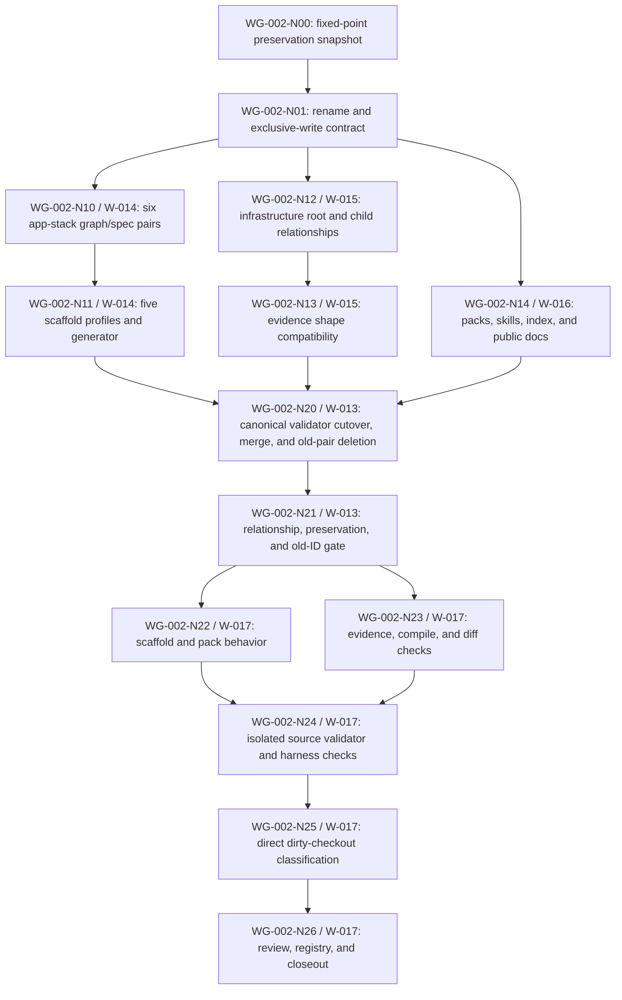

# Stack Naming Migration Work Graph

Status: `COMPLETE`
Created: 2026-07-28
Work Graph ID: `WG-002`
Work Graph Revision: `4`
Scope: `EPIC`
Implementation evidence: `PASS`
Merge owner: `W-013`
Validation owner: `W-017`
Terminal Gate: `WG-002-GD`

## Outcome

The long application-technology and infrastructure-selection pair names were
replaced with a simpler two-branch stack vocabulary:

```text
stack-selection
├─ app-stack
│  ├─ backend-stack
│  ├─ frontend-stack
│  ├─ native-stack
│  ├─ cli-stack
│  └─ experiment-stack
└─ infrastructure
   ├─ infrastructure-compute
   ├─ infrastructure-data
   ├─ infrastructure-messaging
   └─ infrastructure-delivery
```

This is a direct canonical migration, not a semantic redesign. The result keeps
architecture selection separate from stack selection, keeps app choices
separate from operated infrastructure, and preserves the existing graph/spec,
evidence, scaffold, frontend-pack, and adoption contracts.

## Problem And Intended Behavior

The current `technology-selection` and `*-technology` vocabulary is accurate
but heavier than the selection tree needs. It also makes the application branch
read like a package inventory even though it owns a complete per-app runtime,
framework, library, process, packaging, compatibility, and proof profile.

The intended behavior is:

- `stack-selection` remains the source-linked claim, policy, application-unit,
  whole-profile, proof, and lifecycle authority;
- `app-stack` selects the application-side implementation profile for each
  backend, frontend, native, CLI, or experiment unit;
- `infrastructure` independently selects deployment scopes and operated
  compute, data, messaging, and delivery resources;
- the new names become the only canonical graph IDs and filenames;
- the contents and observable behavior of the current 26-pair catalog remain
  stable.

## Assumptions And Non-Goals

Assumptions:

- Graph IDs are public harness references and therefore require an explicit,
  atomic migration.
- The current pair files, validator registries, pack paths, scaffold metadata,
  skills, and public docs are the complete direct-consumer set after hidden-file
  search.
- Work can be sectioned across disjoint files, but integration must serialize
  deletion, shared validator cutover, and final validation.
- Migration-history lane/report files may retain old IDs only inside an
  explicit before/after map.

Non-goals:

- no new stack candidates, rankings, provider guidance, or architecture
  defaults;
- no evidence schema version or record-shape change;
- no generated source path or source template redesign;
- no compatibility aliases, deprecation window, fallback routing, or duplicate
  graph authority;
- no implementation of W-004 through W-010 or W-012 simulation work;
- no live candidate-stack proof, deployment, or release eligibility claim.

## Follow-On Program Boundary

The contour-infrastructure profile request remains planned separately in
`docs/work/reports/2026-07-28-contour-infrastructure-work-graph.md`
and W-018-W-023. It adds frontend SSR/BFF/fullstack, backend data/messaging,
native, CLI, and experiment infrastructure profiles only after W-017 closes
this identity migration.

This report's 26-pair baseline, 46-operation source manifest, protected
evidence/scaffold contract, and W-013-W-017 completion gates remain unchanged.
W-017 completed against implementation source identity
`sha256:e36113eba7d80c12ef1441569b69e8bd43e6cc5e909913a2da4f56993873398b`
and unlocks W-018 WG-003-N00. That completion is not implementation evidence for
the follow-on profiles.

## Canonical Rename Map

| Current pair ID | Replacement pair ID | Pair kind | Semantic rule |
|---|---|---|---|
| `technology-selection` | `app-stack` | extension | preserve all 11 routing/policy decisions |
| `backend-technology` | `backend-stack` | extension | preserve runtime candidates and backend decisions |
| `frontend-technology` | `frontend-stack` | extension | preserve framework, state, UI, realtime, and proof candidates |
| `native-technology` | `native-stack` | extension | preserve platform-native, cross-platform, and shared-core candidates |
| `cli-technology` | `cli-stack` | extension | preserve compiled, runtime, and embedded CLI candidates |
| `experiment-technology` | `experiment-stack` | extension | preserve script, notebook, and accelerated candidates |
| `infrastructure-selection` | `infrastructure` | extension | preserve all 10 scope/resource/lifecycle decisions |

Unchanged IDs:

- `stack-selection`;
- `infrastructure-compute`;
- `infrastructure-data`;
- `infrastructure-messaging`;
- `infrastructure-delivery`;
- all other decision, archetype, and frontend-policy pairs.

## Protected Contract Matrix

| Contract | Baseline | Required post-migration state |
|---|---|---|
| Pair catalog | 26 graph/spec pairs: 5 decisions, 5 archetypes, 16 extensions | 26 pairs with the same kind counts |
| Stack root | `stack-selection` with 12 decisions | unchanged ID, decisions, nodes, edges, and evidence authority |
| App router | 11 decisions | same decision IDs under `app-stack` |
| App child pairs | same nodes, edges, decisions, candidates, and validations | only pair/path/relationship vocabulary changes |
| Infrastructure root | 10 decisions | same decision IDs under `infrastructure` |
| Infrastructure children | four existing IDs | same IDs, nodes, edges, decisions, specs, and validation |
| Evidence contract | `stack-selection-evidence.v1` application and infrastructure records | same schema ID and fields; semantic self-test still passes |
| Scaffold profiles | five profiles and 71 output files | same profile IDs, candidate node IDs, templates, safety rules, and paths |
| Frontend retrieval | dedicated frontend pack | still excludes unrelated backend/native/CLI/experiment catalogs |
| Backend archetype | startup, app-owned modules, and shared libs | unchanged |
| Concurrent simulation work | W-004-W-010 and W-012 owned sources/plans | zero migration edits |

## Concrete Source Change Inventory

Current hidden-file consumer search finds 32 canonical files containing one or
more superseded pair IDs. The direct cutover expands that into 46 source
operations:

| Operation | Count | Owner breakdown |
|---|---:|---|
| Create | 14 | W-014 creates 12 app-stack files; W-015 creates 2 infrastructure root files |
| Modify | 18 | W-014 modifies 2 scaffold files; W-015 modifies 4 infrastructure child graphs; W-016 modifies 11 retrieval/routing/doc files; W-013 modifies 1 shared validator |
| Delete | 14 | W-013 removes 12 superseded app-branch files and 2 superseded infrastructure-root files |
| Evidence/status update | 3 | W-017 updates the active registry, report index, and this report after validation |

### Required Refactoring

| Surface | Required change |
|---|---|
| Pair identity | graph IDs, pair headers, same-stem paths, titles, and bidirectional graph/spec links |
| Graph composition | `extends`, `requires`, `compatible_with`, `conflicts_with`, and `preserves` pair prefixes/targets |
| Scaffold metadata | profile `pair_ids`, adoption text, and generator required-pair checks |
| Retrieval | pack paths, section IDs, summaries, tags, triggers, and selection rules |
| Agent routing | architecture-review and adapt-harness authority names |
| Shared validation | required pair/kind sets, preserved-decision owners, markers, frontend membership, pack assertions, and scaffold owner detection |
| Public discovery | index, stack spec, README, CODEX, glossary, structure map, and current architecture report |

This is not a blanket replacement of the word “technology.” That term remains
correct for concrete runtimes, frameworks, libraries, candidates, and
application-technology evidence. Only public pair identity and routing
authority move to the app-stack vocabulary.

### Verification-Only And Protected Surfaces

| Surface | Required disposition |
|---|---|
| `stack-selection-evidence.schema.json` | byte-identical unless a graph-ID dependency is demonstrated |
| `validate_stack_selection_evidence.py` | byte-identical and existing self-test passes |
| architecture graph schema | unchanged |
| `stack-selection.graph.yaml` | unchanged unless WG-002-N00 finds an exact old pair ID |
| four infrastructure child specs | unchanged unless fresh consumer inventory finds an old ID |
| archetype and frontend-policy pairs | unchanged |
| candidate, node, edge, and decision IDs | unchanged except the seven pair IDs and relationship owner prefixes |
| scaffold templates and generated paths | unchanged; five profiles and 71 paths |
| simulation sources and plans | zero migration edits |

## Workline Model

Classification: `parallel-sectioning` with one merge owner and one independent
validation lane.

| Lane | Boundary | Exclusive writes | Starts | Completion receipt |
|---|---|---|---|---|
| W-013 | contract, shared validator, deletion, integration | shared architecture validator and superseded-pair deletion | WG-002-N00 | integrated source identity |
| W-014 | application branch and source profiles | six new pairs, scaffold manifest, scaffold generator | after WG-002-N01 | app-pair and 71-path preservation |
| W-015 | infrastructure branch | new root pair and four child graph relationships | after WG-002-N01 | infra relationship and evidence-compatibility receipt |
| W-016 | retrieval, routing, and public docs | packs, skills, index, stack spec, public docs, current report | after WG-002-N01 | pack previews and canonical-doc absence check |
| W-017 | independent validation and closeout | work registry and migration report evidence only | after WG-002-N20 | final exact check matrix |

W-014, W-015, and W-016 are parallel-safe after WG-002-N01 because their write
sets are disjoint. W-013 is the only merge owner for shared cutover. W-017
never repairs implementation files; it routes a failed check back to its owner.

## Work Topology



## Node Registry

| Node | Lane | Implementation outcome | Requires | Produces | State |
|---|---|---|---|---|---|
| `WG-002-N00` | W-013 | fixed pair, decision, node, relationship, consumer, scaffold-template, and rendered-path snapshot plus dirty-work protection map | current checkout | baseline digest and preservation matrix | `PASS` |
| `WG-002-N01` | W-013 | frozen rename map, section file ownership, canonical-consumer scope, and migration-history exclusion | WG-002-N00 | workline start receipt | `PASS` |
| `WG-002-N10` | W-014 | create 12 app-stack graph/spec files with new IDs, paths, titles, relationship prefixes, and unchanged semantics | WG-002-N01 | app pair source and normalized comparison | `PASS` |
| `WG-002-N11` | W-014 | modify 2 scaffold files: profile metadata/adoption text and required-pair validation | WG-002-N10 | five profiles, 71-path manifest, safety self-test, and 14-file lane receipt | `PASS` |
| `WG-002-N12` | W-015 | create 2 infrastructure root files and modify 4 child graph relationships | WG-002-N01 | infra pair source and relationship comparison | `PASS` |
| `WG-002-N13` | W-015 | proof that evidence schema/validator are graph-name independent; no edit unless that proof fails | WG-002-N12 | evidence compatibility and self-test receipt | `PASS` |
| `WG-002-N14` | W-016 | modify 11 pack, skill, pattern, public-discovery, and current-report consumers | WG-002-N01 | retrieval previews, harness checks, old-ID search, and 11-file receipt | `PASS` |
| `WG-002-N20` | W-013 | modify 1 shared validator, merge section receipts, delete 14 superseded files, and produce one canonical 26-pair source | WG-002-N11, WG-002-N13, WG-002-N14 | exact integrated source identity and 46-operation manifest | `PASS` |
| `WG-002-N21` | W-013 | every relationship and preserved decision resolves; old IDs are absent from canonical authorities | WG-002-N20 | `WG-002-GC` integration receipt | `PASS` |
| `WG-002-N22` | W-017 | five scaffold previews, validate/self-test, and both context-pack previews pass against the integrated source | WG-002-N21 | behavior evidence | `PASS` |
| `WG-002-N23` | W-017 | evidence self-test, byte-preservation checks, Python compilation, whitespace, and scoped diff checks pass | WG-002-N21 | mechanical evidence | `PASS` |
| `WG-002-N24` | W-017 | isolated source validator, harness catalog, and harness self-test pass against one source identity | WG-002-N22, WG-002-N23 | source validation receipt | `PASS` |
| `WG-002-N25` | W-017 | direct checkout validator is run and unrelated generated Playwright findings are separated from migration findings | WG-002-N24 | dirty-checkout disposition | `PASS` |
| `WG-002-N26` | W-017 | Standards/Spec review, active work status, report evidence, and remaining risks are finalized | WG-002-N25 | closeout or exact routed blocker | `PASS` |

## Gate Contracts

### WG-002-GA — Naming Contract

Required:

- exact current 26-pair list and pair kinds;
- graph/spec path and relationship inventory;
- node, edge, decision, candidate, and validation snapshots for all seven
  renamed pairs and four infrastructure children;
- current scaffold profile, template, rule, and output-path snapshot;
- hidden-file direct-consumer search;
- dirty-file ownership map that protects simulation work.

Acceptance:

- the rename map is unambiguous;
- every planned file has one write owner;
- historical migration documents are the only allowed old-ID exclusion;
- section work may begin without sharing an unresolved decision.

### WG-002-GB — Section Readiness

Required:

- W-014 app-pair and scaffold receipt from WG-002-N11;
- W-015 infrastructure and evidence compatibility receipt from WG-002-N13;
- W-016 pack, skill, and documentation receipt from WG-002-N14.

Acceptance:

- each lane changed only its owned paths;
- normalized comparisons show naming-only graph changes;
- no lane deletes current pairs or edits the shared validator;
- all section-local checks pass or integration remains blocked.

### WG-002-GC — Canonical Integration

Required:

- `WG-002-GB` accepted;
- shared validator set, kind, preserved-decision, spec-marker, frontend-set, and
  scaffold-owner logic use replacement IDs;
- seven old graph/spec pairs are removed;
- all `extends`, `requires`, `compatible_with`, `conflicts_with`, `preserves`,
  pack paths, section IDs, scaffold IDs, skills, and docs resolve;
- canonical authorities contain no old pair ID.

Acceptance:

- exactly 26 complete pairs remain;
- no compatibility alias or duplicate path exists;
- W-017 receives one fixed integrated source identity.

### WG-002-GD — Validation And Closeout

Required:

- scaffold validate/self-test and five fixed previews;
- evidence semantic self-test;
- general and frontend pack previews;
- normalized preservation and old-ID checks;
- Python compilation and `git diff --check`;
- isolated source validator;
- harness catalog and harness self-test;
- direct dirty-checkout validator with unrelated findings classified;
- Standards/Spec review.

Acceptance:

- all migration-required source checks pass against one source identity;
- generated Playwright dependency findings, if unchanged and unrelated, do not
  become a false architecture-migration defect;
- implementation is reported as implemented and validated only after these
  checks, while target stack fitness remains unproved.

## Planned Write Ownership

| Area | Owner | Consumers | Conflict rule |
|---|---|---|---|
| six replacement app-stack pairs | W-014 | packs, index, validator, scaffolds | W-013 merge-only |
| scaffold manifest and generator | W-014 | validator and adopters | no other writer |
| replacement infrastructure root and four child graphs | W-015 | packs, index, validator | W-013 merge-only |
| evidence schema and semantic validator | protected/read-only | every stack evidence record | change requires a new failed-dependency finding and plan |
| architecture packs, index, stack spec, skills, and public docs | W-016 | agents and maintainers | no graph or validator edits |
| shared architecture validator and old-pair deletion | W-013 | repository | serialized after `WG-002-GB` |
| active registry, report index, and final report evidence | W-017 | work tracking | validation status only |
| simulation program files | W-004-W-010 and W-012 | simulation implementation | no migration write |

## Direct And Hidden Consumers

The current source search identifies these consumer classes:

- graph/spec self-identities and relationships;
- four infrastructure child graph relationship sets;
- both architecture context packs and their section IDs;
- `architecture-scaffold-profiles.json` and
  `scripts/scaffold_architecture_default.py`;
- required pair, kind, preserved-decision, marker, frontend-set, and scaffold
  ownership checks in `scripts/validate_cascade_codex.py`;
- architecture-review and adapt-harness skill routing;
- architecture index, stack-selection spec, README, CODEX, glossary, and
  structure map;
- the current architecture-selection report.

`stack-selection-evidence.schema.json` and
`scripts/validate_stack_selection_evidence.py` describe application and
infrastructure records but do not currently encode graph pair IDs. They are
protected inputs and compatibility checks, not expected edit targets.

## Execution Waves And Parallel Safety

| Wave | Nodes | Parallel rule | Exit |
|---|---|---|---|
| 0 | WG-002-N00, WG-002-N01 | serialized under W-013 | `WG-002-GA` accepted |
| 1 | WG-002-N10/11, WG-002-N12/13, WG-002-N14 | three parallel sections with disjoint writes | three readiness receipts |
| 2 | WG-002-N20, WG-002-N21 | serialized merge, validator cutover, deletion, and relationship gate | `WG-002-GC` accepted |
| 3 | WG-002-N22 and WG-002-N23 | read-only checks may run in parallel against one fixed source | behavior and mechanical receipts |
| 4 | WG-002-N24 through WG-002-N26 | serialized source validation, dirty-checkout classification, and closeout | `WG-002-GD` accepted or exact blocker |

Parallel work must use isolated branches/worktrees or otherwise preserve the
exclusive write map. A source mutation after WG-002-N20 invalidates every W-017
result produced from the previous identity.

## Implementation Completion Checklist

| Gate | Required completion signal | Current state |
|---|---|---|
| WG-002-N00 | 26-pair normalized baseline, 32-consumer inventory, five scaffold previews, 71-path manifest, evidence-file digests, and dirty-work map | `PASS` |
| WG-002-N01 | frozen rename map, history exclusion, exclusive ownership, and per-lane start receipt | `PASS` |
| WG-002-N11 | W-014 14-file receipt and all app/scaffold preservation checks | `PASS` |
| WG-002-N13 | W-015 6-file change receipt plus evidence and child-spec unchanged proof | `PASS` |
| WG-002-N14 | W-016 11-file receipt, two pack previews, harness checks, and scoped old-ID result | `PASS` |
| WG-002-N21 | 46-operation integration manifest, 26 valid pairs, no canonical old IDs, and exact source identity | `PASS` |
| WG-002-N24 | scaffold, evidence, packs, isolated validator, harness, compile, and diff checks pass on that identity | `PASS` |
| WG-002-N25 | direct dirty-checkout validator findings classified independently | `PASS_WITH_UNRELATED_FINDINGS` |
| WG-002-N26 | Standards/Spec review and three evidence owners updated | `PASS` |

## Invalidation And Repair Routing

| Changed input or failure | Reopen | Preserve |
|---|---|---|
| rename map or pair-ID convention | WG-002-N01 and every downstream node | baseline snapshot only |
| app pair decision, node, candidate, or scaffold path drift | W-014 WG-002-N10/11; integration and validation | W-015/W-016 evidence when source inputs are unchanged |
| infrastructure decision or evidence-shape drift | W-015 WG-002-N12/13; integration and validation | W-014/W-016 evidence when inputs are unchanged |
| pack path, section, or routing failure | W-016 WG-002-N14; integration and pack validation | W-014/W-015 structural evidence |
| shared validator or deletion failure | W-013 WG-002-N20/21 and all W-017 checks | section receipts after identity revalidation |
| scaffold behavior failure | W-014, then WG-002-N20 onward | infrastructure and docs receipts |
| isolated source validator failure caused by migration | owning source lane plus W-013 integration | unrelated simulation work |
| direct validator generated Playwright finding only | no migration node; report separate checkout blocker | all isolated source evidence |
| any simulation source diff from this program | stop and restore ownership through the simulation lane | architecture plan artifacts |

## Doc Routing Decision Matrix

| Changed fact | Owner target | Status now | Implementation route |
|---|---|---|---|
| canonical application selection branch is `app-stack` | app graph/spec pairs and architecture index | `PROPOSED` | W-014 plus W-016 |
| canonical infrastructure root is `infrastructure` | infrastructure graph/spec pair and index | `PROPOSED` | W-015 plus W-016 |
| graph IDs are direct-cutover public references | shared architecture validator | `PROPOSED` | W-013 |
| retrieval and skill routing must use new names | two packs and two skills | `PROPOSED` | W-016 |
| active execution is separated into five worklines | work lanes and active registry | `UPDATED` | current planning turn |
| migration contains 14 creates, 18 modifications, and 14 deletions plus three evidence updates | this report and W-013-W-017 packets | `UPDATED` | preserve counts in every section receipt |
| implementation and validation evidence | migration report and active registry | `PASS` | W-017 completed after WG-002-N20 |

## Validation Plan

Planning-artifact checks:

```bash
python3 scripts/validate_cascade_codex.py
python3 scripts/run_harness_evals.py catalog --check
python3 scripts/run_harness_evals.py self-test
python3 -m py_compile scripts/validate_cascade_codex.py \
  scripts/scaffold_architecture_default.py \
  scripts/validate_stack_selection_evidence.py
git diff --check
```

Implementation checks:

```bash
python3 scripts/scaffold_architecture_default.py validate
python3 scripts/scaffold_architecture_default.py self-test
python3 scripts/validate_stack_selection_evidence.py self-test
python3 scripts/build_pattern_context_pack.py \
  --pack architecture-defaults --query app-stack
python3 scripts/build_pattern_context_pack.py \
  --pack frontend-architecture-defaults --query frontend-stack
python3 scripts/validate_cascade_codex.py
python3 scripts/run_harness_evals.py catalog --check
python3 scripts/run_harness_evals.py self-test
```

The isolated source validator must run against a clean copy of tracked and
intended source files so generated Playwright `node_modules` do not mask source
results. The direct current-checkout validator must still run and retain its
exact independent disposition.

## Final Validation

| Check | Result | Evidence boundary |
|---|---|---|
| Workline registration | `PASS` | five `COMPLETE` lane packets, W-013 through W-017, each registered once in `docs/work/active.md` |
| work graph identity | `PASS` | 14 unique nodes, WG-002-N00, WG-002-N01, WG-002-N10 through WG-002-N14, and WG-002-N20 through WG-002-N26 |
| Concrete scope reconciliation | `PASS` | 32 current canonical consumers map to 14 creates, 18 modifications, and 14 deletions; W-017 separately owns 3 evidence updates |
| Canonical authority cutover | `PASS` | current catalog has 26 complete pairs, all seven replacement IDs, and zero superseded pair files |
| Graph/spec preservation | `PASS` | seven renamed pairs and four infrastructure children match the normalized baseline; all renamed specs differ only by direct IDs and approved titles/routing vocabulary |
| Protected evidence authority | `PASS` | evidence schema `538c2e60...d00`, evidence validator `c0568c6c...99f`, graph schema, and four infrastructure child specs retain baseline digests |
| Scaffold preservation | `PASS` | five profiles and 71 paths are unchanged; old pair metadata fails closed because `app-stack` is absent |
| Retrieval | `PASS` | app-stack, backend-stack, and frontend-stack previews resolve paired canonical sources |
| Report registration | `PASS` | one report-index entry resolves to this artifact |
| Python compilation | `PASS` | validator, harness evaluator, scaffold generator, and evidence validator compile |
| Harness catalog | `PASS` | 41 skills, 319 scenarios, digest `f975c361819767d05319b7f4b636fa8b9e211e3c56b2005de930dd4d665d6552` |
| Harness self-test | `PASS` | 15 cases |
| Isolated source validator | `PASS` | 9 agents, 41 skills, zero project leakage, and zero standalone-QA references |
| Diff whitespace | `PASS` | `git diff --check` |
| Direct dirty-checkout validator | `FAIL_UNRELATED` | 36 findings under root and `.codex/harness-tooling` Playwright `node_modules`; no Stage 1 source finding |
| Standards review | `PASS` | direct cutover, thin entrypoints, ownership boundaries, and protected dirty work conform to repository rules |
| Spec review | `PASS` | W-013-W-017 acceptance criteria are covered with no Stage 2 or SDK/library implementation |
| Naming migration implementation | `PASS` | WG-002-N00 through WG-002-N26 completed against source identity `e36113be...39873398b` |

## Current Frontier

- Complete: WG-002-N00 through WG-002-N26 and W-013 through W-017.
- Canonical authority: 26 pairs under `app-stack`, the five contour stack
  children, and `infrastructure`.
- Ready: W-018 WG-003-N00 may consume the completed Stage 1 source identity.
- Not implemented: W-018-W-023 contour infrastructure profiles and W-024
  SDK/library contour.
- Live stack proof, deployment, publication, and release eligibility:
  `NOT_RUN` and outside this plan.
- Direct-checkout validator noise remains confined to generated Playwright
  dependencies; the isolated source validator passes.
