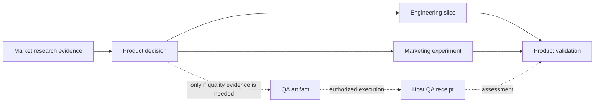

# Lean Graph-Shaped Work

Use graph-shaped work only when a list cannot represent the real coordination
boundary. Cascade Project Management owns the portable planning,
reconciliation, and closeout method. The repository harness persists a lean
projection and performs separately authorized execution effects.

Neither a project artifact nor a graph grants permission, dispatches an agent,
creates a task or worktree, mutates files, runs QA, merges changes, archives
records, or spends provider resources.

## Choose The Smallest Shape

| Situation | Durable shape |
|---|---|
| One owner and one bounded outcome | Inline task plan; no lane or graph |
| Outcome needs status across tasks or an independent handoff | One lane |
| Several meaningful items have simple dependencies | Lane work-item table |
| Several owners or worklines need joins, materialization, invalidation, or partial repair | Coordination Graph |

Do not create a workline for each file, skill, test, phase, or available agent.
Do not create a graph merely to visualize prose. Product, research, market,
design, security, persona, prompt, and quality artifacts remain in their owning
plugins or source documents; durable work records reference their stable IDs
and versions.

## Portable Project Artifact And Host Projection

`cascade-project-management:plan-project` emits either lean horizons or one
canonical Agile hierarchy of MVP versions, iterations, stories, and tasks,
plus dependencies and uncertainty. It progressively elaborates only the first
MVP iteration. `manage-project` establishes current items, owners, joins,
blockers, reconciliation dispositions, and next gates. `close-project`
assesses completion, consumers, and retention readiness.

The host may project an accepted artifact into `docs/work/active.md`, a lane,
or a Coordination Graph when persistence is actually required. That projection
adds only host-specific paths, execution surfaces, authority references,
runtime handles, receipts, and current source identity. It must not copy the
plugin's reusable method or become a second product or strategy source of
truth.

## Cross-Domain Iteration

The same lean record can coordinate product, research, marketing, engineering,
design, security, or quality work. Each work item names an outcome and its
owning artifact rather than flattening every domain into QA or engineering.

Example:

`FIRST`, `NEXT`, `LATER`, `DEFERRED`, and `REMOVED`, or the equivalent Agile
MVP and later-version projections, are plans rather than automatic active
lanes. Activate only the smallest accepted first slice or first MVP iteration.
Later learning may reorder or remove other proposals without invalidating
unaffected completed evidence.

## Minimal Work Item Contract

Each durable item needs only:

- a stable ID, bounded outcome, and owner;
- current input artifact IDs or source versions;
- dependencies or external decisions that truly control readiness;
- produced artifact or receipt and acceptance gate;
- host write/action boundary when execution is authorized;
- invalidation, repair, and next-gate route; and
- current state.

Use `PENDING`, `READY`, `RUNNING`, `REVIEW`, `ACCEPTED`, `BLOCKED`, or
`SUPERSEDED`. A producer receipt proposes evidence; the named project-state
owner records the authoritative transition. Failure returns only affected
items to a recalculated state.

## Coordination Graph

A Coordination Graph is warranted only when at least two worklines have a real
cross-workline dependency, evidence join, materialization or integrated-state
boundary, invalidation relationship, or partial-repair route.

It records:

- the goal, current sources, plan and graph revisions;
- canonical worklines and one coordination-state owner;
- typed dependencies and joins;
- accepted receipts and the current frontier;
- optional execution/materialization bindings; and
- one terminal gate and a retention proposal.

It does not reproduce lane-local definitions, large evidence bodies, generic
state-machine theory, or every possible execution field. Add a field only when
the active graph actually needs it.

One owner records cross-workline transitions. A worker or plugin output cannot
mutate the graph by itself. Changing canonical items, ownership, dependencies,
joins, or terminal acceptance increments the graph revision. An ordinary
retry changes only its attempt and receipt history.

## Dispatch And Functional Execution

Readiness is not dispatch. A host execution binding must name:

- `root`, `internal-subagent`, or `user-visible-task` as the surface;
- the user request or approval that authorizes that surface;
- the allowed actions and write boundary;
- current source identity and accepted input artifact;
- the runtime handle after dispatch; and
- the receipt, cleanup, stop, and invalidation rules.

Project Management plans and coordinates. Domain plugins produce artifacts.
The harness executes them through narrow adapters such as `implement-change`,
`run-qa-plan`, and `closeout`, or through the host-authorized Simulation
Operator applying `cascade-simulations:execute-simulation-campaign`. Results
return to the owning plugin for semantic assessment when needed.

## QA Is A Conditional Branch

Cascade QA applies when accepted behavior needs a quality plan, test design,
evidence assessment, defect triage, or release-risk statement. It does not own
project state, product stories, market strategy, simulation design, or normal
implementation planning.

The flow is:

1. an owning domain supplies accepted behavior and risks;
2. Cascade QA creates a frozen portable artifact when applicable;
3. `run-qa-plan` maps registered adapter IDs to current repository actions;
4. the harness freezes receipts without deciding their semantic meaning;
5. Cascade QA assesses evidence or triages a failure; and
6. `repair-tests` may edit tests only after triage proves `TEST_DRIFT` while
   the public behavior boundary still passes.

No QA branch is created for work with no relevant quality claim.

## Reconciliation

Reconciliation compares current outcomes, acceptance, owners, consumers,
artifacts, and evidence—not titles. Every inspected item receives one proposal:
`KEEP`, `UPDATE`, `MERGE_INTO`, `SUPERSEDE_BY`, `RETIRE_PROPOSED`, or
`BLOCKED_REVIEW`.

The PM artifact proposes the disposition. The host applies a current-state
change only within explicit authority and after validating references. Never
delete evidence or rewrite failed work as complete merely to clean a registry.

## Closeout And Retention

Completion requires current accepted outcomes, satisfied dependencies, known
consumers, and appropriately scoped evidence. It does not require QA when QA
was not applicable.

`cascade-project-management:close-project` returns a typed completion and
retention proposal. `closeout` may then update exact active projections or
move exact frozen records only when current host authority allows it. Otherwise
it records `ARCHIVE_DEFERRED` with the blocker. Retention is never automatic,
and durable receipts remain available for audit or resume.
