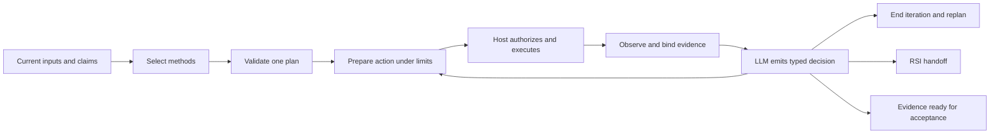

# Cascade workflow groups and Nexus

Status: Cascade CLI contracts implemented; Nexus adapter and tracker UI remain
design work. This handoff uses the current nine-package source checkout and
supersedes the retired harness snapshot used in the initial Nexus inspection.

## Workflow ownership

`cascade-workflows:select-capabilities` already selects methods from current
Task Envelope claims and the catalog, independently of old work graphs.
`plan-workflow` orders the validated selection in one DAG. AI Architect owns
the behavior loop, typed triggers, state, recovery, stops and dynamic topology
when justified. Native host tools retain authorization, execution and results.



This is an authority map, not automatic dispatch. Model interpretation does
not establish permission or source truth. The portable contract is owned by
[AI Architect](../../../.codex/plugins/cascade-ai-architect/skills/design-agent-workflow/references/cascade-control.schema.json).

## Groups in Nexus

Use plugin groups as a method catalog/filter beside project, workstream, issue
and discipline. A workstream represents a real outcome; an issue may use several
groups. Do not create a mandatory parent issue or phase for every plugin.

| Nexus concept | Cascade contract and boundary |
|---|---|
| Method catalog | `workflow groups`: group/version, component, route, exact entrypoint, skill digest and catalog digest |
| Finite issue | Accepted objective and work-item proposal; `define-work-item` cannot commit scope or status |
| Workflow iteration | Frozen envelope, selection, plan, input versions and limits, with a separate identity/revision |
| Worker/run attempt | Host execution handle and receipt; `PREPARED` is only a proposed action |
| Readiness | Input/authority waits, stale bindings or unavailable tools, separate from lifecycle and liveness |
| Evidence | Versioned artifact identity/path/SHA-256, tool/provider receipt and observation history |
| Acceptance | Existing owner compares current criteria/evidence; workflow `COMPLETED` cannot mark an issue Done |
| Learning | RSI experiment/candidate linked to the failed iteration, preserving its baseline |

Keep component owners visible. Product owns product decisions, Market market
evidence, Personas human-model artifacts, QA quality planning/assessment, and
Evals independent model judgments. Sharing a package does not combine these
responsibilities or make all phases mandatory.

## Shared CLI

Every request applies the shared host cycle at proportional depth. The
`run-workflow` adapter prepares ambiguous or multi-method work through the
existing Workflows selector and planner; one sufficient exact method stays
direct. `workflow intake` renders current admitted claims, real artifact
bindings, method descriptors and a structured response contract for the LLM.
`accept-selection` validates its JSON, rechecks source bytes and stamps only
digest fields. A broad Quality/Evals request is resolved by subject, operation
and evidence, with a concise question when a missing decision prevents routing.

```text
bun scripts/cascade.ts workflow groups
bun scripts/cascade.ts workflow intake --envelope ENVELOPE --bindings BINDINGS --output INTAKE
bun scripts/cascade.ts workflow accept-selection --intake INTAKE --response RESPONSE --output SELECTION
bun scripts/cascade.ts workflow control-init --plan PLAN --selection SELECTION --envelope ENVELOPE --bindings BINDINGS --budget BUDGET --output STATE
bun scripts/cascade.ts workflow control-intake --state STATE --observation OBSERVATION
bun scripts/cascade.ts workflow control-step --state STATE --observation OBSERVATION --decision DECISION --output NEXT_STATE
```

Inputs are explicit JSON files inside the allowed host workspace. Intake supplies
the model request and schema; the host calls the model. Step validates its JSON
and rechecks artifact bytes, dependencies, consumed observations and limits.
Missing/uncertain interpretation blocks; no lexical fallback is permitted.
Omit the decision only for native cancellation/revocation or a blocked missing
interpretation result. One prepared action at a time avoids uncertain redispatch.

Control measures decisions, retries and a wall-time deadline. Tool, token, cost
and delegation limits remain the accepted workflow/executor's responsibility.
Every output retains `dispatch_authorized: false` and
`acceptance_authorized: false`. Digests detect drift, not malicious state forgery.
No tracker store, worker spawning, scheduler or standalone provider API is added.

Nexus's future shared CLI/UI operations should persist revisions, observations,
idempotency keys, an execution claim and durable attempt IDs. Preserve unknown,
failed and interrupted runs. Chat-local Codex MCP tools are not an assumed
public Nexus API. Current hooks provide admission/registered closeout checks;
they do not enforce every target tool or create a trusted approval service.

## Entry cycles and feedback

| Need | Smallest applicable cycle |
|---|---|
| Market or competitor change | Discovery research; compare opportunities only if needed; reopen Product decisions only for a material delta |
| Ideas, offers or features from inputs | `define-product`; add missing market evidence or a persona projection when decision-critical |
| Deliver accepted behavior | Host context/plan/implement/validate; Engineering, Design, Security and Quality only for relevant uncertainty or gates |
| Redesign or refactor | Reuse accepted behavior; Design for experience, Engineering for unresolved boundaries; relevant regression checks |
| Improve an agent workflow | Measured failure -> bounded AI Architect improvement -> independent evaluation -> separately authorized integration |

Each iteration has frozen inputs and a terminal reason. Changed inputs/goals
require fresh admission and a candidate plan, without resetting a parent budget.
RSI first repairs prompt/context where appropriate; structural workflow mutation
still needs prior prompt-method failure, a sandbox and explicit allowlist.
Research hypotheses and simulated personas cannot establish market demand.
Recurring research uses a separately requested native schedule with a fixed
question, baseline, cadence, budget and meaningful-change notification rule.

Structural fixture checks cover state/evidence binding, prepared/completed/failed
work, waits, unknown attempts, retries, native cancellation, deadlines and RSI
handoff. Live trigger quality, experiment effectiveness and a working Nexus
adapter require separate evidence; they are not proved by those fixtures.
