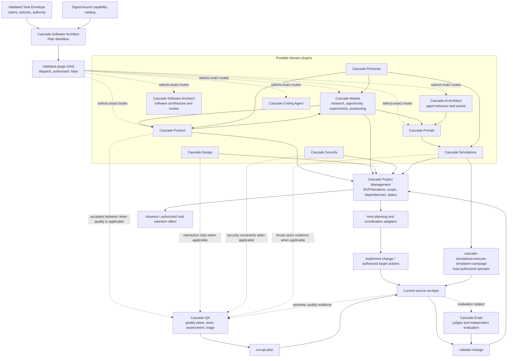

# Plugin Orchestration And Host Effects

Cascade plugins own portable domain reasoning. The repository harness owns
current context, authority, target execution, validation receipts, and durable
host projections. No plugin is a universal hub.

## Responsibility Rules

- Product defines accepted product behavior; Market owns research, opportunity
  assessment, experiments, positioning, and message language; Personas owns
  canonical human models; Design and Security own their specialist methods;
  Software Architect owns software architecture, pattern selection,
  architecture/change review, and multi-plugin Plan Workflow; AI Architect
  owns agent behavior and design assets; Prompt owns prompt construction;
  Coding Agent owns harness engineering; Simulations owns bounded actor
  execution contracts.
- Plan Workflow selects the smallest sufficient set from typed capability
  descriptors, expands required dependencies, orders artifact edges, and names
  safe parallel groups and merge owners. It never dispatches or grants
  authority; deterministic host validation must pass before any execution.
- Prompt evaluation requires Prompt. Simulations is added only when the case
  needs a dynamic actor or adaptive-interview contour; deterministic prompt
  quality cases do not inherit simulation overhead.
- Project Management coordinates accepted artifacts without redefining them.
- QA receives only accepted behavior, risks, and evidence that need a quality
  decision. Research, strategy, planning, or implementation does not route
  through QA by default.
- Evals supplies independent deterministic and semantic judgment. It does not
  execute target work or mutate plugin artifacts.
- Host adapters resolve repository paths, permissions, commands, runtime
  handles, and receipts. They do not copy portable plugin methods.

## Typical Combinations

| Goal | Plugin combination | Host effect |
|---|---|---|
| Market-to-product learning | Market + Product + Project Management | Persist an accepted initiative or experiment lane only if needed |
| Positioning-to-qualified prompt | Market + Prompt + Evals | Preserve accepted brand projection and frozen prompt-evaluation receipts |
| Software architecture and fixed-point review | Software Architect patterns/design + Software Architect review | Implement only after host authority; validate the resulting diff separately |
| AI-agent design and qualification | AI Architect + Prompt + Evals; Software Architect for affected software boundaries | Integrate reviewed assets through Coding Agent, then validate the target separately |
| Persona-based discovery | Personas + Product or Market | Preserve accepted source references |
| Actor simulation | Personas + Prompt + Simulations + Evals | `cascade-simulations:execute-simulation-campaign`, freeze evidence, validate |
| Agile MVP delivery | Product + Project Management; Design/Security as applicable | Execute only the accepted first iteration, then review and validate |
| Quality evidence | Product/Design/Security inputs + QA + Evals as needed | `run-qa-plan`, freeze receipts, assess |
| Test-drift repair | QA triage | `repair-tests` within test-only scope |
| Completion and retention | Project Management | `closeout` for the exact authorized projection or files |

The project artifact may reference any accepted domain artifact. QA remains an
optional branch selected by quality risk or an explicit request, never the
default destination for all plugin output.
