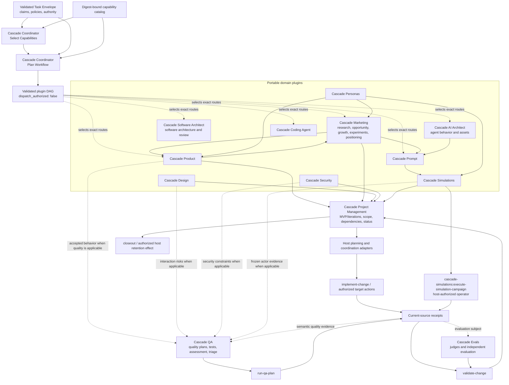

# Plugin Orchestration And Host Effects

Cascade plugins own portable domain reasoning. The repository harness owns
current context, authority, target execution, validation receipts, and durable
host projections. No plugin is a universal hub.

For market selection, product value, feature formation, growth strategy and
feedback into delivery, see [Value decisions through feature delivery](value-to-delivery.md).
Cascade Marketing uses the stable internal plugin ID `cascade-market`.

## Responsibility Rules

- Product defines accepted product behavior; Market owns research, opportunity
  assessment, experiments, positioning, and message language; Personas owns
  canonical human models; Design and Security own their specialist methods;
  Software Architect owns software architecture, pattern selection, and
  architecture/change review; AI Architect owns agent behavior and design
  assets; Prompt owns prompt construction; Coding Agent owns harness
  engineering; Simulations owns bounded actor execution contracts.
- Coordinator selects the smallest sufficient claim-bound capability set from
  typed descriptors and explicit rejections. Only when that validated selection
  needs a graph does Plan Workflow expand dependencies, order artifact edges,
  and name safe parallel groups and merge owners. Neither route dispatches or
  grants authority; deterministic host validation must pass before execution.
- Prompt evaluation requires Prompt. Simulations is added only when the case
  needs a dynamic actor or adaptive-interview contour; deterministic prompt
  quality cases do not inherit simulation overhead.
- Project Management coordinates accepted artifacts without redefining them.
- QA receives only accepted behavior, risks, and evidence that need a quality
  decision. Research, strategy, planning, or implementation does not route
  through QA by default.
- Evals supplies independent deterministic and semantic judgment. It does not
  execute target work or mutate plugin artifacts.
- Host adapters resolve repository paths, permissions, commands, runtime
  handles, and receipts. They do not copy portable plugin methods.

## Model And Delivery Defaults

The primary Codex session, custom agents, all Cascade plugin recommendations
and new Evals builder, target and independent judges use Astra/high. These are
user-selected defaults, not a claim that every plugin has a comparative benchmark.

Each plan node must use its owning plugin's catalog `model_policy.model`.
Coordinator uses Astra/high for its own selector and planner. Evals nodes bind
the descriptor's `evaluation_reasoning_effort`; descriptor/catalog schemas also
support max for a separately versioned policy. Existing frozen evaluations
preserve their builder, target and judge tuples, and a user-selected target
model is distinct from the model authoring its prompt. Descriptor/catalog and
node schemas admit Sol and Astra; the host rejects a node that differs from
its current descriptor. Catalog changes invalidate
old plan bindings. No skill or validated plan switches an in-flight model or
authorizes dispatch; the host applies settings when starting execution.

All plugin skills request concise user-facing delivery. Required structured
artifacts, evidence, permissions and material gaps remain intact; avoid
repeating their contents in surrounding prose or creating extra files without
a concrete delivery or handoff need. This default is inline in each portable
skill, so it does not depend on loading the repository's CODEX.md.

## Typical Combinations

| Goal | Plugin combination | Host effect |
|---|---|---|
| Market-to-product learning | Market + Product + Project Management | Persist an accepted initiative or experiment lane only if needed |
| Positioning-to-qualified prompt | Market + Prompt + Evals | Preserve accepted brand projection and frozen prompt-evaluation receipts |
| Software architecture and fixed-point review | Software Architect patterns/design + Software Architect review | Implement only after host authority; validate the resulting diff separately |
| AI-agent design and qualification | AI Architect + Prompt + Evals; Software Architect for affected software boundaries | Integrate reviewed assets through Coding Agent, then validate the target separately |
| Persona-based discovery | Personas + Product or Market | Preserve accepted source references |
| Actor simulation | Personas + Prompt + Simulations + Evals | `cascade-simulations:execute-simulation-campaign`, freeze evidence, validate |
| Agile MVP delivery | Product + Project Management; Design/Security as applicable | Execute only the accepted first iteration, then review and validate |
| Quality evidence | Product/Design/Security inputs + QA + Evals as needed | `run-qa-plan`, freeze receipts, assess |
| Test-drift repair | QA triage | `repair-tests` within test-only scope |
| Completion and retention | Project Management | `closeout` for the exact authorized projection or files |

The project artifact may reference any accepted domain artifact. QA remains an
optional branch selected by quality risk or an explicit request, never the
default destination for all plugin output.
