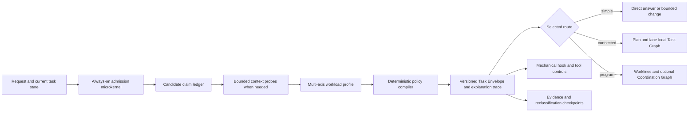

# Task Admission And Workload Compiler Contract

Status: `implemented-current-source-review-pending`
Source identity: 2026-08-04 user request to define a universal task-admission,
claim-extraction, workload-selection, policy-matching, and long-running-work
layer for Cascade
Contract IDs: `TA-001` through `TA-012`

## Outcome

Every request receives a small, explainable admission decision before a
workflow is selected. The decision expands only when the request's claims,
boundaries, hazards, uncertainty, or duration require more context, planning,
validation, or enforcement.

The layer must make simple work cheaper, medium work proportionate, and
complex or enterprise-assurance work explicit without reducing all decisions
to one complexity score. It produces a versioned **Task Envelope** that skills,
routes, hooks, tools, work lanes, and evaluators can consume. It does not
execute the task, grant authority, create a work lane, or prove completion.



## Goals And Non-Goals

Goals:

- classify request relation, intent, workload topology, assurance, authority,
  evidence, and state duration independently;
- extract stable claims and connect each selected control to the claims and
  signals that activated it;
- select the least costly route that still satisfies all hard constraints and
  assurance floors;
- reclassify long-running work when evidence, scope, permissions, or source
  identity changes;
- keep model judgment advisory while schemas, policies, permissions, hooks,
  validators, and tests enforce mechanical invariants; and
- preserve exact `NOT_RUN`, `GAP`, `BLOCKED`, and invalidation states instead
  of inflating authored or local evidence into acceptance.

Non-goals:

- running a full repository scan before every response;
- creating a lane, task, agent, branch, worktree, commit, or external action
  merely because a route is eligible;
- treating "enterprise-grade" as a synonym for large, slow, or highly
  formatted work;
- allowing a model-generated label to bypass permissions or hard controls;
- replacing skill trigger descriptions, repository instructions, or tool
  permission checks with a single classifier; or
- requiring the complete Cascade workflow for conversation, direct answers,
  atomic mechanical edits, or bounded low-risk changes.

## TA-001 Admission Applicability

The admission microkernel applies to every user turn, including follow-ups. It
performs only these cheap operations initially:

1. classify the request relation and primary intent;
2. record explicit authority, prohibitions, and deliverables;
3. detect obvious hard-hazard signals;
4. decide whether the request needs mutation, persistence, context probes, or
   clarification; and
5. emit a provisional route or request the smallest additional probe.

Conversation-only turns, status questions, and direct grounded answers still
receive this minimal pass, but they normally produce `NO_WORKFLOW` or
`DIRECT_READ`. Full claim extraction, repository scans, plans, worklines,
security review, end-to-end checks, or evaluators are conditional controls.

## TA-002 Task Envelope Authority

The Task Envelope is the sole admission artifact for one request revision. It
contains:

- stable envelope ID, schema version, policy-bundle version, request digest,
  task/thread identity, prior-envelope reference, and production time;
- request relation and intent;
- claim ledger with source, status, confidence, and verification route;
- workload profile across independent axes;
- selected route, control packs, required skills, evidence floor, persistence
  decision, and reclassification triggers;
- explicit user authority and still-missing authority;
- matched policy decisions and an explanation trace; and
- unresolved conflicts, gaps, blockers, non-goals, and invalidation rules.

The compiler owns derived route and control fields. The user request owns
explicit intent and authority. Current source and trusted tools own verified
state claims. Policy files own matching and precedence. Skills consume the
envelope but cannot silently rewrite it. A material request, source, policy,
permission, or scope change creates a new envelope revision.

## TA-003 Request Relation And Intent

Request relation is one of:

| Relation | Meaning |
|---|---|
| `NEW` | Starts a distinct objective. |
| `CONTINUE` | Continues the accepted objective without changing its contract. |
| `AMEND` | Adds or changes criteria, constraints, scope, or evidence. |
| `OVERRIDE` | Replaces an unfinished instruction or route. |
| `STATUS` | Requests current evidence or progress without new mutation authority. |
| `CANCEL` | Stops or supersedes work within the user's authority. |
| `CONVERSATION_ONLY` | Seeks discussion, explanation, or ideation without durable work. |

Primary intent is one of `ANSWER`, `DISCOVER`, `DIAGNOSE`, `REVIEW`,
`VALIDATE`, `CHANGE`, or `OPERATE`. Secondary intents may be recorded, but one
primary intent controls the base route. A request to review or diagnose does
not authorize implementation. A request to plan or create a work lane does
not authorize runtime dispatch.

## TA-004 Claim Ledger

The model may propose candidate claims. The deterministic compiler validates
their shape, source class, policy tags, and unresolved conflicts before they
can activate controls.

| Field | Contract |
|---|---|
| `claim_id` | Stable within the request lineage; never reused for a different meaning. |
| `kind` | `OUTCOME`, `CURRENT_STATE`, `CRITERION`, `CONSTRAINT`, `NON_GOAL`, `BOUNDARY`, `HAZARD`, `AUTHORITY`, `EVIDENCE`, or `INFERENCE`. |
| `statement` | One testable or decision-relevant assertion. |
| `source` | User, trusted instruction, current source, tool evidence, external source, or model inference. |
| `status` | `PROVIDED`, `VERIFIED`, `INFERRED`, `UNKNOWN`, `CONFLICTING`, or `SUPERSEDED`. |
| `confidence` | Calibrated model confidence for inferred extraction only; never substitutes for verification. |
| `verification` | Required probe, check, reviewer, or explicit reason none is needed. |
| `policy_tags` | Normalized hazard, boundary, authority, evidence, and routing signals. |
| `consumers` | Policies, controls, worklines, criteria, or evidence gates that depend on the claim. |
| `invalidation` | Request, source, permission, time, environment, or policy changes that require re-evaluation. |

Claims are atomic enough that one can be verified or invalidated without
silently changing another. Conflicting authoritative claims block dependent
mutation until precedence or user intent resolves them. Missing evidence
remains `UNKNOWN` or `GAP`; it is never inferred as success.

## TA-005 Independent Workload Axes

The compiler does not calculate one universal complexity grade. It records:

| Axis | Values | Key signals |
|---|---|---|
| topology | `ATOMIC`, `BOUNDED`, `CONNECTED`, `PROGRAM` | obligations, boundaries, dependencies, joins, independent worklines |
| effort | `MICRO`, `SMALL`, `MEDIUM`, `LARGE`, `EXTENDED` | expected inspection, files/areas, implementation slices, validation runtime, checkpoint count |
| assurance | `BASIC`, `STANDARD`, `HIGH`, `REGULATED` | consequence of error, release criticality, auth/tenant/data/payment/safety obligations |
| authority | `READ_ONLY`, `LOCAL_WRITE`, `EXTERNAL_WRITE`, `PRIVILEGED`, `DESTRUCTIVE` | requested side effects and required approval |
| evidence | `EXPLANATION`, `TARGETED`, `REGRESSION`, `INDEPENDENT`, `RELEASE` | what must be proven and by whom |
| duration | `TURN`, `MULTI_TURN`, `RESUMABLE`, `PROGRAM` | compaction risk, checkpoints, handoffs, external waits |
| context | `PROMPT_ONLY`, `TARGETED_PROBE`, `SCOPED_SCAN`, `FULL_SCAN` | uncertainty and blast-radius knowledge needed before safe action |

Examples of axis independence:

- rotating one production secret is small effort but privileged, high
  assurance, and independently reviewed;
- a broad documentation reformat may be large effort but basic assurance;
- a ten-feature refactor is `PROGRAM` topology even if each slice is simple;
- a full scan is a context control, not a synonym for high assurance or large
  implementation.

## TA-006 Route Classes

| Route | Applicability | Minimum result |
|---|---|---|
| `NO_WORKFLOW` | conversation-only or no actionable claim | answer with no durable mutation |
| `DIRECT_READ` | bounded read-only answer, status, diagnosis, or review | grounded result and uncertainty |
| `DIRECT_CHANGE` | atomic mechanical change with no behavior, contract, state, permission, or broad-regression impact | scoped edit plus targeted check |
| `BOUNDED` | one coherent outcome and validation seam | compact plan when non-atomic, scoped implementation, review/validation proportional to risk |
| `CONNECTED` | several dependent obligations inside one tracked lane | durable plan, worklines as sections, lane-local Task Graph when dependencies or repair justify it |
| `PROGRAM` | multiple independently trackable feature/workline outcomes with a cross-workline join, ownership, invalidation, or long-running coordination boundary | active lanes, typed dependencies, checkpoints, and Coordination Graph only when its applicability rule is met |

Ten to fifteen feature changes normally select `PROGRAM` when they have
independent acceptance seams or owners. They may remain one `CONNECTED` lane
only when one owner, write scope, state machine, and terminal evidence seam
make independent tracking artificial.

## TA-007 Composable Control Packs

Controls are selected as a union. The highest assurance and evidence floors
win; hard denials and approval requirements cannot be minimized away.

| Pack | Typical activation | Controls |
|---|---|---|
| `BASE` | every request | relation, intent, authority, obvious hazards, explanation trace |
| `GROUNDED_READ` | current-state answer, diagnosis, review, or status | targeted source/tool grounding and explicit freshness |
| `ATOMIC_CHANGE` | safe `DIRECT_CHANGE` | owned-scope check, diff inspection, targeted validation |
| `STANDARD_CHANGE` | non-atomic `BOUNDED` change | short plan, behavior/contract criteria, implementation, review, targeted regression |
| `CONNECTED_DELIVERY` | `CONNECTED` topology | durable plan, workline map, dependencies, checkpoints, partial-repair route |
| `PROGRAM_CONTROL` | `PROGRAM` topology or resumable multi-owner work | active lanes, source identities, graph applicability, handoffs, terminal evidence join |
| `SIMULATION_GOVERNANCE` | product, harness, or synthetic-persona simulation authoring/execution | versioned campaign, exact policy and source binding, frozen evidence, cleanup, and independent evaluation; domain-specific simulation contracts retain authority |
| `SECURITY_ASSURANCE` | changed trust, permission, auth, tenant, secret, sensitive-data, external-write, or abuse boundary | secure design, backend/tool enforcement, negative probes, independent security evidence |
| `FULL_SCAN` | explicit request; unknown blast radius around public/state/security/migration contracts; exhaustive migration/release inventory | repository-wide reference and hidden-consumer inventory with bounded exclusions and coverage report |
| `RELEASE_EVIDENCE` | explicit release/merge/deploy eligibility or high-consequence acceptance | current-source regression, independent review, environment identity, residual risk, named `NOT_RUN` gates |

`STANDARD_CHANGE` does not imply a full scan. `FULL_SCAN` does not itself
authorize writes. `SECURITY_ASSURANCE` may apply to an atomic task. Release
evidence cannot be satisfied by an authored plan, historical result, local
mock, or self-review unless the relevant policy explicitly permits it.

## TA-008 Policy Compilation And Precedence

Policy evaluation is deterministic over the normalized envelope:

1. validate schema and request lineage;
2. apply hard denials and missing-approval rules;
3. match domain hazards and assurance floors;
4. derive topology, duration, and context requirements;
5. derive evidence requirements;
6. union all activated control packs and skill obligations;
7. apply the minimizer only to optional or dominated controls;
8. reject contradictions, duplicate authorities, and unsupported required
   capabilities; and
9. emit `claim -> signal -> policy -> control -> route/evidence` trace rows.

Precedence is:

```text
hard deny
  > explicit approval requirement
  > domain hazard and non-compensating security controls
  > assurance and evidence floor
  > topology and duration route
  > optional evidence enhancements
  > minimization
```

Policies declare stable IDs, versions, applicability predicates, required and
forbidden controls, priority class, conflict set, rationale, and invalidation
rules. Equal-priority conflicting requirements fail closed with an explicit
`POLICY_CONFLICT`; the model does not choose one silently.

## TA-009 Context Escalation

Context is acquired progressively:

- `PROMPT_ONLY`: stable instructions and the current request are enough;
- `TARGETED_PROBE`: inspect named files, current task state, or precise source
  references;
- `SCOPED_SCAN`: inspect direct and hidden consumers within affected roots;
- `FULL_SCAN`: inventory the complete relevant repository surface with stated
  exclusions and coverage evidence.

A full scan activates only when explicitly requested or when a safe boundary
cannot otherwise be established for a public contract, stored representation,
security boundary, broad migration, deletion/replacement, or release claim.
The scan result may downgrade later implementation scope, but it cannot erase
hard assurance or authority controls.

## TA-010 Long-Running Reclassification

Long-running tasks compile more than once. Required checkpoints are:

1. initial admission;
2. after material discovery or specification normalization;
3. before the first mutation or external action;
4. at every accepted plan or graph revision;
5. after compaction, handoff, resume, or source-identity change;
6. after a blocker, failed gate, or changed permission; and
7. before terminal acceptance, release, deployment, or closeout.

Reclassification preserves claim and policy IDs whose meanings remain current,
marks changed facts `SUPERSEDED`, and reopens only controls, worklines, and
evidence that consume invalidated claims. It never resets retries, permissions,
or failed evidence silently.

For a feature set or large refactor, admission first creates a program envelope
and a plan. Worklines are then derived from independently meaningful outcomes,
write scopes, owners, dependencies, and validation seams. The number of
worklines is not fixed by the number of requested features. New evidence may
split, merge, serialize, or supersede them.

## TA-011 Workline Promotion And Dispatch Boundary

The admission layer decides whether persistence is useful; it does not create
active work automatically.

Promote to durable work state when at least one condition holds:

- the request spans multiple turns or can lose source/decision context;
- implementation is non-atomic and needs a durable plan;
- dependencies, evidence gates, repair, ownership, or handoff must survive;
- the user asks for a work lane, plan, or durable task artifact; or
- current repository policy requires an active lane for the selected route.

Use one lane-local Task Graph for connected obligations inside one lane. Create
a first-class Coordination Graph only for two or more real worklines plus a
cross-workline dependency, evidence/batch join, materialization boundary,
invalidation relationship, or partial-repair route that direct references
cannot represent safely.

Admission, readiness, and a recorded lane never authorize delegation, a new
Codex task, a branch/worktree, live/provider spend, an external write, commit,
push, publish, deployment, or destructive action. Those actions retain their
specific user and tool permission boundaries.

## TA-012 Hook And Enforcement Boundary

The rollout separates advisory classification from hard enforcement:

- `UserPromptSubmit` may run the cheap provisional microkernel and add a
  compact envelope summary to context. It must not perform a full repository
  scan, make network/model calls, create worklines, or mutate project state.
- the model and bounded read-only probes may enrich claims after prompt
  admission;
- the compiler produces the current envelope and route;
- `PreToolUse` and `PermissionRequest` may enforce only deterministic hard
  boundaries such as denied commands, missing approvals, destructive scope,
  external writes, or an invalid/stale envelope;
- skill routing, planning depth, and evidence selection remain explainable
  orchestration decisions unless converted into a tested mechanical rule; and
- hooks remain project-scoped trusted configuration, with trust review after
  hook changes.

Current Codex hook behavior is grounded in the official
[Hooks documentation](https://learn.chatgpt.com/docs/hooks). Hook availability
or trust does not become a hidden prerequisite for direct conversation: when
the advisory hook is unavailable, the runtime bridge performs the same
microkernel in-process and records the missing hook evidence.

## Security And Abuse Controls

Assets include the user's authority, repository data, secrets, task state,
tool arguments/results, policy bundles, traces, and external systems. Trust
boundaries exist between user instructions, repository instructions, retrieved
or tool content, model proposals, the compiler, hooks, and tool execution.

Required controls:

- untrusted retrieved content can propose no authority or policy changes;
- prompt, tool, terminal, browser, ticket, or external content cannot expand
  user-granted permissions;
- envelope and policy artifacts contain no raw secrets and use bounded,
  redacted trace fields;
- hard-action enforcement is backend/tool-side, not prose-only;
- policy/config changes invalidate affected envelopes and require trust review;
- external, privileged, destructive, or paid actions preserve explicit
  approval, idempotency, cost, timeout, and cleanup boundaries; and
- audit records distinguish proposed, compiled, authorized, executed,
  validated, independently reviewed, accepted, and release-eligible states.

## Representative Classifications

| Request | Profile | Route And Packs | Why |
|---|---|---|---|
| Explain a stable function from supplied text | `ATOMIC/MICRO/BASIC/READ_ONLY/EXPLANATION/TURN/PROMPT_ONLY` | `DIRECT_READ + BASE` | no mutation or current-source claim |
| Check current branch status | `ATOMIC/MICRO/BASIC/READ_ONLY/TARGETED/TURN/TARGETED_PROBE` | `DIRECT_READ + BASE + GROUNDED_READ` | current state requires a probe |
| Fix a typo | `ATOMIC/MICRO/BASIC/LOCAL_WRITE/TARGETED/TURN/TARGETED_PROBE` | `DIRECT_CHANGE + BASE + ATOMIC_CHANGE` | mechanical, no contract or behavior change |
| Add a bounded CLI flag | `BOUNDED/MEDIUM/STANDARD/LOCAL_WRITE/REGRESSION/MULTI_TURN/SCOPED_SCAN` | `BOUNDED + STANDARD_CHANGE` | public CLI behavior and tests change |
| Rotate one production credential | `ATOMIC/SMALL/HIGH/PRIVILEGED/INDEPENDENT/TURN/TARGETED_PROBE` | `BOUNDED + SECURITY_ASSURANCE` | small effort, high consequence and approval |
| Refactor 12 feature slices sharing state and release validation | `PROGRAM/EXTENDED/HIGH/LOCAL_WRITE/INDEPENDENT/PROGRAM/FULL_SCAN` | `PROGRAM + PROGRAM_CONTROL + FULL_SCAN + RELEASE_EVIDENCE` | multiple worklines, hidden consumers, integration join |
| Create and execute a product simulation | `CONNECTED/MEDIUM/HIGH/LOCAL_WRITE/INDEPENDENT/MULTI_TURN/SCOPED_SCAN` | `CONNECTED + CONNECTED_DELIVERY + SIMULATION_GOVERNANCE` | task admission selects governance; campaign policy still authorizes and binds execution |
| Build a synthetic-persona simulation from a product persona | `CONNECTED/MEDIUM/HIGH/LOCAL_WRITE/INDEPENDENT/MULTI_TURN/SCOPED_SCAN` | `CONNECTED + CONNECTED_DELIVERY + SIMULATION_GOVERNANCE` | shared controls compose with persona derivation, provenance, and refinement boundaries |
| Review an auth design without changing code | `BOUNDED/MEDIUM/HIGH/READ_ONLY/INDEPENDENT/MULTI_TURN/SCOPED_SCAN` | `DIRECT_READ or BOUNDED + GROUNDED_READ + SECURITY_ASSURANCE` | assurance applies without mutation |
| Send an external message | topology based on content; authority `EXTERNAL_WRITE` | route plus explicit approval control | workload size cannot grant external authority |

## Acceptance Criteria

- Every request produces a valid minimal envelope or a typed admission error.
- Every selected control has an explanation trace to one or more current
  claims and policy versions.
- Relation, intent, topology, effort, assurance, authority, evidence, duration,
  and context are independently represented.
- Simple direct-read and atomic-change fixtures do not load the full workflow,
  full scan, lane, graph, security, or release controls without a matching
  signal.
- Small high-risk fixtures receive security/permission controls even when
  effort remains `SMALL`.
- Medium behavior changes receive a plan and targeted regression without
  automatic program governance.
- Complex multi-feature fixtures produce adaptive worklines and reclassification
  checkpoints without assuming a fixed workline count.
- Product and synthetic-persona simulation requests select connected delivery
  and simulation governance without replacing campaign, provenance, product,
  execution, or evaluator authority.
- Conflicting policies fail closed and identify the conflicting policy IDs.
- Unknown or conflicting authority prevents the affected mutation but does not
  block unrelated read-only analysis.
- A user-prompt hook cannot scan the repository, call a model/network, create
  active work, or grant authority.
- Tool enforcement rejects stale, missing, or insufficient hard-action
  controls before side effects.
- Reclassification preserves current claims/evidence and reopens only named
  consumers of invalidated inputs.
- Harness evaluations cover happy paths, near misses, prompt injection,
  approval bypass, over-control, under-control, context overflow, resume, and
  long-running replanning.
- Current-source command, review, functional, security, and semantic evidence
  remain distinct at acceptance.
- Removing the admission layer restores the existing explicit route; rollout
  does not require a dual authoritative classifier after launch.
