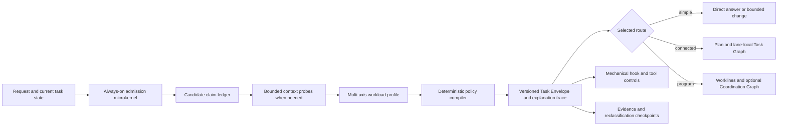

# Task Admission And Workload Compiler Contract

Status: `revision-41 attempt-2 locally validated review candidate at immutable r57; independent review pending`
Source identity: 2026-08-04 user request to define a universal task-admission,
claim-extraction, workload-selection, policy-matching, and long-running-work
layer for Cascade
Contract IDs: `TA-001` through `TA-012`

## Current Contract Identity

| Surface | Current identity | Local state | Acceptance boundary |
|---|---|---|---|
| Task Envelope, policy, control catalog, classifier, and case set | schema/catalog/classifier/case-set `v41`; `cascade-core@42` | `PASS_LOCAL` | fresh independent fixed-point review pending |
| Exact admission corpus | `981/981`; 16 revision-40 review-boundary, grounding, and continuation cases append after the preserved 965-row corpus | zero over-control, zero under-control; persistence `587/587`; claims `789/789` | local deterministic evidence only |
| Clause semantics | `scripts/cascade/admission-clauses.ts` typed clause state/reducer | current admission/clause/hook/intake slice passes `209/209` with 3,121 assertions | does not grant host, tool, provider, deployment, or release authority |

## Outcome

Every request receives a small, explainable admission decision before a
workflow is selected. The decision expands only when the request's claims,
boundaries, hazards, uncertainty, or duration require more context, planning,
validation, or enforcement.

The layer must make simple work cheaper, medium work proportionate, and
complex or enterprise-assurance work explicit without reducing all decisions
to one complexity score. It produces a versioned **Task Envelope** that skills,
routes, hooks, tools, work lanes, and evaluators can consume. It does not
execute the task, grant authority, create a work lane, or prove completion.



## Goals And Non-Goals

Goals:

- classify request relation, intent, workload topology, assurance, authority,
  evidence, and state duration independently;
- extract stable claims and connect each selected control to the claims and
  signals that activated it;
- select the least costly route that still satisfies all hard constraints and
  assurance floors;
- reclassify long-running work when evidence, scope, permissions, or source
  identity changes;
- keep model judgment advisory while schemas, policies, permissions, hooks,
  validators, and tests enforce mechanical invariants; and
- preserve exact `NOT_RUN`, `GAP`, `BLOCKED`, and invalidation states instead
  of inflating authored or local evidence into acceptance.

Non-goals:

- running a full repository scan before every response;
- creating a lane, task, agent, branch, worktree, commit, or external action
  merely because a route is eligible;
- treating "enterprise-grade" as a synonym for large, slow, or highly
  formatted work;
- allowing a model-generated label to bypass permissions or hard controls;
- replacing skill trigger descriptions, repository instructions, or tool
  permission checks with a single classifier; or
- requiring the complete Cascade workflow for conversation, direct answers,
  atomic mechanical edits, or bounded low-risk changes.

## TA-001 Admission Applicability

The admission microkernel applies to every user turn, including follow-ups. It
performs only these cheap operations initially:

1. classify the request relation and primary intent;
2. record explicit authority, prohibitions, and deliverables;
3. detect obvious hard-hazard signals;
4. decide whether the request needs mutation, persistence, context probes, or
   clarification; and
5. emit a provisional route or request the smallest additional probe.

Conversation-only turns, status questions, and direct grounded answers still
receive this minimal pass, but they normally produce `NO_WORKFLOW` or
`DIRECT_READ`. Full claim extraction, repository scans, plans, worklines,
security review, end-to-end checks, or evaluators are conditional controls.

## TA-002 Task Envelope Authority

The Task Envelope is the sole admission artifact for one request revision. It
contains:

- stable envelope ID, schema version, policy-bundle version, request digest,
  task/thread identity, prior-envelope reference, and production time;
- a versioned, digest-bound source-segment projection that distinguishes
  trusted direct-user bytes from trusted instructions and untrusted external,
  retrieved, or tool-originated bytes;
- request relation and intent;
- claim ledger with source, status, confidence, and verification route;
- workload profile across independent axes;
- selected route, control packs, required skills, evidence floor, persistence
  decision, and reclassification triggers;
- explicit user authority and still-missing authority;
- matched policy decisions and an explanation trace; and
- unresolved conflicts, gaps, blockers, non-goals, and invalidation rules.

The compiler owns derived route and control fields. The user request owns
explicit intent and authority. Current source and trusted tools own verified
state claims. Policy files own matching and precedence. Skills consume the
envelope but cannot silently rewrite it. A material request, source, policy,
permission, or scope change creates a new envelope revision.

Hard-action eligibility does not arise from lexical inference. A trusted host
must supply or attest the exact direct-user segment; the envelope binds that
attestation/version and its byte ranges. Lexical parsing may conservatively
identify likely external material for advisory routing, but absent trusted
direct-user provenance it cannot emit authority or `requested-*` claims.

## TA-003 Request Relation And Intent

Request relation is one of:

| Relation | Meaning |
|---|---|
| `NEW` | Starts a distinct objective. |
| `CONTINUE` | Continues the accepted objective without changing its contract. |
| `AMEND` | Adds or changes criteria, constraints, scope, or evidence. |
| `OVERRIDE` | Replaces an unfinished instruction or route. |
| `STATUS` | Requests current evidence or progress without new mutation authority. |
| `CANCEL` | Stops or supersedes work within the user's authority. |
| `CONVERSATION_ONLY` | Seeks discussion, explanation, or ideation without durable work. |

Primary intent is one of `ANSWER`, `DISCOVER`, `DIAGNOSE`, `REVIEW`,
`VALIDATE`, `CHANGE`, or `OPERATE`. Secondary intents may be recorded, but one
primary intent controls the base route. A request to review or diagnose does
not authorize implementation. A request to plan or create a work lane does
not authorize runtime dispatch.

## TA-004 Claim Ledger

The model may propose candidate claims. The deterministic compiler validates
their shape, source class, policy tags, and unresolved conflicts before they
can activate controls.

| Field | Contract |
|---|---|
| `claim_id` | Stable within the request lineage; never reused for a different meaning. |
| `kind` | `OUTCOME`, `CURRENT_STATE`, `CRITERION`, `CONSTRAINT`, `NON_GOAL`, `BOUNDARY`, `HAZARD`, `AUTHORITY`, `EVIDENCE`, or `INFERENCE`. |
| `statement` | One testable or decision-relevant assertion. |
| `source` | User, trusted instruction, current source, tool evidence, external source, or model inference. `USER` authority requires a matching trusted direct-user segment attestation. |
| `status` | `PROVIDED`, `VERIFIED`, `INFERRED`, `UNKNOWN`, `CONFLICTING`, or `SUPERSEDED`. |
| `confidence` | Calibrated model confidence for inferred extraction only; never substitutes for verification. |
| `verification` | Required probe, check, reviewer, or explicit reason none is needed. |
| `policy_tags` | Normalized hazard, boundary, authority, evidence, and routing signals. |
| `consumers` | Policies, controls, worklines, criteria, or evidence gates that depend on the claim. |
| `invalidation` | Request, source, permission, time, environment, or policy changes that require re-evaluation. |

Claims are atomic enough that one can be verified or invalidated without
silently changing another. Conflicting authoritative claims block dependent
mutation until precedence or user intent resolves them. Missing evidence
remains `UNKNOWN` or `GAP`; it is never inferred as success.

## TA-005 Independent Workload Axes

The compiler does not calculate one universal complexity grade. It records:

| Axis | Values | Key signals |
|---|---|---|
| topology | `ATOMIC`, `BOUNDED`, `CONNECTED`, `PROGRAM` | obligations, boundaries, dependencies, joins, independent worklines |
| effort | `MICRO`, `SMALL`, `MEDIUM`, `LARGE`, `EXTENDED` | expected inspection, files/areas, implementation slices, validation runtime, checkpoint count |
| assurance | `BASIC`, `STANDARD`, `HIGH`, `REGULATED` | consequence of error, release criticality, auth/tenant/data/payment/safety obligations |
| authority | `READ_ONLY`, `LOCAL_WRITE`, `EXTERNAL_WRITE`, `PRIVILEGED`, `DESTRUCTIVE` | requested side effects and required approval |
| evidence | `EXPLANATION`, `TARGETED`, `REGRESSION`, `INDEPENDENT`, `RELEASE` | what must be proven and by whom |
| duration | `TURN`, `MULTI_TURN`, `RESUMABLE`, `PROGRAM` | compaction risk, checkpoints, handoffs, external waits |
| context | `PROMPT_ONLY`, `TARGETED_PROBE`, `SCOPED_SCAN`, `FULL_SCAN` | uncertainty and blast-radius knowledge needed before safe action |

Examples of axis independence:

- rotating one production secret is small effort but privileged, high
  assurance, and independently reviewed;
- a broad documentation reformat may be large effort but basic assurance;
- a ten-feature refactor is `PROGRAM` topology even if each slice is simple;
- a full scan is a context control, not a synonym for high assurance or large
  implementation.

## TA-006 Route Classes

| Route | Applicability | Minimum result |
|---|---|---|
| `NO_WORKFLOW` | conversation-only or no actionable claim | answer with no durable mutation |
| `DIRECT_READ` | bounded read-only answer, status, diagnosis, or review | grounded result and uncertainty |
| `DIRECT_CHANGE` | atomic mechanical change with no behavior, contract, state, permission, or broad-regression impact | scoped edit plus targeted check |
| `BOUNDED` | one coherent outcome and validation seam | compact plan when non-atomic, scoped implementation, review/validation proportional to risk |
| `CONNECTED` | several dependent obligations inside one tracked lane | durable plan, worklines as sections, lane-local Task Graph when dependencies or repair justify it |
| `PROGRAM` | multiple independently trackable feature/workline outcomes with a cross-workline join, ownership, invalidation, or long-running coordination boundary | active lanes, typed dependencies, checkpoints, and Coordination Graph only when its applicability rule is met |

Ten to fifteen feature changes normally select `PROGRAM` when they have
independent acceptance seams or owners. They may remain one `CONNECTED` lane
only when one owner, write scope, state machine, and terminal evidence seam
make independent tracking artificial.

## TA-007 Composable Control Packs

Controls are selected as a union. The highest assurance and evidence floors
win; hard denials and approval requirements cannot be minimized away.

| Pack | Typical activation | Controls |
|---|---|---|
| `BASE` | every request | relation, intent, authority, obvious hazards, explanation trace |
| `GROUNDED_READ` | current-state answer, diagnosis, review, or status | targeted source/tool grounding and explicit freshness |
| `ATOMIC_CHANGE` | safe `DIRECT_CHANGE` | owned-scope check, diff inspection, targeted validation |
| `STANDARD_CHANGE` | non-atomic `BOUNDED` change | short plan, behavior/contract criteria, implementation, review, targeted regression |
| `CONNECTED_DELIVERY` | `CONNECTED` topology | durable plan, workline map, dependencies, checkpoints, partial-repair route |
| `PROGRAM_CONTROL` | `PROGRAM` topology or resumable multi-owner work | active lanes, source identities, graph applicability, handoffs, terminal evidence join |
| `SIMULATION_GOVERNANCE` | product, harness, or synthetic-actor simulation authoring/execution | bounded actor, interface, brief, outcome, limits, cleanup, and observable evidence by default; add connected delivery, versioned campaign identity, frozen evidence, and independent evaluation only for explicit comparisons, calibration, release evidence, or other campaign scope; domain-specific simulation contracts retain authority |
| `SECURITY_ASSURANCE` | changed trust, permission, auth, tenant, secret, sensitive-data, external-write, or abuse boundary | secure design, backend/tool enforcement, negative probes, independent security evidence |
| `FULL_SCAN` | explicit request; unknown blast radius around public/state/security/migration contracts; exhaustive migration/release inventory | repository-wide reference and hidden-consumer inventory with bounded exclusions and coverage report |
| `RELEASE_EVIDENCE` | explicit release/merge/deploy eligibility or high-consequence acceptance | current-source regression, independent review, environment identity, residual risk, named `NOT_RUN` gates |

`STANDARD_CHANGE` does not imply a full scan. `FULL_SCAN` does not itself
authorize writes. `SECURITY_ASSURANCE` may apply to an atomic task. Release
evidence cannot be satisfied by an authored plan, historical result, local
mock, or self-review unless the relevant policy explicitly permits it.

## TA-008 Policy Compilation And Precedence

Policy evaluation is deterministic over the normalized envelope:

1. validate schema and request lineage;
2. apply hard denials and missing-approval rules;
3. match domain hazards and assurance floors;
4. derive topology, duration, and context requirements;
5. derive evidence requirements;
6. union all activated control packs and skill obligations;
7. apply the minimizer only to optional or dominated controls;
8. reject contradictions, duplicate authorities, and unsupported required
   capabilities; and
9. emit `claim -> signal -> policy -> control -> route/evidence` trace rows.

Precedence is:

```text
hard deny
  > explicit approval requirement
  > domain hazard and non-compensating security controls
  > assurance and evidence floor
  > topology and duration route
  > optional evidence enhancements
  > minimization
```

Policies declare stable IDs, versions, applicability predicates, required and
forbidden controls, priority class, conflict set, rationale, and invalidation
rules. Equal-priority conflicting requirements fail closed with an explicit
`POLICY_CONFLICT`; the model does not choose one silently.

## TA-009 Context Escalation

Context is acquired progressively:

- `PROMPT_ONLY`: stable instructions and the current request are enough;
- `TARGETED_PROBE`: inspect named files, current task state, or precise source
  references;
- `SCOPED_SCAN`: inspect direct and hidden consumers within affected roots;
- `FULL_SCAN`: inventory the complete relevant repository surface with stated
  exclusions and coverage evidence.

A full scan activates only when explicitly requested or when a safe boundary
cannot otherwise be established for a public contract, stored representation,
security boundary, broad migration, deletion/replacement, or release claim.
The scan result may downgrade later implementation scope, but it cannot erase
hard assurance or authority controls.

## TA-010 Long-Running Reclassification

Long-running tasks compile more than once. Required checkpoints are:

1. initial admission;
2. after material discovery or specification normalization;
3. before the first mutation or external action;
4. at every accepted plan or graph revision;
5. after compaction, handoff, resume, or source-identity change;
6. after a blocker, failed gate, or changed permission; and
7. before terminal acceptance, release, deployment, or closeout.

Reclassification preserves claim and policy IDs whose meanings remain current,
marks changed facts `SUPERSEDED`, and reopens only controls, worklines, and
evidence that consume invalidated claims. It never resets retries, permissions,
or failed evidence silently.

For a feature set or large refactor, admission first creates a program envelope
and a plan. Worklines are then derived from independently meaningful outcomes,
write scopes, owners, dependencies, and validation seams. The number of
worklines is not fixed by the number of requested features. New evidence may
split, merge, serialize, or supersede them.

## TA-011 Workline Promotion And Dispatch Boundary

The admission layer decides whether persistence is useful; it does not create
active work automatically.

Promote to durable work state when at least one condition holds:

- the request spans multiple turns or can lose source/decision context;
- implementation is non-atomic and needs a durable plan;
- dependencies, evidence gates, repair, ownership, or handoff must survive;
- the user asks for a work lane, plan, or durable task artifact; or
- current repository policy requires an active lane for the selected route.

Use one lane-local Task Graph for connected obligations inside one lane. Create
a first-class Coordination Graph only for two or more real worklines plus a
cross-workline dependency, evidence/batch join, materialization boundary,
invalidation relationship, or partial-repair route that direct references
cannot represent safely.

Admission, readiness, and a recorded lane never authorize delegation, a new
Codex task, a branch/worktree, live/provider spend, an external write, commit,
push, publish, deployment, or destructive action. Those actions retain their
specific user and tool permission boundaries.

## TA-012 Hook And Enforcement Boundary

The rollout separates advisory classification from hard enforcement:

- `UserPromptSubmit` may run the cheap provisional microkernel and add a
  compact envelope summary to context. It must not perform a full repository
  scan, make network/model calls, create worklines, or mutate project state.
- the model and bounded read-only probes may enrich claims after prompt
  admission;
- the compiler produces the current envelope and route;
- `PreToolUse` and `PermissionRequest` may enforce only deterministic hard
  boundaries such as denied commands, missing approvals, destructive scope,
  external writes, or an invalid/stale envelope;
- skill routing, planning depth, and evidence selection remain explainable
  orchestration decisions unless converted into a tested mechanical rule; and
- hooks remain project-scoped trusted configuration, with trust review after
  hook changes.

Current Codex hook behavior is grounded in the official
[Hooks documentation](https://learn.chatgpt.com/docs/hooks). Hook availability
or trust does not become a hidden prerequisite for direct conversation: when
the advisory hook is unavailable, the runtime bridge performs the same
microkernel in-process and records the missing hook evidence.

## Security And Abuse Controls

Assets include the user's authority, repository data, secrets, task state,
tool arguments/results, policy bundles, traces, and external systems. Trust
boundaries exist between user instructions, repository instructions, retrieved
or tool content, model proposals, the compiler, hooks, and tool execution.

Required controls:

- untrusted retrieved content can propose no authority or policy changes;
- prompt, tool, terminal, browser, ticket, or external content cannot expand
  user-granted permissions;
- quoted, escaped, nested, fenced, multiline, copied, or paraphrased external
  content is either host-labelled or classified conservatively; punctuation
  alone cannot return it to direct-user authority;
- envelope and policy artifacts contain no raw secrets and use bounded,
  redacted trace fields;
- hard-action enforcement is backend/tool-side, not prose-only;
- host-local plan, input, wait, and status controls are not external writes;
  delegation, durable goal creation, external writes, privileged actions, and
  destructive actions retain their own explicit controls;
- hard-action evaluation rejects non-finite time and treats `expires_at` as an
  exclusive upper bound, so equality is expired;
- policy/config changes invalidate affected envelopes and require trust review;
- external, privileged, destructive, or paid actions preserve explicit
  approval, idempotency, cost, timeout, and cleanup boundaries; and
- audit records distinguish proposed, compiled, authorized, executed,
  validated, independently reviewed, accepted, and release-eligible states.

## Representative Classifications

| Request | Profile | Route And Packs | Why |
|---|---|---|---|
| Explain a stable function from supplied text | `ATOMIC/MICRO/BASIC/READ_ONLY/EXPLANATION/TURN/PROMPT_ONLY` | `DIRECT_READ + BASE` | no mutation or current-source claim |
| Check current branch status | `ATOMIC/MICRO/BASIC/READ_ONLY/TARGETED/TURN/TARGETED_PROBE` | `DIRECT_READ + BASE + GROUNDED_READ` | current state requires a probe |
| Fix a typo | `ATOMIC/MICRO/BASIC/LOCAL_WRITE/TARGETED/TURN/TARGETED_PROBE` | `DIRECT_CHANGE + BASE + ATOMIC_CHANGE` | mechanical, no contract or behavior change |
| Add a bounded CLI flag | `BOUNDED/MEDIUM/STANDARD/LOCAL_WRITE/REGRESSION/MULTI_TURN/SCOPED_SCAN` | `BOUNDED + STANDARD_CHANGE` | public CLI behavior and tests change |
| Rotate one production credential | `ATOMIC/SMALL/HIGH/PRIVILEGED/INDEPENDENT/TURN/TARGETED_PROBE` | `BOUNDED + SECURITY_ASSURANCE` | small effort, high consequence and approval |
| Refactor 12 feature slices sharing state and release validation | `PROGRAM/EXTENDED/HIGH/LOCAL_WRITE/INDEPENDENT/PROGRAM/FULL_SCAN` | `PROGRAM + PROGRAM_CONTROL + FULL_SCAN + RELEASE_EVIDENCE` | multiple worklines, hidden consumers, integration join |
| Run one bounded synthetic actor against a local interface | `BOUNDED/MEDIUM/STANDARD/LOCAL_WRITE/TARGETED/MULTI_TURN/TARGETED_PROBE` | `BOUNDED + SIMULATION_GOVERNANCE` | the compact actor/interface/brief/outcome contract does not create campaign or independent-evaluation work |
| Run a controlled product simulation campaign with calibration and independent evaluation | `CONNECTED/MEDIUM/HIGH/LOCAL_WRITE/INDEPENDENT/MULTI_TURN/SCOPED_SCAN` | `CONNECTED + STANDARD_CHANGE + CONNECTED_DELIVERY + SIMULATION_GOVERNANCE` | explicit campaign semantics select versioned campaign governance; campaign policy still authorizes and binds execution |
| Build a synthetic-persona simulation from a product persona | `BOUNDED/MEDIUM/STANDARD/LOCAL_WRITE/REGRESSION/MULTI_TURN/SCOPED_SCAN` | `BOUNDED + STANDARD_CHANGE + SIMULATION_GOVERNANCE` | product-persona provenance and proposal-only refinement remain required, but do not imply a campaign without controlled-comparison, calibration, repeated-run, or release scope |
| Review an auth design without changing code | `BOUNDED/MEDIUM/HIGH/READ_ONLY/INDEPENDENT/MULTI_TURN/SCOPED_SCAN` | `DIRECT_READ or BOUNDED + GROUNDED_READ + SECURITY_ASSURANCE` | assurance applies without mutation |
| Send an external message | topology based on content; authority `EXTERNAL_WRITE` | route plus explicit approval control | workload size cannot grant external authority |

## Acceptance Criteria

- Every request produces a valid minimal envelope or a typed admission error.
- Every selected control has an explanation trace to one or more current
  claims and policy versions.
- Relation, intent, topology, effort, assurance, authority, evidence, duration,
  and context are independently represented.
- Simple direct-read and atomic-change fixtures do not load the full workflow,
  full scan, lane, graph, security, or release controls without a matching
  signal.
- Small high-risk fixtures receive security/permission controls even when
  effort remains `SMALL`.
- Medium behavior changes receive a plan and targeted regression without
  automatic program governance.
- Complex multi-feature fixtures produce adaptive worklines and reclassification
  checkpoints without assuming a fixed workline count.
- Product and synthetic-persona simulation requests select connected delivery
  and simulation governance without replacing campaign, provenance, product,
  execution, or evaluator authority.
- Conflicting policies fail closed and identify the conflicting policy IDs.
- Unknown or conflicting authority prevents the affected mutation but does not
  block unrelated read-only analysis.
- A user-prompt hook cannot scan the repository, call a model/network, create
  active work, or grant authority.
- Tool enforcement rejects stale, missing, or insufficient hard-action
  controls before side effects.
- Reclassification preserves current claims/evidence and reopens only named
  consumers of invalidated inputs.
- Harness evaluations cover happy paths, near misses, prompt injection,
  approval bypass, over-control, under-control, context overflow, resume, and
  long-running replanning.
- Current-source command, review, functional, security, and semantic evidence
  remain distinct at acceptance.
- Removing the admission layer restores the existing explicit route; rollout
  does not require a dual authoritative classifier after launch.

## Revision 12 Attempt 1 Contract Delta

The revision-11 attempt budget is exhausted. Revision 12 preserves the
requirements-only authority model while tightening two related boundaries:

- destructive shell classification covers forced checkout/switch/clean,
  worktree removal, and copying `/dev/null` over a target;
- a nested `functions.exec` patch is local-write only when its patch body is a
  statically bounded string proven not to contain a delete-file header;
- bounded reads include the reviewed Docker inspect/images, Kubernetes
  describe/logs, GitHub issue/run view, and Git remote listing forms;
- natural pasted/copied/clipboard introductions are external-source spans;
  and
- destructive language activates destructive/requested-destructive tags only
  for change or operation intent. Review and explanation stay read-only;
  direct delete intent remains a hard action.

These semantics are versioned as Task Envelope/schema/catalog/case set v13,
classifier `cascade-task-admission-v13`, and `cascade-core@14`. The exact corpus
contains 124 cases. Local validation is necessary but does not supply an
independent review, trusted production authority host, provider execution,
hard action, promotion, deployment, or release receipt.

## Revision 13 Attempt 1 Contract Delta

Fresh independent revision-12 probes exhausted that attempt by finding
additional shell composition, nested capability, permission-mode,
reclassification, provenance, claim-kind, and destructive-vocabulary gaps.
Revision 13 retains the same authority boundary while requiring:

- shell control operators, substitutions, process substitution, background
  execution, unknown composition, and command-specific write/config flags to
  fail closed, while only command-specific bounded read forms remain read-only;
- nested tool discovery to recognize destructuring, optional chaining,
  parentheses, constant computed names, and aliases, with unresolved dynamic
  capabilities, command bodies, or patch bodies classified as destructive;
- destructive Git, filesystem, PowerShell, infrastructure, package, and MCP
  variants to receive destructive action controls;
- hard actions to require an explicit safe-interactive permission mode from
  the exact allowlist `default`, `ask`, `interactive`, or `on-request`;
- claim identity to survive reclassification only under canonical equality of
  all claim semantics plus intent and provenance authority, otherwise
  superseding the claim and reopening its consumers;
- destructive terminology in documentation, tests, and parser work to remain
  non-destructive while actual remove, purge, wipe, or delete intent is
  destructive;
- copied, pasted, clipboard, and explicit read-framing forms to remain
  untrusted source spans; and
- explicit `CURRENT_STATE`, `BOUNDARY`, `HAZARD`, and `EVIDENCE` claims to use
  their advertised verification and consumer contracts.

These semantics are versioned as Task Envelope/schema/catalog/case set v14,
classifier `cascade-task-admission-v14`, and `cascade-core@15`. The exact corpus
contains 131 cases. Local validation is necessary but does not supply an
independent review, trusted production authority host, provider execution,
hard action, promotion, deployment, or release receipt.

## Revision 14 Attempt 1 Contract Delta

Fresh revision-13 review probes exhausted that attempt. Optional-computed
capabilities could be missed, one static nested command could launder a later
dynamic command, safe file-descriptor duplication was over-controlled, and
command-specific flags plus cloud read verbs were not anchored tightly enough.
The same probes found missing destructive MCP synonyms, incomplete natural
pasted-review framing and destructive intent phrasing, label-only specialized
claims, and non-injective duplicate-claim reclassification.

Revision 14 retains the authority boundary and requires:

- every optional, computed, aliased, or unresolved nested capability to be
  classified, with each nested execution call parsed independently;
- literal decoy commands never to make dynamic command bodies safe;
- `2>&1` and `1>&2` to preserve read liveness while actual file redirection,
  `find`, `sed`, `curl`, `helm`, `aws`, and `az` write or execution semantics
  retain their correct hard-action class;
- cloud read verbs to be anchored to command positions rather than argument
  values, and destructive MCP synonyms such as expunge and obliterate to fail
  closed;
- natural copied/pasted review introductions to remain external-source spans;
- natural current-state, boundary, hazard, and evidence prose to emit the
  advertised exact consumers and invalidation keys;
- reclassification matching to consume each prior claim at most once, so
  duplicate identical statements preserve distinct IDs deterministically; and
- polite, desire, and collaborative remove/delete/erase/drop requests to be
  destructive while tests, documentation, and classifier work about those
  words remain local.

These semantics are versioned as Task Envelope/schema/catalog/case set v15,
classifier `cascade-task-admission-v15`, and `cascade-core@16`. The exact corpus
contains 140 cases. Local validation is necessary but does not supply an
independent review, trusted production authority host, provider execution,
hard action, promotion, deployment, or release receipt.

## Revision 15 Attempt 1 Contract Delta

Fresh revision-14 review failed the remaining command, provenance, intent, and
claim boundaries. `sed -n` execution commands, `find -fprint0`, Bash named-file
descriptors, curl state/log files, destructive AWS/Azure operations, and MCP
unlink/prune/terminate/empty/rmdir/shred names were not all classified by their
actual effects. Natural paste/clipboard introductions, `Review:` or `Explain:`
proposed-action text, `help me remove` intent, and unlabeled specialized claims
also retained under-control or over-control cases.

Revision 15 preserves the authority, hook, policy-precedence, reclassification,
and graph boundaries while requiring:

- `sed` execution commands to be destructive and `s///w` output to be a local
  write;
- `find -fprint0`, Bash `{fd}>`, and curl `--stderr`, `--hsts`, and `--alt-svc`
  file targets to be local writes;
- destructive cloud operation verbs to dominate while token-positioned read
  operations remain read-only;
- MCP unlink, prune, terminate, empty, rmdir, and shred variants to be
  destructive;
- the named natural paste and clipboard framings to remain external-source
  spans, while reviewed or explained proposed actions remain read-only;
- polite `help me remove` requests to be destructive without upgrading tests
  or documentation about that wording; and
- natural current-state, boundary, hazard, and evidence statements to emit the
  advertised contracts without relabelling change outcomes.

These semantics advance together to Task Envelope/schema/catalog/case set v16,
classifier `cascade-task-admission-v16`, and `cascade-core@17`. The exact corpus
contains 151 cases. Local validation remains separate from independent review,
trusted production authority hosting, provider execution, real hard actions,
promotion, deployment, and release evidence.

## Revision 16 Attempt 1 Contract Delta

Fresh revision-15 independent probes found two remaining boundary clusters.
Effect classification did not cover every numeric, range, regex, and step
address form of `sed -n` write or execute commands, and AWS/Azure global
options or compound command lists could obscure a later destructive action.
Natural-language classification still missed additional polite destructive
requests, first-person pasted/copied attribution, review/explain proposed-action
framing, and ordinary variants of the four specialized claim kinds.

Revision 16 preserves the authority, hook, graph, and no-auto-dispatch
boundaries while requiring:

- all supported `sed -n` numeric, range, regex, and step addresses with `e` to
  be destructive, standalone `w`/`W` to be local writes, and print-only forms
  to remain read-only;
- AWS/Azure global options between service and action to preserve the actual
  action class, with any destructive command in a compound list dominating,
  while paired describe/show commands remain read-only;
- `would you mind deleting` and `assist me in removing` requests to be
  destructive, without upgrading tests or implementation work about those
  phrases;
- first-person `I've pasted` and `I've copied` spans, plus review/explain
  proposed-action text, to remain external advisory content and read-only; and
- natural current-state, boundary, hazard, and evidence variants to emit the
  exact claim contract, while requested change outcomes remain outcomes.

These semantics advance together to Task Envelope/schema/catalog/case set v17,
classifier `cascade-task-admission-v17`, and `cascade-core@18`. The exact corpus
contains 160 cases. Local validation remains separate from fresh independent
review, trusted production authority hosting, provider execution, real hard
actions, promotion, deployment, and release evidence.

## Revision 17 Attempt 1 Contract Delta

Fresh revision-16 independent probes found four remaining generalization
boundaries: print-only `sed` programs with long quiet flags, combined flags,
step addresses, and alternate regex delimiters; additional polite destructive
request forms; copied/pasted/clipboard/proposed-action/Slack-drop framing; and
ordinary factual current-state, boundary, hazard, and evidence clauses.

Revision 17 requires effect-based `sed` program parsing, polite mutation
normalization across modal and inflected forms, advisory external-source spans
for the named framing family, and semantic specialized claims without
relabelling meta-work or requested change outcomes. These semantics advance
together to Task Envelope/schema/catalog/case set v18, classifier
`cascade-task-admission-v18`, and `cascade-core@19`. The exact corpus contains
184 cases. Local evidence proposes review only; fresh independent review,
trusted host activation, provider execution, real hard actions, promotion,
deployment, and release evidence remain `NOT_RUN`.

## Revision 18 Attempt 1 Contract Delta

Revision-17 independent architecture/harness, functional, and security review
failed the local fixed point under receipts
`W031-R17-ARCH-HARNESS-REVIEW-20260805-IND-01`,
`W031-R17-FUNCTIONAL-REVIEW-20260805-IND-01`, and
`W031-R17-SECURITY-REVIEW-20260805-IND-01`. The failures covered premature
local-write admission, effect-misclassified shell/package/MCP tools, advisory
source-span continuations, polite mutation variants, natural specialized
claims, source-drift and distinct-objective reclassification, secret
minimization, and bounded claim-history rollover.

Revision 18 therefore requires a current proportional Task Envelope before a
local write may defer to the ordinary interactive permission flow; it never
auto-approves that write. Read-only, missing, stale, blocked, conflicting, or
non-interactive envelopes fail closed for local writes. Effect classification
must recognize `sed` execute/write flags, destructive Node filesystem calls,
package lifecycle effects, and mutating MCP verb families. Advisory copied or
pasted source spans remain non-authoritative until a direct-user continuation;
source-sensitive claims invalidate on source-digest drift, distinct objectives
remain `NEW`, and claim history compacts within the public 64-item bound.

These semantics advance together to Task Envelope/schema/catalog/case set v19,
classifier `cascade-task-admission-v19`, and `cascade-core@20`. The exact corpus
contains 210 cases. Receipt `W031-R18A1-EXEC-20260805` records local validation
only. Fresh independent architecture/harness, functional, and security review
is required; trusted host activation, provider execution, real hard actions,
promotion, deployment, and release evidence remain `NOT_RUN` or
`NOT_IMPLEMENTED/NOT_RUN` as applicable.

## Revision 19 Attempt 1 Contract Delta

Fresh revision-18 architecture/harness, functional, and security probes failed
grouped and non-quiet `sed` effects, official `apply_patch` deletion input,
local-write target binding, malformed-hook process behavior, copied-source
continuations across ordinary punctuation, additional polite destructive
requests, natural specialized claims, and weak distinct-objective evidence.

Revision 19 keeps the authority and no-auto-approval boundaries unchanged and
requires:

- every local-write Task Envelope to bind either explicit normalized targets or
  repository scope; a tool call outside explicit targets or with an unresolved
  target must deny, while an in-scope write may only defer to the normal
  interactive permission boundary;
- official `apply_patch` command bodies and grouped, quoted, non-quiet, or
  combined `sed` programs to be classified by their strongest effect, with any
  execute flag destructive, write-only programs local, and escaped-semicolon
  print programs read-only;
- malformed or timed-out hook execution to fail closed through blocking exit
  status 2 before the configured host timeout;
- copied, pasted, or clipboard commands to remain advisory unless a direct-user
  continuation follows across supported comma, dash, or parenthetical
  punctuation, at which point the referenced action retains its true effect;
- polite active and passive destructive requests, ordinary current-state,
  boundary, evidence, and hazard clauses, and natural credential assignments to
  preserve their exact semantic and redaction contracts; and
- reclassification to require objective overlap, rather than a shared generic
  word or an unrelated pronoun, before treating a request as an amendment.

These semantics advance together to Task Envelope/schema/catalog/case set v20,
classifier `cascade-task-admission-v20`, and `cascade-core@21`. The exact corpus
contains 228 cases. Receipt `W031-R19A1-EXEC-20260805` records local validation
only. Fresh independent architecture/harness, functional, and security review
is required; trusted host activation, provider execution, real hard actions,
promotion, deployment, and release evidence remain `NOT_RUN` or
`NOT_IMPLEMENTED/NOT_RUN` as applicable.

## Revision 20 Exact-Target And Semantic Repair

Fresh revision-19 architecture, functional, and security review found that the
local-write target extractor described command sources as targets, quoted `sed`
filenames could be interpreted as programs, inherited object properties could
satisfy private schema requirements, and several natural provenance, intent,
claim, continuation, and credential forms remained incomplete.

Revision 20 requires a `TARGETS` scope to name exact normalized paths. A named
directory does not authorize its descendants. `cp`, `mv`, `install`, `touch`,
and `mkdir` are parsed according to their command-specific operand and
destination options; every mutation target must resolve exactly, otherwise the
tool decision denies before normal permission evaluation. Forms that may create
unresolved backup or parent paths fail closed. `REPOSITORY` remains an explicit
repository-wide scope and is never inferred from one named path.

`sed` option, program, and filename positions are parsed separately. Actual
execute and write programs retain their strongest effect, while a quoted input
filename that resembles a program stays read-only. Review, audit, copied,
clipboard, and proposed-action text stays read-only across colon and spaced or
unspaced dash forms unless a real direct continuation follows. Bare continuation
requests preserve the prior mutation intent, while a source-digest change
supersedes source-sensitive claims and reopens their consumers.

These semantics advance together to Task Envelope/schema/catalog/case set v21,
classifier `cascade-task-admission-v21`, and `cascade-core@22`. The exact corpus
contains 243 cases. Receipt `W031-R20A1-EXEC-20260805` records local validation
only. Fresh independent architecture/harness, functional, and security review
is required; trusted host activation, provider execution, real hard actions,
promotion, deployment, and release evidence remain `NOT_RUN` or
`NOT_IMPLEMENTED/NOT_RUN` as applicable.

## Revision 21 Exact-Shell And Continuation Repair

Fresh revision-20 architecture, functional, and security review found that
directory-sensitive copy, move, and install destinations could still escape an
exact target; touch and mkdir shared an incorrect option grammar; `sed` backup
suffixes and macOS `-i ''` were not distinguished; and mixed read/write shell
segments could not produce a complete target set. The same review also found
held-out copied-review, direct-continuation, possessive removal, credential
linking, natural claim, and prior-intent forms.

Revision 21 requires command-specific fail-closed grammars. `touch` flag and
value options cannot consume a mutation operand, `mkdir -p` is unresolved,
backup/suffix/parents/trailing-slash forms deny, and `cp`, `mv`, or `install`
may defer as an exact local write only with two operands plus explicit
`-T/--no-target-directory` semantics. `sed -i ''` mutates only its named input,
while any in-place backup suffix remains unresolved. Known read-only segments
may precede or follow exact write segments; an unresolved working-directory
change such as `cd` fails closed rather than guessing a path context.

Copied, pasted, clipboard, review, and inverse framing remains advisory across
colon, hyphen, and spaced or unspaced en/em dash forms. Direct dependent
continuations generalize across proceed, carry out, do it/that, and go ahead,
while quoted/reviewed phrases and explicit new or amended objectives retain
their own boundary. A generic continue/resume request inherits prior mutation
intent only when a valid prior envelope makes it semantically dependent.

These semantics advance together to Task Envelope/schema/catalog/case set v22,
classifier `cascade-task-admission-v22`, and `cascade-core@23`. The exact corpus
contains 258 cases. Receipt `W031-R21A1-EXEC-20260805` records local validation
only. Fresh independent architecture/harness, functional, and security review
is required; shared W-032 rebinding, trusted host activation, provider
execution, real hard actions, promotion, deployment, and release evidence
remain `NOT_RUN` or `NOT_IMPLEMENTED/NOT_RUN` as applicable.

## Revision 22 Mutation-Scope And Semantic Repair

Independent revision-21 architecture, functional, and GF-101 security review
found that exact mutation scope still omitted the source removed by `mv` and
the destination declared by an official `apply_patch` move. Recursive or
archive copy modes could also authorize an exact destination while creating
unknown descendants. Mixed literal output segments, multiword secret values,
review-only inverse framing, appreciative or noun-form destructive requests,
validation continuations, and several natural claim forms remained incomplete.

Revision 22 treats every path mutated by an operation as an exact target. An
`mv -T` requires both source and destination authorization, `*** Move to:` adds
the move destination to the patch target set, and recursive/archive `cp` modes
fail closed even when combined with `-T`. Precisely literal `echo` and `printf`
segments may compose with exact writes, while redirection, substitution,
piping, or unresolved composition denies. Admission schemas are validated by
the shared hardened JSON Schema consumer; the Task Envelope retains an explicit
strict RFC 3339 semantic check for its two timestamp projections.

Natural secret assignments redact the complete quoted or unquoted value up to
the sentence boundary and remain idempotent around `[REDACTED]`. Copied,
pasted, proposed-action, Slack-message, straight-quote, and curly-quote review
framing remains non-authoritative unless a direct continuation follows.
Clear noun, gerund, passive, possessive, and appreciative destruction requests
remain destructive, while parser or wording work remains a local change.
Dependent continue/resume validation inherits prior mutation intent without
crossing an explicit new-objective boundary. Current-state, evidence, and
write-boundary claims retain source-drift invalidation.

These semantics advance together to Task Envelope/schema/catalog/case set v23,
classifier `cascade-task-admission-v23`, and `cascade-core@24`. The exact corpus
contains 294 cases. Receipt `W031-R22A1-EXEC-20260805` records local review
evidence only. Fresh independent architecture/harness, functional, and GF-101
security review is required; W-032 rebinding, complete repository regression,
trusted-host activation, provider execution, real hard actions, promotion,
deployment, and release evidence remain root-owned, `NOT_RUN`, or
`NOT_IMPLEMENTED/NOT_RUN` as applicable.

Revision-22 independent review found two fail-open target seams and adjacent
language, provenance, redaction, and claim-classification gaps. Revision 23
requires atomic patch target admission: if any Add, Update, Delete, or Move
directive is empty, absolute, traversing, or otherwise non-canonical, the
complete patch target set is unresolved and denied. A lexical `mv -T` target
set does not prove that its source is a regular file; exact-target admission
therefore denies it until a trusted pre-tool source-kind binding or explicit
subtree authority exists.

Destructive semantics include appreciative and possessive removal, passive and
gerund deletion, erasure/destruction nouns, eliminate/dispose verbs, and
arranged deletion. Review-only, explicit non-execution, copied Slack/Teams,
audit, analyze, and inverse framings remain non-authoritative. A later direct
execution continuation is distinct and must carry the matching requested hard
action claim. Natural secret assignments cover `presently`, `now`, and
`has been set`; punctuation is treated as possible secret material and cannot
survive as a raw suffix. Natural current-state, validation-report evidence, and
repository-write boundaries invalidate on source drift and reopen their bound
consumers.

These semantics advance together to Task Envelope/schema/catalog/case set v24,
classifier `cascade-task-admission-v24`, and `cascade-core@25`. The exact corpus
contains 308 cases. Receipt `W031-R23A1-EXEC-20260805` is local producer
evidence only; independent architecture/harness, functional, and GF-101
security acceptance remains required.

## Revision 24 Repository Containment And Semantic Repair

Revision-23 independent architecture/harness, functional, and GF-101 review
failed repository-scope target resolution, executable identity, patch-path
canonicalization, exact relative-path extraction, redaction/provenance offsets,
review/action framing, destructive variants, and adjacent source-sensitive
claims. Revision 24 requires every repository-scoped write target to resolve
lexically and physically within the repository and denies absolute, traversing,
symlink-escaping, or unresolved targets. Repository scope requires explicit
repository-wide intent and cannot fill an empty target set.

Executable identities containing a path separator deny. Patch targets reject
quotes, backslashes, trailing slashes, and dot segments; exact relative targets
may contain `@`, Unicode, brackets, or spaces. Raw structured provenance is
verified before offset-preserving redaction. Secret minimization preserves
later non-secret clauses and action intent. Structural review/copy language is
non-authoritative unless a later direct `execute`, `perform`, or `act`
continuation supplies action intent. Evidence, boundary, current-state, and
source-drift claims reopen their exact consumers.

These semantics advance together to Task Envelope/schema/catalog/case set v25,
classifier `cascade-task-admission-v25`, and `cascade-core@26`. The exact corpus
contains 351 cases. Receipt `W031-R24A1-EXEC-20260806` is local deterministic
harness evidence only; fresh independent architecture/harness, functional, and
GF-101 acceptance remains required.

## Revision 25 Shell, Scope, Override, And Provenance Repair

Revision-24 independent architecture/harness, functional, and GF-101 review
failed dynamic-shell operand handling, component-wise symlink containment,
repository-scope activation, terminal review overrides, structural copied
review variants, referenced action recovery, post-secret action retention, and
mixed-source secret provenance.

Revision 25 denies unquoted glob, bracket, and brace operands, but treats
quoted or escaped special characters as exact path bytes. Repository target
resolution performs a component-wise nofollow `lstat` walk and rejects every
symlink component, including dangling and physical-escape links. Admission is
still not the final mutation authority: the pre-tool decision fails closed and
the tool-side writer must repeat the nofollow/current-target check immediately
before mutation.

Repository-wide scope is selected only from an active positive direct mutation
clause. Explicit repository, repo, codebase, and project-wide forms are
supported, while copied, quoted, review-only, detection, and parser/meta forms
cannot widen local-write authority. Terminal Cancel, Instead, and Actually
review-only clauses supersede earlier destructive requests. Structural copied
Critique, Discuss, Summarize, Check, Tell me whether, and analysis requests stay
advisory; a later `Perform the requested action` continuation restores only the
referenced action class.

Secret minimization preserves direct actions after comma, semicolon, or
exclamation boundaries and projects a canonical redaction across structured
source segments without leaking the secret or inventing direct-user origin.
These semantics advance together to Task Envelope/schema/catalog/case set v26,
classifier `cascade-task-admission-v26`, and `cascade-core@27`. The exact corpus
contains 386 cases. Receipt `W031-R25A1-EXEC-20260806` is local producer
evidence only; independent architecture/harness, functional, and GF-101
acceptance remains required.

## Revision 26 Framing, Cancellation, Scope, And Claim Repair

Revision-25 independent receipts
`W031-R25-ARCH-HARNESS-REVIEW-20260806-IND-7C2F`,
`W031-R25-FUNCTIONAL-REVIEW-20260806-IND-01`, and
`W031-R25-A1-GF101-20260806-IND-01` failed external-review framing, terminal
cancellation, post-secret continuation retention, repository-scope wording,
destructive inflections, source-sensitive claim paraphrases, and referenced
action equivalents.

Revision 26 treats quoted requests, copied notes, analysis/assessment-purpose
frames, and copied-request analysis, safety, and risk checks as advisory. A
later direct `perform action requested`, `execute requested action`, or `act on
requested action` clause restores only the referenced external action class.
Terminal Cancel, Stop, and Abort review clauses cancel prior action; Instead
and Actually review clauses override it. Direct requests to stop a service or
abort a process remain operations rather than task cancellation.

Secret redaction retains unpunctuated `and then`, `afterward`, and `afterwards`
actions without leaking the value or promoting external-source bytes.
Repository scope recognizes direct mutation across every file in the repo,
throughout the repo, whole-project, and across all project files, while quoted,
copied, review-only, and parser-test phrases stay bounded. `Document` is a
local mutation verb and a path such as `docs/current.md` produces target scope,
not repository scope. Purged, disposal, removed, disappear, erasure,
destruction, deleting, and disposed forms are destructive only in direct
action context. Evidence and write-boundary paraphrases produce
source-sensitive claims whose exact consumers reopen on source drift.

The existing quoted/escaped shell parsing and component-wise nofollow `lstat`
decision checks remain in force. They do not provide atomic mutation-side
enforcement: a deterministic writer/tool-side seam that repeats current-target
containment immediately before mutation is still `NOT_IMPLEMENTED`, and a
real mutation-side proof remains `NOT_RUN`.

These semantics advance together to Task Envelope/schema/catalog/case set v27,
classifier `cascade-task-admission-v27`, and `cascade-core@28`. The exact corpus
contains 430 cases. Receipt `W031-R26A1-EXEC-20260806` is local deterministic
producer evidence only; it proposes `REVIEW_R26_A1` and does not accept G1-G6.

## Revision 27 Semantic Generalization And Current-Envelope Repair

Independent receipts `W031-R26-ARCH-HARNESS-REVIEW-20260806-IND-3B7A`,
`W031-R26-FUNCTIONAL-REVIEW-20260806-IND-01`, and
`W031-R26-A1-GF101-20260806-IND-01` reject revision 26. They reopen the
read-only/no-mutation boundary, generalized advisory framing, continuation and
scope vocabulary, destructive shell classification, source-sensitive claims,
referenced-action recovery, and current-envelope revocation/currentness.

Revision 27 treats an explicit read-only or no-mutation constraint as a
constraint on intent, authority, requested-action tags, and local-write scope;
the same unqualified mutation remains actionable. Safety, risk, security, and
external review/assessment frames keep embedded actions advisory. A later
direct `take requested action` clause restores the referenced class, while a
negated or quoted equivalent does not. Secret redaction preserves `then`,
`after that`, `and after that`, `afterward`, and `afterwards` action
continuations without retaining the secret value or laundering source origin.

Direct `format`, `rename`, `correct`, and related repository-wide wording now
select local mutation and explicit repository scope. Purged/deleting/disposal/
disappear morphology remains destructive only in direct action context.
`gcloud ... delete`, HTTP DELETE through curl, and `gh ... delete` shell forms
classify as destructive. Evidence, current-source, and write-perimeter
paraphrases produce their specialized source-sensitive claim kinds, and source
digest drift reopens every bound consumer.

Configured hook mutations additionally require a trusted top-level binding to
the current session, envelope ID, revision, request digest, source digest, and
explicit non-revocation. Missing, mismatched, superseded, or revoked bindings
fail closed; model-controlled tool input cannot supply the binding. Prompt
admission remains advisory, hard actions still require the existing trusted
single-use host receipt, and no hook auto-approves a mutation.

The contract advances bijectively to Task Envelope/schema/catalog/case set
v28, classifier `cascade-task-admission-v28`, `cascade-core@29`, and 454 exact
cases. Receipt `W031-R27A1-EXEC-20260806` is local deterministic producer
evidence only and proposes `REVIEW_R27_A1`. Mutation-side atomic containment
is still `NOT_IMPLEMENTED`; real mutation-side, provider, privileged,
destructive, external-write, deployment, and release proof remains `NOT_RUN`.

## Revision 28 Held-Out Generalization And Destructive-Push Boundary

Independent receipts `W031-R27-ARCH-HARNESS-REVIEW-20260806-IND-7E4C`,
`W031-R27-FUNCTIONAL-REVIEW-20260806-IND-01`, and
`W031-R27-A1-GF101-20260806-IND-01` reject revision 27. They reopen ordinary
no-mutation phrasing, review-only punctuation and quoted/copied analysis
frames, purge/delete continuations after redacted secrets, every-project-file
scope, destructive morphology, source-sensitive claim paraphrases,
referenced-action provenance, natural destructive shell requests, and
destructive `git push` classification.

Revision 28 recognizes `never alter repository contents` and `make no
repository changes` as binding no-mutation constraints while the corresponding
unqualified action stays actionable. Review-only, safety, assessment, copied,
and quoted-analysis frames remain advisory. A direct, user-sourced `take
requested action` restores the referenced action class; quoted, copied,
external, and mixed-provenance equivalents do not grant authority.

Redaction retains direct purge/delete continuations introduced by `and after
that`, `afterwards`, or comma-Then without retaining a secret value. Direct
whole-project and across-every-project-file mutations widen scope, while
assessment/review use of purged, deleting, disposal, or disappear remains
inert. Evidence, current-state, and write-boundary paraphrases retain exact
source-sensitive consumer reopening.

Natural direct requests to run destructive `gcloud`, `curl -X DELETE`, and
`gh ... delete` commands classify as destructive. `git push --delete`, a
deletion refspec, `--force`, `-f`, `--force-with-lease`, a force refspec,
`--mirror`, and `--prune` also classify as `DESTRUCTIVE`; an
`EXTERNAL_WRITE` envelope cannot authorize them. Ordinary `git push` remains
`EXTERNAL_WRITE`.

The contract advances bijectively to Task Envelope/schema/catalog/case set
v29, classifier `cascade-task-admission-v29`, `cascade-core@30`, and 485 exact
cases. Receipt `W031-R28A1-EXEC-20260806` is local deterministic producer
evidence only and proposes `REVIEW_R28_A1`. Prompt admission remains advisory,
trusted current-envelope and one-shot receipt binding remain fail closed,
atomic mutation-side containment remains `NOT_IMPLEMENTED`, and live host,
provider, hard-action, deployment, and release proof remains `NOT_RUN`.

## Revision 29 Held-Out Generalization And Deletion-Refspec Repair

Fresh revision-28 architecture/harness, functional, and GF-101 review rejects
the producer candidate and reopens review framing, embedded no-mutation,
repository scope, destructive morphology, specialized claims, polite command
requests, referenced-action provenance, and the full-source Git deletion
refspec. The passing current-envelope, one-shot receipt, command grammar,
nofollow, and default-deny hard controls remain preserved inputs.

Revision 29 covers comma and natural safety/review frames while requiring an
explicit review source and separator. `leave the repository untouched` and
equivalent embedded forms constrain intent, authority, requested tags, and
scope. Direct `revise`, each-file, every-part, and whole-project mutations
select repository scope; their review, quoted, or no-mutation pairs remain
read only. Direct `must disappear`, required disposal, arranged purging, and
needed deletion forms are destructive while assessment variants remain inert.

Evidence, current-state, and boundary paraphrases retain specialized claim
kinds and exact source-drift reopening. Polite direct gcloud/curl/gh deletion
requests classify as destructive operations. Lexical-fallback referenced
actions may recover the described class but cannot mint trusted requested
authority; negated and quoted continuations remain inert.

The full deletion refspec `git push origin refs/heads/main:` and all existing
delete, force, mirror, prune, and short deletion-refspec variants classify as
`DESTRUCTIVE` and are denied by an `EXTERNAL_WRITE` envelope. This reconciles
the security-review conflict without weakening the passing hard controls.

The contract advances bijectively to Task Envelope/schema/catalog/case set
v30, classifier `cascade-task-admission-v30`, `cascade-core@31`, and 515 exact
cases. Receipt `W031-R29A1-EXEC-20260806` is local deterministic producer
evidence only and proposes `REVIEW_R29_A1`. Prompt admission remains advisory,
atomic mutation-side containment and live host integration remain
`NOT_IMPLEMENTED`, and real hard-action/provider/deployment/release proof
remains `NOT_RUN`.

## Revision 39 Held-Out Fixed-Point Promotion

Fresh independent review at immutable r54 rejects the revision-38 candidate
and reopens negated destructive review inertness, em-dash destructive
continuation, arbitrary exact file/directory conflict containment, `Currently`
and `On the current branch` grounding, colon/em-dash Resume validation,
`git --work-tree=.` prompt/tool parity, contraction and possessive-apostrophe
continuations followed by writes, `git --no-optional-locks` read polarity, and
hook conflict/blocker visibility plus validator wiring. The r54 receipts remain
rejected historical evidence and do not accept W-031.

The revision-39 structural fixed point closes those neighborhoods in the typed
clause reducer, compiler, tool classifier, hook projection, and validator. This
promotion does not change that semantic logic. It advances the public identity
bijectively to Task Envelope/schema/catalog/case set v40, classifier
`cascade-task-admission-v40`, and `cascade-core@41`; preserves all 949 existing
row identities and order; corrects exactly the stale TA-C574 and TA-C632
CURRENT_STATE oracles to require `GROUNDED_READ` and `context`; and appends 16
pairwise-distinct, nonduplicate examples as `TA-C950` through `TA-C965`.

The appended rows cover positive, inert, allowed-scope, conflict, read-only,
and destructive controls. Corpus-visible conflict coverage asserts the blocked
projection; existing hook tests retain exact conflict/blocker text and advisory
visibility because those fields are not part of the corpus-case schema. Local
evidence is `965/965 PASS`, with zero over-control and zero under-control;
persistence is `571/571` and claim projections are `773/773`. The full
admission/clause/hook suite passes `180/180` with 2,869 assertions, and the
validator suite passes `7/7` with 13 assertions. The additional repository-wide
Cascade validator remains blocked by a protected, concurrently stale W-032
generated brief; this promotion does not regenerate or alter that consumer.
This remains a locally validated review candidate. Fresh independent
architecture/harness, functional, and GF-101 review against the new fixed
identity is pending; real hard actions, provider/live/product execution,
deployment, and release proof remain `NOT_RUN`.

## Revision 38 Held-Out Fixed-Point Promotion

Fresh held-out and generalized review rejects the revision-37 producer
candidate and reopens exact read-only review framing, review-then-expunge and
referential escaped `env -S` force-push polarity, natural no-mutation and
CURRENT_STATE phrasing, scoped negative clauses followed by documentation
writes, noun-form Resume validation, natural boundary/source-drift behavior,
exact boundary conflicts, and quoted/bare Git/env read parity. The revision-37
typed reducer, mature compiler authority, and all unrelated passing semantics
remain preserved.

Revision 38 closes those families with paired actionable and inert controls.
Direct positive expunge and referential force-push continuations retain their
destructive authority, while review-only and negated pairs remain read only.
Natural no-mutation validation stays read only without suppressing a later
documentation write. Natural CURRENT_STATE and BOUNDARY clauses retain exact
claim roles and source-drift consumers; out-of-bound writes emit an explicit
scope conflict. Git global-option status/diff reads and their quoted static
`env -S` equivalents remain read only, while `git --bare push` remains a
destructive control.

The public contract advances bijectively to Task Envelope/schema/catalog/case
set v39, classifier `cascade-task-admission-v39`, and `cascade-core@40` without
changing semantic parser/compiler behavior. All 925 prior case identities and
order are preserved. Exactly 11 stale CURRENT_STATE/GROUNDED_READ expectations
are corrected, including the former TA-C633 OUTCOME projection, and 24 distinct
revision-38 examples append as `TA-C926` through `TA-C949`. Local evidence is
`949/949 PASS`, with zero over-control and zero under-control; persistence is
`555/555`, claim projections are `757/757`, and the admission-plus-clause suite
passes `171/171` with 2,799 assertions. This is a locally validated review
candidate only. Independent acceptance and immutable integration evidence
remain pending; real hard actions, provider/live/product execution, deployment,
and release proof remain `NOT_RUN`.

## Revision 37 Typed Clause Reducer Contract

Revision 37 makes clause-local state operational instead of treating the
request as one flat authority-bearing string. Each retained clause records its
index and prior edge alongside source, semantic role, operator, polarity,
action polarity/class, operation subject, mutation domain, repository
relation, discourse edge, and specialized claim role. The reducer composes
only compatible clause effects and emits bounded optional patches; the mature
compiler remains authoritative when the reducer abstains.

This state model keeps scoped negative application-source constraints separate
from later documentation writes, preserves natural no-mutation validation as
read-only, recognizes period-delimited Continue/Resume validation, and binds
natural BOUNDARY and CURRENT_STATE claims to their exact consumers and
source-drift reopening. Assessment operators such as assess, analyze,
evaluate, and examine select REVIEW without inheriting mentioned destructive
authority; a later direct positive destructive clause remains actionable.

Prompt and tool shell classification now share raw, bounded Git/env parsing
before lossy normalization. `git status`, `git diff`, and their static
`env -S` forms remain read-only. Quoted or unquoted explanatory/review meta
text stays read-only; ordinary escaped pushes remain external writes, while
escaped force pushes and dynamic or ambiguous operands fail closed as
destructive.

The public contract advances bijectively to Task Envelope/schema/catalog/case
set v38, classifier `cascade-task-admission-v38`, and `cascade-core@39`. All
907 prior case identities and order are preserved: 16 stale expectations are
corrected for the generalized semantics and 18 distinct revision-37 examples
are appended as `TA-C908` through `TA-C925`. Local evidence is `925/925 PASS`,
with zero over-control and zero under-control; persistence is `531/531`, claim
projections are `733/733`, and the admission-plus-clause suite passes
`163/163` with 2,731 assertions. Independent acceptance and immutable
integration evidence remain pending; real hard actions, provider/live/product
execution, deployment, and release proof remain `NOT_RUN`.

## Revision 36 Modular Clause Contract

Revision 36 replaces the rejected monolithic held-out repair with a bounded
clause-semantics module. `scripts/cascade/admission-clauses.ts` retains source,
polarity, operator, quantifier, modality, action class, repository relation,
discourse edge, and specialized claim role independently. The mature compiler
remains authoritative when the module has no applicable patch; the clause seam
may refine relation, intent, authority tags, claim kinds, provenance spans,
repository scope, and prompt-side shell action classification without
duplicating the full admission compiler.

The shared bounded `env -S`/`--split-string` parser covers separated, attached,
quoted, escaped-separator, nested, and dynamic forms for prompt and tool
classification. Static ordinary pushes remain `EXTERNAL_WRITE`; force,
deletion, isolated, sensitive, malformed, or dynamic forms fail closed as
`DESTRUCTIVE`. Mixed negative and positive clauses preserve a later direct
write, while parser/test/documentation wording remains meta-work rather than a
hard action.

The public identity advances bijectively to Task Envelope/schema/catalog/case
set v37, classifier `cascade-task-admission-v37`, and `cascade-core@38`. The
versioned corpus preserves all prior 785 cases and adds 122 revision-36
reviewer/compositional rows with exact relation, intent, workload, route,
control, skill, blocker, persistence, and claim-kind expectations. Local
evidence is `907/907 PASS`, with zero over-control and zero under-control;
persistence is `513/513` and applicable claim projections are `715/715`.
Independent acceptance and immutable integration evidence remain pending;
real hard actions, provider execution, deployment, and release proof remain
`NOT_RUN`.

## Revision 34 Producer Contract

Revision 34 repairs every generalized family rejected by the revision-33
review without widening mutation authority. Compliance/advisory prefixes and
suffixes, quoted or copied commands, passive action assessments, quantified
no-mutation constraints, and negative continuations remain read-only. Direct
positive scheduled, designated, slated, `has got to`, `ought to`,
`in need of`, and `see to it` mutation forms remain actionable. Repository
relations cover overhaul, refresh, modernization, and revamp language while
their review and meta-classifier neighbors remain inert.

EVIDENCE, CURRENT_STATE, BOUNDARY, OUTCOME, and NON_GOAL claims retain exact
source and invalidation semantics across latest-result assertions,
current-source statements, write-boundary paraphrases, parser meta-work,
`USER NON_GOAL`, and labeled `CONTINUE` clauses. Copied and clipboard spans
stop before user-authored assessment clauses; advisory wording cannot recover
hard-action authority.

The bounded Git invocation parser handles `command`, `exec`, nested `env`,
absolute executable paths, wrapper option arguments, `--f`, and unfamiliar
option-bearing wrappers conservatively. Benign `command --`, `exec --`,
`env -v`, nested ordinary environments, absolute `env`, quoted refs, and
ordinary pushes remain external writes; sensitive or ambiguous push wrappers
remain destructive.

The contract advances bijectively to Task Envelope/schema/catalog/case set
v36, classifier `cascade-task-admission-v36`, `cascade-core@37`, and 785 exact
cases. Revision 35 replaces flat held-out phrase repair with quote-aware,
clause-compositional action semantics: advisory and assessment operators,
quantified no-mutation constraints, direct versus mentioned action, natural
continuation, mutation morphology, repository finite relatives, and
specialized claim roles compose without granting authority across quoted or
advisory spans. The shared prompt/tool Git parser expands bounded `env -S` and
`--split-string` values before classifying nested pushes; benign forms remain
external writes and deletion, force, isolated, sensitive, or ambiguous forms
remain destructive. Receipt `W031-R35A1-EXEC-20260806` proposes
`REVIEW_R35_A1` only.
Atomic mutation-side containment and live trusted-host integration remain
`NOT_IMPLEMENTED`; independent acceptance, real hard actions, provider runs,
deployment, and release proof remain `NOT_RUN`.

## Revision 33 Producer Contract

Revision 33 repairs the generalized families rejected at immutable r47 while
preserving the existing trust split. Review/advisory prefix, suffix,
quotation, punctuation, and negative-polarity forms remain read-only;
quantified `none`/`zero` mutations do not become writes. Direct nominal,
passive, modal, polite, and repository-relational mutation forms remain
actionable only in direct positive context. Specialized EVIDENCE,
CURRENT_STATE, and BOUNDARY claims keep exact source-drift invalidation, while
parser/documentation/review meta-work remains OUTCOME.

Lexical copied/pasted markers support colon, hyphen, en dash, and em dash.
External spans never grant authority; unquoted direct continuations may retain
the referenced class/target, while quoted, cancelled, and negative
continuations remain inert.

Static Git push classification uses one bounded invocation parser after shell
normalization. Pre-push global options (including split `-C` and attached
`-pC`/`-Cp`), `--fo`/`--for`, command/exec/env wrappers, isolated
environments, absolute git/env paths, and sensitive Git/SSH/helper environment
bindings are destructive. Benign assignments and ordinary static pushes,
including quoted refs and `--no-force`, remain external writes. Ambiguous or
dynamic composition continues to fail closed.

The contract advances bijectively to Task Envelope/schema/catalog/case set
v34, classifier `cascade-task-admission-v34`, `cascade-core@35`, and 705 exact
cases. Receipt `W031-R33A1-EXEC-20260806` proposes `REVIEW_R33_A1` only; it
does not claim universal language closure. Atomic mutation-side containment
and live trusted-host integration remain `NOT_IMPLEMENTED`; real hard actions,
provider execution, independent acceptance, deployment, and release proof
remain `NOT_RUN`.

## Revision 32 Producer Contract

Revision 32 closes the rejected-r46 polarity, morphology, claim, provenance,
scope, and Git-equivalence findings structurally. Advisory markers normalize
review, analysis, assessment, quoted/copied/pasted note and request roles;
passive action questions and assessment-purpose suffixes remain read-only,
while direct positive imperatives and polite shell actions remain actionable.
Quantified `all`/`each`/`none` constraints that require files to remain or be
kept unmodified suppress mutation authority.

Direct destructive morphology includes obligatory, slated/scheduled/set-for,
vanish/disappear, deleting, and `see to it` forms. Repository scope covers
package, library, directory, and module families through possessive and
`belonging to` relations, but only for direct mutations. EVIDENCE,
CURRENT_STATE, and BOUNDARY claims normalize newest/latest/most-recent,
as-of/current-branch, and put/stop/confined/outside/bounded forms; meta-review
and implementation wording remains OUTCOME. Source drift reopens each claim's
exact consumers.

Lexical fallback splits copied/pasted content from `Direct user instruction`
and `My request` continuations. External spans never grant authority; positive
continuations recover referenced target/class, while negative continuations
surface a USER `NON_GOAL` and remain read-only. Git delete/mirror/prune
abbreviations, pre-push global options, repository/config/transport environment
overrides, isolated environments, and mixed force clusters fail closed.
Ordinary static pushes, quoted refs, and `--no-force` remain external writes.

The producer advances bijectively to Task Envelope/schema/catalog/case set
v33, classifier `cascade-task-admission-v33`, `cascade-core@34`, and 661 exact
cases. Receipt `W031-R32A1-EXEC-20260806` proposes `REVIEW_R32_A1` only.
Atomic mutation-side containment and live trusted-host integration remain
`NOT_IMPLEMENTED`; real Git pushes, external/provider actions, deployment,
independent acceptance, and release proof remain `NOT_RUN`.

## Revision 30 Semantic And Shell-Equivalence Repair

Independent receipts `W031-R29-A1-ARCH-HARNESS-20260806-IND-8B3F`,
`W031-R29-FUNCTIONAL-REVIEW-20260806-IND-01`, and
`W031-R29-A1-GF101-20260806-IND-01` reject revision 29. They reopen the
bounded semantic matrices for natural review/safety framing, embedded
no-mutation constraints, repository-scope synonyms, destructive morphology,
source-sensitive claims, referenced local-action targets, polite destructive
requests, prompt deletion-refspec punctuation, and shell-equivalent Git push
classification.

Revision 30 treats terminal `for review only` and `safety assessment only`
clauses as advisory overrides and recognizes quantified untouched/unchanged
and no-file-may-change constraints without weakening their direct action
pairs. Direct rewrite, adjust, and rework requests across every module, all
project parts, or the repository tree select repository scope. Mandatory
disposal, marked removal, and `is to disappear` remain destructive only in
direct positive context; review, quoted, and negated neighbors remain read
only.

Evidence, current-state, and boundary paraphrases retain exact specialized
claim kinds and source-drift consumer reopening. Declarative `writes stop at`
wording is a boundary statement, not an operation. A lexical-fallback direct
continuation may recover a referenced local action and its exact file target,
but cannot mint trusted requested authority; quoted and negated continuations
remain inert.

Shell classification now normalizes static token concatenation, quote
boundaries, escapes, and backslash-newline continuations before classifying
Git push. Split or escaped delete, force, mirror, prune, short-force, and full
deletion-refspec variants are `DESTRUCTIVE`; dynamic, unclosed, or otherwise
ambiguous forms fail closed. Ordinary static pushes remain `EXTERNAL_WRITE`,
and an external-write envelope denies every destructive equivalent.

The contract advances bijectively to Task Envelope/schema/catalog/case set
v31, classifier `cascade-task-admission-v31`, `cascade-core@32`, and 545 exact
cases. Receipt `W031-R30A1-EXEC-20260806` is local deterministic producer
evidence only and proposes `REVIEW_R30_A1`. Prompt admission remains advisory,
atomic mutation-side containment and live host integration remain
`NOT_IMPLEMENTED`, and real hard-action/provider/deployment/release proof
remains `NOT_RUN`.
