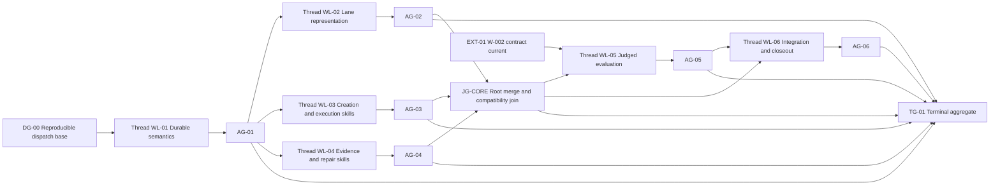

# Work Lane: W-003

Status: `BLOCKED`
Planning Status: `IMPLEMENTATION_READY`
Plan Revision: `4`
Owner: `agent-engineer`
Created: 2026-07-22
Lane Model: `orchestrator-workers-dependency-waves`
Next Gate: `AG-05` focused target/evaluate/judge evidence
Graph Revision: `3`

## Request

Prepare several connected implementation plans for adopting graph-shaped workflow
mechanics without compiling a graph runtime or replacing Cascade's model/tool
loops. Preserve enough definitions, dependencies, evidence rules, failure routes,
and file-level detail for implementation to begin directly from this packet.

## Intended Behavior

Cascade should continue to use skills as prose execution contracts and local
agent loops for reasoning and tool use. For complex work, the existing workflow
context pack should provide reusable graph-shaped rules, while the active lane
packet should hold the instantiated task graph and current execution state.

The mechanics must provide:

1. dependency readiness before work begins;
2. evidence joins before a node or lane is accepted;
3. partial repair that reopens affected work while preserving unrelated accepted
   work;
4. graph revision history when task topology changes;
5. a compact current frontier that survives handoff and compaction;
6. an explicit opt-out for atomic work that does not benefit from graph-shaped
   coordination;
7. one authoritative state writer and typed node, gate, and external
   dependencies;
8. version-bound evidence, deterministic invalidation, bounded retries, and
   cross-lane dependency behavior.

## Assumptions

- No graph framework, scheduler, database, compiler, or executable workflow DSL
  will be introduced.
- The active model continues to interpret and apply the rules.
- `docs/patterns/workflow/` owns reusable workflow policy.
- `docs/work/active.md` remains the thin active-lane registry.
- `docs/work/lanes/*.md` owns task-specific graph state.
- Existing `PASS`, `FAIL`, `BLOCKED`, `NOT_RUN`, and `GAP` evidence meanings stay
  unchanged.
- Node acceptance is stricter than output production: a produced artifact moves
  a node to review; required evidence moves it to accepted.
- The completed `W-002` judged-evaluation contracts are authoritative and must
  not be weakened. `WL-05` must reinspect them before touching overlapping eval
  files.
- Revision 2 planning/context foundation changes are accepted planning inputs;
  they are not graph-mechanics implementation evidence.
- The lane owner is the sole authority for active graph-state mutations.
  Workers and evidence-producing skills return receipts or proposed
  transitions for the lane owner to record.
- The user has authorized one separate Codex thread and Git branch/worktree per
  implementation workline. This root thread remains the only status, gate,
  merge-queue, and lane-state owner.
- Worker dispatch starts only from one immutable, reviewed base commit that
  contains the accepted W-002 and W-003 planning foundation.

## Success Criteria

- `CR-01` — The workflow pattern contains selectively loadable rules for graph
  applicability, dependency readiness, evidence joins, partial repair, and graph
  revision.
- `CR-02` — The lane template can express an optional task graph, current frontier,
  evidence joins, repair history, and graph amendments without changing the
  context-pack schema.
- `CR-03` — Workflow skills agree on node status, legal transitions, readiness,
  acceptance, repair, and closeout behavior.
- `CR-04` — Atomic work can bypass the graph-shaped lane sections without bypassing normal
  Cascade planning or validation rules.
- `CR-05` — A failed check reopens the earliest responsible node and affected consumers;
  accepted nodes whose inputs and contracts remain unchanged are preserved.
- `CR-06` — Handoffs identify the graph revision, current frontier, unresolved joins,
  blockers, and next executable node.
- `CR-07` — Harness scenarios cover readiness, review-versus-acceptance, blocked joins,
  partial repair, atomic bypass, cycle rejection, stale evidence, frontier
  reconciliation, retry exhaustion, conflicting transitions, and cross-lane
  invalidation under the current W-002 judge contract.
- `CR-08` — Every request criterion, accepted definition, boundary contract,
  implementation slice, and required check has a traceability owner.
- `CR-09` — The implementation workline graph is cycle-free and uses per-workline
  acceptance gates; aggregate terminal gates never accept a producer needed by
  one of their own inputs.
- `CR-10` — All required Cascade validation commands pass after implementation.
- `CR-11` — Every workline executes in a separately identified thread,
  branch, and worktree with disjoint writes, an immutable base, and one root
  merge owner.
- `CR-12` — Parallel work begins only after its shared semantic authority is
  accepted; `WL-02`, `WL-03`, and `WL-04` join through one cross-workline
  integration gate before evaluation begins.
- `CR-13` — Workers send typed status events and bound receipts to this root
  thread; workers never edit the canonical status board, W-003 state, or
  `active.md`.
- `CR-14` — A dirty or unanchored dispatch baseline blocks worker creation and
  cannot be bypassed by copying an incomplete working tree into worktrees.

## Non-Goals

- Executing or scheduling graph nodes automatically.
- Creating a second active-work registry.
- Storing live task state in `*.pack.yaml` metadata.
- Compiling textual skill references into execution edges.
- Making every skill a node in every task.
- Replacing agent reasoning and tool-use loops.
- Reworking the current judged-evaluation architecture owned by `W-002`.
- Claiming deterministic enforcement when the mechanism remains instruction- and
  document-driven.

## Definition And Decision Ledger

| ID | Definition Or Decision | Authority | Consumers | Invalidation Rule | Status |
|---|---|---|---|---|---|
| `DEF-01` | A lane is an independently tracked workstream with one owner, scope, merge boundary, and terminal validation boundary. | workflow pattern | `active.md`; lane template; orchestration | Recheck only if active-work ownership changes. | `ACCEPTED` |
| `DEF-02` | A node is one bounded obligation with a stable never-reused ID, one actor/type, named/versioned inputs, named output receipts, write scope, tool/permission requirements, retry bound, and one per-node acceptance gate. | W-003 revision 3; future graph workflow contract | lane template; execution skills; evals | Reopen consumers when any listed contract changes. | `ACCEPTED` |
| `DEF-03` | Prerequisite nodes, acceptance gates, and external conditions are different dependency types and use separate fields. | W-003 revision 3; future graph workflow contract | readiness; lane template; evals | Any mixed dependency field invalidates the affected topology. | `ACCEPTED` |
| `DEF-04` | Producing output moves a node to `REVIEW`; only its required per-node gate can move it to `ACCEPTED`. | W-003 revision 3; future graph workflow contract | implementation; validation; closeout | Reopen if required evidence is missing, stale, failed, or invalidated. | `ACCEPTED` |
| `DEF-05` | Aggregate or terminal gates verify already accepted producers. They cannot accept a producer needed by another input to the same gate. | W-003 revision 3; future graph workflow contract | planning; validation; evals | A self-dependent aggregate gate invalidates the graph revision. | `ACCEPTED` |
| `DEF-06` | The lane Task Graph, gate records, latest graph amendment, and repair/transition records are authoritative active state. Current Frontier and `active.md` are derived projections. | lane packet | context; orchestration; closeout | Projection drift is repaired from lane authority before execution. | `ACCEPTED` |
| `DEF-07` | One lane-state owner records graph-state transitions. Workers and evidence producers return receipts or proposed transitions; they do not independently mutate shared lane state. | lane owner / merge owner | every graph-aware skill | Ownership change increments graph revision and blocks mutation until handed off. | `ACCEPTED` |
| `DEF-08` | Evidence is identified and bound to subject node/gate, graph revision, attempt, input versions, source or commit, producer, and production time. | evidence producer plus lane owner | validation; repair; handoff | A changed binding reopens the subject and affected consumers. | `ACCEPTED` |
| `DEF-09` | Partial repair reopens the earliest responsible node and consumers whose inputs/contracts/evidence are invalid; unrelated accepted nodes remain accepted. | validation and lane owner | repair; context; closeout | New impact evidence expands the repair set; it does not restart unrelated work. | `ACCEPTED` |
| `DEF-10` | Plan revision tracks planning knowledge/workline change. Graph revision tracks instantiated topology, dependency, actor, ownership, or gate change. Ordinary retry changes only attempt/history. | plan and lane owner | context; repair; handoff | Material changes increment the corresponding revision before further execution. | `ACCEPTED` |
| `DEF-11` | Cross-lane readiness requires a named producer lane, accepted producer gate, current evidence reference, compatible version, and non-conflicting merge ownership. | active-work plus producer lane | consumer lane; context; closeout | Producer reopen or evidence invalidation blocks/reopens affected consumer work. | `ACCEPTED` |
| `DEF-12` | Graph-shaped sections are optional for atomic work, but normal planning, permission, validation, and closeout rules still apply. | workflow pattern | orchestration; plan-change | Recheck when applicability rules change. | `ACCEPTED` |
| `DEF-13` | The mechanism remains instruction-driven. It does not claim runtime scheduling, transactional locking, or deterministic enforcement. | user constraint | all worklines and public docs | Any runtime/compiler proposal requires explicit replanning and approval. | `ACCEPTED` |
| `DEF-14` | Legal node and gate transitions name the transition owner, preconditions, evidence, invalidation, and deterministic block/resume route. | W-003 revision 3; future graph workflow contract | lane template; graph-aware skills; evals | An undefined transition or resume destination keeps the plan/graph invalid. | `ACCEPTED` |
| `DEF-15` | Every retryable obligation has an attempt maximum and exhaustion route; paid/live or mutating work also declares tool, cost, idempotency, permission, and cleanup bounds. | W-003 revision 3; future graph workflow contract | planning; implementation; repair; closeout | Missing bounds keep the obligation non-ready. | `ACCEPTED` |
| `DEF-16` | Every acceptance gate identifies evidence producers and evaluator/reviewer authority. Worker output never self-accepts; independent review remains required where the owning review, security, or public-contract workflow requires it. | W-003 revision 3; future graph workflow contract | evidence gates; review; validation; closeout | Missing required reviewer/evaluator evidence prevents acceptance. | `ACCEPTED` |
| `DEF-17` | A dispatch base is one immutable commit/digest containing every approved prerequisite and no unresolved user-owned change needed by a worker. All workline branches record this exact base before edits. | root merge owner | every worker thread; merge queue | A different or incomplete base blocks dispatch or invalidates the worker receipt. | `ACCEPTED` |
| `DEF-18` | A workline thread owns one workline branch/worktree, its declared paths, local commits, checks, and receipts. It never owns canonical lane state or another workline's files. | root assignment plus worker receipt | parallel implementation | Any overlapping write or unapproved base change blocks merge and routes to root reconciliation. | `ACCEPTED` |
| `DEF-19` | The root-thread status board and merge queue are derived projections of worker events plus authoritative W-003 gates. Only the root lane owner records thread state, gate decisions, merge order, and repair propagation. | root/lane owner | every worker and handoff | Worker-side board edits or unbound status messages are rejected as state mutations. | `ACCEPTED` |
| `DEF-20` | Parallel worklines may consume one accepted semantic gate independently when their writes are disjoint. Worker receipts are provisional; root accepts each per-workline gate only after its branch merges and integrated checks pass, and downstream work still waits for the cross-workline `JG-CORE` compatibility join. | graph revision 3 | `WL-02`, `WL-03`, `WL-04`, `JG-CORE`, `WL-05` | Failure at the integration join reopens only responsible worklines and affected consumers. | `ACCEPTED` |

### Node Status Vocabulary

| Status | Meaning | Legal next states |
|---|---|---|
| `PENDING` | Preconditions are not yet satisfied. | `READY`, `BLOCKED`, `SUPERSEDED` |
| `READY` | Every readiness condition is satisfied. | `IN_PROGRESS`, `BLOCKED`, `SUPERSEDED` |
| `IN_PROGRESS` | The assigned actor is executing the obligation. | `REVIEW`, `BLOCKED`, `FAILED`, `SUPERSEDED` |
| `REVIEW` | Required output exists but has not passed its acceptance join. | `ACCEPTED`, `FAILED`, `BLOCKED`, `SUPERSEDED` |
| `ACCEPTED` | Required evidence join passed. | `PENDING` only when later evidence invalidates an input; otherwise terminal |
| `FAILED` | Evidence identified a failed obligation. | `PENDING`, `BLOCKED`, `SUPERSEDED` |
| `BLOCKED` | A named precondition, permission, decision, or environment boundary prevents progress. | `PENDING` after resolution and readiness recalculation, or `SUPERSEDED` |
| `SUPERSEDED` | A later graph revision replaced unfinished work. | terminal |

### Readiness Rule

A node is `READY` only when all of these are true:

1. every ID in `Requires Nodes` is `ACCEPTED`;
2. every ID in `Requires Gates` is `ACCEPTED`;
3. every `External Condition` is explicitly satisfied and current;
4. every named/versioned input exists and is still current;
5. its objective, actor, output receipt, per-node acceptance gate, attempt
   maximum, and repair route are defined;
6. no unresolved product, design, permission, ownership, or environment blocker
   applies;
7. its file/write scope does not conflict with active work unless one merge
   owner is declared;
8. required tools and permissions are available;
9. no later graph revision has superseded the node.

Readiness is recalculated after every accepted result, blocker change, repair,
or graph amendment. The agent must not infer that a merely completed worker turn
satisfies a dependency.

### Evidence-Join Rule

- `PASS` contributes to acceptance.
- `FAIL` fails the join and identifies the responsible producer or contract.
- `BLOCKED` prevents the join from closing until its precondition exists.
- `GAP` routes to the skill that owns the missing intent, contract, or coverage.
- Required `NOT_RUN` evidence prevents acceptance; optional `NOT_RUN` evidence
  must include its optionality and reason.
- Review findings and command evidence remain distinct inputs.
- A join becomes `ACCEPTED` only after every required input is present and
  passing.

### Gate Status Vocabulary

| Status | Meaning | Legal Next States |
|---|---|---|
| `OPEN` | Required inputs are incomplete or awaiting evaluation. | `ACCEPTED`, `FAILED`, `BLOCKED` |
| `ACCEPTED` | All required, current inputs pass. | `OPEN` only when an input or binding is invalidated |
| `FAILED` | At least one required input fails. | `OPEN` after the responsible repair is recorded, or `BLOCKED` |
| `BLOCKED` | A required input cannot currently be produced or evaluated. | `OPEN` after the blocker is resolved |

Per-node gates accept one producer. Aggregate or terminal gates may combine
already accepted per-node gates, but no downstream node may depend on an
aggregate gate that also needs that downstream node's evidence.

### Gate Transitions

| From | To | Recorded By | Preconditions / Evidence | Failure / Reopen Route |
|---|---|---|---|---|
| `OPEN` | `ACCEPTED` | lane-state owner after named evaluator/reviewer result | every required, current evidence input passes | invalidate to `OPEN` if a binding changes |
| `OPEN` | `FAILED` | lane-state owner | at least one required input fails and identifies a responsible producer/contract | repair responsible work, then return to `OPEN` |
| `OPEN` | `BLOCKED` | lane-state owner | a required input cannot currently be produced/evaluated | resolve named blocker, then return to `OPEN` |
| `FAILED` | `OPEN` | lane-state owner | repair record exists and affected evidence will be reevaluated | remain `FAILED`/`BLOCKED` if preconditions still fail |
| `BLOCKED` | `OPEN` | lane-state owner | blocker resolution is recorded and inputs are current | remain `BLOCKED` if any required precondition is unresolved |
| `ACCEPTED` | `OPEN` | lane-state owner | required evidence/input/version is invalidated | reopen affected subject/consumers through Repair History |

### Partial-Repair Rule

When evidence fails:

1. classify the failure as product/runtime defect, stale test, missing contract,
   missing acceptance evidence, environment blocker, or invalid workflow state;
2. locate the earliest node responsible for the failed evidence or input;
3. reopen that node and every consumer whose input, contract, or evidence is no
   longer trustworthy;
4. preserve accepted nodes whose inputs, scope, and acceptance evidence remain
   unchanged;
5. record reopened and preserved nodes in Repair History;
6. increment an attempt for an unchanged topology, or create a graph amendment
   when nodes, dependencies, actors, ownership, or joins change;
7. recalculate the current frontier before further work starts.

### Entity, Authority, And Retention

| Entity / Field | Stable Identity | Source Of Truth | Mutable By | Derived From | Retention |
|---|---|---|---|---|---|
| Lane | `W-XXX` never reused | lane packet plus active registry status | lane owner | request and workline boundaries | preserve through closeout; remove only the active row after durable evidence |
| Node | lane-scoped `N-XX`, never reused after supersession | Task Graph | lane-state owner | accepted plan/workline | retain superseded rows or amendment references |
| Gate | lane-scoped `AG-XX` or `TG-XX`, never reused | Evidence Gates table | lane-state owner after evidence evaluation | required evidence records | retain final status and evidence refs |
| Evidence receipt | stable evidence ID | evidence artifact or command result reference | producing skill/tool; binding recorded by lane owner | node attempt and source inputs | retain reference; raw output follows its artifact policy |
| Graph revision | monotonic integer | Graph Amendments | lane-state owner | topology/ownership/gate changes | retain every amendment delta |
| Current Frontier | no independent identity | derived projection in lane | lane-state owner after recomputation | authoritative nodes, gates, blockers, amendments | replace on every relevant transition |
| Active row | lane ID | `docs/work/active.md` | root coordination | lane status, next gate, dependencies, evidence | remove after complete evidence is preserved |
| Worker thread | `W003-WLNN` | root dispatch record plus Codex thread identity | root assigns; worker emits events | workline, graph revision, attempt, and prompt binding | preserve identity and final disposition in receipts |
| Worker branch/worktree | `agent/w003-wlNN-r4-g3` plus assigned path | Git branch/worktree and dispatch receipt | worker inside scope; root controls rebase/merge | accepted base SHA and workline write scope | retain commit lineage through gate/repair evidence |
| Root status board | W-003 thread board | derived packet projection | root lane-state owner only | worker events, receipts, gates, merge queue | update on every accepted control event; preserve closeout snapshot |
| Merge queue item | `MQ-01` through `MQ-06`, `MQ-JG` | root implementation packet | root merge owner only | frozen branch receipt plus review/integration evidence | retain final disposition and merged commit reference |

### State-Mutation Contract

| Transition | Recorded By | Preconditions | Required Evidence / Receipt | Failure Or Resume Route |
|---|---|---|---|---|
| `PENDING -> READY` | lane-state owner | typed dependencies and readiness checklist pass | current input/dependency references | remain `PENDING` or become `BLOCKED` |
| `READY -> IN_PROGRESS` | lane-state owner | actor, scope, tools, permissions, attempt budget available | execution assignment | return to `PENDING` if assignment becomes invalid |
| `IN_PROGRESS -> REVIEW` | lane-state owner | expected output receipt exists | output/evidence binding | `FAILED` or `BLOCKED` when output is invalid/unavailable |
| `REVIEW -> ACCEPTED` | lane-state owner after gate evaluation | per-node gate `ACCEPTED` | all required current evidence | `FAILED`/`BLOCKED`; repair then `PENDING` |
| `IN_PROGRESS` or `REVIEW -> FAILED` | lane-state owner | execution or acceptance evidence identifies a failed obligation | failed evidence and responsible producer/contract | record repair; move to `PENDING`, `BLOCKED`, or `SUPERSEDED` |
| `FAILED -> PENDING` | lane-state owner | repair route and remaining attempt budget exist | repair event plus refreshed inputs | readiness is recalculated; never jump directly to `READY` |
| `FAILED -> BLOCKED` | lane-state owner | repair cannot proceed because a named precondition is unavailable or attempts are exhausted | blocker/exhaustion record | resolve/replan, then return to `PENDING` |
| any active state `-> BLOCKED` | lane-state owner | named unresolved prerequisite | blocker ID and prior state | resolve blocker, return to `PENDING`, recalculate readiness |
| `ACCEPTED -> PENDING` | lane-state owner | accepted input/evidence invalidated | amendment or repair record | recompute affected consumers only |
| unfinished `-> SUPERSEDED` | lane-state owner | later graph revision replaces obligation | amendment and replacement/terminal reason | terminal |

### Evidence Identity And Freshness

Every required evidence row records: evidence ID, producer, subject node/gate,
graph revision, node attempt, input/source references, source commit or digest
when available, production time, required/optional status, result, and
invalidation condition. Evidence without sufficient identity is `GAP`, not
accepted evidence.

### Retry, Resource, And Exhaustion Rule

- Every graph node declares `attempt / maximum`; absence keeps it `PENDING`.
- The default authored-lane maximum is three unchanged-topology attempts unless
  risk, cost, or an external service requires a lower explicit bound.
- Paid/live or externally mutating work must declare its own tool, cost,
  permission, idempotency, and cleanup bound before becoming `READY`.
- Exhaustion moves the node to `BLOCKED` and routes to `plan-change`, the lane
  owner, or the user; it never silently resets the attempt counter.
- A topology, actor, ownership, dependency, or gate change creates a new graph
  revision instead of consuming another unchanged-topology attempt.

### Cross-Lane Dependency Rule

A consumer lane records producer lane ID, producer gate/evidence ID, accepted
producer state (`READY_TO_MERGE` or `COMPLETE` as defined by the contract),
version/freshness, merge owner, and invalidation route. If the producer reopens,
the consumer recomputes readiness and reopens only work whose inputs are no
longer current. Lane completion does not by itself complete the overall user
goal; the root owner confirms all required terminal gates.

## Source Ledger

| Source ID | Authority / Owner | Path Or Reference | Version / Freshness | Supports | Status |
|---|---|---|---|---|---|
| `SRC-01` | user | current request and attached fixed-point review | current, 2026-07-22 | non-runtime approach; completeness failures; replan authorization | `AUTHORITATIVE` |
| `SRC-02` | Cascade runtime bridge | `AGENTS.md`; `CODEX.md`; `harness.config.yaml` | current working tree | skill-first route, commands, owners, non-runtime boundary | `AUTHORITATIVE` |
| `SRC-03` | workflow pattern | `docs/patterns/workflow/index.md`; `docs/patterns/workflow/workflow.pack.yaml` | current planning-foundation state | planning knowledge, adaptive worklines, future graph semantics and selective retrieval | `AUTHORITATIVE` |
| `SRC-04` | context-memory pattern | `docs/patterns/context-memory/index.md`; its pack metadata | current planning-foundation state | projection authority, compaction, rehydration, drift | `AUTHORITATIVE` |
| `SRC-05` | planning contract | `.codex/skills/plan-change/SKILL.md`; `templates/definition-ready-plan.md`; `checklists/planning-completeness.md` | current planning-foundation state | definition and implementation readiness gates | `AUTHORITATIVE` |
| `SRC-06` | active-work contract | `docs/work/lane-template.md`; `docs/work/active.md`; `docs/work/_index.md` | current working tree | lane state, thin registry, workline materialization | `AUTHORITATIVE` |
| `SRC-07` | context-pack contract | `docs/patterns/context-pack-schema.yaml`; `scripts/build_pattern_context_pack.py` | current working tree | selectable documents/sections without schema or compiler change | `AUTHORITATIVE` |
| `SRC-08` | workflow skill contracts | `.codex/skills/{context,orchestrate-work,plan-change,implement-change,functional-qa,review-change,validate-change,test-autorepair,closeout}/SKILL.md` | current working tree | graph creation, execution, evidence, repair, resume, closeout consumers | `AUTHORITATIVE` |
| `SRC-09` | completed W-002 evaluation contract | `docs/work/lanes/W-002-judged-harness-evals.md`; `docs/work/reports/2026-07-22-judged-harness-evaluations.md`; `evals/harness/`; `scripts/run_harness_evals.py` | completed lane; working-tree implementation | eligibility, judge, scenario, catalog, and evidence boundaries | `AUTHORITATIVE`; reinspect before `WL-05` |
| `SRC-10` | original graph proposal | `/Users/royrud1902/.codex/attachments/75f59569-bac3-4e95-ab37-3b4377419e6e/pasted-text.txt` | historical input | original direction and examples | `SUPPORTING`; shared phase-join example superseded |
| `SRC-11` | derived implementation packet | `docs/work/lanes/W-003-graph-shaped-workflow-implementation-packet.md` | task revision 2; derived from plan revision 4 / graph revision 3 | dependency-wave thread plan, thirteen task contracts, status board, merge queue, receipts, commands, and stop routes | `SUPPORTING`; W-003 remains authoritative |
| `SRC-12` | user | current parallel-thread request | current, 2026-07-22 | separate workline threads/worktrees, root-thread orchestration, and status chart | `AUTHORITATIVE` |

## Assumptions, Questions, And Rejected Paths

| ID | Type | Statement | Impact If Wrong | Resolution Route / Owner | Status |
|---|---|---|---|---|---|
| `AQ-01` | assumption | Markdown plus skill contracts remain the active mechanism; no scheduler, database, executable DSL, or graph runtime is introduced. | Would materially change state, concurrency, and validation architecture. | user plus `plan-change` | `ACCEPTED` |
| `AQ-02` | decision | Graph semantics receive a dedicated document inside the existing `workflow-core` pattern folder and pack, not a separate graph pattern or pack. | Prevents a large semantic contract from being duplicated across skills or buried in the workflow index. | `pattern-context` | `ACCEPTED` |
| `AQ-03` | rejected | One phase-wide gate accepts several producer worklines while one producer depends on another producer in that same gate. | Creates an acceptance cycle and prevents readiness. | planning completeness gate | `SUPERSEDED` |
| `AQ-04` | rejected | A worker or evidence-producing skill directly edits authoritative shared lane state. | Creates conflicting transitions and stale projections. | lane owner contract | `SUPERSEDED` |
| `AQ-05` | deferred | Add executable parsing/validation of arbitrary Markdown graph topology. | Could improve deterministic enforcement but expands beyond the requested rule/mechanics change. | future `codex-maintenance` only if prompt/eval evidence proves insufficient | `DEFERRED` |
| `AQ-06` | decision | All six selected worklines remain sections of W-003 and one `active.md` row even though each implementation workline receives a separate thread/branch/worktree. | Separate active lanes would duplicate canonical state and the root status board. | root owner | `ACCEPTED`; revised by plan revision 4 |
| `AQ-07` | decision | After `AG-01`, `WL-02`, `WL-03`, and `WL-04` may implement concurrently against the accepted semantic contract because their writes are disjoint; their compatibility is not downstream-ready until root accepts `JG-CORE`. | Removes conservative producer-to-producer serialization while preserving an evidence join before evaluation. | root owner plus `JG-CORE` | `ACCEPTED` |
| `AQ-08` | constraint | The dirty `master` at `e562ee5e3e1a7348cfc69b8fb4d55d6f83b41a59` was not a valid dispatch base because required W-002/W-003 and planning changes were uncommitted or untracked. | Worktrees created from that historical `HEAD` would omit required inputs and produce invalid receipts. | root `DG-00` | `RESOLVED` by dispatch base `28d69ec70396a31125b7b989e5066149eff8a8ae` |

## Behavior Examples

| ID | Example | Expected Evidence | Status |
|---|---|---|---|
| GW-001 | Given an atomic one-file mechanical edit, when `orchestrate-work` classifies it, then no task graph is required and normal planning/validation rules still apply. | focused routing scenario | `OPEN` |
| GW-002 | Given N-03 requires N-01 and N-02, when only N-01 is accepted, then N-03 remains `PENDING`. | lane state plus harness scenario | `OPEN` |
| GW-003 | Given a worker produces the requested diff, when no review or validation evidence exists, then its node becomes `REVIEW`, not `ACCEPTED`. | output-contract scenario | `OPEN` |
| GW-004 | Given a terminal join requires functional and command evidence, when the functional check is `BLOCKED`, then neither the node nor lane may be accepted. | blocked-join scenario | `OPEN` |
| GW-005 | Given validation fails for implementation branch B, when branch A has accepted evidence and unchanged inputs, then B and its consumers reopen while A remains accepted. | partial-repair scenario | `OPEN` |
| GW-006 | Given a retry does not change nodes or dependencies, when the failed node is retried, then the graph revision remains unchanged and the attempt is recorded. | repair-history inspection | `OPEN` |
| GW-007 | Given new evidence requires another consumer-mapping node, when the topology is amended, then the graph revision increments and preserved/invalidated evidence is explicit. | graph-amendment inspection | `OPEN` |
| GW-008 | Given a task resumes after compaction or handoff, when `context` loads the lane, then graph revision, current frontier, unresolved joins, blockers, and next ready node are restored. | context handoff scenario | `OPEN` |
| GW-009 | Given a producer and its consumer share an aggregate acceptance gate, when the consumer requires the producer to be accepted first, then planning rejects the topology as cyclic. | cycle-rejection scenario | `OPEN` |
| GW-010 | Given a graph revision reuses an existing or superseded node/gate ID, when planning checks identity, then the revision remains invalid. | identity scenario | `OPEN` |
| GW-011 | Given accepted evidence is bound to an old input version, when a graph amendment changes that input, then the evidence and affected consumers reopen while unrelated work stays accepted. | stale-evidence repair scenario | `OPEN` |
| GW-012 | Given Current Frontier disagrees with authoritative node/gate state after handoff, when `context` resumes, then it reports drift and recomputes the projection before execution. | frontier-reconciliation scenario | `OPEN` |
| GW-013 | Given a worker finishes a node, when it returns output, then it proposes a receipt/transition and the lane-state owner records any authoritative status change. | state-authority scenario | `OPEN` |
| GW-014 | Given a node reaches its maximum unchanged-topology attempts, when another retry is requested, then it becomes `BLOCKED` and routes to replanning/escalation instead of resetting. | exhaustion scenario | `OPEN` |
| GW-015 | Given an accepted gate's required evidence becomes invalid, when repair begins, then the gate reopens and only consumers with invalid inputs reopen. | gate-reopen scenario | `OPEN` |
| GW-016 | Given a consumer lane depends on accepted producer-lane evidence, when the producer reopens or changes version, then the consumer recomputes readiness and invalidates only affected work. | cross-lane scenario | `OPEN` |
| GW-017 | Given a node lacks a required permission or human approval, when readiness is evaluated, then it remains `BLOCKED` and cannot be inferred ready from other evidence. | permission-gate scenario | `OPEN` |
| GW-018 | Given two actors propose conflicting transitions, when the lane owner reconciles them, then one authoritative transition is recorded and the rejected proposal remains evidence/history, not state. | concurrent-transition scenario | `OPEN` |
| GW-019 | Given the integration branch has uncommitted required sources, when root attempts worker dispatch, then `DG-00` remains blocked and no worktree is created from the incomplete `HEAD`. | dispatch-base inspection | `OPEN` |
| GW-020 | Given `AG-01` is accepted and `WL-02`, `WL-03`, and `WL-04` have disjoint declared writes, when root dispatches dependency wave 2, then all three threads may implement concurrently from the same base. | assignment and write-scope receipts | `OPEN` |
| GW-021 | Given a worker reports local completion, when its receipt has not been reviewed, merged, and rebound to the integrated commit, then the workline remains `REVIEW` and no downstream gate becomes ready. | status-board and merge-queue inspection | `OPEN` |
| GW-022 | Given `JG-CORE` finds one skill contract incompatible with the merged lane schema, when root records the failed join, then only the responsible workline and affected consumers reopen while unrelated accepted parallel work is preserved. | integration-join repair record | `OPEN` |

## Feature Impact Matrix

| Feature / Flow | Source | Code Areas / Public Contracts | Touched Directly? | Protected Adjacent Behavior | Required Check | Status | Route |
|---|---|---|---|---|---|---|---|
| Selective workflow context | current request | `docs/patterns/workflow/index.md`; `workflow.pack.yaml`; context-pack builder | yes | Existing pack IDs, sections, and filtered compilation remain valid. | compile full pack and each new section | `PASS` | complete in `WL-01` |
| Lane orchestration | current request | `orchestrate-work`; `docs/work/lane-template.md`; `docs/work/active.md` | yes | Small lanes remain lightweight; examples remain non-active. | targeted scenario and validator | `PASS` | complete in `WL-02`/`WL-03` |
| Planning and execution | current request | `plan-change`; `implement-change`; `functional-qa`; `review-change` | yes | Existing behavior examples, Feature Impact Matrix, and fixed-point review remain distinct. | skill contract review and harness cases | `PASS` | complete in `WL-03`/`JG-CORE` |
| Validation and repair | current request | `validate-change`; `test-autorepair`; `closeout` | yes | Product defects never route to stale-test repair; required missing evidence never passes. | partial-repair and blocked-join cases | `PASS` | complete in `WL-04`/`JG-CORE` |
| Harness evaluation | W-002 plus current request | `evals/harness/`; runner; judge contracts | yes | Completed W-002 eligibility/judge contracts remain authoritative and unchanged. | reinspect W-002, catalog check, self-test, focused cases and judgment | `BLOCKED` | authored/deterministic evidence passes; required `SL-05C` canary awaits spend authority |
| Runtime bridge and package docs | existing public docs | `CODEX.md`; `README.md`; `docs/structure.md` | yes | Canonical task route and thin-entrypoint policy remain unchanged. | impact scan after implementation | `PASS` | merged `R-06A` at `6c4e33e` |

## Documentation Impact And Routing

| Fact | Source | Owner Target | Action | Bloat Check | Evidence | Next Gate |
|---|---|---|---|---|---|---|
| Active implementation plan for graph-shaped workflow mechanics | current request | `docs/work/lanes/W-003-graph-shaped-workflow-mechanics.md`; `docs/work/active.md` | `UPDATED` | One lane packet owns all connected worklines and current execution state. | plan revision 4 and active row | root `DG-00` |
| Derived workline implementation packet | W-003 revision 4 | `docs/work/lanes/W-003-graph-shaped-workflow-implementation-packet.md` | `UPDATED` | Task/thread detail, root status chart, and merge queue are separated from canonical lane state; no second active registry is created. | six workline prompts; thirteen task/receipt contracts; dependency waves | root `DG-00` |
| Reusable graph semantics | W-003 | `docs/patterns/workflow/graph-shaped-work.md` | `UPDATED` | Dedicated document inside the existing workflow pattern preserves one semantic authority without creating another pack. | accepted `AG-01` semantic review | done |
| Selective graph-work context routing | W-003 | `docs/patterns/workflow/workflow.pack.yaml`; thin link from `index.md` | `UPDATED` | Existing `workflow-core` remains the pack; metadata stays routing-only. | full and six selected pack builds pass | done |
| Instantiated graph state and valid example | W-003 | `docs/work/lane-template.md`; `docs/work/examples/graph-shaped-lane.md` | `UPDATED` | Template owns operational fields; example proves one cycle-free instantiation; `active.md` stays thin. | accepted `AG-02` and `JG-CORE` | done |
| Product, design, brand, or application behavior | current request | none | `NO_DOC_NEEDED` | Harness workflow mechanics do not change a product UI or application contract. | repository is a harness scaffold | done |

## Boundary Contracts

| Boundary ID | Producer / Authority | Consumer | Input / Output Contract | Compatibility / Invalidation Rule | Required Check |
|---|---|---|---|---|---|
| `BND-01` | `graph-shaped-work.md` inside `workflow-core` | graph-aware skills | Selected semantic sections with stable definition IDs; pack metadata selects but does not redefine them. | Existing pack ID/schema and prior section IDs remain compatible; semantic changes invalidate affected skill/eval consumers. | full and selected pack compilation; consumer inventory |
| `BND-02` | lane Task Graph, gates, amendments, transition/repair history | `context` and executing skills | Authoritative node/gate state plus versioned inputs/evidence. | Current Frontier and `active.md` are derived and must be reconciled before execution. | resume/drift scenario; lane inspection |
| `BND-03` | worker or execution/evidence skill | lane-state owner | Output receipt or proposed transition with node, revision, attempt, source, and evidence identity. | Producer cannot directly make shared authoritative state current; conflicting proposals route to owner reconciliation. | state-authority and concurrent-transition scenarios |
| `BND-04` | functional, review, command, and validation evidence producers | per-node acceptance gate | Required/optional evidence with freshness and invalidation rules. | Missing/stale/failed required evidence prevents acceptance and reopens affected consumers only. | join, stale-evidence, and partial-repair scenarios |
| `BND-05` | completed W-002 judge/evaluation contract | W-003 harness cases | Current eligibility, rubric, trace, catalog, and evidence-state contracts. | Reinspect before edits; W-003 extends without weakening or relabeling W-002 evidence. | catalog, self-test, focused target/judge checks |
| `BND-06` | producer lane terminal gate/evidence | consumer lane | Producer lane ID, accepted gate/evidence ID, version/freshness, merge owner, and invalidation route. | Producer reopen/version change triggers consumer readiness and repair recalculation. | cross-lane scenario |
| `BND-07` | all accepted workline gates | terminal integration gate | Docs-impact result, structural checks, eval evidence, explicit residual risks. | Required `BLOCKED`, `FAIL`, `GAP`, or `NOT_RUN` cannot close the lane. | final validation and closeout audit |
| `BND-08` | workline worker thread | root lane-state/merge owner | Typed event plus receipt bound to thread, branch/worktree, base/head SHA, plan/graph revision, attempt, writes, checks, and proposed transition. | Worker cannot accept/merge or edit canonical state; rebase/amend/source drift invalidates the receipt. | event/receipt inspection and lineage audit |
| `BND-09` | root integration branch and merge queue | workline gates and `JG-CORE` | Reviewed worker commits plus post-merge evidence on the integrated tip. | Local passes are provisional; downstream readiness requires root merge and current integrated evidence. | fast-forward/rebase audit, post-merge checks, compatibility join |

## Workline Discovery

| Candidate | Independent Outcome | Definitions / Criteria Owned | Write Scope | Dependencies | Validation Seam | Disposition / Reason |
|---|---|---|---|---|---|---|
| `C-01` | Durable graph semantics | `DEF-01` through `DEF-16`; `GW-001` through `GW-018` contract | workflow pattern document | planning revision 4 | semantic review | `SELECT` as `WL-01` |
| `C-02` | Selective graph context routing | `BND-01` | workflow pack metadata; thin workflow index link | `C-01` terminology | full/filtered pack compilation | `MERGE` into `WL-01` because semantics and metadata cannot be accepted independently |
| `C-03` | Instantiable lane state and valid example | `DEF-02` through `DEF-11`; `BND-02` | lane template; non-active example | accepted `WL-01` semantics | template inspection and end-to-end dependency walk | `SELECT` as `WL-02` |
| `C-04` | Graph creation, resume, planning, and bounded execution | `DEF-03`, `DEF-06`, `DEF-07`, `DEF-12` | context/orchestration/planning/implementation skills | accepted `WL-01` and `WL-02` | focused skill scenarios | `SELECT` as `WL-03` |
| `C-05` | Evidence acceptance, repair, retry, and terminal behavior | `DEF-04`, `DEF-05`, `DEF-08` through `DEF-11` | functional/review/validation/repair/closeout skills | accepted `WL-01` through `WL-03` | join/repair/exhaustion scenarios | `SELECT` as `WL-04` |
| `C-06` | Post-W-002 adversarial behavioral evidence | `GW-001` through `GW-022`; `BND-05`, `BND-08`, `BND-09` | harness interactions/cases/catalog and only necessary judge criteria | accepted `JG-CORE`; current W-002 contract | catalog, self-test, eligibility, focused judgments | `SELECT` as `WL-05` |
| `C-07` | Integration, public-doc consistency, and closeout | all criteria; `BND-07` | conditional public docs; active lane; report if needed | accepted `JG-CORE` and `AG-05` | docs impact, validator, runtime audit, diff check | `SELECT` as `WL-06` |
| `C-08` | Executable Markdown graph parser/validator | deterministic topology enforcement | validator/runtime surfaces | new parser/schema decision | parser tests | `DEFER` under `AQ-05`; outside requested rule/mechanics slice |
| `C-09` | Separate-thread dispatch, status, and merge control | `CR-11` through `CR-14`; `DEF-17` through `DEF-20`; `GW-019` through `GW-022` | W-003 lane plus derived implementation packet; root-only state | accepted plan revision 4; reproducible base | dispatch-base audit; event/receipt lineage; integrated compatibility join | `MERGE` into root control plane, not a seventh implementation workline |

The six selected worklines remain sections of W-003 and one active registry
row. Separate worker threads own workline branches/worktrees, while this root
thread alone owns canonical status and merges. `WL-02`, `WL-03`, and `WL-04`
may execute in parallel only after `AG-01` fixes their shared semantic contract;
none becomes downstream-ready until the root integration join `JG-CORE` passes.

## Selected Workline Map

| Workline | Outcome | Primary Criteria | Requires Gates | External Conditions | Produces | Ownership / Writes | Acceptance Gate | Attempt / Max | Status |
|---|---|---|---|---|---|---|---|---|---|
| `WL-01` | One selectively retrievable graph semantic authority | reusable semantics; atomic bypass; typed dependencies; state/evidence authority | `DG-00` | plan revision 4 and graph revision 3 remain current | `graph-shaped-work.md` plus pack routing | thread `W003-WL01`; workflow pattern/pack only | `AG-01` | `1/3` | `ACCEPTED` |
| `WL-02` | Optional lane representation that can express and demonstrate the contract | operational state, identity, frontier, gates, repair, history | `AG-01` | common wave-2 base current | lane-template sections and valid non-active example | thread `W003-WL02`; work template/example | `AG-02` | `2/3` | `ACCEPTED` |
| `WL-03` | Existing skills create, resume, plan, and execute only ready obligations | creation/resume/execution authority; permissions/write scope | `AG-01` | common wave-2 base current | graph-aware context/orchestration/planning/implementation contracts | thread `W003-WL03`; named creation/execution skill files | `AG-03` | `2/3` | `ACCEPTED` |
| `WL-04` | Existing skills accept evidence, repair minimally, exhaust safely, and close only terminal work | evidence identity, gate lifecycle, partial repair, retry/exhaustion | `AG-01` | common wave-2 base current | graph-aware functional/review/validation/repair/closeout contracts | thread `W003-WL04`; named evidence/repair skill files | `AG-04` | `2/3` | `ACCEPTED` |
| `WL-05` | Current judged harness distinguishes safe graph behavior from plausible unsafe prose | `GW-001` through `GW-022`; W-002 compatibility | `JG-CORE` | `EXT-01` refreshed by `SL-05A` before eval-file writes | authored cases, current catalog, deterministic and focused evidence | thread `W003-WL05`; eval surfaces after reinspection | `AG-05` | `1/2` | `BLOCKED`; required bounded model evidence lacks spend authority |
| `WL-06` | Integrated change is documented, validated, and honestly closed | all request criteria and residual-risk reporting | `JG-CORE`, `AG-05` | required commands/environment available or explicitly blocked | docs-impact disposition, final validation, handoff | thread `W003-WL06`; conditional public docs; root owns lane state | `AG-06` | `1/2` | `BLOCKED`; outputs merged at `6c4e33e`, predecessor `AG-05` reopened |

## Implementation Slices

| Slice | Workline | Implements | Inputs | Files / Contracts | Output | Acceptance Evidence | Repair / Stop Boundary |
|---|---|---|---|---|---|---|---|
| `SL-01A` | `WL-01` | `DEF-01` through `DEF-16`; `BND-01`, `BND-06` | `SRC-01` through `SRC-07` | `docs/patterns/workflow/graph-shaped-work.md`; thin `index.md` link only if required | durable semantics with entity, state, dependency, evidence, repair, retry, reviewer authority, cross-lane, and limitation rules | semantic review against planning completeness; no duplicated authority | reopen `WL-01` only; stop on unresolved critical definition |
| `SL-01B` | `WL-01` | selective context routing | `SL-01A` terminology; pack schema | `docs/patterns/workflow/workflow.pack.yaml` | graph-work route and selectable sections in existing pack | full pack and every graph section compile; existing sections preserved | repair pack metadata or `SL-01A` term mismatch |
| `SL-02A` | `WL-02` | `DEF-02` through `DEF-11`; `BND-02` | accepted `AG-01` | `docs/work/lane-template.md`; `docs/work/_index.md` only if routing is incomplete | optional graph applicability, revision, authority, Task Graph, gates, frontier, transition/repair/amendment fields | template represents `GW-001` through `GW-018` without duplicating active registry | reopen `WL-02`; reopen `WL-01` only for semantic contradiction |
| `SL-02B` | `WL-02` | cycle-free reference instantiation | `SL-02A` | `docs/work/examples/graph-shaped-lane.md`; examples index if required | copyable non-active example with typed edges and per-node gates | end-to-end dependency walk reaches terminal gate; no reused IDs or self-dependent aggregate | repair example/template only |
| `SL-03A` | `WL-03` | `DEF-03`, `DEF-06`, `DEF-07`, `DEF-11`, `DEF-12` | accepted `AG-01`; graph revision 3 common base | `context`; `orchestrate-work`; `plan-change` skills | applicability, authoritative rehydration, workline/node creation, cross-lane readiness | atomic bypass, cycle rejection, frontier reconciliation, cross-lane scenarios | reopen affected skill; semantic gap routes to `WL-01`; compatibility waits for `JG-CORE` |
| `SL-03B` | `WL-03` | bounded execution and mutation authority | `SL-03A`; accepted `AG-01` field contract | `implement-change` skill | execute only `READY` node; emit bound receipt/proposed transition; respect write/permission/attempt scope | output remains `REVIEW` until accepted; worker cannot self-accept/mutate | repair implementation skill or upstream contract; compatibility waits for `JG-CORE` |
| `SL-04A` | `WL-04` | `DEF-04`, `DEF-05`, `DEF-08`, `DEF-09` | accepted `AG-01`; graph revision 3 common base | `functional-qa`; `review-change`; `validate-change` skills | named evidence production, gate evaluation, invalidation, bounded repair set | review and command evidence distinct; stale evidence reopens affected consumers | route semantic failure to `WL-01`; cross-workline mismatch to `JG-CORE` repair |
| `SL-04B` | `WL-04` | `DEF-10`, `DEF-11`; retry, exhaustion, terminal completion | `SL-04A` | `test-autorepair`; `closeout` skills | stale-test-only repair, attempt exhaustion, terminal gate and goal/lane distinction | product defects not absorbed; required blockers/missing evidence prevent completion | reopen smallest responsible workline |
| `SL-05A` | `WL-05` | `BND-05` | accepted `JG-CORE`; `SRC-09` | W-002 lane/report, runner, schemas, judge profiles/rubrics | current eval impact/compatibility note in W-003 | exact current commands, owners, and protected contracts recorded | stop before eval edits if current contract cannot be established |
| `SL-05B` | `WL-05` | `GW-001` through `GW-022` | `SL-05A` | `evals/harness/interactions.json`; `skill-cases.json` if needed; generated catalog | focused safe/unsafe scenarios with eligibility and judge coverage | catalog check and self-test pass; unsafe routes rejected | scenario defect stays in `WL-05`; observed workflow defect routes upstream |
| `SL-05C` | `WL-05` | executed behavioral evidence required by the refreshed W-002 acceptance contract | current authored cases and environment | current W-002 target/judge command surfaces | focused eligibility, target, and judge results where required/authorized | authored, deterministic, executed, judged, and accepted states reported separately; optional live evidence is explicitly labeled | missing required environment is `BLOCKED`, never a pass; optional `NOT_RUN` needs a reason |
| `SL-06A` | `WL-06` | documentation/boundary consistency | final diff and accepted `JG-CORE` plus `AG-05` | `CODEX.md`, `README.md`, `docs/structure.md` only if impact requires; lane/report | smallest public-doc deltas or explicit no-change decisions | docs-impact matrix | reopen only inaccurate consumer docs or responsible upstream definition |
| `SL-06B` | `WL-06` | terminal validation and handoff | `SL-06A` and all required evidence | configured validators, pack commands, catalog/self-test, runtime audit, diff | accepted `AG-06` and `TG-01`, durable handoff, active-row disposition | all required checks pass; blockers remain explicit and prevent completion | reopen smallest responsible workline; never accept with required blocker |

## Traceability

| Requirement / Definition | Primary Workline | Implementation Slices | Artifact / Consumer | Evidence | Status |
|---|---|---|---|---|---|
| `CR-01`, `CR-09`, `DEF-02`, `DEF-03`, `DEF-05`; dependency readiness and typed dependencies | `WL-01` | `SL-01A`, `SL-02A`, `SL-03A` | semantic contract, lane schema, orchestration/planning | `GW-002`, `GW-009`, `GW-017` | `COVERED` |
| `CR-03`, `DEF-04`, `DEF-08`, `DEF-16`; output versus acceptance, evidence binding, evaluator authority, and gate lifecycle | `WL-04` | `SL-01A`, `SL-02A`, `SL-04A` | semantic contract, lane gates, evidence skills | `GW-003`, `GW-004`, `GW-015` | `COVERED` |
| `CR-05`, `DEF-09`; partial repair and evidence freshness | `WL-04` | `SL-01A`, `SL-04A`, `SL-04B` | repair, validation, closeout contracts | `GW-005`, `GW-011` | `COVERED` |
| `CR-02`, `DEF-01`, `DEF-10`; plan/graph revisions and stable lane identities | `WL-02` | `SL-01A`, `SL-02A`, `SL-02B` | lane template/example | `GW-006`, `GW-007`, `GW-010` | `COVERED` |
| `CR-06`, `DEF-06`, `DEF-07`; handoff/frontier authority and state ownership | `WL-03` | `SL-02A`, `SL-03A`, `SL-03B` | lane authority, context, execution | `GW-008`, `GW-012`, `GW-013`, `GW-018` | `COVERED` |
| `CR-03`, `DEF-14`, `DEF-15`; retry/resource exhaustion and transition closure | `WL-04` | `SL-01A`, `SL-02A`, `SL-04B` | semantic contract, node fields, repair/closeout | `GW-014` | `COVERED` |
| `CR-05`, `DEF-11`; cross-lane invalidation and root goal closure | `WL-04` | `SL-01A`, `SL-03A`, `SL-04B` | active/lane/closeout contracts | `GW-016` | `COVERED` |
| `CR-04`, `DEF-12`, `DEF-13`; atomic bypass and no runtime/compiler | `WL-01` | `SL-01A`, `SL-03A` | workflow pattern and orchestration | `GW-001`; source/diff review | `COVERED` |
| `CR-07`; current W-002-compatible behavioral evidence | `WL-05` | `SL-05A` through `SL-05C` | eval cases/catalog/results | catalog, self-test, eligibility, focused judgments | `COVERED` |
| `CR-08`, `CR-10`; public consistency and terminal completion | `WL-06` | `SL-06A`, `SL-06B` | public docs, lane/report, terminal gate | docs impact and final validation | `COVERED` |
| `CR-11`, `CR-13`, `CR-14`; thread identity, status authority, and reproducible dispatch | root control | `DG-00`; `P-WL01` through `P-WL06`; merge queue | W-003 and implementation packet | `GW-019`, `GW-021`; receipt/lineage audit | `COVERED` |
| `CR-12`, `DEF-20`; parallel wave and integration evidence join | root control plus `WL-02`/`WL-03`/`WL-04` | wave-2 dispatch and `JG-CORE` | disjoint worker branches and root integration tip | `GW-020`, `GW-022`; compatibility review | `COVERED` |

## Graph Revision History

| Graph Revision | Plan Revision | Trigger | Current Topology | Superseded | Evidence Disposition |
|---|---|---|---|---|---|
| `1` | `1` | Initial five-phase implementation projection. | historical `G-01` through `G-12` and shared phase joins | superseded by graph revision 2 after the fixed-point review found circular acceptance and mixed dependency types | planning checks preserved as historical shape evidence only; no node/gate acceptance |
| `2` | `3` | Definition-ready replanning with adaptive workline discovery. | `WL-01` through `WL-06`, per-workline `AG-01` through `AG-06`, external `EXT-01`, and non-consumed terminal `TG-01` | revision 1 topology and executable Plans A-E | revision 2 planning-foundation evidence preserved; all graph-mechanics gates remain open |
| `3` | `4` | User authorized separate implementation threads/worktrees and root-thread orchestration. | dispatch gate `DG-00`; `WL-01`; parallel wave `WL-02`/`WL-03`/`WL-04`; root integration join `JG-CORE`; `WL-05`; `WL-06`; terminal `TG-01` | graph revision 2 producer-to-producer serialization and local-only actor assignments | all prior planning evidence preserved; no implementation gate accepted; dispatch blocked until a reproducible base exists |

## Workline Execution Graph

The workline graph is a current implementation schedule, not the future generic
node schema. Dependencies name acceptance gates and external conditions in
separate fields. Each workline has its own gate; the terminal aggregate is not
consumed by any producer.

## External Conditions

| Condition | Authority / Source | Consumer | Satisfaction Rule | Current Status | Invalidation / Block Route |
|---|---|---|---|---|---|
| `DG-00` | root branch/worktree inspection | every workline thread | One reviewed integration commit contains approved W-002, planning foundation, W-003 revision 4, and task packet revision 2; root records commit SHA and deterministic checks; worker worktrees can start cleanly from it. | `SATISFIED` by `R-DG00` at `28d69ec70396a31125b7b989e5066149eff8a8ae` | Any source-inventory or lineage change invalidates the receipt and blocks new dispatch until root refreshes it. |
| `EXT-01` | `SRC-09`, refreshed by `SL-05A` | `WL-05` | W-002 is complete; current runner/schema/profile/rubric commands and protected evidence meanings are recorded before W-003 eval edits. | `SATISFIED` by `R-05A` at `0e6ba3c3d3b144c533330694368d641488cf8c81`; current CLI and W-002 evidence meanings were inspected before writes | Any runner, schema, profile, rubric, or protected-source drift invalidates `R-05A` and reopens `SL-05A`. |

## Current Frontier

- Ready: none.
- In progress: none.
- In review: merged `WL-06` outputs at
  `6c4e33e833373b9fb514e040f2a3f68fd0a9e590`; acceptance is blocked by its
  reopened `AG-05` predecessor.
- Blocked: `WL-05 / SL-05C` requires explicit authority for one bounded
  model-backed target/evaluate/judge canary. `WL-06`, `AG-06`, and `TG-01` are
  affected consumers.
- Preserved failed history: `JG-CORE` attempt 1 at `5c4b267` remains recorded.
- Accepted worklines: `WL-01` through `WL-04`.
- Pending: none.
- Accepted gates: `DG-00`, `AG-01` through `AG-04`, and `JG-CORE`.
- Open/blocked gates: `AG-05` is `BLOCKED`; `AG-06` and `TG-01` remain `OPEN`.
- External conditions: `EXT-01` is satisfied by `R-05A` and remains current for
  the authored WL-05 source versions.
- Next executable action: obtain explicit model-spend authority for the bounded
  `HX-031` canary, then run target/evaluate/judge/coverage and reevaluate
  `AG-05`. Without that authority, preserve all authored/deterministic and
  merged WL-06 evidence and keep the terminal consumers blocked.

Current Frontier is a derived projection. On resume, `context` must reconstruct
it from the Selected Workline Map, gate table, external conditions, and latest
replanning/repair records before recommending execution.

## Acceptance Gates

| Gate | Type | Subject / Inputs | Required Evidence | Acceptance Rule | Status | Failure / Reopen Route |
|---|---|---|---|---|---|---|
| `DG-00` | dispatch gate | integration base for all worktrees | `R-DG00`: base `28d69ec70396a31125b7b989e5066149eff8a8ae`; approved 54-file W-002/W-003/planning inventory; clean detached checkout; validator `PASS` (7 agents, 39 skills); catalog `PASS` (299 scenarios, digest `89076ff0f1a51bec91eaa413131cfebe41daed3da525316c11452cc6548e2c0d`); self-test `PASS` (18); diff hygiene `PASS` | every required W-002/W-003/planning input is reproducible from one commit and no unresolved user-owned dependency is omitted | `ACCEPTED` | invalidate on source-inventory or lineage change and refresh before new dispatch |
| `AG-01` | per-workline | `WL-01` | `R-01A`/`R-01B` at `70c7c3323e92eef43ccd53cb364fe72d68ddaf84`; two owned commits from base `3e9d35b37aa6be4b2d3c815a37141da728f09d8f`; three-path scope audit; independent Standards `PASS`; independent Spec `PASS` after four repaired findings; full pack `PASS` (15 sections); six filtered packs `PASS`; prior sections 9/9; validator/catalog/self-test/diff `PASS` on integrated tip | all required evidence passes and graph rules have one authority | `ACCEPTED` | reopen `WL-01` and affected consumers if semantics, routing, or evidence binding changes |
| `AG-02` | per-workline | `WL-02` | refreshed `R-02A`/`R-02B` at `bc78f2b`; 3-path scope; template 11 tables; example 16 tables, 15 subjects, 21 acyclic edges, 11 bound receipts, 18 bound evidence rows, `TR-01..TR-63`, ownership handoff, partial repair, terminal outdegree 0; independent Standards/Spec `PASS`; integrated validator/diff `PASS` | schema and example implement accepted `AG-01` semantics without active-state duplication | `ACCEPTED` | reopen `WL-02` or `WL-01` if semantic |
| `AG-03` | per-workline | `WL-03` | refreshed `R-03A`/`R-03B` at `a363f42`; 7-path scope; readiness/resume/permission/receipt/conflict and revision-trigger trajectories `PASS`; independent Standards/Spec `PASS`; integrated validator/diff `PASS` | all changed skills use the same authoritative state and readiness contracts | `ACCEPTED` | reopen affected `WL-03` slice or upstream gate |
| `AG-04` | per-workline | `WL-04` | refreshed `R-04A`/`R-04B` at `c6583ff`; 9-path scope; evidence/join/repair/exhaustion/terminal/review-head/replacement-result trajectories `PASS`; independent Standards/Spec `PASS`; integrated validator/diff `PASS` | evidence, invalidation, repair, retries, and terminal behavior agree | `ACCEPTED` | reopen affected `WL-04` slice or upstream gate |
| `JG-CORE` | cross-workline integration | merged `AG-02`, `AG-03`, `AG-04` outputs on root integration tip | attempt-2 head `ce737f2998db11db45511d977beb1c15f3290bb5`; refreshed worker heads are ancestors and owned paths byte-identical/disjoint; pack, validator, catalog, self-test, runtime audit, diff, receipt/transition checks `PASS`; `EV-JGCORE-STANDARDS-CE737F2` and `EV-JGCORE-SPEC-CE737F2` required `PASS` | all three workline gates are current, root merges their reviewed commits, and integrated contracts agree on IDs, states, transitions, evidence, and repair | `ACCEPTED` — attempt 2 | reopen only responsible workline(s) and affected consumers; preserve unrelated accepted wave outputs |
| `AG-05` | per-workline | `WL-05` | refreshed W-002 impact note; authored `HX-027` through `HX-036`; catalog/self-test/audit/validator/diff; required focused eligibility/target/judge evidence under the unchanged W-002 contract | unsafe routes rejected; intended routes accepted; evidence states remain distinct; required live evidence needs explicit spend authority | `BLOCKED` — authored/deterministic evidence passes; target/evaluate/judge `NOT_RUN` without authority | obtain explicit authority and run bounded `HX-031`, or formally replan before changing this gate; repair cases or route observed workflow defects upstream |
| `AG-06` | per-workline | `WL-06` | docs-impact matrix; validator; pack compilation; catalog; self-test; runtime audit; diff check; current predecessor gates | every required check passes and `AG-05` remains accepted/current; required blockers, gaps, failures, or not-run evidence prevent acceptance | `OPEN` — outputs merged, predecessor blocked | preserve `R-06A`/`R-06B`; reevaluate after `AG-05` accepts or reopen smallest responsible workline |
| `TG-01` | terminal aggregate | `AG-01` through `AG-06` | accepted current per-workline gates plus explicit residual-risk statement | all six gates are `ACCEPTED`; no workline consumes `TG-01` | `OPEN` | reopen invalidated gates/consumers; lane remains incomplete |

### JG-CORE Repair Record — Attempt 1

- Failed evidence: `EV-JGCORE-STANDARDS-5C4B267` and
  `EV-JGCORE-SPEC-01`, bound to integrated head
  `5c4b2678b201d87f5020ea0f473cf170ab9f4b02`.
- Reopened: `WL-02` receipt/evidence/transition/handoff/example compatibility;
  `WL-03` revision-trigger checklist; `WL-04` review-head and replacement-result
  bindings; root-owned `active.md` projection wording.
- Preserved: accepted `DG-00`, `WL-01`/`AG-01`, all unrelated content in the
  three wave branches, merge lineage, and passing mechanical evidence whose
  inputs remain unchanged. Head-bound compatibility reviews must be rerun.
- Resume route: owning threads commit bounded repairs without rebase/amend;
  root merges refreshed heads, reruns mechanical checks and independent
  Standards/Spec review, then reevaluates `AG-02`/`AG-03`/`AG-04` and
  `JG-CORE`.

### JG-CORE Acceptance Record — Attempt 2

- Integrated head: `ce737f2998db11db45511d977beb1c15f3290bb5`.
- Refreshed worker tips: `WL-02 bc78f2b`, `WL-03 a363f42`, and
  `WL-04 c6583ff`; all are ancestors of the integration tip with disjoint owned
  paths and preserved merge lineage.
- Mechanical evidence: full pack 15 sections/750 lines; six filtered graph
  sections compile individually; validator `PASS` (7 agents, 39 skills);
  catalog `PASS` (299, digest `89076ff0...`); self-test `PASS` (18); runtime
  audit `PASS` with zero findings; diff hygiene `PASS`; 63 transitions and 11
  ordinary/handoff receipts resolve.
- Independent evidence: `EV-JGCORE-STANDARDS-CE737F2` required `PASS` and
  `EV-JGCORE-SPEC-CE737F2` required `PASS`, both bound to comparison base
  `fee3f2e`, reviewed head `ce737f2`, graph revision 3, reevaluation attempt 2.
- Transition: `WL-02`/`AG-02`, `WL-03`/`AG-03`, `WL-04`/`AG-04`, and
  `JG-CORE -> ACCEPTED`; `WL-05 / SL-05A -> READY`.

### WL-05 Evidence Record — Attempt 1; Gate Blocked

- Integrated and reviewed head: `0e6ba3c3d3b144c533330694368d641488cf8c81`.
- `R-05A`: read-only inspection confirmed the current W-002 runner, schema,
  profile, rubric, evidence-state, and CLI contracts before any eval-source
  write; no protected runner, schema, profile, rubric, or skill-case source was
  changed.
- `R-05B`: `HX-027` through `HX-036` cover `GW-001` through `GW-022`; the
  generated catalog contains 309 scenarios with digest
  `6d856d23e4c9695094382fd09beaae96efdba56a29cbb168f8b12e9797ca2fea`.
- `R-05C`: catalog check, runtime audit, self-test (18), Cascade validator, and
  diff hygiene passed. Independent harness Standards and Spec source reviews
  reported no findings.
- Evidence boundary: coverage reports 0 executed, 0 accepted, and 309 missing.
  The bounded `HX-031` target/evaluate/judge canary is required by the unchanged
  `AG-05` contract and is `NOT_RUN` because this task had no explicit
  model-spend authority. Authored/deterministic coverage cannot accept the
  focused-behavior gate.
- Transition: `EXT-01 -> SATISFIED`; `WL-05 / SL-05C` and `AG-05 -> BLOCKED`;
  affected consumers `WL-06`, `AG-06`, and `TG-01` remain unaccepted. Preserve
  all accepted upstream gates and merged outputs.

| Authored Interaction | Covered Behavior Criteria | Evidence State |
|---|---|---|
| `HX-027` | `GW-001` | `AUTHORED_ONLY` |
| `HX-028` | `GW-002`, `GW-017` | `AUTHORED_ONLY` |
| `HX-029` | `GW-003`, `GW-013`, `GW-018`, `GW-021` | `AUTHORED_ONLY` |
| `HX-030` | `GW-004`, `GW-015` | `AUTHORED_ONLY` |
| `HX-031` | `GW-005`, `GW-011`, `GW-016`, `GW-022` | `AUTHORED_ONLY`; required bounded canary pending authority |
| `HX-032` | `GW-006`, `GW-007`, `GW-014` | `AUTHORED_ONLY` |
| `HX-033` | `GW-008`, `GW-012` | `AUTHORED_ONLY` |
| `HX-034` | `GW-009`, `GW-010` | `AUTHORED_ONLY` |
| `HX-035` | `GW-019` | `AUTHORED_ONLY` |
| `HX-036` | `GW-020`, `GW-021` | `AUTHORED_ONLY` |

### WL-06 Integrated Receipt — Review Blocked

- Worker base/head: `7a5b85862322b994d4113b4744fcdd084a246a36` /
  `6c4e33e833373b9fb514e040f2a3f68fd0a9e590`; one owned commit, clean branch,
  and only `CODEX.md` plus `README.md` changed.
- `R-06A`: `CODEX.md` and `README.md` were `UPDATED` with thin routing and
  capability-boundary text; README's validated skill count was corrected to
  39. `docs/structure.md`, work/pattern indexes, the workflow semantic index,
  and root-owned state files were inspected and marked `NO_CHANGE`.
- `R-06B`: the full workflow pack, all six graph selectors, Cascade validator,
  309-scenario catalog check, 18-case self-test, runtime audit, and diff hygiene
  passed on the integrated head. Worker Standards and Spec self-reviews passed
  with no findings but do not constitute root acceptance.
- Blocking evidence boundary: required model target/evaluate/judge remains
  `NOT_RUN` without explicit spend authority; coverage is 0 executed, 0
  accepted, and 309 missing. The protocol remains instruction-driven, and
  executable graph parsing/validation remains deferred under `AQ-05`.
- Proposed transition: preserve merged `WL-06` outputs and set `WL-06 -> BLOCKED`;
  `AG-06` and `TG-01` remain `OPEN` until `AG-05` accepts and independent
  integrated reviews pass.

### Terminal Review Record — Attempt 1

- Reviewed candidate: `41aad397b4f58a21a2aba854021726976378943a` against
  dispatch base `28d69ec70396a31125b7b989e5066149eff8a8ae`.
- `EV-AG06-STANDARDS-41AAD39`: required `FAIL`; found stale feature/doc impact,
  compact-resume, closeout, and packet projections. Those root-owned
  projections are repaired in the next state commit without changing accepted
  implementation evidence.
- `EV-AG06-SPEC-41AAD39`: required `FAIL`; found the same projection drift, an
  orphaned acceptance-gate table fragment, and the terminal-blocking fact that
  `AG-05` had been accepted by silently treating its required canary as
  optional. The gate table and projections are repaired; `AG-05` is restored
  to `BLOCKED` under unchanged plan revision 4 / graph revision 3.
- Preserved: `DG-00`, `AG-01` through `AG-04`, `JG-CORE`, every worker commit,
  authored harness cases, deterministic results, public-doc deltas, and the
  durable report.
- Resume: obtain explicit canary authority, complete `SL-05C`, reevaluate
  `AG-05`, then obtain new head-bound terminal Standards and Spec reviews.

## Repair And Revision Policy

| Failure | Earliest Responsible Workline | Reopen | Preserve |
|---|---|---|---|
| Semantic contradiction or graph cycle | `WL-01` | `WL-01` and consumers using the invalid definition | unrelated accepted source/planning foundation |
| Lane cannot represent an accepted contract or example cannot reach terminal state | `WL-02` | `WL-02` and affected skill/eval consumers | `AG-01` unless the semantic contract is wrong |
| Creation, readiness, resume, or execution authority is wrong | `WL-03` | affected `WL-03` slice and downstream evidence consumers | accepted `WL-01`/`WL-02` with current inputs |
| Evidence, repair, retry, or closeout route is wrong | `WL-04` | affected `WL-04` slice and `WL-05`/`WL-06` consumers | unrelated accepted execution mechanics |
| Root integration join finds schema/skill incompatibility | responsible subset of `WL-02`, `WL-03`, `WL-04` | failed producer(s), `JG-CORE`, and downstream consumers | accepted parallel work whose inputs/contracts remain compatible |
| W-002 contract or scenario/judge wiring changed | `WL-05` | `SL-05A` onward | accepted `WL-01` through `WL-04` |
| Final public docs or validation become inaccurate | `WL-06` | affected integration slice and `AG-06`/`TG-01` | accepted implementation gates whose inputs remain current |

Repair records name failed evidence, responsible workline/node, reopened and
preserved IDs, cause, input/evidence versions, attempt, plan revision, and graph
revision. An unchanged-topology repair increments the attempt only. A topology,
dependency, actor, owner, or gate change increments Graph Revision before work
resumes.

## Replanning History

| Plan Revision | Trigger | Preserved | Changed / Added | Invalidated / Superseded | Worklines Re-evaluated | Evidence Impact |
|---|---|---|---|---|---|---|
| `2` | Fixed-point review found one circular acceptance model plus thirteen missing or ambiguous contract groups and ten absent adversarial trajectories. | User outcome; no-runtime constraint; workflow-pack, lane-state, evidence-join, and partial-repair direction; completed W-002 ownership boundary. | Definition-ready planning rules, compact context preservation, adaptive workline discovery, operational-semantics checklist, and plan/context templates. | Revision 1 master graph readiness, shared phase-join topology, mixed dependency fields, and any claim that G-01/G-02 were executable. | All W-003 worklines required rediscovery; no target count retained. | Prior planning checks remain planning evidence only; no W-003 implementation node or join accepted. |
| `3` | User authorized updating the lane plan after omission analysis. | `SRC-01` through `SRC-10`; `DEF-01` through `DEF-16` direction; revision 2 planning-foundation evidence; all non-goals. | Typed dependencies; per-workline gates; state authority; evidence identity/freshness; gate lifecycle; reviewer authority; retry/exhaustion; cross-lane rules; `GW-009` through `GW-018`; six adaptively derived worklines; slices, boundaries, traceability, and terminal aggregate. | Revision 1 G-01 through G-12 topology; Plans A-E as executable units; shared `J-C`/`J-D`/`J-E` acceptance; ambiguous terminal-blocker wording. | Every candidate was selected, merged, serialized, or deferred through `C-01` through `C-08`. | Planning status becomes `IMPLEMENTATION_READY`. No graph-mechanics implementation or acceptance evidence is claimed. |
| `4` | User authorized parallel workline implementation in separate threads/worktrees with this root thread receiving status and orchestrating merges. | `SRC-01` through `SRC-11`; `DEF-01` through `DEF-16`; six workline outcomes and thirteen slices; all no-runtime and evidence-integrity constraints. | `SRC-12`; `DEF-17` through `DEF-20`; `CR-11` through `CR-14`; `GW-019` through `GW-022`; dispatch gate `DG-00`; worker thread identities; parallel wave 2; integration join `JG-CORE`; root status/merge protocol. | Local-only/no-delegation execution, producer-to-producer serialization among `WL-02`/`WL-03`/`WL-04`, and graph revision 2 actor assignments. | All six worklines re-evaluated for write conflicts and joins; outputs remain unimplemented. | Prior planning evidence is preserved. No workline dispatch is valid until `DG-00` accepts a reproducible baseline. |

## File Ownership And Conflict Plan

| Path Or Area | Workline Owner | Access | Conflict / Sequencing Note |
|---|---|---|---|
| `docs/patterns/workflow/graph-shaped-work.md`; thin `index.md` link | thread `W003-WL01` | write | New durable semantic owner inside existing workflow pattern; do not duplicate full rules elsewhere. |
| `docs/patterns/workflow/workflow.pack.yaml` | thread `W003-WL01` | write | Existing `workflow-core` ID/schema and current planning sections must remain compatible. |
| `docs/work/lane-template.md`; `docs/work/examples/graph-shaped-lane.md` | thread `W003-WL02` | write | Preserve current planning/context fields and keep the example explicitly non-active. Disjoint from wave peers. |
| `context`, `orchestrate-work`, `plan-change`, `implement-change` skills | thread `W003-WL03` | write | Extend the accepted semantic contract independently; do not consume unfinished wave-peer files. |
| `functional-qa`, `review-change`, `validate-change`, `test-autorepair`, `closeout` skills | thread `W003-WL04` | write | Extend the accepted semantic contract independently; compatibility joins at `JG-CORE`. |
| `evals/harness/` and current judge/runner contracts | thread `W003-WL05` | inspect then write | `SL-05A` must pin current W-002 contracts after `JG-CORE`; extend, never weaken or relabel evidence. |
| `scripts/validate_cascade_codex.py` | shared current contract | no planned W-003 write | Executable graph parsing remains deferred under `AQ-05`; edit only after explicit replanning. |
| `CODEX.md`, `README.md`, `docs/structure.md` | thread `W003-WL06` conditional | impact-check then write if needed | Update only when the final behavior makes current public docs inaccurate. |
| `docs/work/active.md` and W-003 lane | root/lane owner | merge-only for shared state | Root records authoritative status, gates, revisions, and closeout. |

## Tool And Permission Context

| Tool / Surface | Worklines | Permission / Bound | Result Handling |
|---|---|---|---|
| Local filesystem and `apply_patch` | `WL-01` through `WL-06` | writes only in the owning slice; preserve unrelated user-owned changes | record changed paths and keep lane-state mutation with root owner |
| `scripts/build_pattern_context_pack.py` | `WL-01`, `WL-06` | local read/build; no external write | store compact command result/section IDs; preview is structural evidence only |
| `scripts/validate_cascade_codex.py` | every coherent slice, final | local read/validation | record exact result; failure reopens smallest responsible workline |
| `scripts/run_harness_evals.py` deterministic commands | `WL-05`, `WL-06` | local artifacts under current W-002 contract | keep catalog/self-test/runtime-audit evidence states distinct |
| Model-backed target/judge execution | `SL-05C` | use only current W-002 command, available credentials, existing spend/permission authority, bounded concurrency, and explicit evidence policy | missing permission/environment is `BLOCKED`; one focused canary precedes expansion |
| External trackers/connectors | none | not authorized or required by this plan | no external writes |

## Parallel And Merge Contract

- `DG-00` must accept one reproducible integration base before any worker
  thread/worktree is created. The current dirty `master` does not satisfy it.
- Each workline uses one separate thread, branch, and worktree. Branch names are
  `agent/w003-wlNN-r4-g3`; the assigned worktree path and exact base SHA are
  recorded at dispatch.
- `WL-01` is wave 1 and stays internally serialized: `SL-01A -> SL-01B -> AG-01`.
- After `AG-01`, root dispatches `WL-02`, `WL-03`, and `WL-04` concurrently from
  the same accepted integration tip. Their write scopes are disjoint and their
  only shared implementation authority is accepted `AG-01`, not unfinished
  wave-peer output.
- Each wave-2 thread produces a local receipt and proposed gate result. Root
  reviews and merges accepted-scope commits, then evaluates `JG-CORE` on the
  integrated tip. No worker gate unlocks `WL-05` by itself.
- `WL-05` waits for `JG-CORE` plus refreshed `EXT-01`; its model-backed canary
  remains serial and permission-bounded. `WL-06` waits for `JG-CORE` and `AG-05`.
- Workers never merge, rebase, update W-003/`active.md`, or mark gates accepted.
  Root may authorize a rebase; any changed commit/evidence binding requires a
  refreshed receipt and affected checks.
- Root uses fast-forward merges for serialized waves when lineage permits. For
  divergent wave-2 branches created from the same base, root uses explicit
  non-fast-forward merge commits so reviewed worker SHAs remain reachable, then
  binds `JG-CORE` evidence to the integrated merge tip. Any conflict returns to
  the owning worker; an authorized rebase requires a new receipt and checks.
- All six worklines remain one active W-003 lane. Threads are execution units,
  not additional active-state authorities.

## Implementation Sequence

1. Root classifies and anchors the approved baseline; evaluate `DG-00`.
2. Dispatch thread `W003-WL01`; execute `SL-01A -> SL-01B`, root review/merge,
   then evaluate `AG-01` on the integrated tip.
3. Dispatch wave 2 threads `W003-WL02`, `W003-WL03`, and `W003-WL04` from the
   same accepted `AG-01` integration commit. Each thread serializes its A/B
   tasks and returns a receipt/proposed gate.
4. Root reviews and merges wave-2 branches, evaluates `AG-02`, `AG-03`, and
   `AG-04`, then runs and evaluates `JG-CORE`. Repair only failed producers and
   affected consumers.
5. Dispatch `W003-WL05`; refresh `EXT-01`, author/run focused cases and bounded
   evidence, root review/merge, then evaluate `AG-05`.
6. Dispatch `W003-WL06`; execute integration/docs/validation tasks, root
   review/merge, then evaluate `AG-06` and terminal `TG-01`.
7. Mark W-003 `COMPLETE` only after `TG-01` is accepted and durable evidence is
   preserved.

## Validation Plan

| Check | Command Or Evidence | Intended Stage | Status |
|---|---|---|---|
| Dispatch-base reproducibility | `R-DG00`; base `28d69ec70396a31125b7b989e5066149eff8a8ae`; clean detached checkout; source inventory; validator/catalog/self-test/diff results | `DG-00` | `PASS`; `DG-00 ACCEPTED` |
| Compile full workflow pack | `python3 scripts/build_pattern_context_pack.py --pack workflow` | `WL-01` and final | `PASS` on integrated `70c7c33`; 15 sections, 750 lines |
| Compile graph applicability section | `python3 scripts/build_pattern_context_pack.py --pack workflow --section graph-shaped-work` | `WL-01` | `PASS`; 1 section, 127 lines |
| Compile state/authority section | `python3 scripts/build_pattern_context_pack.py --pack workflow --section graph-state-authority` | `WL-01` | `PASS`; 1 section, 150 lines |
| Compile readiness section | `python3 scripts/build_pattern_context_pack.py --pack workflow --section dependency-readiness` | `WL-01` | `PASS`; 1 section, 131 lines |
| Compile evidence-gate section | `python3 scripts/build_pattern_context_pack.py --pack workflow --section evidence-gates` | `WL-01` | `PASS`; 1 section, 132 lines |
| Compile repair/retry section | `python3 scripts/build_pattern_context_pack.py --pack workflow --section partial-repair` | `WL-01` | `PASS`; 1 section, 124 lines |
| Compile revision/cross-lane section | `python3 scripts/build_pattern_context_pack.py --pack workflow --section graph-revision-cross-lane` | `WL-01` | `PASS`; 1 section, 125 lines |
| Walk non-active example from initial nodes through terminal gate | fixed-point graph inspection plus focused scenario | `WL-02` | `PASS`; 15 subjects, 21 edges, 63 transitions, terminal outdegree 0, readiness/repair/exhaustion/handoff walks current |
| Review skill consumers for one authority and legal transitions | Standards/Spec fixed-point review | `WL-03` and `WL-04` | `PASS` after bounded review and integration repairs |
| Wave-2 integration compatibility | root merge lineage, disjoint-write audit, lane-schema/skill fixed point, focused readiness/evidence/repair trajectories | `JG-CORE` | `PASS` at `ce737f2`; attempt-1 failure preserved; required attempt-2 Standards/Spec evidence passed |
| Cascade structural validation | `python3 scripts/validate_cascade_codex.py` | each coherent slice and final | `PASS` at `AG-01`; 7 agents, 39 skills, zero leakage |
| Catalog freshness | `python3 scripts/run_harness_evals.py catalog --check` | `WL-05` and final | `PASS` at `AG-05`; 309 scenarios, digest `6d856d23e4c9695094382fd09beaae96efdba56a29cbb168f8b12e9797ca2fea` |
| Harness evaluator self-test | `python3 scripts/run_harness_evals.py self-test` | `WL-05` and final | `PASS` at `AG-05`; 18 cases |
| Runtime audit | `python3 scripts/run_harness_evals.py audit --runtime` | final | `PASS` at `AG-05`; zero findings, required models available; rerun final |
| Diff hygiene | `git diff --check` | each coherent slice and final | `PASS` at `AG-05` |
| Focused behavioral evidence | `HX-027` through `HX-036`; current eligibility/target/judge commands pinned during `SL-05A` | `WL-05` | `BLOCKED`; authored/deterministic validation `PASS`, but required live canary is `NOT_RUN` without spend authority; coverage 0 executed/accepted, 309 missing |

Passing structural and compilation checks proves artifact shape and routing
wiring. It does not prove that a live model consistently applies readiness,
joins, or repair; required focused execution and accepted judgments remain the
blocking `AG-05` input.

### Planning Artifact Validation — 2026-07-22

The dated planning subsections below are historical snapshots. Their scenario
counts and open-gate statements describe the named planning stage, not the
current frontier.

| Check | Result | Interpretation |
|---|---|---|
| W-003 plan file and active-row diff hygiene | `PASS` | The authored planning changes contain no whitespace errors. |
| `python3 scripts/validate_cascade_codex.py` | `PASS` — 7 agents, 39 skills | Current repository structure is valid. The 39-skill count includes concurrent W-002 work and is not W-003 implementation evidence. |
| `python3 scripts/run_harness_evals.py catalog --check` | `PASS` — 299 scenarios | The current concurrent catalog is internally current; graph-mechanics scenarios have not yet been authored. |
| `python3 scripts/run_harness_evals.py self-test` | `PASS` — 16 cases | Current evaluator mechanics pass their self-test; this does not validate the planned W-003 behavior. |
| Existing `workflow-core` selected-context preview | `PASS` | Current pack retrieval works before `WL-01`. New graph sections remain `NOT_RUN` until implemented. |

### Planning Foundation Validation — 2026-07-22

| Check | Result | Interpretation |
|---|---|---|
| Full `workflow-core` and selected `planning-knowledge-contract` / `adaptive-workline-planning` compilation | `PASS` | Reusable planning preservation and count-free workline discovery are selectively retrievable. |
| Full `context-memory-core` and selected `planning-context-preservation` compilation | `PASS` | Compact planning context and rehydration rules are selectively retrievable. |
| `python3 scripts/validate_cascade_codex.py` | `PASS` — 7 agents, 39 skills, zero project-specific leakage | The changed skills, templates, checklists, pattern metadata, and lane references satisfy current structural rules. |
| `python3 scripts/run_harness_evals.py catalog --check` | `PASS` — 299 scenarios, digest `89076ff0f1a51bec91eaa413131cfebe41daed3da525316c11452cc6548e2c0d` | The concurrent post-W-002 catalog remains current; this does not yet provide focused graph-mechanics execution evidence. |
| `python3 scripts/run_harness_evals.py self-test` | `PASS` — 18 cases | Current evaluator mechanics remain healthy after the planning-foundation changes. |
| `git diff --check` | `PASS` | The full working tree contains no whitespace errors. |

These results accept only the planning/context foundation slice. They do not
accept the superseded revision 1 topology or any revision 3 implementation
workline/gate.

### Plan Revision 3 Readiness Validation — 2026-07-22

| Check | Result | Interpretation |
|---|---|---|
| Definition/workline/traceability audit | `PASS` — 10 criteria, 16 accepted definitions, 18 behavior/failure trajectories, 6 selected worklines, 13 implementation slices, and 7 gates | Every criterion and accepted definition is traced; expected IDs and slices are present with no orphan detected. |
| Workline topology audit | `PASS` — 14 graph subjects, 26 edges, acyclic, terminal outdegree 0 | The replacement topology has no dependency cycle; each workline has its own acceptance gate and `TG-01` has no consumer. |
| Planning completeness fixed-point review | `PASS` | Sources, authority, transitions, typed dependencies, evidence binding, retry/exhaustion, permissions, boundaries, repair, workline ownership, validation, replanning, and resume state are explicit. |
| Standards review | `PASS` | Revision 3 follows the current `plan-change`, `orchestrate-work`, context-memory, workflow, boundary, thin-active-registry, and single-merge-owner contracts. |
| Request/spec review | `PASS` | The plan preserves the no-runtime constraint, corrects the reviewed omissions, plans separate semantic/template/example owners, and is directly executable from `WL-01`. |
| `python3 scripts/validate_cascade_codex.py` | `PASS` — 7 agents, 39 skills, zero project-specific leakage | Current repository structure remains valid after the lane replan. This is structural evidence, not W-003 implementation acceptance. |
| `git diff --check` | `PASS` | Current working-tree changes contain no whitespace errors. |

Revision 3 is therefore `IMPLEMENTATION_READY`. This readiness accepts the plan
only; `AG-01` through `AG-06` and `TG-01` remain `OPEN`.

### Plan Revision 4 Parallel-Orchestration Readiness — 2026-07-22

| Check | Result | Interpretation |
|---|---|---|
| Definition/workline/traceability audit | `PASS` — 14 criteria, 20 accepted definitions, 22 behavior/failure trajectories, 6 worklines, 13 implementation slices, and 9 dispatch/workline/integration/terminal gates | The new parallel-thread request, dispatch-base safety, status authority, merge lineage, and partial integration repair have owners and evidence routes. |
| Graph topology audit | `PASS` — 16 graph subjects, 24 edges, acyclic, `TG-01` outdegree 0 | Wave 2 fans out only after `AG-01`; `WL-05` cannot start until all wave producers merge and `JG-CORE` accepts compatibility. |
| Parallel-write and decision audit | `PASS` | `WL-02`, `WL-03`, and `WL-04` have disjoint writes and consume only accepted `AG-01`; unfinished peer output is not an input. Shared compatibility is serialized at `JG-CORE`. |
| Agent/workflow packet audit | `PASS` — 7 inventoried agent routes, 6 worker prompt bindings, 13 task headings | Existing `agent-engineer` workers are used; root-only status/gate/merge authority, source order, skills, writes, receipts, events, checks, and stops are explicit. |
| Planning completeness fixed point | `PASS` | Replanning preserves definitions and evidence meanings, records actor/topology changes, adds dirty-base and concurrency trajectories, and exposes the next blocked gate. |
| Standards review | `PASS` | Revision 4 follows current workline, one-state-writer, dirty-worktree, evidence-identity, and workflow-packet contracts. |
| Spec review | `PASS` | Separate workline threads, a root status chart, dependency-wave parallelism, and root orchestration are directly represented without adding a graph runtime. |
| `python3 scripts/validate_cascade_codex.py` | `PASS` — 7 agents, 39 skills, zero project-specific leakage | Current repository structure remains valid after the orchestration replan. |
| `python3 scripts/run_harness_evals.py catalog --check` | `PASS` — 299 scenarios, digest `89076ff0f1a51bec91eaa413131cfebe41daed3da525316c11452cc6548e2c0d` | Current W-002 catalog remains coherent; no W-003 behavioral scenario has been executed. |
| `python3 scripts/run_harness_evals.py self-test` | `PASS` — 18 cases | Evaluator mechanics remain healthy; this is not worker or graph-mechanics evidence. |
| Tracked and untracked plan diff hygiene | `PASS` | No whitespace errors exist in the current tracked diff or either untracked W-003 plan artifact. |
| Dispatch readiness | `PASS` | Root anchored the approved 54-file W-002/W-003/planning inventory at `28d69ec70396a31125b7b989e5066149eff8a8ae` and reproduced all required checks from a clean detached checkout. |

Plan revision 4 and task revision 2 are `IMPLEMENTATION_READY`; `DG-00` is
accepted by `R-DG00`. No implementation workline gate, integration join, or
terminal gate is accepted yet.

## Risks And Mitigations

| Risk | Consequence | Mitigation |
|---|---|---|
| Prompt-only graph mechanics are mistaken for deterministic enforcement. | Agents may still transition incorrectly. | State the limitation, add focused evals, and avoid runtime-enforcement claims. |
| Graph sections burden simple work. | Routine tasks become paperwork-heavy. | Explicit applicability rule and atomic bypass. |
| `active.md`, lane frontier, and narrative plan drift. | Resume and scheduling decisions become unreliable. | Keep `active.md` thin; update frontier with every state-changing lane edit. |
| Worker output is treated as completion. | Unreviewed work unlocks dependents. | Require `REVIEW -> ACCEPTED` through named evidence joins. |
| Repair restarts too much work. | Cost and context are wasted. | Record earliest responsible node, affected consumers, and preserved accepted nodes. |
| Repair preserves stale work. | Downstream evidence no longer matches changed inputs. | Reopen every consumer whose named input or contract changed. |
| Premature graph decomposition freezes a wrong plan. | Discovery cannot safely change downstream work. | Place decision gates before uncertain topology and revise only unfinished work. |
| W-002 overlap causes lost or incompatible eval changes. | Accepted judged-eval contracts are weakened or cases target an obsolete schema. | Preserve W-002 and require `SL-05A` reinspection before `WL-05` edits. |
| Current Frontier or `active.md` drifts from lane state. | Resume selects the wrong obligation. | Treat both as derived; recompute them from nodes, gates, amendments, and repair history before execution. |
| Evidence appears current but belongs to another attempt/input version. | Stale work remains accepted. | Bind evidence to subject, graph revision, attempt, inputs, producer, source/commit, and time. |
| Unbounded retries consume work without changing the failing contract. | The lane loops indefinitely. | Declare attempt maxima and route exhaustion to `BLOCKED` plus replanning/escalation. |
| Cross-lane producer evidence reopens after consumer work starts. | Consumer evidence becomes invalid without visible propagation. | Record producer gate/version and reopen only affected consumer work. |
| Dirty baseline is copied into worker worktrees without a reproducible commit. | Threads omit W-002/W-003 sources or diverge before implementation begins. | Keep `DG-00` blocked until root records one reviewed base SHA and clean worker checkout proof. |
| Parallel wave consumers interpret accepted semantics differently. | Disjoint local passes hide a cross-contract incompatibility. | Keep their gates provisional for downstream use and require root `JG-CORE` after merge. |
| Workers edit the status board or rebase independently. | Competing state, lineage, and evidence identities make receipts untrustworthy. | Workers emit events only; root owns board, rebase authorization, merge queue, gates, and repair propagation. |

## Highest Useful Test Seam

The highest useful seam is a focused Cascade harness scenario trace in which the
target agent must read a graph-shaped lane and return the correct route, status,
evidence decision, repair set, and next frontier. Pack compilation and repository
validation remain lower-level structural checks.

## Compact Resume And Handoff Contract

- Authoritative sources: `SRC-01` through `SRC-10` and `SRC-12`; use supporting
  `SRC-11` for task/thread execution and refresh `SRC-09` at `SL-05A`.
- Accepted definitions/decisions: `DEF-01` through `DEF-20`, `AQ-01`, `AQ-02`,
  `AQ-06`, and `AQ-07`; preserve rejected `AQ-03`/`AQ-04`, deferred `AQ-05`,
  and resolved historical dispatch constraint `AQ-08`.
- Current worklines: `WL-01` through `WL-04` are accepted; `WL-05 / SL-05C`
  is blocked on spend authority; merged `WL-06` outputs remain
  `BLOCKED` as affected consumers, with their merged outputs preserved.
- Current evidence: accepted `R-DG00`, `R-01*`, refreshed `R-02*`/`R-03*`/
  `R-04*`, the authored/deterministic portions of `R-05A` through `R-05C`,
  attempt-2 integrated mechanical evidence, required
  `EV-JGCORE-STANDARDS-CE737F2`/`EV-JGCORE-SPEC-CE737F2` passes, merged
  `R-06A`/`R-06B`, and the failed terminal reviews that exposed the evidence
  block and now-repaired projection drift.
- Next executable action: obtain explicit authority, execute the bounded
  `HX-031` canary, and reevaluate `AG-05`; then refresh terminal reviews.
- Merge and lane-state owner: root `agent-engineer`.
- Merge target: root integration branch created from the accepted `DG-00` base,
  later merged to the current branch only after `TG-01`.
- Evidence to preserve: semantic fixed point, example dependency walk, pack
  previews, skill reviews, validator/catalog/self-test results, focused
  traces/judgments, repair decisions, and docs-impact matrix.
- Stop condition: stop on a critical definition conflict, unauthorized shared
  state mutation, exhausted attempt, unresolved permission, invalid topology,
  stale W-002 contract, or required validation blocker.

## Closeout

- Merge evidence: all implementation and public-doc outputs are integrated on
  `agent/w003-integration-r4-g3`; only required live evidence and terminal gate
  acceptance remain.
- Report: `docs/work/reports/2026-07-22-graph-shaped-workflow-mechanics.md`
  records the multi-turn implementation and current blocker.
- Remaining risk: this design improves instruction-driven coordination but does
  not provide deterministic runtime transition enforcement; executable Markdown
  graph validation remains explicitly deferred under `AQ-05`.
