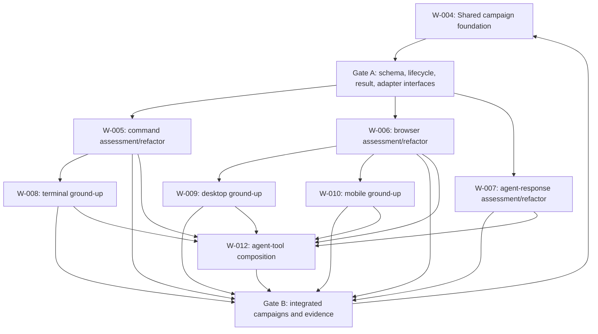

# Cross-Surface Simulation Program

Date: 2026-07-27
Status: Shared deterministic runtime and independent Codex evaluation implemented; surface-specific runtime evidence remains open
Owner: Agent Engineer
Scope: Cascade campaign tasks, execution adapters, evidence, and evaluation

## Responsible Skill And Route

The simulation workflow has three explicit responsibility stages across all
six contours:

- `simulation-campaigns`, owned by Agent Engineer, authors and selects
  campaigns, prepares dispatch/replay plans, aggregates identity-matched
  receipts, and reports exact dispositions.
- `simulation-execution`, owned by the `simulation-operator`, performs one
  approved mutable run, freezes evidence, performs cleanup, and emits an
  execution receipt.
- `simulation-evaluation`, owned by the read-only
  `simulation-evaluator`, consumes frozen evidence and any required
  specialized receipt, applies policy/oracle/claim rules, and emits an
  evaluation receipt.

It delegates:

- product-visible behavior examples and acceptance oracles to
  `functional-qa`;
- Cascade scenario, response, JSONL trace, deterministic grade, and golden
  semantic evaluation to `harness-evaluation`, whose specialized receipt is
  then consumed by `simulation-evaluation`;
- campaign schema, runner, validator, skill/agent wiring, permissions, tool
  guidance, and repository-surface changes to `codex-maintenance`.

The three skill packages, two dedicated agent contracts, Agent Engineer
wiring, route docs, structure map, glossary vocabulary, validator rules, and
harness collision cases are implemented. The campaign schemas, receipt
schemas, source folders, runner, adapters, composed profiles, and run artifacts
remain W-004 through W-010 plus W-012 work and are `NOT_RUN`.

## Request

Extend Cascade simulations beyond deterministic browser checks so campaigns can
exercise non-interactive CLIs, interactive terminal applications, browsers,
native desktop applications, mobile applications, standalone Codex agents, and
Cascade harness scenarios. Keep a separate implementation work lane for each
task kind, with assessment/refactoring lanes for existing kinds and ground-up
lanes for missing kinds. Keep cross-contour agent/tool composition in one
additional integration lane so it reuses those task kinds and adapters rather
than multiplying them into hybrid variants.

## Decision

Simulation tasks have two independent axes:

1. `kind` identifies the public interaction boundary being tested.
2. `driver` identifies how the harness operates that boundary.

This avoids encoding Computer Use as a duplicate task family. Browser, desktop,
mobile, and selected terminal tasks may use a Computer Use driver, while their
deterministic drivers remain available for lower-cost mechanical proof.

| Task kind | Default driver | Optional driver | Primary public boundary |
|---|---|---|---|
| `command` | direct process | none | argv, exit code, stdout/stderr, files |
| `terminal` | PTY | Computer Use only for a visible terminal/TUI | terminal screen, keys, signals, exit |
| `browser` | Playwright | Computer Use | rendered web UI and observable effects |
| `desktop` | platform automation | Computer Use | native application UI and OS-visible effects |
| `mobile` | platform simulator automation | Computer Use | installed mobile app, lifecycle, and device state |
| `agent-response` | agent-runtime adapter | none | structured response, tool trajectory, and evaluation |

Computer Use is a driver, not an oracle. Every model-driven task must still
verify success through a deterministic public boundary when one exists.

## Annotation 1: Agent Response Boundary

`agent-response` does not need to be implemented inside Codex and must not
require Cascade-specific scenario fields.

The campaign owns a provider-neutral task contract and invokes an agent through
an adapter. The first real adapter is Codex-specific because Cascade currently
has a Codex runtime:

- standalone Codex-agent mode runs a named custom agent or an explicit
  instruction source against a prompt and output schema;
- Cascade-harness mode references a generated Cascade scenario and reuses the
  existing trace normalizer, deterministic grader, and optional golden judge.

Both modes return the same normalized agent-task result. Cascade-only fields
live in the Cascade evaluation profile, not in the common task schema. Further
agent providers are deferred until another real runtime needs the adapter
contract; the plan does not create speculative provider implementations.

Proposed shape:

```json
{
  "id": "AGENT-STANDALONE-SMOKE",
  "kind": "agent-response",
  "driver": {
    "type": "agent-runtime",
    "adapter": "codex"
  },
  "target": {
    "mode": "standalone-agent",
    "agent": "agent-engineer",
    "prompt_file": "evals/tasks/prompts/agent-smoke.md",
    "output_schema": "evals/tasks/schemas/agent-smoke-output.json"
  },
  "evaluation": {
    "profile": "response-contract"
  }
}
```

A Cascade case changes only `target.mode` and the evaluation profile:

```json
{
  "target": {
    "mode": "cascade-harness",
    "scenario_id": "HS-plan-change-implicit"
  },
  "evaluation": {
    "profile": "cascade-route-and-trace"
  }
}
```

## Shared Execution Contract

Every task adapter implements the same lifecycle:

```text
resolve task and source digests
  -> atomically reserve run identity and execution lease
  -> preflight runtime and permissions
  -> provision isolated environment
  -> seed fixture and initial state
  -> execute bounded actions
  -> observe public state
  -> run independent oracle
  -> freeze evidence bodies
  -> cleanup and verify reset
  -> finalize immutable execution receipt
  -> harness-evaluator receipt, only for Cascade route/trace claims
  -> read-only simulation-evaluator receipt
  -> campaign aggregation and scoped claim projection
```

The model proposes actions. The harness validates permissions, executes the
actions, records observations, applies deterministic oracles, and owns the
final mechanical status. The operator never owns semantic or portfolio
judgment; the evaluator never executes or mutates the target; aggregation
accepts only identity-matched append-only receipts.

### Common Task Fields

- stable task ID and schema version;
- `kind` and typed `driver`;
- platform and runtime requirements;
- bounded working directory or environment image;
- declared inputs with source digests;
- permissions for filesystem, network, applications, accounts, and actions;
- timeout, step, retry, token, cost, and output-size budgets as applicable;
- fixture/seed identity and cleanup contract;
- independent oracle definitions;
- required evidence paths and redaction policy;
- required/optional disposition;
- expected error and blocked states.

### Common Result And Evidence

Each task result records:

- run, campaign, task, source, fixture, and environment identities;
- adapter and driver versions;
- start/end time, duration, status, and earliest failure;
- command, PTY, UI action, tool, approval, and observation events as applicable;
- stdout/stderr or normalized textual output;
- screenshots, terminal frames, video, traces, and app/device logs where useful;
- oracle inputs, output, verdict, and evidence digest;
- cleanup actions and cleanup verification;
- cost, tokens, retries, and action counts for model-driven tasks;
- redacted errors and blockers.

Authored schema validity, successful preflight, completed execution, oracle
success, semantic judgment, and release eligibility remain separate statuses.

### Claim And Policy Contract

Every simulation declares the claims it is allowed to support before execution.
A claim definition includes a stable ID, claim class, subject, assertion,
coverage scope, required policy IDs, oracle IDs, and evidence requirements.
Claim classes remain distinct:

- `authorship`: the definition is structurally valid;
- `execution`: the declared task completed through the selected driver;
- `mechanical-behavior`: deterministic public-boundary oracles passed;
- `semantic-quality`: an identified judge evaluated frozen evidence;
- `safety-compliance`: every applicable policy decision was satisfied;
- `coverage`: the exact platform, runtime, device, application, and driver
  combination has evidence;
- `release-eligibility`: all explicitly required lower gates passed.

Policies are versioned source definitions rather than prose embedded only in a
task. Each policy records a stable ID/version/digest, scope, applicability
conditions, allow/deny/confirmation effect, and required decision evidence.
Tasks reference policies; the runner resolves and digest-binds them before
execution. Action-time policy decisions use `ALLOW`, `DENY`,
`REQUIRE_CONFIRMATION`, or `NOT_APPLICABLE` and record the exact policy and
observation that produced the decision.

The generated claim ledger uses `SUPPORTED`, `PARTIALLY_SUPPORTED`,
`UNSUPPORTED`, `CONFLICTING`, `BLOCKED`, `NOT_RUN`, or `INVALID`. Only
`SUPPORTED` satisfies a required claim. Semantic judgment cannot compensate for
an invalid definition, denied policy, failed exact oracle, missing evidence,
failed cleanup, stale identity, or unsupported coverage scope.

### Canonical Source And Run Layout

The foundation lane owns the planned source layout:

```text
evals/claims/                         versioned claim definitions and schema
evals/policies/                       versioned policy definitions and schema
evals/oracles/                        reusable deterministic oracle definitions
evals/rubrics/                        semantic rubrics and evaluation profiles
evals/simulations/<simulation-id>/    simulation manifest and controlled fixtures
evals/tasks/                          reusable typed tasks
evals/campaigns/                      versioned execution plans
```

Each execution freezes a self-contained run package:

```text
.artifacts/campaigns/<run-id>/
  reservation.json
  execution/
    run.json
    source-manifest.json
    execution-receipt.json
    tasks/<task-id>/events.jsonl
    tasks/<task-id>/claims.json
    tasks/<task-id>/policy-decisions.json
    tasks/<task-id>/oracle.json
    tasks/<task-id>/evidence/
    tasks/<task-id>/cleanup.json
    tasks/<task-id>/handoff.json
    summary.json
  specialized-evaluations/<receipt-id>.json
  evaluations/<evaluation-id>/
    input/
      request.json
      input-manifest.json
      prompt.txt
      contracts/
      run/
    command.json
    stdout.jsonl
    stderr.log
    attempt.json
    receipt.json
  aggregations/<aggregation-id>.json
```

Required evidence bodies are copied or content-addressed into the run package;
a digest pointing only to one mutable shared path is insufficient. Durable
human summaries may be promoted to `docs/work/reports/`, but ignored local run
artifacts remain the execution authority.

The run container is append-only by namespace. `simulation-operator` owns only
`reservation.json` and `execution/`; evaluators return read-only receipt content
that the campaign layer stores under new sibling IDs; aggregation writes only a
new projection receipt. Atomic identity reservation prevents two operators from
sharing a run ID. An interrupted attempt may be cleaned up and finalized by an
explicit recovery operation, but target actions never resume implicitly and an
unknown external outcome is never auto-retried.

### Identity And Runtime Handoff

Every run binds campaign, task, simulation, claim, policy, fixture, source,
runner, adapter, driver, environment, application build, oracle, judge, rubric,
target actor, simulation operator, specialized evaluator, general evaluator,
and aggregator identities where applicable. Role and session identities,
repository revision plus dirty-diff identity, parent/retry lineage, receipt
IDs, and every artifact digest remain independently attributable.

Each terminal task writes a handoff receipt containing the source run/task,
terminal status, exact next owner or gate, reason, required inputs, artifact
references and digests, cleanup state, retry lineage, and receipt disposition.
`next_route` in an agent response is an evaluated proposal; it becomes an
accepted runtime handoff only when the receiving gate records a matching
receipt.

## Campaign Portfolio By Contour

A contour is the public interaction boundary under test: process, terminal,
browser, agent runtime, native desktop, or mobile device/application. A driver
operates that contour. A campaign selects versioned tasks, claims, policies,
oracles, fixtures, runtime requirements, and required evidence for one bounded
execution purpose.

Campaigns split when they require different isolation, permissions, runtime,
cost approval, cleanup, platform identity, or claim scope. They combine tasks
only when those tasks share one provisioned environment and cleanup boundary,
failures remain attributable, and the combined result does not broaden
coverage. Deterministic and live/model-driven evidence never share one
ambiguous pass.

### Planned Campaign Catalog

| Campaign ID | Owner | Contour / driver | Execution tier | Purpose and allowed claim |
|---|---|---|---|---|
| `simulation-contract-smoke` | W-004 | all adapters / fake | PR deterministic | Validate common lifecycle, identity, claim, policy, oracle, artifact, cleanup, and result contracts without external runtimes |
| `cross-contour-handoff-smoke` | W-004 | shared result boundary / fake | PR deterministic | Prove accepted, rejected, pending, stale, and retry handoff receipts across typed task results |
| `harness-static-smoke` | W-005 | command / direct process | deterministic | Preserve the candidate static harness checks; support only exact command/runtime/source claims |
| `command-failure-recovery` | W-005 | command / direct process | deterministic | Exercise nonzero exit, timeout, missing output, denied effect, redaction, cleanup, and retry lineage |
| `browser-simulation-smoke` | W-006 | browser / Playwright | deterministic | Preserve the controlled browser fixture as an infrastructure canary with exact browser/fixture scope |
| `browser-computer-use-canary` | W-006 | browser / Computer Use | isolated live canary | Exercise the screenshot/action loop, browser policies, injection resistance, independent oracle, and cleanup |
| `agent-response-fake-smoke` | W-007 | agent response / fake runtime | PR deterministic | Validate provider-neutral task/result, policy, claim, trace, judge-input, and handoff contracts without model execution |
| `agent-standalone-codex-canary` | W-007 | agent response / Codex adapter | bounded live canary | Evaluate one source-blind standalone custom agent without requiring a Cascade scenario |
| `agent-cascade-harness-canary` | W-007 | agent response / Codex adapter | bounded live canary | Reuse one exact current Cascade scenario, deterministic eligibility, independent judges, and coverage |
| `terminal-pty-smoke` | W-008 | terminal / PTY | deterministic | Exercise prompt, TUI, resize, signal, transcript/screen oracle, redaction, and process cleanup |
| `terminal-computer-use-canary` | W-008 | visible terminal / Computer Use | isolated live canary | Operate an isolated terminal visually while PTY/public-state oracles remain authoritative |
| `desktop-linux-fixture-smoke` | W-009 | desktop / platform automation | deterministic isolated | Prove the controlled Linux application, environment identity, native effects, crash handling, and reset |
| `desktop-computer-use-canary` | W-009 | desktop / Computer Use | isolated live canary | Exercise native screenshot/action policies and independent application/file/accessibility oracles |
| `mobile-android-emulator-smoke` | W-010 | mobile / Android automation | deterministic platform | Exercise boot, install, launch, lifecycle, permission denial, state oracle, logs, and reset |
| `mobile-ios-simulator-canary` | W-010 | mobile / iOS automation | macOS-gated platform | Prove only the exact iOS Simulator/runtime/app-build tuple or return an explicit blocker |
| `mobile-computer-use-canary` | W-010 | mobile / Computer Use | isolated live canary | Exercise visual mobile interaction with device/app policies and independent device/app oracles |
| `agent-tool-composition-smoke` | W-012 | agent response -> all five surface seams / fake adapters | PR deterministic integration | Prove tool-event linkage, independent agent/surface results, policy enforcement, oracle and cleanup failures, execution/evaluation receipts, and composed-claim reduction without model or surface runtime |
| `agent-command-tool-canary` | W-012; W-005/W-007 inputs | agent response / Codex adapter -> command / direct-process tool | bounded live integration | Evaluate one source-blind agent using one allowlisted command tool with exact argv/cwd/env policy, output oracle, budgets, frozen trace/logs, and cleanup |
| `agent-browser-tool-canary` | W-012; W-006/W-007 inputs | agent response / Codex adapter -> browser / structured browser tool | bounded live integration | Evaluate one source-blind agent operating one isolated controlled browser with exact profile/fixture, navigation/action policy, public-state oracle, frozen trace/visual evidence, and cleanup |
| `agent-terminal-tool-canary` | W-012; W-007/W-008 inputs | agent response / Codex adapter -> terminal / PTY tool | bounded live integration | Evaluate one source-blind agent operating one isolated PTY/TUI with exact runtime/dimensions, input/signal policy, transcript/screen oracle, budgets, and cleanup |
| `agent-desktop-tool-canary` | W-012; W-007/W-009 inputs | agent response / Codex adapter -> desktop / native tool | isolated live platform | Evaluate one source-blind agent operating one disposable native fixture with exact OS/image/app build, app/window policy, native oracle, budgets, reset, and artifact transfer |
| `agent-mobile-tool-canary` | W-012; W-007/W-010 inputs | agent response / Codex adapter -> mobile / device-app tool | isolated live platform | Evaluate one source-blind agent operating one emulator/simulator fixture with exact platform/device/app identity, lifecycle/action policy, device/app oracle, budgets, reset, and scoped coverage |

Real-device mobile, macOS desktop, and Windows desktop campaign manifests are
not authored until a real provider, controlled fixture, cleanup path, and
artifact-transfer boundary exist. Their absence is `DEFERRED`, not a hidden
optional pass.

### Campaign Catalog And Selection

Campaign manifests are authored source. The implementation generates
`evals/campaigns/catalog.generated.json` as a normalized inventory containing
campaign ID, owner lane, contours, drivers, execution tier, required runtimes,
claim/policy/oracle references, and manifest digest. `campaign catalog --check`
fails on stale catalog entries, duplicate IDs, unresolved references, invalid
contour/driver combinations, or an execution tier inconsistent with runtime
and permission requirements.

Default selection is explicit:

- pull requests run schema/reference checks plus
  `simulation-contract-smoke`, `cross-contour-handoff-smoke`,
  `agent-response-fake-smoke`, `agent-tool-composition-smoke`, and low-cost
  deterministic adapter fixtures;
- trusted deterministic CI may run `harness-static-smoke`,
  `command-failure-recovery`, `browser-simulation-smoke`, and
  `terminal-pty-smoke`;
- isolated live canaries require their named runtime, policy, environment, and
  cost gates and never run because another contour passed;
- every W-012 live canary requires the accepted agent profile plus its exact
  surface tool, fixture, policy, oracle, evidence, and cleanup identities;
  neither standalone-agent nor direct-surface evidence can satisfy its
  composed claim;
- desktop/mobile platform campaigns run only on matching controlled hosts;
- release reporting aggregates immutable named run IDs and exact claims; it
  does not rerun or relabel campaigns through one umbrella pass.

## Safety And Isolation

- Never run desktop or mobile Computer Use tasks against a maintainer's normal
  desktop, personal profile, or real accounts.
- Use disposable VMs, containers, simulators, emulators, or dedicated OS users.
- Deny network access by default; allowlist only task-required destinations.
- Use synthetic accounts, credentials, content, and device data.
- Treat screenshots, terminal output, documents, application content, and tool
  output as untrusted input rather than permission.
- An agent prompt, model response, or browser page cannot expand the
  pre-resolved browser domain, action, account, download/upload, clipboard, or
  filesystem policy.
- Require action-time confirmation for external sends, deletion, installation,
  credential entry, financial actions, account/permission changes, or other
  hard-to-reverse effects.
- When a Computer Use response contains a batch, normalize and validate each
  action immediately before execution, stop at the first denied or
  confirmation-required action, and preserve the partial batch plus the next
  screenshot/observation.
- Verify cleanup and preserve a failed cleanup as a failed task outcome.
- Keep real-device and real-account campaigns separate from fixture campaigns.

The OpenAI Computer Use guide is a current provider reference for the
screenshot/action loop and recommends isolated browsers or VMs:
`https://developers.openai.com/api/docs/guides/tools-computer-use`.

## Architecture Review

Scope classification: `epic`, public-contract and integration-sensitive.

The proposed campaign implementation exists on
`agent/w003-integration-r4-g3`, but it is not present on the current `master`.
That branch is a baseline candidate, not current-checkout authority. The
foundation lane must reconcile it with current dirty work and the completed
W-002/W-003 architecture-default work before implementation begins.

Public contracts and hidden consumers at risk:

- `evals/tasks/schema.json` and every reusable task definition;
- `evals/campaigns/schema.json` and campaign manifests;
- `evals/claims/`, `evals/policies/`, `evals/oracles/`, `evals/rubrics/`, and
  simulation manifests/fixtures;
- generated campaign catalog and any report/coverage consumer of campaign IDs;
- campaign list, validation, preflight, execution, result reduction, and
  artifact storage;
- harness-evaluation runner, scenario catalog, coverage ledger, and judge;
- `harness.config.yaml`, `README.md`, `CODEX.md`, and `docs/structure.md`;
- Cascade validator and campaign self-tests;
- isolated Playwright/tooling dependencies;
- ignored artifact paths and any future report reader.

Chosen approach:

- one canonical campaign runner and task schema;
- one shared lifecycle/result, claim/policy, identity, artifact, and handoff
  contract with deep adapter modules;
- direct migration from the selected baseline rather than Python/Bun or
  old/new schema coexistence;
- task-specific adapter ownership after the shared contract freezes;
- deterministic oracles before optional semantic grading;
- platform adapters added only where a real platform or controlled fixture
  exists.

Rejected approaches:

- one generic `command` task that shells out to every tool, because it hides
  permissions, lifecycle, evidence, and cleanup semantics;
- one `computer-use` task kind, because it conflates an execution mechanism
  with browser, desktop, mobile, and terminal acceptance boundaries;
- Cascade-specific fields in the common `agent-response` contract, because
  standalone Codex-agent evaluation is a real consumer;
- host-desktop automation as the initial native test environment, because it
  cannot provide safe, reproducible reset and account isolation.

## Work Lane Graph

The separate executable-node work graph is
[`IG-001`](2026-07-27-cross-surface-simulation-work-graph.md).
Its pre-implementation assumptions, corrections, feasibility limits, and
complexity are reviewed in
[`2026-07-28-cross-surface-simulation-plan-integrity-review.md`](2026-07-28-cross-surface-simulation-plan-integrity-review.md).
The diagram below remains a lane-level summary; `IG-001` owns implementation
order, Gate A/Gate B inputs, invalidation, and partial-repair sequencing without
duplicating lane acceptance criteria.



W-005, W-006, and W-007 are parallel-safe only after W-004 Gate A and only
when each lane writes its own adapter and fixtures. Shared schema, dispatcher,
documentation, catalog, and final merge remain W-004-only surfaces. W-012
writes only composition profiles, manifests, and fixtures after IG-15.
W-009 and W-010 may proceed in parallel after W-006 publishes the accepted
visual-action seam; mobile does not consume the desktop provider.

## Lane Summary

| Lane | Kind | Change class | Main outcome |
|---|---|---|---|
| W-004 | shared | assessment and foundation refactor | canonical schema, lifecycle, claims, policies, identity, artifacts, handoffs |
| W-005 | `command` | assessment and refactor | safe direct-process task with typed oracle/evidence |
| W-006 | `browser` | assessment and refactor | deterministic and Computer Use browser drivers |
| W-007 | `agent-response` | assessment and refactor | standalone Codex-agent and Cascade profiles over one adapter |
| W-008 | `terminal` | ground-up | PTY execution, screen/transcript evidence, TUI handling |
| W-009 | `desktop` | ground-up | isolated native-app automation and Computer Use loop |
| W-010 | `mobile` | ground-up | emulator/simulator lifecycle, platform automation, Computer Use |
| W-012 | `agent-response` + five typed tool contours | integration | deterministic composition matrix and separate live command/browser/terminal/desktop/mobile canaries without hybrid task kinds |

## Common Behavior Examples

| ID | Example | Required evidence |
|---|---|---|
| `SIM-001` | Given an authored task with a missing runtime, validation returns `BLOCKED` and does not execute it. | preflight result and zero execution events |
| `SIM-002` | Given a required task whose oracle fails, the campaign fails even if the driver reports completion. | driver result, oracle failure, campaign summary |
| `SIM-003` | Given a model-driven task that requests a forbidden action, the harness rejects it and records the policy decision. | action event and permission verdict |
| `SIM-004` | Given a retry after failure, the original run remains immutable and the retry receives a new run identity. | two manifests and unchanged first-run digests |
| `SIM-005` | Given cleanup failure, the task cannot pass. | cleanup trace and terminal failure |
| `SIM-006` | Given a standalone Codex agent, `agent-response` evaluates it without requiring a Cascade scenario ID. | Codex trace, normalized result, response grade |
| `SIM-007` | Given a Cascade scenario profile, the same task kind reuses Cascade route/trace grading without changing the common task schema. | selected scenario, normalized trace, route grade |
| `SIM-008` | Given a mobile simulator pass, reporting does not claim real-device coverage. | environment identity and coverage classification |
| `SIM-009` | Given a required claim without resolvable policy and oracle identities, validation returns `INVALID` before execution. | claim-resolution result and zero execution events |
| `SIM-010` | Given a denied action, the policy decision is frozen and the safety claim is `UNSUPPORTED` even if later output looks successful. | policy decision, action trace, and claim ledger |
| `SIM-011` | Given two retries that use one external evidence path, each run freezes its own evidence body and digest. | two independent artifact trees and digest verification |
| `SIM-012` | Given a terminal task result with a proposed next route, completion requires a digest-bound handoff receipt or reports handoff as pending. | task result and accepted or pending handoff receipt |
| `SIM-013` | Given two campaigns use the same contour but different drivers or permission envelopes, they remain separate named runs and cannot satisfy each other's claims. | campaign catalog and two summaries |
| `SIM-014` | Given a platform campaign is unavailable, explicit selection reports `BLOCKED` or `NOT_RUN`; another contour or platform pass cannot replace it. | selection result and coverage ledger |
| `SIM-015` | Given an authored campaign changes, `campaign catalog --check` detects the stale normalized catalog before execution. | catalog drift failure |
| `SIM-016` | Given a source-blind agent operates any accepted typed surface tool, a composed claim is supported only when the agent task and surface task independently satisfy their required policies, oracles, evidence, cleanup, and receipt gates. | linked agent/surface results, policy decisions, oracle evidence, cleanup, receipts, and joined claim ledger |
| `SIM-017` | Given the agent requests an action outside the selected surface policy, the action is denied and final model prose or driver completion cannot compensate or support the composed claim. | tool-call event, surface deny decision, independent task verdicts, and unsupported composed claim |
| `SIM-018` | Given the five-contour fake composition matrix passes, reporting proves only composition-contract readiness and leaves every live model, browser, PTY, desktop, and mobile capability `NOT_RUN`. | deterministic matrix receipt and live capability ledger |
| `SIM-019` | Given one live agent-tool canary is blocked or fails, every other contour retains its independent status, evidence scope, and coverage disposition. | five named campaign projections without substitution |
| `SIM-020` | Given two operators request the same run ID concurrently, exactly one atomic reservation succeeds and the other emits no target action. | reservation/lease race fixture and zero duplicate side effects |
| `SIM-021` | Given execution is interrupted after a possibly external action, recovery performs cleanup and finalizes the attempt with explicit uncertainty but never resumes or retries the target action automatically. | interrupted run, recovery identity, cleanup result, and unknown-outcome disposition |
| `SIM-022` | Given execution, specialized evaluation, general evaluation, and aggregation complete, each receipt occupies a separate append-only namespace and binds its producer role/session plus exact input digests. | artifact tree and receipt-chain verification |
| `SIM-023` | Given an unknown or unsupported source schema version, validation fails before provisioning; a supported migration produces one canonical current form with no runtime fallback. | version/migration fixture and zero execution events |
| `SIM-024` | Given Computer Use returns several actions, the harness validates each action at execution time, stops before the first denied or confirmation-required action, and records the partial batch and resulting observation. | batched action/policy trace and screenshot |
| `SIM-025` | Given a Codex standalone-agent target, the initial canary uses a digest-bound explicit instruction source through isolated non-interactive execution; named custom-agent invocation remains blocked until its exact invocation and identity seam is proven. | isolated Codex JSONL, output-schema result, resolved instruction digest, and capability disposition |

## Validation And Rollout Strategy

1. Validate schemas, generated campaign catalog, claim/policy resolution, task
   resolution, source digests, operator/evaluator identity separation,
   execution/evaluation receipt matching, result reduction, handoff receipts,
   and artifact immutability without external runtimes.
2. Run local deterministic command, browser, and PTY fixtures.
3. Run fake-adapter agent, desktop, and mobile lifecycle self-tests, integrate
   the accepted surface seams, then run W-012's
   `agent-tool-composition-smoke`.
4. Run one isolated browser Computer Use canary and one isolated desktop
   canary only after permission and environment gates pass.
5. Run Android-emulator and macOS-only iOS-simulator canaries separately;
   never convert unavailable platform evidence into a pass.
6. Run standalone Codex-agent and Cascade-harness live canaries separately.
7. Run W-012's agent-command, agent-browser, agent-terminal, agent-desktop, and
   agent-mobile canaries only after Gate B and each campaign's own runtime,
   isolation, permission, fixture, budget, and cleanup preflight; do not infer
   any composed result from standalone-agent or direct-surface evidence.
8. Keep low-cost schema/self-tests on every PR, deterministic smokes on trusted
   CI, and live model/desktop/mobile matrices scheduled or release-triggered.

Program completion requires each lane's named validation. A structurally valid
campaign proves authorship only; it does not prove that any task executed,
passed its oracle, was semantically graded, or is release-eligible.

## Residual Decisions

- W-004 must choose the exact integration base after comparing current
  `master` with `agent/w003-integration-r4-g3`; default is a direct reconciled
  port of the campaign modules, not a broad branch merge.
- W-004 owns the claim registry, policy registry, self-contained run package,
  oracle registry, rubric registry, identity envelope, execution receipt,
  specialized/general evaluation receipt storage, aggregation receipt, and
  runtime handoff receipt. Surface lanes may add typed policy actions, oracles,
  or rubric inputs but may not create parallel claim, receipt, or artifact
  authorities.
- W-004 must enforce that `simulation-operator` and `simulation-evaluator`
  identities differ for a run, evaluation consumes only frozen evidence, and
  Cascade route/trace claims include a matching specialized
  `harness-evaluator` receipt.
- W-004 owns campaign catalog generation and selection rules. W-005 through
  W-010 own their named direct-surface manifests and reusable contour tasks
  after Gate A. W-012 owns agent-to-tool composition profiles and manifests
  after IG-15; W-004 remains their merge and shared-contract authority.
- Release reporting consumes exact immutable run IDs and claims rather than an
  umbrella campaign status; cross-contour orchestration must preserve each
  campaign's independent verdict and blocker.
- W-008 must select a maintained portable PTY dependency or document bounded
  platform adapters; the task schema must not expose dependency-specific
  details.
- W-009 should use an isolated Linux desktop fixture for the first portable
  smoke. macOS and Windows adapters require platform-specific evidence before
  being claimed.
- W-010 should implement an Android emulator canary first and keep iOS
  Simulator evidence as a macOS gate. Real-device evidence is a separate,
  deferred capability.
- W-007's first executable standalone Codex canary should use
  `codex exec --ephemeral --json --output-schema` with an isolated working
  directory and a digest-bound explicit instruction source. A named custom
  agent is supported only after the adapter proves how that exact agent
  configuration is selected and attributed; the plan does not assume an
  undocumented direct-agent CLI flag.
- Live Computer Use and Codex-agent runs require separate provider/runtime
  readiness and cost approval; offline validation must report them `NOT_RUN`.

## Planning Artifact Validation

| Check | Result | Evidence boundary |
|---|---|---|
| Lane registration and required packet sections | `PASS` | W-004 through W-010 plus W-012 each exist, are registered, and contain the required lane sections |
| Separate work graph | `PASS` | `IG-001` defines 19 unique implementation node/gate IDs, Gate A/Gate B contracts, execution waves, ownership, invalidation, and partial repair without creating duplicate W-IDs |
| Named contour campaign ownership | `PASS` | 22 planned campaign IDs are assigned once across W-004 through W-010 plus W-012 with explicit execution tier, evidence boundary, and current `OPEN` or `NOT_RUN` status |
| Claim/policy/identity/artifact/handoff planning coverage | `PASS` | W-004 owns one shared authority; W-005 through W-010 provide surface seams and W-012 owns composition criteria, profiles, manifests, examples, and validation gates |
| Campaign-plan focused structure and diff checks | `PASS` | all eight simulation lane packets contain campaign deliverables and required sections; 22 campaign IDs are unique and assigned once; diff whitespace is clean |
| Full dependency-excluded source tree | `PASS` | current aggregate output reports no source-file finding; all 36 findings are inside ignored dependency trees |
| Aggregate Cascade validator | `FAIL` | 36 false-positive legacy/project-token matches in root and `.codex/harness-tooling` Playwright `node_modules`; no campaign-plan, role, skill, lane, or work-graph finding |
| Responsible skills, agents, and docs | `PASS` | `simulation-campaigns`, `simulation-execution`, and `simulation-evaluation` packages; Agent Engineer, simulation-operator, simulation-evaluator, and harness-evaluator boundaries; route docs; structure map; glossary; and design report |
| Operator/evaluator runtime conformance | `NOT_RUN` | the authored role contracts are implemented; W-004 still owns receipt schemas, identity enforcement, fake-runtime conformance, and live execution evidence |
| New-skill package validation | `PASS` | skill-creator `quick_validate.py` completed with a PyYAML-capable Python environment |
| Harness catalog | `PASS` | 41 skills, 319 scenarios, digest `f975c361819767d05319b7f4b636fa8b9e211e3c56b2005de930dd4d665d6552`; execution, evaluation, specialized-harness, and receipt-aggregation routes are covered |
| Harness grader self-test | `PASS` | 15 cases |
| Harness static audit | `PASS` | zero P0, P1, P2, or P3 findings across 9 agents, 41 skills, and 319 scenarios |
| Python compilation | `PASS` | current validator and harness runner |
| Diff whitespace | `PASS` | `git diff --check` |
| Task-scoped dependency-excluded source validator | `PASS` | after excluding installed dependencies: 9 agents, 41 skills, zero project-specific leakage, zero standalone legacy review aliases |
| Campaign/task implementation | `NOT_RUN` | plans and lane packets only |
| Computer Use, standalone Codex-agent, five-contour agent-tool composition, desktop, and mobile execution | `NOT_RUN` | direct surfaces are owned by W-006 through W-010; composition by W-012; W-004 aggregates |

The aggregate validator still fails because its leakage checks walk ignored
dependency trees: 36 findings are in the root and `.codex/harness-tooling`
Playwright `node_modules`. The dependency-excluded source snapshot passes. This
slice does not rewrite the aggregate leakage boundary or installed
dependencies. W-004 must preserve that source-only boundary when the runtime
foundation is implemented.

### Current Status Reconciliation

The table above is execution-time evidence for the earlier source identity.
IG-001 plan revision 9 now binds the active implementation baseline to
`master@60fdc2464b9782a689d3f53ffa8fc177f486e6a8`. The current generated
harness catalog contains 44 skills and 368 scenarios, while current-HEAD Bun
validation remains `NOT_RUN` because Bun 1.3.3 is unavailable on the active
shell `PATH`. The next candidate is W-004 `IG-03`; it is `PENDING`, not
dispatched or running.

## Doc Routing Decisions

| Fact | Source | Owner Target | Action | Bloat Check | Evidence | Next Gate |
|---|---|---|---|---|---|---|
| Task kind and execution driver are separate axes | current request | this program report and W-004 | `UPDATED` | provisional architecture belongs with the implementation program until validated in code | lane structure and source-only validator pass | W-004 |
| `agent-response` supports standalone Codex agents and Cascade profiles through one adapter boundary | Annotation 1 | W-007 | `UPDATED` | no unimplemented provider-neutral rule added to durable architecture patterns | W-007 criteria and examples | W-007 |
| Agent-driven tool evaluation composes `agent-response` with command, browser, terminal, desktop, and mobile tasks rather than creating hybrid task kinds | current follow-up | W-012 with W-005 through W-010 inputs and W-004 merge authority | `UPDATED` | one composition lane avoids duplicate adapters while each composed claim retains agent and surface evidence boundaries | `agent-tool-composition-smoke`, five live canaries, `SIM-016` through `SIM-019`, and W-012 examples | IG-16 then IG-17 |
| Mobile is a separate native task kind with Android/iOS simulator evidence split from real devices | current request | W-010 | `UPDATED` | platform claims remain in the implementation lane until executed | W-010 criteria and coverage examples | W-010 |
| Claims resolve to versioned policies, independent oracles, frozen evidence, exact identity, and runtime handoff receipts | simulation audit | this program report and W-004 through W-010 plus W-012 | `UPDATED` | one shared foundation owns the contract; W-012 consumes it without a parallel reducer or artifact authority | updated criteria, behavior examples, and validation gates | W-004 Gate A |
| Execution and evaluation use separate identities and matching receipts, with specialized Cascade trace evaluation preserved | role-separation follow-up | W-004 and W-007 | `UPDATED` | one operator and one read-only evaluator serve every contour; per-contour agent duplication is avoided | skill/agent contracts, receipt templates, W-004 Gate A criteria, and W-007 profile rules | W-004 Gate A |
| Each contour has named deterministic, live, platform, or composed campaign manifests with explicit selection and independent verdicts | contour campaign follow-up | this program report and W-004 through W-010 plus W-012 | `UPDATED` | one composition lane extends the surface lanes without an umbrella pass or hybrid task kind | 22 campaign deliverables, catalog rules, and deferred real-platform boundaries | W-004 Gate A |
| Campaign, contour, driver, claim ledger, and runtime handoff terminology | implemented skill/docs contract | `docs/glossary.md` | `UPDATED` | only shared terms needed to interpret campaign sources and reports were added | glossary rows and validator pass | W-004 Gate A |

No product, design, brand, or reusable architecture-pattern diff was written.
The glossary and workflow docs now describe the implemented responsibility
contract; they do not claim that the planned campaign runtime exists.
