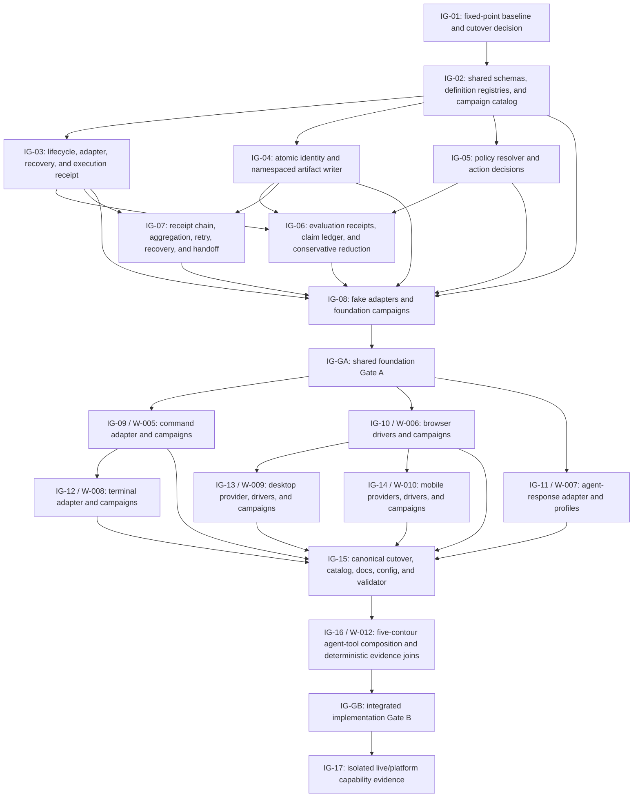

# Cross-Surface Simulation Work Graph

Date: 2026-07-27
Status: `PLANNED`
Work Graph ID: `IG-001`
Plan Revision: `9`
Owner: `agent-engineer` through W-004
Merge Owner: `W-004`
Scope: implementation sequencing for W-004 through W-010 plus W-012
Terminal Gate: `IG-GB` for deterministic implementation; `IG-17` owns
capability-scoped live/platform dispositions

## Purpose And Authority

This work graph decomposes the cross-surface simulation program into
executable implementation nodes, dependency gates, validation joins, and
repair routes.
The program report owns architecture and shared decisions. W-004 through W-010
plus W-012 own acceptance criteria, behavior examples, and file ownership.
This graph owns only implementation order and readiness projection; it does
not duplicate those definitions.

The program previously contained only a lane-level Mermaid summary. `IG-001`
is the separate work graph requested for the work.

This graph uses the repository work-graph contract and
`docs/work/work-graph-template.md`. Its stable `IG-001` identity is preserved
because it already binds worklines, reports, and evidence; the canonical type
and user-facing name are now `work graph`. Candidate-only Coordination Graph
state is not treated as current authority.

## Goal, Success, And Non-Goals

Goal:

Implement one canonical campaign system that supports command, terminal,
browser, agent-response, desktop, and mobile contours through typed drivers,
versioned claims and policies, independent oracles, self-contained immutable
run artifacts, exact identity, runtime handoff receipts, and conservative
coverage/release projection.

Success:

- Gate A freezes the shared schemas and adapter/lifecycle seams.
- Surface lanes implement against that exact Gate A identity.
- Gate B accepts the combined active-worktree implementation only after every
  required deterministic check and exact surface disposition is current.
- Authorship, implementation, deterministic validation, live execution,
  semantic judgment, platform coverage, and release eligibility remain
  separate.

Non-goals:

- automatic scheduling or dispatch, user-visible task/thread creation,
  worktree creation, merge, commit, push, deployment, or live-provider
  spending;
- importing the candidate branch wholesale;
- creating a second claim, policy, artifact, catalog, or handoff authority;
- treating fake-adapter or deterministic evidence as live Computer Use,
  model-effectiveness, desktop-platform, mobile-platform, or release proof.

## Current Preconditions

| Precondition | Current state | Required disposition |
|---|---|---|
| W-004 through W-010 plus W-012 plans | `OPEN`; authored | retain as criteria authority |
| Candidate campaign code | present only on `agent/w003-integration-r4-g3` | compare and directly port only selected current-compatible modules |
| Current campaign source folders | deterministic framework roots implemented in the working tree | retain as current W-004 evidence; do not infer surface completion |
| Existing campaign artifacts | preserved immutable framework and candidate runs; key manifests differ from current `HEAD` | preserve as source-bound history; current-HEAD replay required |
| W-011 architecture-catalog work | `COMPLETE`; changed validator/docs/config surfaces | include its completed source state in the `IG-01` fixed-point inventory before accepting |
| Current source | clean implementation baseline `master@60fdc2464b9782a689d3f53ffa8fc177f486e6a8`; revision-9 planning diff applied on top | preserve implementation files until IG-03 dispatch |
| Required runtime | Bun 1.3.3 declared by `package.json` and `harness.config.yaml`; absent from active shell `PATH` | block readiness without consuming an implementation attempt |
| Work-graph mechanics | current template, workflow rules, dispatch contract, and validator | retain `IG-001` as the stable graph identity and use the canonical work-graph type |

## Execution Surface And Dispatch Manifest

Graph readiness is eligibility, not authorization. This plan does not dispatch
itself. `internal-subagent` means a child agent inside the current task tree,
not a separate user-visible Codex task. A separate task may replace the
preferred surface only after the user explicitly asks to create, open, or fork
separate tasks or threads and the resulting task ID is recorded here.

| Nodes / Lane | Preferred Execution Surface | Dispatch State | Authorization Evidence | Runtime Handle | Eligible After | Merge Owner |
|---|---|---|---|---|---|---|
| `IG-03` through `IG-08` / W-004 | `root` | `NOT_AUTHORIZED` | none; prior W-004 authorization consumed by preserved framework attempt | none | current Bun preflight plus explicit implementation authorization | W-004 |
| `IG-09` / W-005 | `internal-subagent` | `NOT_AUTHORIZED` | none | none | `IG-GA ACCEPTED` plus explicit delegation authorization | W-004 |
| `IG-10` / W-006 | `internal-subagent` | `NOT_AUTHORIZED` | none | none | `IG-GA ACCEPTED` plus explicit delegation authorization | W-004 |
| `IG-11` / W-007 | `internal-subagent` | `NOT_AUTHORIZED` | none | none | `IG-GA ACCEPTED` plus explicit delegation authorization | W-004 |
| `IG-12` / W-008 | `internal-subagent` | `NOT_AUTHORIZED` | none | none | accepted W-005 seam plus explicit delegation authorization | W-004 |
| `IG-13` / W-009 | `internal-subagent` | `NOT_AUTHORIZED` | none | none | accepted W-006 seam plus explicit delegation authorization | W-004 |
| `IG-14` / W-010 | `internal-subagent` | `NOT_AUTHORIZED` | none | none | accepted W-006 seam plus explicit delegation authorization | W-004 |
| `IG-15` / W-004 | `root` | `NOT_AUTHORIZED` | none | none | all six exact surface dispositions | W-004 |
| `IG-16` / W-012 | `internal-subagent` | `NOT_AUTHORIZED` | none | none | accepted `IG-15` identity plus explicit delegation authorization | W-004 |
| `IG-17` operator/evaluator runs | `internal-subagent` | `NOT_AUTHORIZED` | none | none | `IG-GB ACCEPTED`, runtime permission, and explicit delegation authorization | W-004 |

`max_threads` limits root-plus-subagent execution capacity. It does not create
these agents or determine how many user-visible tasks exist. At dispatch,
update only the affected row to `AUTHORIZED`, then `DISPATCHED`/`RUNNING`, and
record the agent ID or Codex task ID without changing unrelated node evidence.

## Status Reconciliation Audit

Checked: `2026-07-30`
Source identity: clean implementation baseline
`master@60fdc2464b9782a689d3f53ffa8fc177f486e6a8`; revision-9 planning diff
applied on top
Disposition rule: mark `COMPLETE` automatically only when current-source
implementation, dependencies, required validation, and closeout evidence all
pass.

| Lane | Current-source implementation check | Required evidence state | Reconciled disposition |
|---|---|---|---|
| W-004 | deterministic schemas, catalog, runner, fake state world, policy/oracle reducer, frozen artifacts, evaluation/calibration/aggregation receipts, and correctness fixtures present | three immutable run receipts are preserved but key source manifests differ from current `HEAD`; current Bun validation plus cross-surface recovery, handoff, redaction, composition, and Gate A criteria remain `OPEN`/`NOT_RUN` | `UPDATE`; `KEEP_OPEN` |
| W-005 | shared `direct-process` execution primitive present; command manifests, recovery fixtures, and accepted seam absent | deterministic command, recovery, and handoff gates `OPEN`/`NOT_RUN` | `UPDATE`; `KEEP_OPEN` |
| W-006 | isolated Playwright harness tooling present; browser campaign adapter/definitions absent | deterministic browser, isolation, and Computer Use gates `OPEN`/`NOT_RUN` | `UPDATE`; `KEEP_OPEN` |
| W-007 | provider-neutral agent task runtime, profiles, and tool-event composition seam absent | fake adapter and regression gates `OPEN`; live canaries `NOT_RUN` | `KEEP_OPEN` |
| W-008 | terminal PTY task, fixtures, transcripts, and cleanup runtime absent | PTY lifecycle, redaction, cleanup, and platform gates `OPEN`/`NOT_RUN` | `KEEP_OPEN` |
| W-009 | desktop provider, adapter, controlled fixture, and reset runtime absent | environment, deterministic desktop, safety, and platform gates `OPEN`/`NOT_RUN` | `KEEP_OPEN` |
| W-010 | Android/iOS provider, adapter, fixtures, and coverage runtime absent | provider and platform canaries `OPEN`/`NOT_RUN` | `KEEP_OPEN` |
| W-012 | composed profiles/manifests, five-contour fake matrix, and joined result runtime absent | definition, matrix, receipt, reduction, regression, and live gates `OPEN`/`NOT_RUN` | `KEEP_OPEN` |

Existing `.artifacts/campaigns/` files remain immutable source-bound evidence,
but the contract, calibration, and latest Codex run manifests respectively
differ from current `HEAD` in 1/21, 7/39, and 4/54 inputs. They do not satisfy a
current-source gate. No lane meets the automatic-completion threshold.

## Work Topology



## Node Registry

| Node | Lane | Implementation outcome | Requires | Produces | State |
|---|---|---|---|---|---|
| `IG-01` | W-004 | fixed-point current/candidate inventory, selected canonical runner base, dirty-work preservation map, W-011 overlap disposition, and direct-cutover decision | current checkout; candidate branch; W-011 fixed state or non-overlap receipt | accepted baseline and allowed-write map | `COMPLETE` |
| `IG-02` | W-004 | task/campaign/claim/policy/oracle/rubric/simulation schemas, reference resolution, supported-version migration rules, contour/driver/tier rules, generated campaign catalog contract, and duplicate/stale rejection | `IG-01` | versioned shared definition contract | `COMPLETE` |
| `IG-03` | W-004 | bounded lifecycle, adapter interface, typed events, oracle interface, cleanup/recovery contract, unknown-outcome handling, result envelope, and operator/target-attributed execution receipt | `IG-02`; Bun 1.3.3; explicit authorization | adapter and operator implementation seam | `PENDING` |
| `IG-04` | W-004 | atomic run/lease reservation, complete actor/role identity envelope, source manifest, append-only execution/specialized-evaluation/general-evaluation/aggregation namespaces, safe evidence freezing/content addressing, atomic finalization, and artifact verification | `IG-02`; current Bun preflight | artifact and identity seam | `PENDING` |
| `IG-05` | W-004 | policy registry/resolver, applicability, allow/deny/confirmation decisions, budgets, redaction, and default-deny behavior | `IG-02`; current Bun preflight | policy decision seam | `PENDING` |
| `IG-06` | W-004 | read-only simulation-evaluator contract, specialized harness-evaluator receipt input, actor/operator/evaluator identity separation, claim registry/resolver, evidence/oracle/policy linkage, split claim statuses, immutable evaluation receipt content, and non-compensating reduction | accepted `IG-03`, `IG-04`, `IG-05` | evaluation receipt, claim ledger, and campaign reduction seam | `BLOCKED_ON_IG-03/04/05` |
| `IG-07` | W-004 | identity-matched append-only execution/specialized/general/aggregation receipt chain; self-evaluation rejection; accepted/rejected/pending/stale/not-applicable handoff receipts; retry parentage; cancellation/crash cleanup recovery; unknown-outcome binding; and invalidation rules | accepted `IG-03`, `IG-04`, `IG-06` | receipt chain, aggregation projection, runtime handoff, recovery, and retry seam | `BLOCKED_ON_IG-03/04/06` |
| `IG-08` | W-004 | fake adapters, fake operator/evaluator receipts, `simulation-contract-smoke`, and `cross-contour-handoff-smoke`, including reservation race, recovery, unsafe-evidence, schema-version, role-separation, receipt-mismatch, and missing-specialized-receipt failure injection | accepted `IG-02` through `IG-07` | Gate A evidence set | `BLOCKED_ON_IG-03..07` |
| `IG-GA` | W-004 | shared foundation accepted for surface implementation | `IG-08` and every required W-004 validation current | Gate A schema/interface digest and handoff packet | `OPEN` |
| `IG-09` | W-005 | safe direct-process command adapter, scoped claims/policies/oracles, static smoke, failure/recovery campaign, and command-to-terminal handoff | `IG-GA` | W-005 accepted adapter/result seam | `BLOCKED_ON_IG-GA` |
| `IG-10` | W-006 | Playwright and Computer Use browser drivers, isolated profile, scoped navigation/action policy, frozen visual evidence, and named browser campaigns | `IG-GA` | W-006 accepted visual action seam | `BLOCKED_ON_IG-GA` |
| `IG-11` | W-007 | provider-neutral agent result, Codex adapter, standalone and Cascade profiles, claim analysis, deterministic hard gates, judges, and route receipts | `IG-GA`; fixed current harness catalog | W-007 accepted agent seam | `BLOCKED_ON_IG-GA` |
| `IG-12` | W-008 | PTY/TUI terminal adapter, typed steps, raw/redacted transcript, screen oracle, cleanup, and optional Computer Use terminal driver | `IG-09` accepted process-result seam | W-008 accepted terminal seam | `BLOCKED_ON_IG-09` |
| `IG-13` | W-009 | isolated desktop provider, Linux fixture, deterministic and Computer Use drivers, platform-scoped identity/policy/oracle evidence, and reset | `IG-10` accepted visual action seam | W-009 accepted desktop/environment seam | `BLOCKED_ON_IG-10` |
| `IG-14` | W-010 | Android provider/canary, iOS Simulator provider/gate, exclusive environment leases, deterministic and Computer Use drivers, lifecycle, permissions, and scoped coverage | `IG-GA`; `IG-10` accepted visual-action seam | W-010 accepted mobile seam | `BLOCKED_ON_IG-10` |
| `IG-15` | W-004 merge owner | direct canonical source cutover, generated catalog, explicit selection, release projection, docs/config/validator wiring, and stale-path removal | `IG-09` through `IG-14` exact dispositions | one combined active-worktree implementation | `BLOCKED_ON_SURFACES` |
| `IG-16` | W-012 implementation; W-004 merge owner | `agent-tool-composition-smoke` across fake command, browser, terminal, desktop, and mobile seams; composed profiles/manifests; artifact immutability; independently attributable agent/tool/policy/result joins; claim/handoff joins; harness regression; reviews; and failure attribution | `IG-15`; accepted W-005 through W-010 surface seams and W-007 agent seam | Gate B evidence set | `BLOCKED_ON_IG-15` |
| `IG-GB` | W-004 | integrated implementation accepted for exact combined source state | `IG-16`; every required current check passes | implementation-complete receipt | `OPEN` |
| `IG-17` | W-012 and W-006 through W-010 with W-004 aggregation | isolated browser/desktop/terminal/mobile Computer Use; standalone/Cascade agent; five composed agent-tool canaries for command, browser, terminal, desktop, and mobile; Android; and iOS live/platform evidence | `IG-GB`; per-campaign runtime, permission, environment, fixture, budget, cleanup, and cost gates | exact capability/coverage ledger; no umbrella pass | `BLOCKED_ON_IG-GB` |

## Gate Contracts

### IG-GA — Shared Foundation Gate A

Required inputs:

- accepted baseline/cutover decision from `IG-01`;
- schema/reference/catalog checks from `IG-02`;
- lifecycle/adapter/oracle/result, cancellation, recovery, and unknown-outcome
  contract tests from `IG-03`;
- atomic reservation, retry, overwrite, safe content-freezing, namespaced
  receipt storage, finalization, digest, and source-manifest tests from `IG-04`;
- allow, deny, confirmation, stale-policy, budget, and redaction tests from
  `IG-05`;
- unresolved, conflicting, partial, non-compensating, and release-scope claim
  tests from `IG-06`;
- accepted, rejected, pending, stale, retry, cleanup/recovery, aggregation,
  unknown-outcome, and invalidation receipt tests from `IG-07`;
- operator/evaluator identity separation, matching execution/evaluation
  receipts, and required specialized harness-evaluator receipt tests;
- both W-004 fake-adapter campaigns passing from `IG-08`.

Acceptance:

Every required input is current and passes against one shared contract digest.
No surface implementation may amend the contract independently after Gate A.
A required amendment reopens Gate A and every affected surface node.

### IG-GB — Integrated Implementation Gate B

Required inputs:

- exact surface dispositions for `IG-09` through `IG-14`;
- one canonical current-source cutover with no legacy fallback;
- current generated catalog and zero unresolved claim/policy/oracle references;
- combined active-worktree source/diff identity;
- required deterministic campaign and failure-injection results;
- passing `agent-tool-composition-smoke` with independently attributable agent
  and command, browser, terminal, desktop, and mobile results plus conservative
  composed-claim reduction;
- self-contained artifact verification and cleanup results;
- current harness catalog/self-test and agent-response regression evidence;
- Standards/Spec review plus repository validation against the same combined
  source state.

Acceptance:

Every required implementation and deterministic evidence input passes or has
an explicitly non-required platform/live disposition allowed by its lane. Gate
B proves integrated implementation only. It does not prove live Computer Use,
model effectiveness, unavailable platforms, real devices, or release
eligibility.

## Execution Waves And Parallel Safety

| Wave | Nodes | Parallel rule | Exit condition |
|---|---|---|---|
| 0 | `IG-01` | serialized; shared dirty-work and W-011 reconciliation | fixed baseline, allowed writes, candidate cutover decision |
| 1 | `IG-02` through `IG-08` | W-004-owned; internal sectioning allowed, but one merge owner controls shared schemas and reducer/artifact contracts | `IG-GA ACCEPTED` |
| 2 | `IG-09`, `IG-10`, `IG-11` | parallel only with disjoint adapter/fixture paths; shared changes return to W-004 | three exact surface dispositions |
| 3 | `IG-12`, `IG-13`, `IG-14` | may run in parallel after their distinct producer seams accept; mobile and desktop providers do not depend on each other's implementation | terminal, desktop, and mobile dispositions |
| 4 | integration readiness check | W-004 verifies all six accepted surface/agent seams and their exact digests before cutover | exact `IG-09` through `IG-14` dispositions |
| 5 | `IG-15`, then `IG-16` | W-004 serializes canonical cutover; W-012 adds composition only after the integrated source and all accepted tool seams are fixed; W-004 remains merge owner | `IG-GB ACCEPTED` or exact blocker |
| 6 | `IG-17` | campaigns are independent by runtime/platform; never substitute one result for another, including standalone-agent, direct-surface, and each named composed agent-tool canary | exact capability ledger with `PASS`, `FAIL`, `BLOCKED`, or `NOT_RUN` per campaign |

W-011 remains separate from this graph. Its completed validator, config,
pattern, and documentation changes are a Wave 0 overlap input, not a simulation
workline. `IG-01` must inventory that completed source state before selecting
the campaign integration base.

## Planned Write Ownership

| Area | Owner node/lane | Consumers | Conflict rule |
|---|---|---|---|
| shared schemas, claim/policy/oracle/rubric registries, catalog schema/generator | `IG-02` / W-004 | every surface | surface lanes read only; changes reopen Gate A |
| lifecycle, adapter, oracle, result events | `IG-03` / W-004 | `IG-09` through `IG-14` | one merge owner |
| simulation operator/evaluator role and skill contracts | `IG-03`, `IG-06` / W-004 | every campaign and report | execution is mutable and evaluation is read-only; no self-evaluation |
| atomic reservation/lease manager, namespaced artifact writer, identity envelope, and finalizer | `IG-04` / W-004 | every runner/adapter/report | no surface-local identity allocator or artifact writer |
| policy engine | `IG-05` / W-004 | every adapter | surfaces contribute typed action vocabulary through W-004 |
| claim reducer | `IG-06` / W-004 | campaigns, coverage, release projection | no semantic or surface override |
| execution/specialized/general/aggregation joins and handoff/retry/recovery/cleanup receipts | `IG-07` / W-004 | all tasks and downstream gates | identity or receipt schema changes reopen affected evidence |
| command adapter/fixtures/manifests | `IG-09` / W-005 | W-008; W-004 integration | must not edit shared contracts |
| browser adapter/fixtures/manifests | `IG-10` / W-006 | W-009; W-004 integration | publishes accepted visual seam |
| agent adapter/profiles/fixtures/manifests | `IG-11` / W-007 | harness and W-004 integration | preserves current harness authority |
| composed agent-tool profiles, manifests, five-contour fake matrix, tool-event linkage, and joined result fixtures | `IG-16` / W-012 | W-005 through W-010 surface seams, W-007 agent seam, W-004 Gate B aggregation | no hybrid task kind, surface adapter, reducer, or artifact writer; surface lanes retain their own task results and policies |
| terminal adapter/fixtures/manifests | `IG-12` / W-008 | W-004 integration | consumes command seam |
| desktop provider/fixtures/manifests | `IG-13` / W-009 | W-004 integration and desktop composition | publishes an independent desktop environment seam |
| mobile providers/fixtures/manifests | `IG-14` / W-010 | W-004 integration | no responsive-web substitution |
| canonical docs/config/validator/cutover | `IG-15` / W-004 | repository | serialize with W-011 and existing dirty owners |

## Invalidation And Partial Repair

| Changed input or failure | Reopen | Preserve |
|---|---|---|
| shared schema, lifecycle, identity, policy, claim, execution/evaluation receipt, role-separation, or handoff contract after Gate A | `IG-GA`; every surface that consumes the changed contract; `IG-15`, `IG-16`, `IG-GB` | unaffected historical evidence only |
| command process-result seam | `IG-09`, `IG-12`, integration gates | browser, agent, desktop, mobile work whose inputs are unchanged |
| browser visual action seam | `IG-10`, `IG-13`, `IG-14`, integration gates | command, terminal, agent work whose inputs are unchanged |
| desktop environment seam | `IG-13`, integration gates, and affected desktop composition evidence | command, terminal, browser, mobile, and agent work whose inputs are unchanged |
| mobile environment seam | `IG-14`, integration gates, and affected mobile composition evidence | command, terminal, browser, desktop, and agent work whose inputs are unchanged |
| harness scenario/catalog/source digest | affected `IG-11` Cascade profile and integration evidence | standalone-agent and other surfaces if their inputs are unchanged |
| accepted command, browser, terminal, desktop, or mobile tool seam | its owning surface node, `IG-16`, integration gates, and the matching composed `IG-17` evidence | direct evidence and other compositions whose exact inputs are unchanged |
| agent tool-event or result-linkage seam | `IG-11`, `IG-16`, integration gates, and every affected composed `IG-17` entry | direct surface and standalone-agent evidence whose exact inputs are unchanged |
| reservation, lease, artifact writer, receipt namespace, finalization, or evidence-copy behavior | every result produced with the changed mechanism; `IG-16`, `IG-GB`, affected `IG-17` entries | source definitions and accepted adapter code when unchanged |
| policy or claim definition | only referencing tasks/campaigns plus aggregation gates | unrelated contour evidence |
| W-011 or unrelated dirty-source overlap | `IG-01`, affected shared node, integration gates | disjoint accepted surface results after identity is revalidated |
| one live/platform canary failure | that exact `IG-17` campaign and its coverage/release claim | every independent campaign result |

## Validation Plan

Current structural and harness checks:

```bash
bun scripts/cascade.ts validate
bun scripts/cascade.ts eval catalog --check
bun scripts/cascade.ts eval self-test
bun scripts/cascade.ts target self-test
bun scripts/cascade.ts campaign catalog --check
bun scripts/cascade.ts campaign self-test
bun test scripts/cascade
git diff --check
```

Current and remaining implementation checks:

```bash
bun scripts/cascade.ts campaign catalog --check
bun scripts/cascade.ts campaign self-test
bun scripts/cascade.ts campaign run simulation-contract-smoke
bun scripts/cascade.ts campaign run cross-contour-handoff-smoke
bun scripts/cascade.ts campaign run agent-tool-composition-smoke
```

Surface campaign commands are added only with their owning node and must write
new immutable run IDs. Live/provider/platform commands remain `NOT_RUN` until
their explicit readiness and cost gates pass.

## Current Frontier

- Complete: `IG-01` and `IG-02`.
- Pending: `IG-03`, `IG-04`, and `IG-05`; Gate A remains open.
- Blocked: `IG-09` through `IG-17` pending the required predecessor gates.
- Next candidate: `IG-03` attempt 1 of 2 under the version-bound packet in the
  W-004 lane.
- Readiness blocker: Bun 1.3.3 is absent from the active shell `PATH`; current
  validation and implementation authorization are also required.
- Current implementation evidence: pre-merge deterministic framework evidence
  is historical; current-HEAD replay and remaining Gate A evidence are
  `OPEN`/`NOT_RUN`.
- Current live Computer Use/model/platform evidence: `NOT_RUN`.
- Dispatch authorization and runtime handles: none.
- Next action: restore Bun 1.3.3, run the current preflight, then explicitly
  authorize and execute `IG-03`.
- Commit, push, publication, or provider spending: not authorized by this
  graph.

## Lifecycle And Closeout

- Current lifecycle status: `PLANNED`; no node is dispatched or running.
- Use `BLOCKED` when the current frontier lacks a required dependency,
  authority, runtime, permission, or evidence input.
- Deterministic implementation is complete only when `IG-GB` accepts the exact
  combined source identity.
- Live/platform capability remains a separate `IG-17` ledger. It does not
  weaken or inflate the deterministic implementation result.
- After its required scope is `COMPLETE` or a named replacement makes it
  `SUPERSEDED`, retain this durable report and all receipts, then remove the
  terminal graph projection from the active registry.

## Planning Artifact Validation

| Check | Result | Evidence boundary |
|---|---|---|
| Work-graph identity and node registry | `PASS` | 19 unique implementation node/gate IDs: `IG-01` through `IG-17`, `IG-GA`, and `IG-GB` |
| Cross-document wiring | `PASS` | program report, W-004 lane, active registry, and report index reference `IG-001` |
| Lane ownership | `PASS` | nodes reference W-004 through W-010 plus W-012 and preserve W-011 as an external overlap precondition; no additional workline is required for the integrity corrections |
| Harness catalog | `NOT_RUN` for current `HEAD` | generated catalog currently records 44 skills, 368 scenarios, digest `d6030bf0ea98a6bd26b431de50ac1b7ca909a19a289192d005403c514507897d`; prior 41/319 receipt retained as historical |
| Harness self-test | `NOT_RUN` for current `HEAD` | prior 15-case receipt retained as historical |
| Bun tests and diff whitespace | `NOT_RUN` / `PASS` | Bun 1.3.3 unavailable; revision-9 planning diff passes `git diff --check` |
| Aggregate Cascade validator | `NOT_RUN` | current Bun validator exists but required runtime is unavailable |
| Campaign/runtime implementation | `PARTIAL` | seven definitions and source-bound fixture/Codex receipts exist; current-HEAD replay, Gate A completion, and release eligibility remain open |
| Live Computer Use/model/platform execution | `NOT_RUN` | owned by `IG-17` after `IG-GB` |

## Revision 9 Reconciliation And Resume Contract

- Revision delta: plan revision 8 -> 9. Topology, node IDs, owners, edges, Gate
  A, Gate B, and workline boundaries are preserved.
- Updated projections: current source/catalog identities, dispatch/runtime
  state, evidence freshness, validation commands, lane dispositions, and
  Current Frontier.
- Canonical survivors: W-004 through W-010 and W-012. W-004, W-005, and W-006
  are `UPDATE`; W-007 through W-010 and W-012 are `KEEP`. No merge,
  supersession, retirement, or deletion applies.
- Invalidated for current acceptance: prior W-004 Bun test, campaign,
  evaluator, validator, and 41-skill/319-scenario harness receipts.
- Preserved: implementation files, immutable run artifacts, completed
  architecture work, accepted IG-01/IG-02 planning knowledge, and all
  unrelated historical evidence.
- Coordination Graph action: `NO_CHANGE`. The next slice is lane-local W-004
  work; no worktree dispatch, materialization queue, batch join, or first-class
  Coordination Graph cutover is authorized. Reassess before Gate A opens the
  cross-workline surface wave.
- Graph action: `UPDATE`; revision-9 status and resume bindings are now the
  authoritative active projection.
