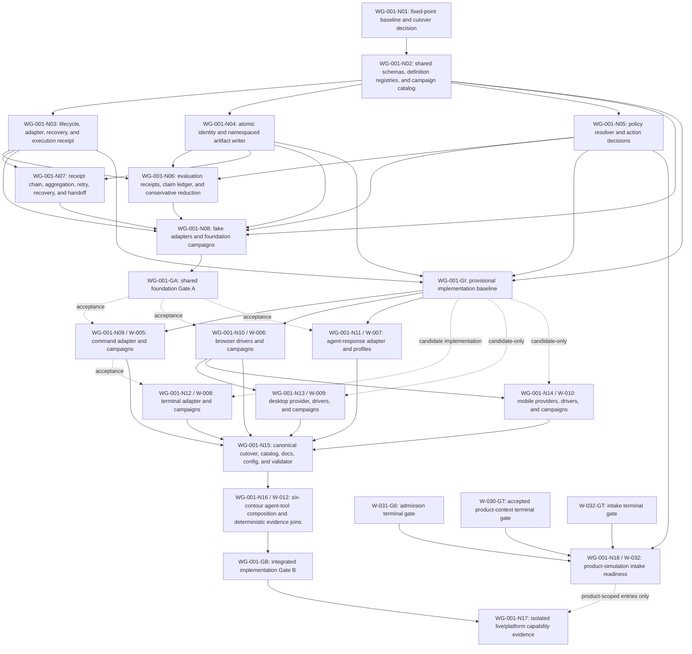

# Cross-Surface Simulation Work Graph

Date: 2026-07-27
Status: `ACTIVE`
Work Graph ID: `WG-001`
Plan Revision: `89`
Work Graph Revision: `16`
Owner: `agent-engineer` through W-004
Merge Owner: `W-004`
Scope: implementation sequencing for W-004 through W-010, W-012, and the
W-032 product-simulation intake bridge
Terminal Gate: `WG-001-GB` for deterministic implementation; `WG-001-N17` owns
capability-scoped live/platform dispositions, and `WG-001-N18` gates only its
product-scoped entries

## Purpose And Authority

This work graph decomposes the cross-surface simulation program into bounded
work nodes, dependency gates, validation joins, and repair routes.
The program report owns architecture and shared decisions. W-004 through W-010
plus W-012 own acceptance criteria, behavior examples, and file ownership.
This graph owns only work ordering and readiness projection; it does
not duplicate those definitions.

The program previously contained only a lane-level Mermaid summary. `WG-001`
is the canonical work graph for this work and follows
`docs/work/work-graph-template.md`. Candidate-only Coordination Graph state is
not treated as current authority.

## Goal, Success, And Non-Goals

Goal:

Implement one canonical campaign system that supports command, HTTP, terminal,
browser, agent-response, desktop, and mobile contours through typed drivers,
versioned claims and policies, independent oracles, self-contained immutable
run artifacts, exact identity, runtime handoff receipts, and conservative
coverage/release projection.

Success:

- Gate I freezes a mechanically validated provisional interface baseline for
  candidate surface implementation without accepting the foundation.
- Gate A accepts the shared schemas and adapter/lifecycle seams.
- Surface candidates may implement against Gate I, but their acceptance and
  integration remain blocked until the exact Gate A identity is accepted.
- Gate B accepts the combined active-worktree implementation only after every
  required deterministic check and exact surface disposition is current.
- Authorship, implementation, deterministic validation, live execution,
  semantic judgment, platform coverage, and release eligibility remain
  separate.

Non-goals:

- automatic scheduling or dispatch, user-visible task/thread creation,
  worktree creation, merge, commit, push, deployment, or live-provider
  spending;
- importing the candidate branch wholesale;
- creating a second claim, policy, artifact, catalog, or handoff authority;
- treating fake-adapter or deterministic evidence as live Computer Use,
  model-effectiveness, desktop-platform, mobile-platform, or release proof.

## Current Preconditions

| Precondition | Current state | Required disposition |
|---|---|---|
| W-004 through W-010 plus W-012 plans | `OPEN`; authored | retain as criteria authority |
| Candidate campaign code | historical branch `agent/w003-integration-r4-g3` | do not import; WG-001-N03 uses current `master` source only |
| Current campaign source folders | deterministic framework roots implemented in the working tree | retain as current W-004 evidence; do not infer surface completion |
| Existing campaign artifacts | preserved immutable framework and candidate runs; key manifests differ from current `HEAD` | preserve as source-bound history; current-HEAD replay required |
| W-011 architecture-catalog work | `COMPLETE`; changed validator/docs/config surfaces | include its completed source state in the `WG-001-N01` fixed-point inventory before accepting |
| Current source | base `master@4226bfa1f69f069407b5f383e8c72dd39aa5abed` plus preserved dirty work; N06 revision-79 attempt-50 is accepted against immutable r67 and N07 revision-82 attempt-2 is rejected by GF-101 | preserve accepted r67 identity and unrelated work; replan only the rejected N07 receiver-authentication boundary |
| Next-frontier implementation | N03 through N06 accepted; N07 r75/r76 passes architecture/functional and reducer/evaluator review but fails GF-101 receiver-authentication review; W-031 revision-41 remains an unaccepted candidate; W-032 revision 24 preserves intake-v6/action-binding-v2 and v41/core@42 parity; W-005 through W-008 have scoped passes, while W-009 r5 and W-010 r2 have valid provider-blocked dispositions | replan N07 receiver authentication before N08/Gate A review; W-012 remains dependency-pending |
| Required runtime | exact Bun 1.3.3 available through ephemeral `npx bun@1.3.3` | use the exact declared runtime without adding repository or global dependencies |
| Work-graph mechanics | current template, workflow rules, dispatch contract, and validator | use `WG-001` and graph-scoped node/gate IDs as the only live work-graph namespace |

## Execution Surface And Dispatch Manifest

Graph readiness is eligibility, not authorization. This plan does not dispatch
itself. `internal-subagent` means a child agent inside the current task tree,
not a separate user-visible Codex task. A separate task may replace the
preferred surface only after the user explicitly asks to create, open, or fork
separate tasks or threads and the resulting task ID is recorded here.

| Nodes / Lane | Preferred Execution Surface | Dispatch State | Authorization Evidence | Runtime Handle | Eligible After | Merge Owner |
|---|---|---|---|---|---|---|
| `WG-001-N03` / W-004 | `root` | `COMPLETE` | accepted pre-r50 current-source join | current root task | accepted | W-004 |
| `WG-001-N04` / W-004 | `internal-subagent` | `COMPLETE` | explicit user authorization for delegated workline implementation, 2026-08-05 | `WG001-N04-ACCEPT-20260806-R58-A29` | accepted | W-004 |
| `WG-001-N05` / W-004 | `root` | `COMPLETE` | accepted pre-r50 current-source join | current root task | accepted | W-004 |
| `WG-001-N06` / W-004 | `internal-subagent` | `COMPLETE` | explicit user authorization for delegated implementation and independent reviews, reaffirmed 2026-08-06 | immutable r67 and the five exact acceptance receipts | accepted | W-004 |
| `WG-001-N07` / W-004 | `root` | `IN_PROGRESS` | user request to build all worklines, 2026-07-31 | immutable r75/r76 plus exact reviews; GF-101 rejected attempt 2 | accepted N03/N04/N06; receiver-authentication replan | W-004 |
| `WG-001-N08` / W-004 | `root` | `BLOCKED` | user request to build all worklines, 2026-07-31 | immutable deterministic r77/r78 retained | accepted N02 through N07 | W-004 |
| `WG-001-N09` / W-005 | `root` | `RUNNING` | explicit user implementation instruction, 2026-08-08 | current root task | `WG-001-GI ACCEPTED` for candidate implementation; `WG-001-GA ACCEPTED` for acceptance | W-004 |
| `WG-001-N10` / W-006 | `root` | `RUNNING` | explicit user implementation instruction, 2026-08-08 | current root task | `WG-001-GI ACCEPTED` for candidate implementation; `WG-001-GA ACCEPTED` for acceptance | W-004 |
| `WG-001-N11` / W-007 | `root` | `IN_REVIEW` | explicit user implementation instruction, 2026-08-08 | immutable W-007 r4 campaigns plus combined r64 | `WG-001-GI ACCEPTED` for candidate implementation; `WG-001-GA ACCEPTED` for acceptance | W-004 |
| `WG-001-N12` / W-008 | `root` | `IN_REVIEW` | explicit user implementation instruction, 2026-08-08 | immutable PTY r3 plus combined r64 | `WG-001-GI` plus current W-005 candidate for candidate implementation; accepted W-005 and Gate A for acceptance | W-004 |
| `WG-001-N13` / W-009 | `root` | `IN_PROGRESS` | explicit user implementation instruction, 2026-08-08 | immutable provider-blocked r5; combined r64 is historical | Gate I/current W-006 permit candidate work; accepted W-006 and Gate A gate acceptance | W-004 |
| `WG-001-N14` / W-010 | `root` | `IN_PROGRESS` | explicit user implementation instruction, 2026-08-08 | immutable provider-blocked r2 plus combined r64 | Gate I/current W-006 permit candidate work; accepted W-006 and Gate A gate acceptance | W-004 |
| `WG-001-N15` / W-004 | `root` | `AUTHORIZED` | user request to implement every remaining graph/workline | none until eligible | W-004 HTTP plus all six exact downstream surface/agent dispositions | W-004 |
| `WG-001-N16` / W-012 | `internal-subagent` | `AUTHORIZED` | explicit user authorization for delegated workline implementation, 2026-08-05 | none until eligible | accepted `WG-001-N15` identity | W-004 |
| `WG-001-N17` operator/evaluator runs | `internal-subagent` | `NOT_AUTHORIZED` | none | none | `WG-001-GB ACCEPTED`, runtime permission, and explicit delegation authorization | W-004 |
| `WG-001-N18` / W-032 | `root` | `COMPLETE` | explicit user implementation instruction, 2026-08-04 | current root task | `W-031-G6`, `WG-001-N05`, and `W-032-GT` accepted; independent acceptance remains separate | W-004 |

The runtime concurrency limit used at that time constrained root-plus-subagent
execution capacity. It did not create these agents or determine how many
user-visible tasks existed. At dispatch,
update only the affected row to `AUTHORIZED`, then `DISPATCHED`/`RUNNING`, and
record the agent ID or Codex task ID without changing unrelated node evidence.

## Status Reconciliation Audit

Checked: `2026-08-08`
Current source identity: `master@4226bfa1f69f069407b5f383e8c72dd39aa5abed`
plus preserved dirty work; immutable r47/r49/r50/r51/r52/r53/r54/r55/r56/r58
remain historical review evidence. Immutable r64 binds W-004 revision-76,
W-031 revision-41, W-032 revision-24, and its then-current W-005 through W-010
candidate source, but all three exact N06 reviews rejected it. W-004
revision-77 attempt-48 immutable r65 was rejected by architecture/functional
and GF-101 review while reducer/evaluator accepted that frozen packet only.
Revision-78 attempt-49 is the active repair. W-032 preserves
intake-v6/action-binding-v2 and binds v41/core@42 mechanical parity, but its
independent gates remain open.
Disposition rule: mark `COMPLETE` automatically only when current-source
implementation, dependencies, required validation, and closeout evidence all
pass.

| Lane | Current-source implementation check | Required evidence state | Reconciled disposition |
|---|---|---|---|
| W-004 | N03 through N06 are accepted; N07 revision-82 r75/r76 is frozen and reviewed; N08 deterministic r77/r78 pass | N07 architecture/functional and reducer/evaluator accept, but GF-101 rejects receiver self-impersonation; N08/Gate A remain blocked | `N07_R82_A2_GF101_FAILED`; `KEEP_OPEN` |
| W-005 | strict direct-process contract, task-root file oracle, two named campaigns, and fresh r8/r10 runs present | both campaigns are `VALID`/`COMPLETED`/`FRESH`; missing-output failure is proven; W-008 handoff, review, and Gate A remain open | `IN_PROGRESS`; `KEEP_OPEN` |
| W-006 | deterministic Playwright adapter, browser-navigation policy, negative tasks, bounded Computer Use loop, evidence, and cleanup present | immutable r18 is `VALID`/`COMPLETED`/`FRESH`; live Computer Use, W-012 seam, independent review, and Gate A remain open or `NOT_RUN` | `IN_PROGRESS`; `KEEP_OPEN` |
| W-007 | provider-neutral agent task v5, fixture/Codex adapters, explicit-instruction standalone profile, exact Cascade profile, and source-blind claim/result seam present | fixture r5 plus live standalone and Cascade r4 are `VALID`/`COMPLETED`/`FRESH`; Cascade r4 has independent outcome/trajectory 100, general evaluation PASS, and release false; named-agent selection stays fail-closed, composition is W-012-owned, and Gate A remains open | `IN_REVIEW`; `KEEP_OPEN` |
| W-008 | schema-v6 PTY task, Node runner, policy-bound terminal steps, transcripts/screens, recovery, and deterministic fixtures present | immutable Darwin/arm64 r3 is `VALID`/`COMPLETED`/`FRESH`; prompt/resize/signal/timeout cleanup pass, secret redaction passes focused tests; W-005 handoff, review, Gate A, other platforms, and Computer Use remain open or `NOT_RUN` | `IN_REVIEW`; `KEEP_OPEN` |
| W-009 | schema-v7 adapter, pinned image, Linux fixture, policy/oracle/claim, recovery, and reset candidate present | r5 `VALID`/`BLOCKED`/`FRESH` after provider dispatch timed out, with verified cleanup and no residual resources; deterministic pass, other platforms, Computer Use, review, W-006, and Gate A remain open | `IN_PROGRESS`; `KEEP_OPEN` |
| W-010 | schema-v8 action/provider contract, exact adapter preflight, requirements fixture, policy/oracle/claim candidate present | r2 `VALID`/`BLOCKED`/`FRESH` because adb is unavailable; app/snapshot runner, Android/iOS execution, Computer Use, review, W-006, and Gate A remain open | `IN_PROGRESS`; `KEEP_OPEN` |
| W-012 | composed profiles/manifests, six-contour fake matrix, and joined result runtime absent | definition, matrix, receipt, reduction, regression, and live gates `OPEN`/`NOT_RUN` | `KEEP_OPEN` |

Earlier `.artifacts/campaigns/` files remain immutable source-bound evidence and
do not satisfy the current-source gate. Fresh deterministic run
`wg001-n03-attempt3-20260730-r1` and the independent attempt-3 review bind and
accept WG-001-N03. Fresh run `wg001-frontier-repair-20260731-r1` validates the
repaired N04/N05 deterministic contracts but did not independently accept
either node; later fixed-point receipts accepted both. It does not satisfy
WG-001-N06 through WG-001-N08 or Gate A.
No lane meets the automatic-completion threshold.

## Work Topology



`W-031-G6`, `W-030-GT`, and `W-032-GT` are external producer-gate
projections, not additional WG-001 nodes. Their authoritative states remain in
their owning lane/archive; the N18 registry row records the consumed state.

## Node Registry

| Node | Lane | Implementation outcome | Requires | Produces | State |
|---|---|---|---|---|---|
| `WG-001-N01` | W-004 | fixed-point current/candidate inventory, selected canonical runner base, dirty-work preservation map, W-011 overlap disposition, and direct-cutover decision | current checkout; candidate branch; W-011 fixed state or non-overlap receipt | accepted baseline and allowed-write map | `COMPLETE` |
| `WG-001-N02` | W-004 | task/campaign/claim/policy/oracle/rubric/simulation schemas, reference resolution, supported-version migration rules, contour/driver/tier rules, generated campaign catalog contract, and duplicate/stale rejection | `WG-001-N01` | versioned shared definition contract | `COMPLETE` |
| `WG-001-N03` | W-004 | bounded lifecycle, adapter interface, typed events, oracle interface, cleanup/recovery contract, unknown-outcome handling, result envelope, and operator/target-attributed execution receipt | `WG-001-N02`; Bun 1.3.3; explicit authorization | adapter and operator implementation seam | `ACCEPTED`; preserved by the pre-r50 N03/N04/N05 acceptance join |
| `WG-001-N04` | W-004 | atomic run/lease reservation, complete actor/role identity envelope, source manifest, append-only execution/specialized-evaluation/general-evaluation/aggregation namespaces, safe evidence freezing/content addressing, atomic finalization, and artifact verification | `WG-001-N02`; current Bun preflight | artifact and identity seam | `ACCEPTED`; receipt `WG001-N04-ACCEPT-20260806-R58-A29` |
| `WG-001-N05` | W-004 | policy registry/resolver, applicability, allow/deny/confirmation decisions, budgets, redaction, and default-deny behavior | `WG-001-N02`; current Bun preflight | policy decision seam | `ACCEPTED`; preserved by the pre-r50 N03/N04/N05 acceptance join |
| `WG-001-N06` | W-004 | read-only simulation-evaluator contract, specialized harness-evaluator receipt input, actor/operator/evaluator identity separation, claim registry/resolver, evidence/oracle/policy linkage, split claim statuses, immutable evaluation receipt content, and non-compensating reduction | accepted `WG-001-N03`, `WG-001-N04`, `WG-001-N05` | evaluation receipt, claim ledger, and campaign reduction seam | `ACCEPTED`; r67 receipts `WG001-N06-R79-A50-ARCHFUNC-STANDARDS-20260808-04`, `WG001-N06-R79-A50-ARCHFUNC-SPEC-20260808-04`, `WG001-N06-R79-A50-R67-REDUCER-EVALUATOR-STANDARDS-20260808-IND-01`, `WG001-N06-R79-A50-R67-REDUCER-EVALUATOR-SPEC-20260808-IND-01`, and `WG001-N06-R79-A50-R67-GF101-SEC-20260808-01` |
| `WG-001-N07` | W-004 | identity-matched append-only execution/specialized/general/aggregation receipt chain; self-evaluation rejection; accepted/rejected/pending/stale/not-applicable handoff receipts; retry parentage; cancellation/crash cleanup recovery; unknown-outcome binding; and invalidation rules | accepted `WG-001-N03`, `WG-001-N04`, `WG-001-N06` | receipt chain, aggregation projection, runtime handoff, recovery, and retry seam | `IN_PROGRESS`; revision-82 attempt-2 failed GF-101 because operator-controlled authority can mint receiver acceptance |
| `WG-001-N08` | W-004 | fake adapters, fake operator/evaluator receipts, `simulation-contract-smoke`, and `cross-contour-handoff-smoke`, including reservation race, recovery, unsafe-evidence, schema-version, role-separation, receipt-mismatch, and missing-specialized-receipt failure injection | accepted `WG-001-N02` through `WG-001-N07` | Gate A evidence set | `BLOCKED_ON_WG-001-N07`; deterministic r77/r78 retained |
| `WG-001-GI` | W-004 merge owner | mechanically validated provisional schema, adapter, lifecycle, identity, policy, and artifact interfaces for candidate-only downstream implementation | accepted `WG-001-N02` through `WG-001-N05`; immutable r57 mechanical validation | provisional interface baseline; no acceptance or release claim | `ACCEPTED_FOR_CANDIDATE_IMPLEMENTATION_R57` |
| `WG-001-GA` | W-004 | shared foundation accepted for surface implementation | `WG-001-N08` and every required W-004 validation current | Gate A schema/interface digest and handoff packet | `OPEN` |
| `WG-001-N09` | W-005 | safe direct-process command adapter, scoped claims/policies/oracles, static smoke, failure/recovery campaign, and command-to-terminal handoff | `WG-001-GI` for implementation; `WG-001-GA` for acceptance | W-005 accepted adapter/result seam | `IN_PROGRESS_CANDIDATE`; acceptance blocked on `WG-001-GA` |
| `WG-001-N10` | W-006 | Playwright and Computer Use browser drivers, isolated profile, scoped navigation/action policy, frozen visual evidence, and named browser campaigns | `WG-001-GI` for implementation; `WG-001-GA` for acceptance | W-006 accepted visual action seam | `IN_PROGRESS_CANDIDATE`; deterministic and local Computer Use seam proven; acceptance blocked on `WG-001-GA` |
| `WG-001-N11` | W-007 | provider-neutral agent result, Codex adapter, standalone and Cascade profiles, claim analysis, deterministic hard gates, judges, and route receipts | `WG-001-GI` for implementation; `WG-001-GA` for acceptance; fixed current harness catalog | W-007 accepted agent seam | `IN_REVIEW_CANDIDATE`; standalone and exact Cascade profiles proven, acceptance blocked on `WG-001-GA` |
| `WG-001-N12` | W-008 | PTY/TUI terminal adapter, typed steps, raw/redacted transcript, screen oracle, cleanup, and optional Computer Use terminal driver | `WG-001-GI` plus current W-005 candidate for candidate implementation; `WG-001-N09` accepted process-result seam and Gate A for acceptance | W-008 accepted terminal seam | `IN_REVIEW_CANDIDATE`; deterministic Darwin/arm64 r3 proven, acceptance blocked on W-005/Gate A |
| `WG-001-N13` | W-009 | isolated desktop provider, Linux fixture, deterministic and Computer Use drivers, platform-scoped identity/policy/oracle evidence, and reset | Gate I plus current W-006 for candidate implementation; `WG-001-N10` accepted visual action seam and Gate A for acceptance | W-009 accepted desktop/environment seam | `IN_PROGRESS_CANDIDATE`; r5 validly blocks after provider dispatch timeout and verifies cleanup |
| `WG-001-N14` | W-010 | Android provider/canary, iOS Simulator provider/gate, exclusive environment leases, deterministic and Computer Use drivers, lifecycle, permissions, and scoped coverage | Gate I plus current W-006 for candidate implementation; `WG-001-GA` and accepted `WG-001-N10` for acceptance | W-010 accepted mobile seam | `IN_PROGRESS_CANDIDATE`; r2 validly blocks before dispatch because adb is unavailable |
| `WG-001-N15` | W-004 merge owner | direct canonical source cutover, generated catalog, explicit selection, release projection, docs/config/validator wiring, and stale-path removal | `WG-001-N09` through `WG-001-N14` exact dispositions | one combined active-worktree implementation | `BLOCKED_ON_SURFACES` |
| `WG-001-N16` | W-012 implementation; W-004 merge owner | `agent-tool-composition-smoke` across fake command, HTTP, browser, terminal, desktop, and mobile seams; composed profiles/manifests; artifact immutability; independently attributable agent/tool/policy/result joins; claim/handoff joins; harness regression; reviews; and failure attribution | `WG-001-N15`; accepted W-004 HTTP, W-005 through W-010 surface, and W-007 agent seams | Gate B evidence set | `BLOCKED_ON_WG-001-N15` |
| `WG-001-GB` | W-004 | integrated implementation accepted for exact combined source state | `WG-001-N16`; every required current check passes | implementation-complete receipt | `OPEN` |
| `WG-001-N17` | W-012 and W-004 through W-010 with W-004 aggregation | isolated browser/desktop/terminal/mobile Computer Use; standalone/Cascade agent; six composed agent-tool canaries for command, HTTP, browser, terminal, desktop, and mobile; Android; and iOS live/platform evidence | `WG-001-GB`; per-campaign runtime, permission, environment, fixture, budget, cleanup, and cost gates | exact capability/coverage ledger; no umbrella pass | `BLOCKED_ON_WG-001-GB` |
| `WG-001-N18` | W-032 with W-004 merge ownership | digest-bound simulation intake from W-031 Task Envelope through current product brief, exact action policies, separated author/operator/evaluator roles, and product-run gate | `W-031-G6 ACCEPTED`; `W-030-GT ACCEPTED`; `WG-001-N02 COMPLETE`; `WG-001-N05 ACCEPTED`; `W-032-GT ACCEPTED` | accepted product-intake readiness receipt for product-scoped `WG-001-N17` entries | `BLOCKED_ON_W-031-G6/W-032-GT`; local candidate evidence retained |

## Gate Contracts

### WG-001-GI — Provisional Implementation Gate I

Required inputs:

- accepted shared definition, lifecycle, identity, policy, and artifact seams
  from `WG-001-N02` through `WG-001-N05`;
- one immutable mechanically validated source baseline;
- W-004 merge-owner control for any additive surface proposal that touches a
  shared contract.

Acceptance:

Gate I permits candidate implementation and focused deterministic testing only.
It does not accept `WG-001-N06` through `WG-001-N08`, Gate A, any surface node,
Gate B, live capability, or release eligibility. A surface may propose an
additive shared-contract amendment through W-004, but the resulting candidate
cannot be accepted or integrated until the amended source passes Gate A.

### WG-001-GA — Shared Foundation Gate A

Required inputs:

- accepted baseline/cutover decision from `WG-001-N01`;
- schema/reference/catalog checks from `WG-001-N02`;
- lifecycle/adapter/oracle/result, cancellation, recovery, and unknown-outcome
  contract tests from `WG-001-N03`;
- atomic reservation, retry, overwrite, safe content-freezing, namespaced
  receipt storage, finalization, digest, and source-manifest tests from `WG-001-N04`;
- allow, deny, confirmation, stale-policy, budget, and redaction tests from
  `WG-001-N05`;
- unresolved, conflicting, partial, non-compensating, and release-scope claim
  tests from `WG-001-N06`;
- accepted, rejected, pending, stale, retry, cleanup/recovery, aggregation,
  unknown-outcome, and invalidation receipt tests from `WG-001-N07`;
- operator/evaluator identity separation, matching execution/evaluation
  receipts, and required specialized harness-evaluator receipt tests;
- both W-004 fake-adapter campaigns passing from `WG-001-N08`.

Acceptance:

Every required input is current and passes against one shared contract digest.
No surface implementation may amend the contract independently after Gate A.
A required amendment reopens Gate A and every affected surface node.

### WG-001-GB — Integrated Implementation Gate B

Required inputs:

- exact surface dispositions for `WG-001-N09` through `WG-001-N14`;
- one canonical current-source cutover with no legacy fallback;
- current generated catalog and zero unresolved claim/policy/oracle references;
- combined active-worktree source/diff identity;
- required deterministic campaign and failure-injection results;
- passing `agent-tool-composition-smoke` with independently attributable agent
  and command, HTTP, browser, terminal, desktop, and mobile results plus conservative
  composed-claim reduction;
- self-contained artifact verification and cleanup results;
- current harness catalog/self-test and agent-response regression evidence;
- Standards/Spec review plus repository validation against the same combined
  source state.

Acceptance:

Every required implementation and deterministic evidence input passes or has
an explicitly non-required platform/live disposition allowed by its lane. Gate
B proves integrated implementation only. It does not prove live Computer Use,
model effectiveness, unavailable platforms, real devices, or release
eligibility.

## Execution Waves And Parallel Safety

| Wave | Nodes | Parallel rule | Exit condition |
|---|---|---|---|
| 0 | `WG-001-N01` | serialized; shared dirty-work and W-011 reconciliation | fixed baseline, allowed writes, candidate cutover decision |
| 1 | `WG-001-N02` through `WG-001-N08` | W-004-owned; internal sectioning allowed, but one merge owner controls shared schemas and reducer/artifact contracts | `WG-001-GA ACCEPTED` |
| 1.5 | `WG-001-GI` | W-004 freezes the provisional baseline; it authorizes candidate work, not acceptance | exact provisional interface identity |
| 2 | `WG-001-N09`, `WG-001-N10`, `WG-001-N11` | parallel only with disjoint adapter/fixture paths; shared changes return to W-004 | three exact surface dispositions |
| 3 | `WG-001-N12`, `WG-001-N13`, `WG-001-N14` | N12 candidate implementation may proceed against Gate I plus the current W-005 candidate, but acceptance still waits for accepted N09/Gate A; N13/N14 still wait for their named producer seams; mobile and desktop providers do not depend on each other's implementation | terminal, desktop, and mobile dispositions |
| 4 | integration readiness check | W-004 verifies its HTTP seam plus all six accepted downstream surface/agent seams and their exact digests before cutover | exact W-004 HTTP and `WG-001-N09` through `WG-001-N14` dispositions |
| 5 | `WG-001-N15`, then `WG-001-N16` | W-004 serializes canonical cutover; W-012 adds composition only after the integrated source and all accepted tool seams are fixed; W-004 remains merge owner | `WG-001-GB ACCEPTED` or exact blocker |
| 6 | `WG-001-N18` | product-intake implementation stays serialized with W-004 shared campaign/policy consumers; harness mechanics remain independent; acceptance requires the named W-031, W-030, WG-001, and W-032 producer gates | accepted product-intake readiness receipt or exact blocker |
| 7 | `WG-001-N17` | campaigns are independent by runtime/platform; never substitute one result for another, including standalone-agent, direct-surface, and each named composed agent-tool canary; product-scoped entries additionally require accepted N18 | exact capability ledger with `PASS`, `FAIL`, `BLOCKED`, or `NOT_RUN` per campaign |

W-011 remains separate from this graph. Its completed validator, config,
pattern, and documentation changes are a Wave 0 overlap input, not a simulation
workline. `WG-001-N01` must inventory that completed source state before selecting
the campaign integration base.

## Planned Write Ownership

| Area | Owner node/lane | Consumers | Conflict rule |
|---|---|---|---|
| shared schemas, claim/policy/oracle/rubric registries, catalog schema/generator | `WG-001-N02` / W-004 | every surface | surface lanes read only; changes reopen Gate A |
| lifecycle, adapter, oracle, result events | `WG-001-N03` / W-004 | `WG-001-N09` through `WG-001-N14` | one merge owner |
| simulation operator/evaluator role and skill contracts | `WG-001-N03`, `WG-001-N06` / W-004 | every campaign and report | execution is mutable and evaluation is read-only; no self-evaluation |
| atomic reservation/lease manager, namespaced artifact writer, identity envelope, and finalizer | `WG-001-N04` / W-004 | every runner/adapter/report | no surface-local identity allocator or artifact writer |
| policy engine | `WG-001-N05` / W-004 | every adapter | surfaces contribute typed action vocabulary through W-004 |
| claim reducer | `WG-001-N06` / W-004 | campaigns, coverage, release projection | no semantic or surface override |
| execution/specialized/general/aggregation joins and handoff/retry/recovery/cleanup receipts | `WG-001-N07` / W-004 | all tasks and downstream gates | identity or receipt schema changes reopen affected evidence |
| command adapter/fixtures/manifests | `WG-001-N09` / W-005 | W-008; W-004 integration | must not edit shared contracts |
| browser adapter/fixtures/manifests | `WG-001-N10` / W-006 | W-009; W-004 integration | publishes accepted visual seam |
| agent adapter/profiles/fixtures/manifests | `WG-001-N11` / W-007 | harness and W-004 integration | preserves current harness authority |
| composed agent-tool profiles, manifests, six-contour fake matrix, tool-event linkage, and joined result fixtures | `WG-001-N16` / W-012 | W-004 HTTP, W-005 through W-010 surface seams, W-007 agent seam, W-004 Gate B aggregation | no hybrid task kind, surface adapter, reducer, or artifact writer; surface lanes retain their own task results and policies |
| terminal adapter/fixtures/manifests | `WG-001-N12` / W-008 | W-004 integration | consumes command seam |
| desktop provider/fixtures/manifests | `WG-001-N13` / W-009 | W-004 integration and desktop composition | publishes an independent desktop environment seam |
| mobile providers/fixtures/manifests | `WG-001-N14` / W-010 | W-004 integration | no responsive-web substitution |
| canonical docs/config/validator/cutover | `WG-001-N15` / W-004 | repository | serialize with W-011 and existing dirty owners |
| product-simulation intake schema/compiler, Task Envelope and brief bindings, exact policy applicability, and author/operator/evaluator bridge | `WG-001-N18` / W-032; W-004 merge owner | product-scoped `WG-001-N17` entries | no duplicate task-admission, campaign-policy, product-context, execution, or evaluation authority |

## Invalidation And Partial Repair

| Changed input or failure | Reopen | Preserve |
|---|---|---|
| shared schema, lifecycle, identity, policy, claim, execution/evaluation receipt, role-separation, or handoff contract after Gate I | affected Gate I implementation baseline and focused surface validation; after Gate A, also `WG-001-GA`, every consuming surface, `WG-001-N15`, `WG-001-N16`, and `WG-001-GB` | unaffected historical evidence only |
| command process-result seam | `WG-001-N09`, `WG-001-N12`, integration gates | browser, agent, desktop, mobile work whose inputs are unchanged |
| browser visual action seam | `WG-001-N10`, `WG-001-N13`, `WG-001-N14`, integration gates | command, terminal, agent work whose inputs are unchanged |
| desktop environment seam | `WG-001-N13`, integration gates, and affected desktop composition evidence | command, terminal, browser, mobile, and agent work whose inputs are unchanged |
| mobile environment seam | `WG-001-N14`, integration gates, and affected mobile composition evidence | command, terminal, browser, desktop, and agent work whose inputs are unchanged |
| harness scenario/catalog/source digest | affected `WG-001-N11` Cascade profile and integration evidence | standalone-agent and other surfaces if their inputs are unchanged |
| accepted command, browser, terminal, desktop, or mobile tool seam | its owning surface node, `WG-001-N16`, integration gates, and the matching composed `WG-001-N17` evidence | direct evidence and other compositions whose exact inputs are unchanged |
| agent tool-event or result-linkage seam | `WG-001-N11`, `WG-001-N16`, integration gates, and every affected composed `WG-001-N17` entry | direct surface and standalone-agent evidence whose exact inputs are unchanged |
| reservation, lease, artifact writer, receipt namespace, finalization, or evidence-copy behavior | every result produced with the changed mechanism; `WG-001-N16`, `WG-001-GB`, affected `WG-001-N17` entries | source definitions and accepted adapter code when unchanged |
| policy or claim definition | only referencing tasks/campaigns plus aggregation gates | unrelated contour evidence |
| W-011 or unrelated dirty-source overlap | `WG-001-N01`, affected shared node, integration gates | disjoint accepted surface results after identity is revalidated |
| one live/platform canary failure | that exact `WG-001-N17` campaign and its coverage/release claim | every independent campaign result |
| Task Envelope, product brief, simulation intake, campaign action, or applicable policy drift | `WG-001-N18` and only product-scoped `WG-001-N17` entries consuming the changed identity | harness mechanics and unrelated capability evidence |

## Validation Plan

Current structural and harness checks:

```bash
bun scripts/cascade.ts validate
bun scripts/cascade.ts eval catalog --check
bun scripts/cascade.ts eval self-test
bun scripts/cascade.ts target self-test
bun scripts/cascade.ts campaign catalog --check
bun scripts/cascade.ts campaign self-test
bun test --max-concurrency 4 scripts/cascade
git diff --check
```

Current and remaining implementation checks:

```bash
bun scripts/cascade.ts campaign catalog --check
bun scripts/cascade.ts campaign self-test
bun scripts/cascade.ts campaign run simulation-contract-smoke
bun scripts/cascade.ts campaign run cross-contour-handoff-smoke
bun scripts/cascade.ts campaign run agent-tool-composition-smoke
```

Surface campaign commands are added only with their owning node and must write
new immutable run IDs. Live/provider/platform commands remain `NOT_RUN` until
their explicit readiness and cost gates pass.

## Current Frontier

- Complete: `WG-001-N01` and `WG-001-N02`.
- Accepted: `WG-001-N03`, `WG-001-N04`, `WG-001-N05`, and `WG-001-N06`.
- Implementation baseline: `WG-001-GI` accepts immutable r57 for candidate-only
  surface work. It does not accept N06, Gate A, any surface, or release.
- Accepted N06: revision-79 attempt-50 immutable r67 has passing exact
  architecture/functional, reducer/evaluator, and GF-101 receipts with worst
  severity `NONE`. r64 through r66 remain rejected historical evidence.
  W-031 revision-41 attempt-2
  remains frozen at historical r64 and still requires its own named reviews.
  W-032 revision 24 preserves intake-v6/action-binding-v2, clarifies ordinary
  bounded simulations versus explicit campaigns, and has v41/core@42
  mechanical parity; G5 is accepted and
  G1-G4/G6/GT remain open or blocked.
- In progress: N07 revision-82 attempt-2 preserves retry, recovery, and
  unknown-outcome correctness, but GF-101 rejects its receiver-acceptance
  authority because the operator can mint the receiving identity and evidence.
  N08 r77/r78 remains blocked until N07 accepts.
- In progress: `WG-001-N09` / W-005 and `WG-001-N10` / W-006 have candidate
  implementations against Gate I; `WG-001-N11` / W-007 and `WG-001-N12` /
  W-008 are in review. Their
  current scoped proofs are command r8/r10, browser r18, agent fixture r5, and
  standalone plus exact Cascade-profile Codex r4, and deterministic PTY r3.
  W-005 still needs its W-008 handoff; W-006 still needs live Computer Use;
  W-012 owns later composition.
  None is accepted and all still require their named review and Gate A.
- In progress: W-009 r5 has a valid Docker-provider blocker and W-010 has a valid
  no-adb blocker; their candidate contracts no longer idle, while acceptance
  still waits for W-006 and Gate A. `WG-001-N15` through `WG-001-N17` remain
  dependency-pending.
- Blocked: `WG-001-N18` retains passing local implementation/regression
  evidence, but requires `W-031-G6 ACCEPTED`, `WG-001-N05 ACCEPTED`, and
  `W-032-GT ACCEPTED`; independent integration/security/functional/harness
  acceptance remains `NOT_RUN`.
- Current local evidence: campaign catalog
  `b0d20244add6d30c3a915bd38c1da87818b2538b8b3dba5a50948fb3ffa5ff0d`;
  revision-79 focused tests pass `69/69`; the complete suite passes `511/511`
  with 5,245 assertions and every named repository validator passes;
  exact admission corpus
  `981/981`, persistence `587/587`, claims `789/789`, zero over/under-control;
  the combined admission/clause/hook/intake slice passes `209/209`. These pass
  their deterministic scopes only; immutable r56/r58/r63 through r66 are
  historical, immutable r57 is the provisional Gate I input, and immutable r67
  is the current N06 review subject.
- Current live evidence: standalone explicit-instruction and exact
  Cascade-profile Codex r4 are narrow `PASS_CANDIDATE` results; Computer Use,
  composed-tool, desktop, mobile, and visible-terminal Computer Use evidence
  remains `NOT_RUN`; direct PTY Darwin/arm64 r3 is deterministic platform
  evidence, not a live provider run.
- Next action: replan the smallest receiver-authenticated N07 boundary; do not
  relabel operator persistence as receiver acceptance. W-031/W-032 and surface
  reviews remain separate named gates.
- Commit, push, publication, or provider spending: not authorized by this
  graph.

## Lifecycle And Closeout

- Current lifecycle status: `ACTIVE/REVIEW`; N03/N04/N05 are accepted and N06
  revision-76 attempt-47 plus W-008 require a new combined review subject.
- Use `BLOCKED` when the current frontier lacks a required dependency,
  authority, runtime, permission, or evidence input.
- Deterministic implementation is complete only when `WG-001-GB` accepts the exact
  combined source identity.
- Live/platform capability remains a separate `WG-001-N17` ledger. It does not
  weaken or inflate the deterministic implementation result. Product-scoped
  entries also require accepted `WG-001-N18`; harness entries do not.
- After its required scope is `COMPLETE` or a named replacement makes it
  `SUPERSEDED`, retain this durable report and all receipts, then remove the
  terminal graph projection from the active registry.

## Planning Artifact Validation

| Check | Result | Evidence boundary |
|---|---|---|
| Work-graph identity and node registry | `PASS` | `WG-001` plus 21 unique graph-scoped node/gate IDs: `WG-001-N01` through `WG-001-N18`, `WG-001-GI`, `WG-001-GA`, and `WG-001-GB` |
| Cross-document wiring | `PASS` | program report, W-004 lane, active registry, and report index reference `WG-001` |
| Lane ownership | `PASS` | nodes reference W-004 through W-010 plus W-012 and preserve W-011 as an external overlap precondition; no additional workline is required for the integrity corrections |
| Harness catalog | `PASS_LOCAL_R60` | generated campaign catalog passes with 12 entries at digest `146a5db3...`; eval catalog is current at 45 skills and 386 scenarios |
| Harness self-test | `PASS_LOCAL_R60` | exact admission corpus passes 981/981 at v41/core@42; 31 eval, 26 target, and 12 campaign self-test cases pass in their deterministic scopes |
| Bun tests and diff whitespace | `PASS_LOCAL_R60` | exact Bun 1.3.3; aggregate passes 494/494 with 5,116 assertions; diff check passes |
| Target self-test | `PASS` | 26 cases |
| Aggregate Cascade validator | `PASS_LOCAL_R60` | current catalogs, briefs, validators, self-tests, work audit, and complete suite are current; independent acceptance remains open |
| Campaign/runtime implementation | `PARTIAL_REVIEW` | N06 revision-76, W-031 revision-41, W-032 revision-24, and W-005/W-006/W-007 candidates are review-ready at immutable r60; N07/N08, Gate A, accepted downstream seams, and release eligibility remain blocked or `NOT_RUN` |
| Live Computer Use/model/platform execution | `PARTIAL_PASS_CANDIDATE` | standalone explicit-instruction Codex r4 passes narrowly; Computer Use, Cascade profile, composed tools, PTY, desktop, and mobile remain `NOT_RUN` under N17 |

## Revision 9 Reconciliation And Resume Contract

- Revision delta: plan revision 8 -> 9. Topology, node IDs, owners, edges, Gate
  A, Gate B, and workline boundaries are preserved.
- Updated projections: current source/catalog identities, dispatch/runtime
  state, evidence freshness, validation commands, lane dispositions, and
  Current Frontier.
- Canonical survivors: W-004 through W-010 and W-012. W-004, W-005, and W-006
  are `UPDATE`; W-007 through W-010 and W-012 are `KEEP`. No merge,
  supersession, retirement, or deletion applies.
- Invalidated for current acceptance: prior W-004 Bun test, campaign,
  evaluator, validator, and 41-skill/319-scenario harness receipts.
- Preserved: implementation files, immutable run artifacts, completed
  architecture work, accepted WG-001-N01/WG-001-N02 planning knowledge, and all
  unrelated historical evidence.
- Coordination Graph action: `NO_CHANGE`. The next slice is lane-local W-004
  work; no worktree dispatch, materialization queue, batch join, or first-class
  Coordination Graph cutover is authorized. Reassess before Gate A opens the
  cross-workline surface wave.
- Graph action at that revision: `UPDATE`; revision-9 status and resume
  bindings remained authoritative until the revision-10 amendment below.

## Revision 10 WG-001-N03 Execution Amendment

- Revision delta: plan revision 9 -> 10. Node topology, dependencies, actors,
  ownership, Gate A, Gate B, and Coordination Graph disposition are unchanged.
- Current-source constraint: WG-001-N03 was implemented only from
  `master@21ba5288`; no candidate-branch commit, archived patch, overwritten
  source, or historical run artifact was imported.
- Scope amendment: `product-evals/campaigns/catalog.generated.json` is an actual
  generated output because campaign catalog entries bind
  `scripts/cascade/campaigns.ts`; its delta is limited to seven source digests
  plus the aggregate digest.
- Receipt: `WG001-N03-EXEC-20260730-A1`, attempt 1 of 2, proposes
  `PENDING -> IN_PROGRESS -> REVIEW`.
- Preserved: accepted WG-001-N01/WG-001-N02 knowledge, all other lane boundaries and
  states, unrelated implementation, and historical evidence.
- Invalidated: the prior catalog digest and any WG-001-N03 evidence not bound to
  implementation diff
  `028ffc47f743d95a3246ef574402c5f3e90f7ca86946d4d88261f764f6efb6d1`.
- Next gate: independent architecture/contract review followed by integrated
  validation; self-review cannot accept the GF-004 contract gate.

## Work Graph Revision 11 Namespace Cutover

- At cutover, plan revision remained 10; no outcome, workline boundary, dependency, actor,
  gate meaning, evidence requirement, or current node state changed.
- The graph, node, and gate namespace now follows the canonical graph-scoped
  ID shapes across every live planning/work reference.
- The current deterministic runtime run ID remains unchanged because it is an
  immutable evidence identity rather than a work-graph identifier.
- Validator checks now own work-graph filename, terminology, ID shape,
  uniqueness, graph scoping, and reference resolution.

## Plan Revision 11 WG-001-N03 Repair And Acceptance

- Plan delta: attempt 1 failed independent review because lifecycle phases could
  wait forever; attempt 2 closed that defect but failed review because parent
  cancellation during cleanup could still produce `PASS`. The declared
  two-attempt maximum was exhausted, so `plan-change` extended only
  WG-001-N03's maximum to attempt 3. Topology, dependencies, actor, owner,
  gates, workline boundaries, GF-004 v1, and Work Graph Revision 11 were
  preserved.
- Attempt-1 review evidence:
  `IG03-REVIEW-STANDARDS-20260730-A1` and
  `IG03-REVIEW-SPEC-20260730-A1`, required `FAIL`.
- Attempt-2 review evidence:
  `WG001-N03-REVIEW-STANDARDS-20260730-A2` and
  `WG001-N03-REVIEW-SPEC-20260730-A2`, required `FAIL`.
- Attempt-3 execution receipt: `WG001-N03-EXEC-20260730-A3`, base
  `master@21ba5288b27700f94ecad92ec0cf3d1e5dca5f29`, implementation digest
  `a964ee6a736727b13a7e25fef18fc87f13a8128b119f8863a42de2c620e71491`,
  catalog digest
  `5228269b97beac38bb77fb0e254bc1b2a1244404b0f69ea8685bca6c23f250a8`,
  and deterministic run `wg001-n03-attempt3-20260730-r1`.
- Attempt-3 independent evidence:
  `WG001-N03-REVIEW-STANDARDS-20260730-A3`,
  `WG001-N03-REVIEW-SPEC-20260730-A3`, and
  `WG001-N03-GF004-CONTRACT-20260730-A3`, all required `PASS`.
- Integrated validation evidence: `WG001-N03-VALIDATE-20260730-A3`; 31
  targeted and 44 aggregate Bun tests, catalog/self-tests, target self-test,
  Cascade validator, deterministic campaign, JSON, and diff checks pass.
- Transition owner: W-004 lane-state owner records attempt 3
  `REVIEW -> ACCEPTED`. Any change to the base, implementation digest,
  lifecycle contract, catalog source digest, GF-004 version, plan/work-graph
  revision, or producer/consumer binding reopens WG-001-N03.
- Recomputed frontier: WG-001-N04 and WG-001-N05 are dependency-ready but
  remain `PENDING`/`NOT_AUTHORIZED`; no automatic dispatch occurred.

## Plan Revision 12 Next-Frontier Preparation

- Preparation authority: user request to run preparation for the next
  frontier, 2026-07-30. This is planning-only authority.
- Prepared packet:
  `docs/work/reports/2026-07-30-wg001-next-frontier-preparation.md`.
- WG-001-N04 preparation receipt: `WG001-N04-PREP-20260730-R12`.
- WG-001-N05 preparation receipt: `WG001-N05-PREP-20260730-R12`.
- Preserved: node IDs, outcomes, dependencies, actor, state owner, merge
  owner, gates, accepted WG-001-N03 evidence, GF-004 v1, and Work Graph
  Revision 11.
- WG-001-N03 carry-forward: revision 12 changes no N03 source, lifecycle
  contract, catalog input, GF-004 binding, or producer/consumer contract, so
  its accepted attempt-3 evidence remains current. The revision-11
  invalidation wording is refined: a later plan revision reopens N03 only when
  one of its named inputs or contracts changes; a numeric planning revision
  alone does not invalidate accepted evidence.
- Added planning knowledge: current-source fingerprints, architecture and
  security findings, GF-101 v1 overlay, exact write allowlists, protected
  paths, public test seams, behavior/failure fixtures, attempt bounds, repair
  routes, and independent review gates for N04 and N05.
- Scheduling decision: implement N04 first and serialize N05 behind its
  acceptance because the nodes share integration files. This is a write-safety
  order, not a new semantic edge; graph topology remains unchanged.
- Preparation-time state: both nodes were `PENDING` and
  `IMPLEMENTATION_READY`; both dispatch rows were `NOT_AUTHORIZED`, with no
  runtime handle.
- Preparation validation:
  `WG001-FRONTIER-PREP-VALIDATE-20260730-R12`; 31 targeted and 44 aggregate
  tests, campaign and harness catalog/self-tests, target self-test, Cascade
  validator, JSON, and diff checks pass against the unchanged accepted
  implementation digest.
- Preparation-time `NOT_RUN`: all N04/N05 implementation, new focused tests,
  acceptance runs, independent implementation reviews, later graph nodes,
  Gate A, and live or platform evidence.

## Revision 12 Frontier Implementation Authorization

- Authorization evidence: user request `implement what is left`, 2026-07-30.
- Scope interpretation: implement prepared WG-001-N04 and WG-001-N05 only;
  N06 through N08, Gate A, surface lanes, and live/platform work are excluded.
- N04 transition: `PENDING -> IN_PROGRESS`, attempt 1 of 2, root task
  `019fb3c2-bd84-7282-9df0-5477a8321233`.
- N05 dispatch: `AUTHORIZED` but serialized; it remains `PENDING` with no
  runtime handle until N04 review and refreshed shared-file fingerprints.
- Bound inputs: `master@21ba5288b27700f94ecad92ec0cf3d1e5dca5f29`,
  accepted N03 implementation digest
  `a964ee6a736727b13a7e25fef18fc87f13a8128b119f8863a42de2c620e71491`,
  preparation receipts `WG001-N04-PREP-20260730-R12` and
  `WG001-N05-PREP-20260730-R12`, exact Bun 1.3.3, and the recorded source
  fingerprints.
- No graph topology, dependency, actor, owner, or gate changed; Work Graph
  Revision remains 11.

## Revision 12 N04/N05 Implementation

- Implementation report:
  `docs/work/reports/2026-07-30-wg001-n04-n05-implementation.md`.
- Receipts: `WG001-N04-EXEC-20260730-A1` and
  `WG001-N05-EXEC-20260730-A1`.
- Serialized handoff: N04 implementation and focused tests passed; shared-file
  fingerprints were refreshed; N05 then implemented in the same root task.
- State transitions: N04 `IN_PROGRESS -> REVIEW`; N05
  `PENDING -> IN_PROGRESS -> REVIEW`.
- Current fixed-point digest:
  `3d58dc883166880fc0c3499216a980c2af63cd5570153a6a3b3228f5df999598`.
- Deterministic evidence: 48 focused tests, 61 aggregate tests, all catalog
  and self-test gates, the Cascade validator, campaign run
  `wg001-frontier-20260730-r2`, and its valid 72-file terminal manifest.
- Independent GF-004/GF-101 review: `NOT_RUN`; neither node is `ACCEPTED`.
- N06 through N08, Gate A, surface lanes, live/platform work, commit, push, and
  deployment remain unopened or unauthorized.

## Plan Revision 13 N04/N05 Scenario-Building Repair

- Authorization evidence: user request `implement the gaps fixes`, 2026-07-31.
- Review findings routed to repair: generated starter policy/campaign mismatch,
  missing pre-provision zero-applicable-policy rejection, missing platform
  identity in frozen/source/execution evidence, and N04/N05 controls absent
  from the generated scenario-design prompts.
- Scope: repair WG-001-N04 and WG-001-N05 only. N06 through N08, Gate A,
  surface implementation, case-by-case trajectory expansion, and the
  SIM-020-through-SIM-024 campaign portfolio remain excluded.
- State route: both nodes `REVIEW -> PENDING -> READY -> IN_PROGRESS -> REVIEW`,
  attempt 2 of 2. No node is self-accepted.
- Receipts: `WG001-N04-REPAIR-EXEC-20260731-A2`,
  `WG001-N05-REPAIR-EXEC-20260731-A2`,
  `WG001-N04-N05-REPAIR-VALIDATE-20260731-A2`, and local findings-only review
  `WG001-N04-N05-REPAIR-REVIEW-20260731-A2`.
- Plan revision changes because the repair expands the allowed scenario
  initializer/skill/template writes. Node topology, dependencies, actors,
  ownership, acceptance gates, and Work Graph Revision 11 remain unchanged.
- Current fixed-point digest:
  `0ccb25a3eb88d58289d47e920d5924e78390dd11b69e20b354c4ce53d069d940`.
- Current campaign catalog digest:
  `9fee3f183d458f56ff7f5d59eee7fbea9d45531b2a9cb2533d1a18bde8fce6ba`.
- Evidence: 52 focused and 62 aggregate tests pass; initializer dry-run renders
  19 collision-free paths; catalog, campaign, harness, target, validator, JSON,
  and diff gates pass. Run `wg001-frontier-repair-20260731-r1` passes on
  `darwin-local`, records parent `wg001-frontier-20260730-r2`, remains
  `release_eligible=false`, and verifies a 72-file terminal manifest with
  digest
  `2c74f0b81c009cdee51743e873dc802a5bfa72e5ba55814955c025b891fd3960`.
- Local Standards and Spec review: `PASS` for the bounded repair, but it is not
  the independent GF-004/GF-101 acceptance authority.
- Remaining gate: independent GF-004/GF-101 review is `NOT_RUN`; both nodes
  remain `REVIEW`, N06 stays blocked, and Gate A remains open.

## Plan Revision 14 N04/N05 Independent-Review Repair

- Authorization evidence: user request to build the full implementation for all
  worklines and explicit authorization for the independent architecture and
  security reviewers, 2026-07-31.
- Required failed review receipts:
  `WG001-N04-GF004-REVIEW-20260731-A2`,
  `WG001-N05-GF004-REVIEW-20260731-A2`,
  `WG001-N04-GF101-REVIEW-20260731-A2`, and
  `WG001-N05-GF101-REVIEW-20260731-A2`. All bind source-set digest
  `34c4b495ab5e01d7c312e8e90e649295ea99ced22bac03e0f04a9f42f2dda065`
  and prevent acceptance.
- Attempt-exhaustion route: record attempt 2 `REVIEW -> BLOCKED`, extend only
  N04/N05 to a maximum of four attempts, then route attempt 3
  `BLOCKED -> PENDING -> READY -> IN_PROGRESS`. Work Graph Revision 11,
  topology, dependencies, owners, gates, and accepted N03 evidence are
  unchanged.
- N04 repair scope: remove same-run retry authority; fence every mutation by
  the reserved operator lease and expiry; restrict unknown-outcome finalization
  to the declared recovery identity; require status-appropriate terminal
  artifacts; reject symlinked artifact trees and unsafe path ancestors; bound
  evidence reads; and route execution, calibration, evaluation, aggregation,
  and task artifact writes through the artifact authority with an atomic
  terminal lock.
- N05 repair scope: validate confirmation schema and receipt identity; require
  a cryptographically verifiable configured confirmation authority; record
  campaign-wide consumed/remaining action and output budgets; share exact
  applicability rules between definition preflight and runtime; redact both
  advertised profiles; and bound process output while it is read.
- Allowed writes are limited to the existing N04/N05 modules and tests,
  `scripts/cascade/common.ts` and its tests for bounded process output,
  `scripts/cascade/evaluations.ts` and its tests for artifact-authority
  integration, the two public N04/N05 schemas and current policy definition,
  `scripts/cascade/simulation-definitions.ts` and its tests, the campaign
  orchestrator/tests, and generated campaign catalog when source digests
  change. Surface adapters, N06 through N08 behavior, historical artifacts,
  and unrelated dirty paths remain protected.
- Acceptance requires fresh focused and aggregate tests, deterministic
  campaign and artifact verification, independent GF-004/GF-101 re-review
  bound to the new source-set digest, and W-004 reconciliation. Self-review
  cannot accept either node.

## Plan Revision 15 N04/N05 Final Review Repair

- Required failed attempt-3 receipts:
  `WG001-N04-N05-GF004-REVIEW-20260731-A3` and
  `WG001-N04-N05-GF101-REVIEW-20260731-A3`. Both bind the expanded 25-path
  source-set digest
  `83094f89e10695a051fdc3c93095e2e945b8bc0304bc45fea86ed0e7f706aec0`
  and reject acceptance.
- Attempt route: N04/N05 `REVIEW -> PENDING -> READY -> IN_PROGRESS`, attempt
  4 of 4. N06 through N08 remain dependency-blocked; Gate A remains open.
- N04 repair scope: serialize every governed mutation and finalization through
  one cross-process lock; validate status-specific receipt identities and
  digest links before terminalization; require lifecycle plus recovery and
  cleanup disposition for `UNKNOWN_OUTCOME`; reject unsafe source and artifact
  symlink ancestors; and add deterministic race, placeholder, recovery, and
  containment tests.
- N05 repair scope: make runtime validation match the public policy schema;
  keep confirmation signing keys outside adapter contexts and child-process
  environments; redact configured authority values in output; scan structured
  artifacts before persistence; reject duplicate receipts; and regenerate the
  campaign catalog.
- Allowed writes remain the Plan Revision 14 N04/N05 implementation, schema,
  test, generated-catalog, and execution-state paths. No N06 behavior, surface
  adapter, live runtime, provider, deployment, or historical artifact is in
  scope.
- Acceptance requires the full deterministic matrix, a fresh immutable
  campaign run and verification, and new independent GF-004 and GF-101
  receipts bound to the attempt-4 digest. Work Graph Revision 11 and accepted
  N03 evidence remain unchanged.

## Attempt 4 Review Failure And Exhaustion

- Required receipts `WG001-N04-N05-GF004-REVIEW-20260731-A4` and
  `WG001-N04-N05-GF101-REVIEW-20260731-A4` are `FAIL` against source digest
  `711d0ecf0881977d1fae9aa62371fe55a41c73c95f9bee15cdd681577c5c2876`.
- Passing evidence retained: 74 aggregate tests; fresh campaign catalog digest
  `25bc8484ea084b0ddc962d0d28b21fefd2be19dbf1b489cd4f9171cf11feae84`;
  run `wg001-n04-n05-repair-20260731-r3`; valid 73-file manifest digest
  `c06489a4f3c433f722331dab9e13de6c407a2c4d737156a27bc09c7540aa7c01`.
- Blocking findings: ownership-unsafe stale-lock reclamation; incomplete
  terminal receipt schemas and producer-identity checks; unbounded lifecycle
  and structured JSON I/O; and confirmation-secret exposure to pre-task child
  processes.
- N04/N05 move `REVIEW -> BLOCKED`. Attempt 4 of 4 is exhausted. N06 through
  N08 remain dependency-blocked and no implicit attempt 5 is authorized.
- Next authority required: an explicit human decision to open a new plan
  revision and repair attempt with the same Work Graph topology.

## Plan Revision 16 W-025 Shared-Source Invalidation

- W-025 completed on 2026-08-03 and changed shared campaign definition,
  evaluation, artifact, orchestration, catalog, and workflow sources.
- The W-025 terminal matrix passes for its persona-derivation/refinement scope,
  but it is not WG-001 acceptance evidence.
- WG-001-N03's historical accepted receipt is stale under its recorded
  invalidation rule. N03 moves `ACCEPTED -> PENDING`; its gate is reopened and
  current-source revalidation is `NOT_RUN`.
- N04/N05 remain `BLOCKED`, attempt 4 of 4 exhausted. Their failed reviews and
  historical deterministic evidence retain their original meaning.
- N06 through N17 and both terminal gates remain blocked or `NOT_RUN`.
- Work Graph Revision remains 11: no topology, dependency, actor, ownership,
  or gate definition changed. Plan Revision increments for the new source and
  readiness knowledge only.
- No W-004 execution, retry, reviewer dispatch, provider spend, commit, push,
  or publication is authorized by this reconciliation.

## Plan Revision 17 W-026 Provenance Hardening Invalidation

- W-026 changes persona derivation/population schemas, evaluation receipts,
  artifact terminal validation, campaign source digests, generated catalog,
  and reusable defaults.
- Current W-026 deterministic validation is scoped to that repair. It does not
  become a fresh WG-001-N03 receipt or compensate for failed N04/N05 reviews.
- WG-001-N03 remains `PENDING` with current-source validation `NOT_RUN`.
  N04/N05 remain `BLOCKED`, attempt 4 of 4 exhausted; N06 through N17 and both
  terminal gates remain blocked or `NOT_RUN`.
- Work Graph Revision remains 11 because topology, dependencies, actors,
  ownership, and gates are unchanged. Plan Revision increments only for the
  new current-source and readiness evidence.
- No W-004 execution, attempt 5, reviewer dispatch, provider spend, commit,
  push, or publication is authorized by this reconciliation.

## Plan Revision 18 W-027 Simulation-Scope Invalidation

- W-027 changes shared simulation roots, schema and executable resolution,
  target initializer defaults, validator layout enforcement, framework fixture
  paths, campaign manifests, and generated catalog scope/source digests.
- Current W-027 deterministic validation is scoped to that separation. It does
  not become a fresh WG-001-N03 receipt or compensate for failed N04/N05
  reviews.
- WG-001-N03 remains `PENDING` with current-source validation `NOT_RUN`.
  N04/N05 remain `BLOCKED`, attempt 4 of 4 exhausted; N06 through N17 and both
  terminal gates remain blocked or `NOT_RUN`.
- Work Graph Revision remains 11 because topology, dependencies, actors,
  ownership, and gates are unchanged. Plan Revision increments only for the
  new current-source and readiness evidence.
- No W-004 execution, attempt 5, reviewer dispatch, provider spend, commit,
  push, or publication is authorized by this reconciliation.

## Plan Revision 19 W-028 Top-Level Evaluation-Root Invalidation

- W-028 replaces the mixed legacy `evals/` root with peer `harness-evals/`
  and `product-evals/` authorities, moves the new campaign artifact default to
  `.artifacts/product-evals/`, and updates runtime path bounds, target
  exclusions, schemas, catalogs, configs, and validator enforcement.
- Current W-028 deterministic validation is scoped to that migration. It does
  not become a fresh WG-001-N03 receipt or compensate for failed N04/N05
  reviews.
- WG-001-N03 remains `PENDING` with current-source validation `NOT_RUN`.
  N04/N05 remain `BLOCKED`, attempt 4 of 4 exhausted; N06 through N17 and both
  terminal gates remain blocked or `NOT_RUN`.
- Work Graph Revision remains 11 because topology, dependencies, actors,
  ownership, and gates are unchanged. Plan Revision increments only for the
  new current-source and readiness evidence.
- No W-004 execution, attempt 5, reviewer dispatch, provider spend, commit,
  push, or publication is authorized by this reconciliation.

## Plan Revision 20 Explicit Attempt-5 Adapter/HTTP Replan

- The user's 2026-08-03 instruction explicitly authorizes a narrow W-004
  attempt-5 repair after the W-028 migrated baseline passed 69/69 focused
  tests. This supersedes the no-attempt-5 clauses in revisions 16 through 19
  for this slice only.
- N03 through N05 are `RUNNING` in the current root task for adapter identity,
  capability/preflight evidence, typed surface observations, exact adapter
  selection, the HTTP contour, policy/oracle integration, and current-source
  validation.
- HTTP is owned inside the W-004 shared foundation; W-012 consumes it as a
  sixth typed agent tool seam. No new graph node, owner, dependency, actor, or
  gate is required, so Work Graph Revision remains 11.
- Local implementation and repository validation do not equal independent
  acceptance. N06 through N17, Gate A, Gate B, browser/PTY/desktop/mobile/
  agent runtimes, provider spend, live/platform runs, multi-screen/long-run
  claims, commit, push, and publication remain unauthorized or `NOT_RUN`.

## Plan Revision 21 W-029 Persona/Simulation Governance Invalidation

- W-029 owns governed persona evidence, typed actor policies, claim-level
  population authority, immutable refinement disposition receipts, and
  privacy/default enforcement.
- These changes invalidate the attempt-5 fixed source digest before its
  independent review. Its local results remain historical for the prior
  digest; they are not current acceptance evidence.
- W-004 waits for W-029 terminal validation, fresh current-source validation,
  and then independent GF-004/GF-101 review. N06 through N17 and Gate A/B stay
  blocked or `NOT_RUN`.
- Work Graph Revision remains 11 because topology, dependencies, owners,
  actors, gates, and dispatch surfaces do not change.

## Plan Revision 22 Multi-Surface Session Controller

- The user's 2026-08-04 implementation instruction extends W-004's existing
  N03 lifecycle, N04 artifact/lease, and N08 deterministic-fixture scope with
  a goal-driven multi-surface session controller. It does not add a node,
  workline, owner, dependency, gate, or dispatch surface, so Work Graph
  Revision remains 11.
- Current implementation adds typed surface identity and lifecycle, conflict-
  safe parallel batches, a hash-linked append-only session journal,
  revisioned checkpoints, bounded episodes, renewable lease heartbeats,
  exact idempotency accounting, and conservative goal/timeout/budget/
  cancellation/unknown-outcome termination.
- Deterministic evidence includes a 120-step three-surface soak across ten
  episodes and verified frozen campaign run
  `session-runtime-smoke-20260804-r3`. This is current local implementation
  evidence, not independent node acceptance or platform capability proof.
- W-029 still owns overlapping persona/governance source changes. N03 through
  N05 therefore require fresh combined validation after W-029, followed by
  the existing independent GF-004/GF-101 review. N06 through N17 and Gate A/B
  remain blocked or `NOT_RUN`.

## Plan Revision 23 W-029 Terminal Revalidation

- W-029 is terminal at `W-029-GT ACCEPTED`; its governed persona evidence,
  typed actors, exact claim population authority, disposition workflow, and
  artifact/privacy defaults are now part of the combined current source.
- Combined validation passes 102/102 tests and every local repository/catalog/
  self-test gate at campaign digest `006fd8ad45d0b51c8544cdfe5ef1b6788afd5f474053eda46a757f5011dea236`.
- Current-source public run `session-runtime-smoke-20260804-r3` reached
  `ACHIEVED`, verified cleanup, and froze a valid 87-file manifest with digest
  `2a73060fae9a9d43384b781bdc5ee6a85582d7baf82a2d98b45eea08eccace68`.
- WG-001-N03 through N05 are locally review-ready, not independently accepted.
  The next gate remains independent GF-004/GF-101 attempt-5 review; N06 through
  N17 and Gate A/B remain blocked or `NOT_RUN`.
- Work Graph Revision remains 11 because topology, dependencies, owners,
  actors, gates, and dispatch surfaces did not change.

## Plan Revision 24 Bounded-Session Hardening

- Authorization: explicit user instruction to implement the reconciled fixes
  and gaps, 2026-08-04.
- Plan-revision-23 command and fixture evidence remains retained but is stale
  for independent acceptance because the shared session contract is changing.
- WG-001-N03 and WG-001-N04 route through
  `PENDING -> READY -> IN_PROGRESS`; WG-001-N05's implementation is preserved,
  while its joint GF-004/GF-101 review input waits for the new fixed point.
- The bounded write set is the session controller/contract, campaign
  schema/defaults/integration, artifact persistence and focused tests, generated
  campaign catalog, and W-004/WG-001 projections. N06 through N17, Gate A/B,
  real surface adapters, live/platform runs, publication, commit, and push
  remain blocked, `NOT_RUN`, or out of scope.
- Work Graph Revision remains 11 because topology, dependencies, actors,
  ownership, gates, and dispatch surfaces are unchanged.
- Implementation result: exact contract/step digest binding, per-step and
  surface bounds, checkpoint/journal continuity, segmented persistence,
  conflict-aware public parallel scheduling, public process resume, recovery
  lease takeover, budget rehydration, and terminal-stage reuse are implemented.
- Current immutable evidence: run `wg001-resume-hardening-20260804-r7`
  reached `ACHIEVED`, verified cleanup, retained
  `release_eligible=false`, and verified an 89-file manifest at digest
  `58255c06c714415ca6fa0b587b71d7e180e98e9941e3e9c6cd2c9c38de3b0ceb`.
- Current frontier: WG-001-N03 through N05 are `REVIEW`, not accepted. The
  independent GF-004/GF-101 attempt-5 receipt is the next gate; N06 through
  N17 and Gate A/B remain dependency-blocked or `NOT_RUN`.

## Plan Revision 25 Public Process Resume And Lease Takeover

- Authorization: the user's instruction to implement the remaining simulation
  workload through achievable terminal gates reopens only the unfinished
  public process-resume/recovery seam inside W-004.
- WG-001-N03 and WG-001-N04 route `REVIEW -> PENDING -> READY -> IN_PROGRESS`
  for attempt 5. The joint N03/N04/N05 independent review target is invalidated
  until this bounded fixed point is complete; no prior review receipt is
  promoted or discarded.
- Required behavior: `campaign resume <run-id>` must bind the reserved campaign,
  identities, exact source digests, session contract, journal/checkpoint chain,
  policy budgets, and terminal evidence; it may continue only proven-complete
  steps and must never replay an ambiguous dispatch.
- An unexpired operator lease may continue only with its exact lease identity.
  An expired lease may be replaced only by the reserved recovery identity,
  with a monotonic generation and append-only takeover receipt. Finalized runs,
  active foreign leases, mismatched source, and unbound checkpoints fail closed.
- Allowed writes: campaign CLI/orchestrator, artifact lease authority, session
  state, focused tests, generated catalog, usage/docs, and W-004/WG-001
  projections. N06 through N17, Gate A/B, real surface adapters, provider
  execution, commit, push, and publication remain blocked or out of scope.
- Validation: failure-first artifact and CLI tests, exact Bun 1.3.3 focused and
  aggregate tests, catalog/self-tests, repository validator, deterministic
  interrupted/resumed fixture run, artifact verification, and fixed-point
  review. Successful local evidence returns N03 through N05 to `REVIEW`; only
  the independent GF-004/GF-101 reviewer can accept them.
- Implementation result: public resume now validates exact reservation,
  source, identity, checkpoint/journal, result-digest, policy-budget, and
  terminal-stage bindings before continuation. Expired-lease replacement is
  recovery-only and emits a monotonic append-only receipt containing the full
  previous lease plus its digest; stale mutexes fail closed.
- Current evidence: catalog digest
  `73e0a208c94ab44509d99952816c3132d925a3668ba6ba6408fe82e504ae5d40`;
  immutable fixture run `wg001-resume-hardening-20260804-r7`; verified 89-file
  manifest digest
  `58255c06c714415ca6fa0b587b71d7e180e98e9941e3e9c6cd2c9c38de3b0ceb`;
  `release_eligible=false`.
- Disposition: N03 through N05 are locally `REVIEW`; independent GF-004/
  GF-101 acceptance, N06 through N17, Gate A/B, real adapters, live/platform
  proof, and release eligibility remain blocked or `NOT_RUN`.

## Work Graph Revision 12 Product Simulation Intake Bridge

- Trigger: W-032 implemented the missing request-to-product-simulation bridge
  from the W-031 Task Envelope through current product context, exact campaign
  action policies, and separated author/operator/evaluator roles.
- Topology change: `WG-001-N18` is the W-032 readiness node. It gates only
  product-scoped `WG-001-N17` entries; it does not gate deterministic harness
  mechanics, Gate A, Gate B, or unrelated live/platform entries.
- Preserved authority: W-031 owns generic admission, W-030 owns generated
  product context, W-004 owns campaign/policy/runtime/evidence contracts and
  merge, and evaluators remain read-only. No intake grants execution authority.
- Current state: N18 is `REVIEW` with local implementation and regression
  evidence. Independent integration, functional, security, and harness review
  remain `NOT_RUN`; product/provider execution remains separately unauthorized.
- N18 current-source evidence: PB-002 fixed point, seven-entry campaign catalog
  digest `73e0a208c94ab44509d99952816c3132d925a3668ba6ba6408fe82e504ae5d40`,
  `152/152` aggregate Bun tests, and immutable run
  `wg001-resume-hardening-20260804-r7` with an 89-file manifest digest
  `58255c06c714415ca6fa0b587b71d7e180e98e9941e3e9c6cd2c9c38de3b0ceb`.
- Plan revision: `26`, because the new product-execution prerequisite,
  definition bindings, and W-032 workline boundary add planning knowledge as
  well as Graph Revision 12 topology.

## Plan Revision 27 Intake Trust Hardening

- Trigger: local review found that a hand-authored READY intake could retain a
  blocking or forged action decision, a harness intake could bind product
  context, and `TAP-011` had not advanced the admission bundle identity.
- Repair: admission policy bundle `cascade-core@2` invalidates older envelopes;
  intake schema/runtime validation binds snapshot paths to scope and envelope
  identity, rejects product context on harness intakes, requires exact READY
  task/action policy equality, rejects blocking decisions, and rechecks the
  current decision during campaign resolution.
- Evidence: focused admission/intake/simulation tests, PB-001/PB-002 generated
  brief fixed point, 368-scenario harness catalog, seven-entry campaign catalog
  digest `73e0a208...`, `152/152` aggregate tests, and verified immutable run
  `wg001-resume-hardening-20260804-r7` all pass locally.
- Preserved: Work Graph Revision 12 topology, W-004/W-031/W-032 authority
  separation, no-auto-dispatch, normal hard-action approval, and every
  independent/provider/release gate.

## Plan Revision 28 Strict READY Check Fixed Point

- Trigger: the final fixed-point review found that `simulation intake --check`
  compared deterministic output but did not strictly re-resolve READY
  envelope, brief, policy, and digest dependencies.
- Repair: matching READY content now passes only after strict current-source
  resolution. PB-002, 49 focused tests, all 152 aggregate tests, the
  seven-entry catalog, campaign self-test, harness/target self-tests, and the
  repository validator pass at catalog `73e0a208...`.
- Current immutable evidence: run `wg001-resume-hardening-20260804-r7` verifies
  89 files at manifest `58255c06...` and remains `release_eligible=false`.
  Work Graph Revision remains 12; independent W-004 and W-032 reviews remain
  `NOT_RUN`.

## Plan Revision 29 Stale Lease Fixture Fixed Point

- Trigger: aggregate validation found the recovery-takeover test's replacement
  lease was anchored to a fixed 2026 instant and therefore expired against the
  runtime's real wall clock before the post-takeover lifecycle append.
- Classification and repair: `test-drift`; preserve runtime lease authority and
  expiry semantics, move only the fixture clock to the established far-future
  deterministic convention, and retain every assertion and scenario identity.
- Evidence binding: `WG001-N04-TEST-REPAIR-20260804-A5`, subject WG-001-N04,
  graph revision 12, attempt 5, current working-tree source over
  `master@4226bfa1f69f`; required local evidence produced by root on 2026-08-04;
  `PASS` when the artifact suite passes repeatedly, the 153-test regression and
  repository gates pass, and immutable verification succeeds; invalidated by
  lease-contract, fixture-clock, source, or catalog change; failure returns to
  WG-001-N04 test repair without reopening preserved runtime contracts.
- Result: artifact tests passed three consecutive 21/21 runs; aggregate tests
  passed 153/153; catalogs, validators, self-tests, and briefs pass at catalog
  `73e0a208...`; run `wg001-resume-hardening-20260804-r9` verifies 89 files at
  manifest `5da7cfe6a5b1ff47f72c9f9d140cca81a4f41e5435012b1aae843f47d2e6207b`
  with verified cleanup and `release_eligible=false`.
- State: N03 through N05 remain `REVIEW` on attempt 5. The fixture repair does
  not alter topology, consume a new runtime attempt, accept Gate A, or replace
  independent GF-004/GF-101 review.

## Plan Revision 30 / Work Graph Revision 13 Intake Gate Reconciliation

- Trigger: fixed-point reconciliation found that N18 named producer contracts
  only in prose and could appear review-ready without accepted upstream gates.
- Topology change: N18 now requires `W-031-G6 ACCEPTED`, archived
  `W-030-GT ACCEPTED`, `WG-001-N02 COMPLETE`, `WG-001-N05 ACCEPTED`, and
  `W-032-GT ACCEPTED`. Only product-scoped N17 entries consume N18.
- State correction: N18 is `BLOCKED`, not accepted or independently in review,
  while W-031-G6, WG-001-N05, and W-032-GT remain open. W-032's local compiler,
  template, role, 50-test focused suite, 153-test regression, catalog, and r9
  immutable evidence remain preserved as candidate evidence.
- Unchanged: W-031 admission, W-030 product-context, W-004 campaign/policy,
  and W-032 intake authorities remain separate. Harness mechanics, Gate A/B,
  provider execution, product-doc promotion, merge/deploy, and release
  eligibility receive no new acceptance or authority.

## Plan Revision 34 Behavior-Ledger Reconciliation

- Trigger: the current-source staleness audit found that W-004 still marked
  every behavior example `OPEN` after direct local test evidence existed for
  five examples.
- Correction: SF-001, SF-002, SF-003, SF-006, and SF-007 now identify their
  direct test sources and move to `REVIEW`. SF-004, SF-005, and SF-008 remain
  `OPEN` because their complete assertions are not yet proven.
- Preserved: work-graph revision 13, runtime/catalog identity, independent
  gate authority, and all downstream dependencies are unchanged. Local test
  evidence is not independent acceptance.

## Plan Revision 35 Independent Attempt-5 Review And Repair 6

- Review inputs: HEAD `4226bfa1f69f069407b5f383e8c72dd39aa5abed`,
  worktree diff `252aa847908ece80b4a148000a39d0e5b02ffed0c6f64154e087daa14df35c0f`,
  receipts `WG001-N03-N05-GF004-REVIEW-20260805-A5` and
  `WG001-N03-N05-GF101-REVIEW-20260805-A5`.
- Outcome: both independent gates failed. N03 through N05 return through
  `PENDING`; N06 through N18 remain blocked on their existing typed producers.
- Repair 6: bound governed reads, preserve dispatch truth into cleanup,
  complete recovery/stale-lock restart paths, enforce restrictive artifact
  modes, unify action typing, scan all dispatched action material, and consume
  confirmation receipts exactly once.
- Preserved: work-graph revision 13 topology, N01/N02, W-004 merge ownership,
  no-auto-dispatch, no provider spend, and every downstream acceptance gate.
  The catalog and r14 run are historical candidate evidence after source
  mutation and cannot satisfy the new fixed point.

### Attempt-6 fixed point

- Implementation receipt: `WG001-N03-N04-N05-W004-R35-A6-20260805`.
- Current catalog: seven entries, digest
  `e5c4948e82d70ece13b73a099b3fc81b975001865c902a37a2c581d720a0ee71`.
- Current local evidence: `176/176` aggregate tests plus repository,
  admission, eval, target, campaign, and brief checks pass.
- Immutable fixture: `wg001-attempt6-review-20260805-r15`; `90` files;
  manifest digest
  `3e865125d4e6049dba04067dbe1d61090f45396496439ac1b3a860653b20bb0a`;
  fixture evaluation `PASS`; `release_eligible=false`.
- State: N03 through N05 are `REVIEW`. GF-004/GF-101 and Gate A remain open
  until fresh independent receipts accept this exact fixed point.

## Plan Revision 36 Independent Attempt-6 Review And Repair 7

- Receipts: `WG001-N03-N05-GF004-REVIEW-20260805-A6` and the replacement
  independent GF-101 review both failed.
- Preserved: N03 dispatch-truth/cleanup evidence, canonical actions, all-profile
  redaction, single-use confirmations, restrictive artifact modes, bounded
  governed-run reads, graph topology, and downstream ownership.
- Reopened: N04 for operator-lock recovery and crash-safe stale-lock takeover;
  N05 for bounded nofollow external confirmation-receipt input handling.
- Repair 7: add explicit recovery-completer attribution, a durably
  reconcilable takeover transaction, bounded regular-file receipt ingestion,
  and exact interruption/unsafe-input regressions.
- Gate A and N06 through N18 remain blocked. The catalog and r15 fixture are
  historical candidate evidence after source mutation; fresh catalog/run and
  GF-004/GF-101 receipts are required.

### Attempt-7 fixed point

- Implementation receipt: `WG001-N04-N05-W004-R36-A7-20260805`.
- Current catalog: seven entries, digest
  `f3de59594183346408d663bb643a8256933ea140a87e05e97b343bd6c3858724`.
- Current local evidence: `183/183` aggregate tests and `728` expectations,
  plus repository, admission, eval, target, campaign, and brief checks pass.
- Immutable fixture: `wg001-attempt7-review-20260805-r16`; `90` files;
  manifest digest
  `ce369837308ca3e8ceef07a5d6d22cbf680c123a4091c25a2c47fbdee17dd852`;
  fixture evaluation `PASS`; `release_eligible=false`.
- State: N03 through N05 are `REVIEW`; GF-004/GF-101 and Gate A remain open
  until fresh independent receipts accept this exact fixed point.

## Plan Revision 37 Independent Attempt-7 Review And Repair 8

- Receipts: `WG001-N03-N05-GF004-REVIEW-20260805-A7` and the attempt-7
  GF-101 receipt both failed.
- Reopened: N04 for composed terminal-intent plus stale-lock recovery and
  versioned artifact compatibility; N05 for nonblocking special-file reads.
- Preserved: N03 dispatch/cleanup, terminal producer/completer in isolation,
  takeover phases in isolation, canonical actions, redaction, confirmation
  consumption, restrictive modes, and bounded regular-file reads.
- Repair 8: separate frozen application evidence from post-intent recovery
  evidence; add the combined crash case; advance and dispatch artifact schema
  versions while supporting historical `1.0.0`; publish recovery artifact
  shapes; use `O_NONBLOCK | O_NOFOLLOW` before file-type checks with FIFO/socket
  tests.
- Gate A and N06 through N18 remain blocked. Fresh catalog, fixture, and
  GF-004/GF-101 receipts are required.

### Attempt-8 fixed point

- Implementation receipt: `WG001-N04-N05-W004-R37-A8-20260805`.
- Current catalog: seven entries, digest
  `059b6943da585ffa562e3a0c3239f03c109877f4eb30dbbea45393d9e29e2c89`.
- Current local evidence: `189/189` aggregate tests and `785` expectations,
  plus repository, admission, eval, target, campaign, brief, and diff checks.
- Immutable fixture: `wg001-attempt8-review-20260805-r17`; `90` files;
  manifest digest
  `22c2b1e273e16bd66c6cc74ea37b9a537870ad27669af4f2a73163f91f4123df`;
  fixture evaluation `PASS`; `release_eligible=false`.
- State: N03 through N05 are `REVIEW`. GF-004/GF-101 and Gate A remain open
  until fresh independent receipts accept this exact fixed point.

## Plan Revision 38 Independent Attempt-8 Review And Repair 9

- Receipts: `WG001-N03-N05-GF004-REVIEW-20260805-A8` and
  `WG001-N03-N05-GF101-REVIEW-20260805-A8` both failed.
- Preserved: N03 lifecycle/cleanup contribution, composed terminal-intent and
  recovery manifest separation, 1.1.0 version dispatch, historical 1.0.0
  verification, policy classification/redaction/confirmation behavior, and
  governed descriptor-first reads.
- Reopened: N04 for exact version-specific finalization validation and N04/N05
  external-source ingestion for precheck/open TOCTOU, nonblocking special-file
  rejection, and descriptor/path identity binding.
- Attempt 9 adds schema/runtime parity negatives for malformed/extra terminal
  fields and deterministic FIFO/socket/regular-substitution race tests across
  `writeStageFile()` and `freezeFile()`.
- r17 and catalog `059b6943...` become historical after mutation. N06-N18 and
  Gate A remain blocked until new local evidence and fresh GF-004/GF-101
  receipts pass.

### Attempt-9 fixed point

- Implementation receipt: `WG001-N04-N05-W004-R38-A9-20260805`.
- Current catalog: seven entries, digest
  `e1e82b2de692889dfdba0865937595ae729cfe057963afe1cd2b1c54b77f6605`.
- Current local evidence: `195/195` aggregate tests and `834` expectations,
  plus repository, admission, eval, target, campaign, brief, and diff checks.
- Immutable fixture: `wg001-attempt9-review-20260805-r18`; `90` files;
  manifest digest
  `37ddf4601816b2de1e0eebcceea25d501d3f2fbb804ee8aa44fc841f8a85ce1d`;
  fixture evaluation `PASS`; `release_eligible=false`.
- State: N03 through N05 are `REVIEW`. GF-004/GF-101 and Gate A remain open
  until fresh independent receipts accept this exact fixed point.

## Plan Revision 39 Independent Attempt-9 Review And Repair 10

- Receipt `WG001-N03-N05-GF004-REVIEW-20260805-A9` failed N04; the parallel
  GF-101 reviewer errored and produced no acceptance receipt.
- Preserved: N03, current 1.1.0 strict parity, descriptor-first external-source
  identity checks, policy behavior, and r15's valid historical package.
- Reopened: N04 for strict legacy 1.0.0 date/recovery-reason validation and
  complete public legacy reservation/lease coverage.
- Attempt 10 adds legacy negative parity tests, preserves valid r15, and
  requires a new catalog/run plus fresh GF-004 and replacement GF-101 review.
- N06-N18 and Gate A remain blocked.

### Attempt-10 fixed point

- Implementation receipt: `WG001-N04-W004-R39-A10-20260805`.
- Scoped implementation digest:
  `f0968e12874f3ac855e3960e7f57d085895fdb8fadcbf2d580151eb4b59662c1`.
- Current catalog: seven entries, digest
  `80ce2c96b1a79309ab91f3aea651b5a0cc821d28cb1564936debeb148fa9f499`.
- Local evidence: `202/202` aggregate tests with 927 expectations and all
  repository, admission, eval, target, campaign, brief, and diff checks pass.
- Immutable fixture: `wg001-attempt10-review-20260805-r19`; 90 files; manifest
  `6b2cd6b154aa88490a9bce41304020114667ee42bc9d12f32e269b60d057c49b`;
  verification `VALID/COMPLETED`; `release_eligible=false`.
- State: N03 through N05 are `REVIEW`. Fresh GF-004 and replacement GF-101
  receipts must accept this exact final fixed point before N06 can start.

## Plan Revision 40 Attempt-10 Review And Repair 11

- Receipts `WG001-N03-N05-GF004-REVIEW-20260805-A10` and
  `WG001-N03-N05-GF101-REVIEW-20260805-A10` independently failed N04: the
  public legacy reservation/lease schemas are closed, but the runtime verifier
  accepts digest-rebound objects with unsupported fields or recovery modes and
  does not structurally validate the legacy lease artifact.
- Preserve N03 and N05 review contributions. Reopen only N04 for exact
  version-specific reservation/lease validation, persisted lease verification,
  reservation/run identity binding, and schema-invalid-but-digest-consistent
  negative tests.
- Attempt 11 requires a new catalog/run, full validation, and fresh GF-004 and
  GF-101 receipts. N06-N18 and Gate A remain blocked.

### Attempt-11 fixed point

- Implementation receipt: `WG001-N04-W004-R40-A11-20260805`; scoped cumulative
  digest `020500061c870ca8b62dd15a29239d4a157c10fd4c89944e15c55c1f15b0bcca`.
- Catalog: seven entries, digest
  `8bb094b23fae5eaf3c0b6e8ad7fa2b1da58189882d7eb3f4b7baf12ae7720ff8`.
- Local evidence: `209/209` tests with 1037 expectations and every repository,
  admission, eval, target, campaign, brief, and diff check passes.
- Immutable fixture `wg001-attempt11-review-20260805-r20` verifies 90 files at
  manifest `3e7c22b58d6cd6e9ada0217702dbde9a4d540c316714b288fdcb5815d02d282e`;
  evaluation `PASS`; `release_eligible=false`.
- N03 through N05 are `REVIEW`; fresh GF-004/GF-101 receipts remain mandatory
  before N06.

## Plan Revision 41 Attempt-11 Review And Repair 12

- Receipt `WG001-N03-N05-GF101-REVIEW-20260805-A11` passed N03-N05.
- Receipt `WG001-N03-N05-GF004-REVIEW-20260805-A11` failed N04 because current
  1.1.0 verification does not structurally validate `lease.json`, bind its
  takeover history, or exactly validate the closed terminal-intent contract.
- Preserve N03/N05 contributions. Reopen N04 for digest-consistent current
  lease extra/recovery/lease-ID probes, takeover binding, and terminal extra/
  date-only/impossible-date rejection.
- Attempt 12 requires new catalog/run/full validation and fresh GF-004/GF-101
  receipts. N06-N18 and Gate A remain blocked.

### Attempt-12 fixed point

- Implementation receipt `WG001-N04-W004-R41-A12-20260805`; scoped cumulative
  digest `377396957467683d204bfebb52d1ee4ccd32ef23c1a097a0eebc027a1a00dcb9`.
- Catalog: seven entries, digest
  `5f3d6c01e6f493ca0fc976c5f26fd583645a55986d8121535e64b1068caa25a5`.
- Local evidence: `211/211` tests with 1185 expectations and every repository,
  admission, eval, target, campaign, brief, and diff check passes.
- Immutable fixture `wg001-attempt12-review-20260805-r21` verifies 90 files at
  manifest `7f680af19d6b10532a4f9e28ea5314a3dc57c4510dcc5d5953d9459a44aeb5c4`;
  evaluation `PASS`; `release_eligible=false`.
- N03 through N05 are `REVIEW`; fresh GF-004/GF-101 receipts remain mandatory
  before N06.

## Plan Revision 42 Attempt-12 Review And Repair 13

- Receipts `WG001-N03-N05-GF004-REVIEW-20260805-A12` and
  `WG001-N03-N05-GF101-REVIEW-20260805-A12` failed N04.
- The current takeover validator accepts schema-invalid receipts/nested lease
  states and does not prove exact predecessor-to-replacement generation
  continuity; digest-consistent mutated r21 packages verified `VALID`.
- Preserve N03/N05. Reopen N04 for exact takeover receipt/nested-lease shape,
  strict timestamps, and exact prior replacement equality unless an intervening
  renewal record is explicitly bound. Add multi-receipt gap regressions.
- Attempt 13 requires regenerated evidence and fresh GF-004/GF-101 review.

## Plan Revision 47 Attempt-17 Review And Repair 18

- Outcome: the attempt-17 GF-004/GF-101 gate failed N04 while preserving the
  N03/N05 review contributions. The rejected fixed point lacked one captured
  reconciliation-time boundary, admitted an existing receipt beside its
  active previous lock, did not load applicable terminal/finalization
  chronology before mutation, persisted a runtime receipt without full
  semantic validation, and did not exact-bind its embedded lease to the
  manifest-bound current `lease.json`.
- Repair 18: capture one reconciliation boundary; reject future persisted
  claim/receipt timestamps and the impossible receipt-plus-active-lock state;
  validate complete applicable chronology before the first rename, unlink, or
  write; validate a newly created receipt before persistence; and require its
  lease snapshot to equal the actual manifest-bound lease.
- Permanent regressions prove byte-for-byte no mutation for a future claim, a
  preseeded receipt beside the active previous lock, pre-terminal and
  post-completion chronology, and a fully resealed active-current-lease
  mismatch. Legitimate crash recovery phases remain passing.
- Implementation receipt: `WG001-N04-W004-R47-A18-20260805`; runtime/test diff
  digest
  `d3eba72dc08fb4d53f8ad6d033b247e821814aaa8362a6f8ba32b3af54091b2f`.
- Focused evidence: `47/47` artifact tests with 324 assertions; `63/63`
  common/artifact tests with 373 assertions; owned diff check `PASS`.
- Integrated fixed point: the complete suite passes `246/246` with 1819
  assertions; catalog `25cfaa0c...` is current; immutable
  `wg001-attempt18-review-20260805-r28` verifies 91 files at manifest
  `89a4c18f...`, fixture evaluation `PASS`, and `release_eligible=false`.
- State: N04 is `REVIEW`, not accepted. Independent GF-004/GF-101,
  provider/product/live, semantic-evaluation, Gate A/B, promotion, deployment,
  and release evidence remain `NOT_RUN` or unopened.

## Plan Revision 48 Attempt-18 Review And Repair 19

- Outcome: the revision-47 GF-101 gate failed N04 while preserving N03/N05.
  Lease parsing and manifest-record construction used separate reads;
  takeover reconciliation did not exact-revalidate every governing artifact
  presence and identity immediately before mutation; and refinement disposition
  could verify, parse, and digest different proposal snapshots.
- Aggregate race: mutation-lock contention reproduced transient release/read
  failures in `2/100` and `8/200` runs. These were valid `ENOENT` or identity-
  change windows after an `EEXIST`, not authority to retry malformed or unsafe
  replacements.
- Repair 19: use one bounded nofollow identity-stable buffer for record, digest,
  and parsing; pin and exact-revalidate reservation, lease, claim, receipt,
  terminal intent, finalization, active lock, and quarantine state before each
  reconciliation mutation; publish durable locks atomically; and expose one
  verified manifest-bound record/bytes/value API to the refinement consumer.
- Regression boundary: deterministic same-byte lease substitution, unsafe
  lock replacement, proposal/finalization substitution, and a repeated
  512-writer contention stress gate. Retry is bounded to validated transient
  lock-release races and fails closed for unsafe replacement.
- Implementation receipt: `WG001-N04-W004-R48-A19-20260805`; N04 proposes
  `IN_PROGRESS -> REVIEW`; scoped cumulative runtime/test diff digest
  `6bf2adb0a46ae7c061232b0a91a77b9c6d77ccf787c9d06f68d4010b98eb550a`.
- Focused evidence: the common/artifact/refinement slice passes `76/76` with
  `422` assertions; three repeated 512-writer stress runs pass `1536/1536`
  writes with zero rejection; owned diff check passes.
- Integrated evidence: after the sibling producer and root-owned projection
  rebind, the complete suite passes `257/257` with 1888 assertions; every
  repository gate passes; catalog `acd7f8ee...` is current; immutable
  `wg001-attempt19-review-20260805-r29` verifies 91 files at manifest
  `f9f2e314...`, fixture evaluation `PASS`, and `release_eligible=false`.
- State: N04 is a review candidate, not accepted. Fresh independent GF-004 and
  GF-101 receipts remain mandatory. N06-N18, Gate A/B, provider/product/live
  execution, promotion, deployment, and release remain blocked, `NOT_RUN`, or
  unopened.

## Plan Revision 49 Attempt-19 Review And Repair 20

- Outcome: the revision-48 GF-004/GF-101 gate failed N04 while preserving the
  N03/N05 review contributions. Artifact reads did not prove post-open physical
  ancestor containment; refinement disposition exposed a void
  `verifyFrozenRun` bypass; and external evidence used separate pathname
  operations for validation, parse, and digest.
- Repair 20: bind each governed artifact descriptor to the canonical physical
  artifact root before and after its bounded one-buffer read; require the real
  manifest-bound `COMPLETED` verification path for every disposition; and read,
  parse, validate, and digest external-evidence manifests from one bounded
  nofollow physical-root snapshot.
- Permanent regressions reject deterministic artifact-ancestor substitution,
  arbitrary artifact-shaped proposals without a finalized authority chain,
  and external-evidence replacement after open while proving no disposition
  is written. Positive disposition tests construct a genuinely reserved,
  evaluated, aggregated, completed, and finalized immutable run.
- Implementation receipt: `WG001-N04-W004-R49-A20-20260805`; N04 proposes
  `IN_PROGRESS -> REVIEW`; cumulative runtime/test diff digest
  `7582dca02e8a6626dee2af8aab889b2d2e717d878369b0c152a5af64a1e1002b`.
- Focused evidence: `62/62` owned artifact/refinement tests pass with `377`
  assertions; three fresh 512-writer contention repetitions pass `1536/1536`
  writes with zero rejection; owned `git diff --check` passes.
- Integrated evidence: root-owned catalog/brief regeneration and every
  repository gate pass; the complete suite passes `262/262` with `2001`
  assertions; harness-eval catalog `67607bcf...` covers 368 scenarios; product
  campaign catalog `1adbe379...` covers seven campaigns; immutable fixture
  `wg001-attempt20-review-20260805-r30` verifies 91 files at manifest
  `df6b1da1...`, fixture evaluation `PASS`, and `release_eligible=false`.
- State: N04 remains a review candidate, not accepted. Independent
  GF-004/GF-101 acceptance, N06-N18, Gate A/B, provider/product/live execution,
  semantic evaluation, promotion, deployment, and release remain `NOT_RUN`,
  blocked, or unopened.

## Plan Revision 50 Attempt 21 Identity-Envelope Prerequisite

- Frozen revision-49 acceptance evidence is recorded as
  `GF004-WG001-N04-R49-A20-20260805-LOCAL-01` and
  `WG001-N04-GF101-REVIEW-20260805-R49-A20`. The pre-r50 join accepted N03,
  N04, and N05 at that fixed point.
- N04 was immediately reopened alone because N06 requires a specialized
  evaluator identity contract absent from the accepted fixed point. N03/N05
  remain accepted; N06 is blocked only on refreshed N04 acceptance.
- Revision 50 directly cuts new reservations over to identity-envelope schema
  v2, with an applicable `harness-evaluator` principal for harness campaigns
  and explicit `null` non-applicability for product campaigns. Frozen 1.0/1.1
  verification remains historical-only.
- Exact roles and pairwise-distinct sessions and subjects are enforced. Resume
  flags and source-manifest identity digests replay the reservation envelope.
- Receipt `WG001-N04-W004-R50-A21-20260805` proposes N04
  `IN_PROGRESS -> REVIEW`; N06 receipt/reducer behavior remains out of scope.
- Focused artifact evidence passes `54/54` with `345` assertions. After
  root-owned regeneration, the artifact/campaign join passes `85/85` with 511
  assertions and the complete suite passes `265/265` with 2062 assertions.
  Every repository gate passes; campaign catalog `02265b76...` is current;
  immutable r31 verifies 91 files at manifest `2edd58b2...` with fixture
  evaluation `PASS` and `release_eligible=false`.
  Runtime/test/schema diff digest: `74bc7aa7459ba897019ab7430005584bbbabcc96400bfcea0beaa9663b027e06`.

## Plan Revision 51 Attempt 22 Scoped Identity Repair

- Frozen r50 GF-004 and GF-101 reviews fail N04. The lane owner assigns stable
  ID `GF004-WG001-N04-R50-A21-20260805-LOCAL-01` to the GF-004 reviewer's
  frozen `FAIL` receipt; GF-101 receipt
  `WG001-N04-GF101-REVIEW-20260805-R50-A21-IND-01` is `FAIL`.
- Only N04 reopens. N03 and N05 remain `ACCEPTED`; N06 remains
  `BLOCKED_ON_WG-001-N04`.
- Repair: persist `simulation_scope` in new reservations; require a distinct
  `harness-evaluator` only for harness scope and explicit `null` for product
  scope; replay resolved scope/applicability before source loading or lifecycle
  mutation; exact-validate source-manifest keys and revision/dirty-source
  types; and exact-bind every ordinary role in the public schema and runtime.
  Frozen 1.0/1.1 verification remains historical-only.
- Permanent regressions cover product reserve/read/finalize/verify, both
  invalid cross-scope reservations, per-slot schema/runtime role parity,
  pre-source public resume scope mismatch, and invalid source-manifest extra
  key/revision/dirty-source shapes.
- Implementation receipt: `WG001-N04-W004-R51-A22-20260805`; N04 proposes
  `IN_PROGRESS -> REVIEW` only. Cumulative runtime/test/schema diff digest:
  `cf60a1ab4f2c9314a5ac10b3f4ff7a3c2d81c27bb5a83e260990224eada5f7a2`.
- Focused evidence: artifact tests pass `55/55` with `367` assertions;
  campaign self-test passes seven campaigns with `release_scope=NOT_RUN`;
  frozen r30 and r31 runs both verify `VALID` with 91 files; scoped diff check
  passes.
- Integration evidence: artifact/campaign tests report `83/87`; every failure
  is the root-owned stale generated campaign catalog gate. Regeneration and
  post-regeneration campaign/full-suite validation are `NOT_RUN` in the
  bounded worker scope.
- State: N04 is `REVIEW`, not accepted. Fresh independent r51 GF-004/GF-101
  acceptance remains required before N06 can start. Provider/product/live
  execution, semantic evaluation, Gate A/B, promotion, deployment, and release
  remain `NOT_RUN`, blocked, or unopened.

## Plan Revision 56 Attempt 27 Immutable Schema Snapshot

- Frozen r55 GF-004/GF-101 receipts fail N04 on schema-graph time-of-check/
  time-of-use divergence, inexact `multipleOf`, non-standard `required`
  preflight, and format-annotation mismatch. N03/N05 remain accepted.
- Revision 56 snapshots the complete caller-owned schema graph once into plain
  own-data objects/arrays before preflight and evaluation, rejects non-data or
  cyclic graphs, compares decimal `multipleOf` exactly, permits required names
  without sibling property declarations, and treats `format` as annotation.
- Implementation receipt `WG001-N04-W004-R56-A27-20260805` proposes N04
  `IN_PROGRESS -> REVIEW` only; source/test digest `d5e6506e...`.
- Integrated evidence: common/artifact/campaign `117/117` with 1,029
  assertions; complete suite `310/310` with 3,116 assertions; campaign catalog
  `d57288db...`; current PB-002; immutable
  `wg001-attempt27-review-20260805-r37` verifies 93 files at manifest
  `e9217dab...`, fixture evaluation `PASS`, and `release_eligible=false`.
- Fresh independent r56 GF-004/GF-101 acceptance remains required. N06 through
  N18, Gate A/B, provider/product/live execution, promotion, deployment, and
  release remain blocked, `NOT_RUN`, or unopened as defined by their gates.

## Plan Revision 57 Attempt 28 Bounded Schema Traversal

- Frozen r56 receipts `GF004-WG001-N04-R56-A27-20260805-IND-01` and
  `WG001-N04-GF101-REVIEW-20260805-R56-A27-IND-01` fail N04 on empty
  `dependentRequired`, absent-`contains` bounds, unbounded normalization array
  allocation/depth, and unbounded cyclic or deep local-reference traversal.
  N03/N05 remain accepted.
- Revision 57 permits standards-valid empty dependencies and ignores the
  contains-bound relation without `contains`; caps schema arrays at 100,000,
  graph/contract/evaluation depth at 256, and evaluation at 100,000 steps;
  rejects self/mutual/deep local references as `CascadeError`; and preserves
  shared-object and repeated-reference DAG behavior.
- Implementation receipt `WG001-N04-W004-R57-A28-20260805` proposes N04
  `IN_PROGRESS -> REVIEW` only. Two-file content-manifest digest:
  `c6d470475fd419be4e4b302a037d7773a86fed4c91df924c17e7e62f2cc78166`.
- Focused common/artifact evidence passes `86/86` with 874 assertions;
  TypeScript and scoped diff checks pass. The joined campaign slice is blocked
  only by expected stale generated catalog state, while wider brief/corpus
  gates are temporarily blocked by concurrent W-031/W-032 integration; these
  are not product failures.
- Root integration now passes the 316/316 full suite and every repository gate;
  immutable `wg001-attempt28-review-20260805-r38` verifies 93 files at manifest
  `c9a52839...`, fixture evaluation `PASS`, and `release_eligible=false`.
  Fresh r57 GF-004/GF-101 review remains required. N06
  through N18, Gate A/B, provider/product/live execution, promotion,
  deployment, and release remain blocked, `NOT_RUN`, or unopened.

## W-031 Revision 23 And W-032 Producer Rebind Integration

- Revision-22 W-031 architecture/harness, functional, and GF-101 receipts fail
  the admission candidate. `W031-R23A1-EXEC-20260805` repairs atomic patch
  targets, fail-closed `mv` subtree uncertainty, adjacent destructive/review
  language, complete secret minimization, direct continuation claims, natural
  claim kinds, and source-drift reopening.
- Task Envelope/classifier/catalog/case set advance to v24 with
  `cascade-core@25` and 308 exact cases. W-032 revision 22 is rebound to that
  producer without changing its intake-v5 behavior or accepting a gate.
- Integrated deterministic evidence: admission `96/96` with 1,590 assertions;
  corpus `308/308`, persistence `269/269`, claims `180/180`; W-032 focused
  `70/70` with 590 assertions; common/artifact/campaign `118/118` with 1,044
  assertions; full suite `316/316` with 3,262 assertions. Campaign catalog is
  `e8b2b9f5...`; PB-001/PB-002 are current.
- Fresh W-031 revision-23 independent receipts and fresh W-032 producer-bound
  G1/G4 plus formal G2/G3 receipts remain required. W-004 r57 independent
  review also remains open. Immutable r38 is current deterministic harness
  evidence; r37 is historical only. No provider,
  product, hard-action, promotion, deployment, or release execution ran.

## W-031 Revision 24 And W-032 Producer Rebind Integration

- Revision-23 W-031 architecture/harness, functional, and GF-101 receipts fail
  the admission candidate. `W031-R24A1-EXEC-20260806` repairs repository-scope
  lexical and physical containment, bare executable identities, canonical
  patch paths, exact Unicode/special-character relative targets, raw-to-redacted
  provenance offsets, post-secret actions, review/action continuations,
  destructive variants, and adjacent source-sensitive claims.
- Task Envelope/classifier/catalog/case set advance to v25 with
  `cascade-core@26` and 351 exact cases. W-032 remains behavior revision 22 and
  is rebound to that producer without accepting a product-intake gate.
- Deterministic harness evidence: admission `100/100` with 1,722 assertions;
  corpus `351/351`, persistence `312/312`, claims `223/223`, zero
  over/under-control; W-032 focused `71/71` with 597 assertions. The complete
  suite passes `321/321` with 3,401 assertions after root regenerates catalog
  `3f86e21b...`; PB-002 and all repository checks are current.
- Fresh W-031 revision-24 independent receipts and fresh W-032 producer-bound
  G1/G4 plus formal G2/G3 receipts remain required. Immutable r39 is current
  deterministic harness evidence only; it is not product-simulation execution
  or independent acceptance. r38 and r37 are historical. No provider, product,
  hard-action, promotion, deployment, or release execution ran.

## Plan Revision 58 Attempt 29 Selected-Subject Contract Repair

- GF-004 receipt `GF004-WG001-N04-R57-A28-20260805-IND-01` fails N04 because
  the shared snapshot contract-preflight covered only the root, not a separate
  selected subject unreachable through recognized root schema keywords, and
  because inverted contains bounds were rejected as an invalid schema rather
  than retained as valid unsatisfiable assertions. GF-101 receipt
  `WG001-N04-GF101-REVIEW-20260805-R57-A28-IND-01` passes revision 57 but is
  invalidated for revision-58 acceptance by the shared-consumer change. N03
  and N05 remain accepted.
- Revision 58 contract-preflights normalized root and selected subject through
  one shared traversal. Unsupported selected-subject keywords and malformed
  pairwise extensions fail as `CascadeError`; `$ref` and required-vocabulary
  authority remain root-bound; root/subject DAG nodes remain single-snapshot.
  `minContains > maxContains` with `contains` now evaluates as an
  unsatisfiable schema instead of failing contract preflight.
- Implementation receipt `WG001-N04-W004-R58-A29-20260806` proposes N04
  `IN_PROGRESS -> REVIEW` only. Two-file content-manifest digest:
  `7ec095ff1da6a2a09b788e4ffd0f481e3d9fa5be0244534576107210eb5cd116`.
- Common tests pass `26/26` with 152 assertions; common/artifact passes `87/87`
  with 881 assertions; TypeScript and scoped diff checks pass. Campaign and
  target self-tests pass. The joined campaign slice is 115/119 with all four
  failures at the expected stale-catalog preflight; root intentionally owns
  regeneration after concurrent integration.
- Root integration passes catalog `3f86e21b...`, the complete `321/321` suite,
  and every repository gate. Immutable `wg001-attempt29-review-20260806-r39`
  verifies 93 files at manifest `76e085d8...`, fixture evaluation `PASS`, and
  `release_eligible=false`. Fresh r58 GF-004/GF-101 review remains required. N06 through
  N18, Gate A/B, provider/product/live execution, promotion, deployment, and
  release remain blocked, `NOT_RUN`, or unopened.
- Independent receipts `GF004-WG001-N04-R58-A29-20260806-IND-01` and
  `WG001-N04-GF101-REVIEW-20260806-R58-A29-IND-01` both pass the exact r39
  identity. Lane-owner acceptance receipt `WG001-N04-ACCEPT-20260806-R58-A29`
  transitions N04 `REVIEW -> ACCEPTED`; N06 is now dependency-ready. This does
  not accept Gate A or authorize provider/product/live execution.

## Plan Revision 59 Attempt 30 N06 Root Integration

- Receipt `WG001-N06-W004-R59-A30-20260806` implements explicit campaign-level
  specialized-evaluation applicability, one harness specialized receipt,
  general evaluation v3, aggregation v2, and non-compensating claim reduction.
  Product campaigns declare `specialized_evaluation: null`; harness and product
  evaluation roots and principals remain mechanically separated.
- New artifacts cut directly to schema `1.2.0`; read-only verification retains
  historical `1.0.0` and `1.1.0` artifacts. Historical r35 through r39 remain
  valid at their original 93-file manifests.
- Root integration regenerates campaign catalog `429eca73...` and both product
  briefs. The exact admission corpus passes `386/386` with zero over-control and
  zero under-control; the W-032 focused join passes `80/80`; the complete suite
  passes `335/335` with 3,526 assertions; every repository validation and diff
  check passes.
- Immutable `wg001-n06-review-20260806-r40` verifies schema `1.2.0`, 97 files,
  and manifest
  `cae5fae54a6f27daba8a787093c4e08899cc8157dab2c93198db962f898ffa89`.
  Fixture evaluation is `PASS` and `release_eligible=false`.
- N06 remains `REVIEW`. Fresh independent architecture/functional, security,
  and reducer/evaluator review is required. W-031 revision 25 also remains in
  independent review; W-032 formal gates remain producer-blocked. No provider,
  product, live, semantic-judge, promotion, deployment, or release execution
  ran.

## Plan Revision 60 Attempt 31 And W-031 Revision 26 Integration

- `WG001-N06-W004-R60-A31-20260806` repairs every failed r59 reducer,
  specialized-receipt, evaluation-freshness, release-eligibility, and terminal
  projection finding. `W031-R26A1-EXEC-20260806` advances Task Envelope and
  classifier identity to v27, policy `cascade-core@28`, and 430 exact cases;
  W-032 revision 22 is rebound to that producer without changing behavior.
- Root regenerates campaign catalog `588f75ef...`, PB-001, and PB-002. The N06
  focused join passes `136/136` with 1,195 assertions; W-031 admission/hook
  passes `112/112` with 1,958 assertions; the exact corpus passes `430/430`
  with zero over-control and zero under-control; W-032 parity passes `71/71`
  with 597 assertions; and the complete suite passes `346/346` with 3,678
  assertions. Every repository validator, catalog, self-test, brief, and diff
  gate passes.
- Immutable `wg001-n06-r60-w031-r26-review-20260806-r41` verifies schema
  `1.2.0`, 97 files, and manifest
  `fa6d1d5439086c05b7114bac19f7bdab964f1c4cbad7991632b019ff284dcf6c`.
  Fixture evaluation is `PASS`; `release_eligible=false`.
- N06 and W-031 remain `IN_REVIEW`; W-032 remains producer-bound but its fresh
  independent gates remain open. N07, N08, Gate A, downstream surfaces,
  composition, and Gate B remain dependency-blocked. The deterministic
  REQUIRED specialized-evaluation execution path remains an N08 gap and is
  `NOT_RUN`; W-031 mutation-side atomic containment remains
  `NOT_IMPLEMENTED`/`NOT_RUN`. No provider, product, live, semantic-judge,
  hard-action, promotion, deployment, release, stage, commit, or push action
  occurred.

## Plan Revision 61 Attempt 32 And W-031 Revision 27 Integration

- Failed receipts `WG001-N06-R60-A31-ARCH-FUNC-REVIEW-20260806`,
  `WG001-N06-R60-A31-REDUCER-REVIEW-20260806`, and
  `WG001-N06-GF101-REVIEW-20260806-R60-A31-IND-N06SEC` reopen N06.
  `WG001-N06-W004-R61-A32-20260806` binds authored claim classes, exact
  terminal source/evaluation/provider artifacts, and distinct canonical
  REQUIRED specialization evidence without inventing a provider producer.
- Failed W-031 receipts `W031-R26-ARCH-HARNESS-REVIEW-20260806-IND-3B7A`,
  `W031-R26-FUNCTIONAL-REVIEW-20260806-IND-01`, and
  `W031-R26-A1-GF101-20260806-IND-01` reopen the producer. Receipt
  `W031-R27A1-EXEC-20260806` advances Task Envelope/classifier/case identity to
  v28 and `cascade-core@29`, repairs read-only framing/generalization, remote
  destructive classification, and fail-closed current-envelope revocation,
  while keeping mutation-side atomic containment explicit as
  `NOT_IMPLEMENTED`/`NOT_RUN`.
- Root regenerates campaign catalog `651aecba...`, PB-001, and PB-002. The
  exact admission corpus passes `454/454` with zero over/under-control; focused
  W-031/W-032 parity passes `138/138` with 2,245 assertions; and the complete
  suite passes `353/353` with 3,764 assertions. Every repository validator,
  catalog, self-test, brief, and diff gate passes.
- Immutable `wg001-n06-r61-w031-r27-review-20260806-r42` verifies 99 files at
  manifest `60e19b5a3723d8e9686159ce8d7f616738118aa1e57f789334bb07e4f767d04a`.
  Fixture evaluation is `PASS`; `release_eligible=false`.
- N06 and W-031 remain `IN_REVIEW`; W-032 is mechanically rebound but its
  independent gates remain open. N07/N08, Gate A, downstream surfaces,
  composition, and Gate B remain dependency-blocked. REQUIRED specialized
  provider execution, live trusted-host/hard-action proof, product/live runs,
  semantic judging, promotion, deployment, and release remain `NOT_RUN`.

## Plan Revision 62 Attempt 33 And W-031 Revision 28 Integration

- Independent receipts `WG001-N06-R61-A32-ARCH-FUNC-REVIEW-20260806` and
  `WG001-N06-R61-A32-REDUCER-REVIEW-20260806` fail revision 61 because a
  coherently resealed provider/mechanical result and submitted general receipt
  could disagree semantically. The revision-61 GF-101 review is `NOT_RUN`
  after reviewer-infrastructure refusal, so it supplies no acceptance evidence.
  Receipt `WG001-N06-W004-R62-A33-20260806` reconstructs fixture and Codex
  receipts from authenticated inputs and compares ledger, status, reasons,
  evidence, root cause, earliest failure, residual, route, and proposal
  bindings in both runtime freshness and terminal finalization.
- Failed W-031 receipts `W031-R27-ARCH-HARNESS-REVIEW-20260806-IND-7E4C`,
  `W031-R27-FUNCTIONAL-REVIEW-20260806-IND-01`, and
  `W031-R27-A1-GF101-20260806-IND-01` reopen the admission producer. Receipt
  `W031-R28A1-EXEC-20260806` advances Task Envelope, classifier, catalog, and
  case identity to v29 and `cascade-core@30` with 485 exact cases. It repairs
  remaining no-mutation/review frames, secret continuations, broad scope,
  destructive morphology, evidence/current/boundary claims, quoted/direct
  action framing, natural remote destructive requests, and destructive Git
  push variants. W-032 revision 22 is mechanically rebound to that producer.
- Root regenerates campaign catalog
  `78838d3bb3e572ed874677422f8eee61ff61fae642f7bc59fd9919429f39a1b8`,
  PB-001, and PB-002. The exact admission corpus passes `485/485`; focused
  W-031/W-032 parity passes `144/144` with 2,343 assertions; the complete suite
  passes `361/361` with 3,871 assertions; and every repository validator,
  catalog, self-test, brief, and diff gate passes.
- Immutable `wg001-n06-r62-w031-r28-review-20260806-r43` verifies 99 files at
  manifest `5e0e2c83a44e9bb76c159541683ed330c04548de1ddc83b0b8e4287283eed99e`.
  Fixture evaluation is `PASS`; `release_eligible=false`.
- N06 and W-031 remain `IN_REVIEW`, not accepted; fresh exact-identity
  architecture, functional/reducer, and security reviews are required. W-032
  has only mechanical producer parity and still requires its producer-bound
  independent gates. N07/N08, Gate A, downstream surfaces, composition, and
  Gate B remain dependency-blocked. REQUIRED specialized provider execution,
  mutation-side atomic containment, live trusted-host/hard-action proof,
  product/live runs, semantic judging, promotion, deployment, and release
  remain `NOT_RUN` or `NOT_IMPLEMENTED` as recorded by their owning lanes.

## Revision 62 And W-031 Revision 28 Independent Review Disposition

- N06 receipts `WG001-N06-R62-A33-ARCH-FUNC-REVIEW-20260806`,
  `WG001-N06-R62-A33-REDUCER-REVIEW-20260806-IND-6E2C`, and
  `WG001-N06-GF101-REVIEW-20260806-R62-A33-IND-CONTRACT` fail the exact r43
  identity. Terminal finalization permits a coherently resealed Codex-to-
  fixture/profile downgrade because the submitted evaluation request is not
  reconstructed from frozen authored profile, rubric, principal, and execution
  authority. REQUIRED specialized receipts also accept receipt-only residual
  uncertainty not projected from the authenticated canonical provider output.
  Revision-63 attempt-34 is limited to those authority bindings; N03/N04/N05
  remain accepted and N07/N08 remain blocked.
- W-031 receipts `W031-R28-ARCH-HARNESS-REVIEW-20260806-IND-4D9C` and
  `W031-R28-FUNCTIONAL-REVIEW-20260806-IND-01` fail revision 28. Review-only,
  embedded no-mutation, repository scope, destructive morphology,
  EVIDENCE/CURRENT_STATE/BOUNDARY paraphrase, natural destructive-command,
  quoted-action/provenance, and reclassification families remain too
  example-shaped; a full source deletion refspec also remains under-classified.
  Receipt `W031-R28-A1-GF101-20260806-IND-01` passes its tested security
  controls, but it does not override the architecture/functional failures or
  accept G5/G6. Revision-29 reopens affected N01-N04/N06 and the deletion-
  refspec slice while retaining passing fail-closed controls as regression
  evidence.
- r43 remains valid immutable evidence of the rejected candidates, not current
  acceptance evidence. No provider, product, live, hard-action, deployment,
  promotion, release, stage, commit, or push action occurred during review.

## Plan Revision 63 Attempt 34 And W-031 Revision 29 Integration

- Receipt `WG001-N06-W004-R63-A34-20260806` authenticates terminal general-
  evaluation authority by reconstructing the frozen authored campaign,
  evaluation profile, rubric, principals, tasks, execution result digests,
  calibration, claims, population, and mechanical ledger. Runtime/resume Codex
  freshness now fails closed without its complete authenticated provider
  packet. REQUIRED specialized provider output projects residual uncertainty
  exactly into the receipt.
- Receipt `W031-R29A1-EXEC-20260806` advances Task Envelope, classifier,
  catalog, and case identity to v30 and `cascade-core@31` with 515 exact cases.
  It repairs the failed review/no-mutation, scope, morphology,
  evidence/current/boundary, natural destructive-command, referenced-action,
  provenance, and full-source deletion-refspec families while retaining the
  passing fail-closed security controls.
- Root regenerates campaign catalog
  `70143a4a10208378914d10fe798d6a9edac3f89a39949a49cb876d21dcd725d4`,
  PB-001, and PB-002. Admission corpus passes `515/515`, persistence `391/391`,
  claims `387/387`, and zero over/under-control; focused W-031/W-032 parity
  passes `148/148` with 2,424 assertions; the complete suite passes `366/366`
  with 3,959 assertions; and every repository validator, catalog, self-test,
  brief, and diff gate passes.
- Immutable `wg001-n06-r63-w031-r29-review-20260806-r44` verifies 99 files at
  manifest `dbaf083fe88d0eb577877e8a0263291534e2a25fddf9531ccbf04d05b7633243`.
  Fixture evaluation is `PASS`; `release_eligible=false`.
- N06 and W-031 remain `IN_REVIEW`, not accepted. Fresh exact-identity
  architecture, functional/reducer, and security receipts are required. W-032
  has mechanical v30/core@31 producer parity only. N07/N08, Gate A, downstream
  surfaces, composition, and Gate B remain dependency-blocked; all named live,
  provider, product, hard-action, deployment, promotion, and release evidence
  remains `NOT_RUN` or `NOT_IMPLEMENTED` under its owning lane.

## Revision 63 And W-031 Revision 29 Independent Review Disposition

- N06 reducer receipt
  `WG001-N06-R63-A34-REDUCER-REVIEW-20260806-IND-9F3A` passes the exact r44
  identity and confirms the REQUIRED uncertainty and reducer repairs. Receipts
  `WG001-N06-R63-A34-ARCH-FUNC-REVIEW-20260806` and
  `WG001-N06-GF101-REVIEW-20260806-R63-A34-IND-CONTRACT` fail terminal
  mechanical authority: self-resealable task results and calibration payloads
  remain accepted instead of canonical task sidecars and authored
  policy/oracle/metric/calibration definitions; Codex mechanical-gate status,
  aggregation calibration lineage, and exhaustive source-manifest authority
  are not fully bound. Revision-64 attempt-35 is limited to those failures.
- W-031 receipts `W031-R29-A1-ARCH-HARNESS-20260806-IND-8B3F`,
  `W031-R29-FUNCTIONAL-REVIEW-20260806-IND-01`, and
  `W031-R29-A1-GF101-20260806-IND-01` fail revision 29. Residual review,
  no-mutation, scope, morphology, specialized-claim, provenance, referenced-
  action, polite-command, and prompt deletion-refspec families remain too
  narrow. Shell-equivalent quote/escape/token-concatenation forms can also
  downgrade destructive Git pushes to ordinary external writes. Revision-30
  reopens the affected compiler/corpus/hook/enforcement/terminal projections
  while retaining passing literal-command, receipt, provenance, and default-
  deny controls as regression evidence.
- r44 remains valid immutable evidence of rejected candidates. No provider,
  product, live, hard-action, deployment, promotion, release, stage, commit,
  or push action occurred during review.

## Plan Revision 64 Attempt 35 And W-031 Revision 30 Integration

- Receipt `WG001-N06-W004-R64-A35-20260806` introduces one shared frozen
  mechanical/calibration authority reducer. Terminal validation reconstructs
  canonical task sidecars and frozen policy/oracle/metric/treatment/
  calibration/score definitions, binds Codex mechanical-gate status and exact
  calibration lineage, and validates source-manifest digests, identity, and
  exhaustive definition/frozen-source correspondence.
- Receipt `W031-R30A1-EXEC-20260806` advances Task Envelope, classifier,
  catalog, and case identity to v31 and `cascade-core@32` with 545 exact cases.
  It closes the residual semantic families and statically normalizes shell
  quotes, escapes, concatenation, and backslash-newline continuations before
  destructive Git-push classification; dynamic/ambiguous forms fail closed.
- Root regenerates campaign catalog
  `234c05a39d559884b9c549ef8b4a781642d48f47c4cae1daca821617a14745b3`,
  PB-001, and PB-002. Admission passes `545/545`, persistence `391/391`, claims
  `417/417`, and zero over/under-control; focused W-031/W-032 parity passes
  `153/153` with 2,506 assertions. One expanded strict-authority test initially
  exceeded Bun's five-second default by 13 milliseconds; test autorepair
  widened only its timeout to 15 seconds. The focused replay passes `1/1` and
  the complete suite passes `371/371` with 4,052 assertions; every repository
  validator, catalog, self-test, brief, and diff gate passes.
- Immutable `wg001-n06-r64-w031-r30-review-20260806-r45` verifies 100 files at
  manifest `9f365c6879fc18668b1d223f779d4b8562bb6bdf5fa663e57a49ebbe9795d209`.
  Fixture evaluation is `PASS`; `release_eligible=false`.
- N06 and W-031 remain `IN_REVIEW`, not accepted. Fresh exact-identity
  architecture, functional/reducer, and security receipts are required. W-032
  has mechanical v31/core@32 parity only. N07/N08, Gate A, downstream surfaces,
  composition, and Gate B remain blocked; named provider/product/live/hard-
  action/deployment/release evidence remains `NOT_RUN` or `NOT_IMPLEMENTED`.

## Plan Revision 65 Attempt 36 N06 Repair

- Receipt `WG001-N06-W004-R65-A36-20260806` binds one authenticated lifecycle
  evaluation/finalization chronology to calibration freshness and terminal
  evidence. Resume reuses, rather than duplicates, those instants. Exact expiry
  is calibrated; expiry plus one millisecond is stale; coherently backdated
  nonfixture receipts cannot upgrade the terminal projection.
- PASS task authority now requires exact frozen action-policy and oracle
  coverage, applicable policy identity/effect/reason, decision/dispatch,
  redaction, confirmation usage, campaign-wide budgets, reconstructed oracle
  expected/actual/status, exact task summaries, cleanup, top execution status,
  and digest-valid session projection when present. Missing positive required
  policy evidence blocks the shared reducer. Error-bearing oracles cannot PASS.
- Frozen dynamic definitions must equal the reachable campaign dependency
  closure. Held-outs reject extra definitions, zero decision/oracle/dispatch
  evidence with an applicable ALLOW policy and state-equals oracle, empty final
  state, and coherent top-status substitution.
- The strict terminal matrix passes `1/1` with 28 assertions. The complete
  campaign/artifact/definition focus passes `123/123` with 1,182 assertions.
  Campaign catalog check and self-test pass seven campaigns at digest
  `3996ed743f072980238043c7dd03b18d448067db3c6d1a0a9b33ef452e72db46`;
  release scope remains `NOT_RUN`.
- Repository validation stops only at the concurrently stale protected PB-002
  generated brief. No immutable current-source fixture or independent receipt
  was created, so N06 remains `IN_REVIEW` and cannot self-accept. Root must
  regenerate the protected brief, perform joined validation/freeze, and obtain
  fresh architecture/functional, reducer/evaluator, and GF-101 receipts.
  Provider, product, live, semantic-judge, promotion, deployment, and release
  execution remain `NOT_RUN`.

## Plan Revision 65 Attempt 36 And W-031 Revision 31 Root Integration

- Root regenerates PB-002 against the joined W-004/W-031/W-032 source. The
  campaign catalog passes with seven entries at digest
  `3996ed743f072980238043c7dd03b18d448067db3c6d1a0a9b33ef452e72db46`;
  both product briefs are current.
- Admission v32/core@33 passes `599/599`, persistence `391/391`, claims
  `471/471`, and zero over/under-control. All repository validators, catalogs,
  self-tests, brief checks, and diff checks pass. The complete Bun 1.3.3 suite
  passes `377/377` with 4,157 assertions across 14 files.
- Immutable deterministic fixture
  `wg001-n06-r65-w031-r31-review-20260806-r46` verifies 100 files at manifest
  `9ed9d9355d167c765d93c7f3a9ba4b17d1858fb0e30738349717e73aa32ce911`.
  Fixture evaluation is `PASS`; `release_eligible=false` and release scope is
  `NOT_RUN`.
- N06 and W-031 remain `IN_REVIEW`, not accepted. Fresh exact-identity
  architecture, functional/reducer, and security receipts are required. W-032
  has mechanical v32/core@33 parity only. N07/N08, Gate A, downstream surfaces,
  composition, and Gate B remain blocked; named provider/product/live/hard-
  action/deployment/release evidence remains `NOT_RUN` or `NOT_IMPLEMENTED`.

## Plan Revision 66 Attempt 37 N06 Runtime-Truth Repair

- Receipt `WG001-N06-W004-R66-A37-20260806` binds plan revision 66,
  work-graph revision 13, attempt 37, and exactly ten owned files. The eight
  runtime/test/catalog payload files have canonical path-plus-SHA-256 digest
  `45e51b1184a515b80de313fe7d46e2e5ce8d83abb9d5077868901d700bd5917f`.
- Confirmation authority freezes and reloads the actual signed receipt and
  exact usage; terminal replay validates HMAC, run/campaign/task/action,
  policy/version/digest, expiry, confirmer/key, and one-shot consumption.
  Budget, redaction, capability, reason, and dispatch truth are recomputed by
  the shared resolver, and only exact `ALLOW` dispatches.
- Shared fake-action replay binds authored fixture, action events, final state,
  and oracles. File-exists truth comes from runtime observation plus frozen
  evidence or terminally re-observed absence, never a submitted boolean.
  Missing positive required-policy evidence has exact runtime/terminal
  `BLOCKED` parity.
- Exclusive lifecycle clock receipts bind reservation, current lease and
  generation, clock instant, digest path, and filesystem creation time. Resume
  reuses the receipt; a coherently resealed 60-second backdate is rejected.
  Confirmation exact-expiry rejection and expiry-plus-one-millisecond
  acceptance remain covered.
- The owned focus passes `121/121` with 1,027 assertions; the strict terminal
  slice passes `1/1` with 30 assertions. Catalog regeneration, check, and
  self-test pass seven campaigns at
  `cba94fe424ec525b7876da57479cf89f41fc883ecaa09707793f7fa281894c69`;
  self-test release scope is `NOT_RUN`. Owned diff validation passes.
- Repository validation is blocked only by the concurrently stale protected
  PB-002 generated brief outside this worker's scope. Rejected immutable r46
  remains unchanged. No current-source freeze, independent receipt,
  provider/live/product run, semantic judge, stage, commit, push, promotion,
  deployment, release proof, self-acceptance, or N07 opening occurred. N06
  remains `IN_REVIEW` pending root integration and fresh independent receipts.

## Plan Revision 66 Attempt 37 And W-031 Revision 32 Root Integration

- Root regenerates PB-002 against the joined W-004/W-031/W-032 source. The
  campaign catalog passes with seven entries at digest
  `cba94fe424ec525b7876da57479cf89f41fc883ecaa09707793f7fa281894c69`;
  both product briefs are current.
- Admission v33/core@34 passes `661/661`, persistence `391/391`, claims
  `533/533`, and zero over/under-control. All repository validators, catalogs,
  self-tests, brief checks, and diff checks pass. The complete Bun 1.3.3 suite
  passes `384/384` with 4,271 assertions across 14 files.
- Immutable deterministic fixture
  `wg001-n06-r66-w031-r32-review-20260806-r47` verifies 102 files at manifest
  `d137961959b29a4436d9952bc58116bf465db452b35c992d7aa2d5421b50fe56`.
  Fixture evaluation is `PASS`; `release_eligible=false` and release scope is
  `NOT_RUN`.
- N06 and W-031 remain `IN_REVIEW`, not accepted. Fresh exact-identity
  architecture, functional/reducer, and security receipts are required. W-032
  has current durable v33/core@34 mechanical parity only. N07/N08, Gate A,
  downstream surfaces, composition, and Gate B remain blocked; named provider,
  product, live, hard-action, deployment, and release evidence remains
  `NOT_RUN` or `NOT_IMPLEMENTED`.

## R47 Independent Rejection And Repair Reopen

- N06 is rejected by `WG001-N06-R66-A37-ARCH-FUNC-REVIEW-20260806`,
  `WG001-N06-R66-A37-REDUCER-EVALUATOR-REVIEW-20260806-R47-IND`, and
  `WG001-N06-GF101-REVIEW-20260806-R66-A37-IND-CONTRACT-R47`. The common
  blockers are the BLOCKED-path reconstruction bypass, incomplete fixed and
  transitive source closure, fake/file oracle and reducer parity, absent
  public verification-key replay for signed confirmations, and conflated
  immutable integrity versus operational freshness. Revision-67 attempt-38
  owns that bounded repair; N07 stays blocked.
- W-031 is rejected by `W031-R32-A1-ARCH-HARNESS-20260806-IND-7C4A`,
  `W031-R32-FUNCTIONAL-REVIEW-20260806-IND-01`, and
  `W031-R32-A1-GF101-20260806-IND-01`. Exact-corpus and hook parity remain
  useful diagnostics, but advisory polarity, destructive morphology,
  repository scope, specialized claims/provenance, and Git prefix/global-
  option families remain incomplete. Revision-33 attempt-1 owns the repair.
- Immutable r47 is preserved as rejected diagnostic evidence and is not
  overwritten or relabeled. W-032's v33/core@34 state is rejected producer
  history, not acceptance. Root will join both repairs, regenerate owned
  projections, freeze a new identity, and repeat independent reviews before
  any N07 or W-032 terminal gate opens.

## Plan Revision 67 Attempt 38 And W-031 Revision 33 Root Integration

- Root regenerates PB-002 against W-031 v34/core@35 and the W-032 revision-22
  consumer. Admission passes `705/705`, persistence `391/391`, claims
  `577/577`, and zero over/under-control. The complete Bun 1.3.3 suite passes
  `389/389` with 4,361 assertions across 14 files.
- Repository validation, the 368-scenario evaluation catalog, evaluation and
  target self-tests, the seven-entry campaign catalog/self-test at digest
  `7d2de27ecb4bb53d0344835e99de80839526ae841a89d4eb7162bdef40aae511`,
  both product briefs, and diff hygiene pass.
- The final held-out replay family landed after provisional r48, so r48 is
  preserved as superseded evidence and is not a review identity. Immutable
  deterministic fixture `wg001-n06-r67-w031-r33-review-20260806-r49`
  verifies 109 files at manifest
  `80a26aa1876aefc424bad897876bc18dea5e90bac70d5099c427916f51c58b43`;
  freshness is `FRESH`, fixture evaluation is `PASS`, and
  `release_eligible=false`.
- N06 and W-031 remain `IN_REVIEW`, not accepted. W-032 has v34/core@35
  mechanical parity only. N07/N08, W-032 terminal acceptance, Gate A,
  downstream surfaces, composition, Gate B, and all provider/live/product,
  deployment, and release evidence remain blocked, `NOT_RUN`, or
  `NOT_IMPLEMENTED` under their named gates.

## R49 Independent Rejection And Repair Reopen

- N06 is rejected by `WG001-N06-R67-A38-ARCH-FUNC-REVIEW-20260806`,
  `WG001-N06-R67-A38-REDUCER-EVALUATOR-REVIEW-20260806-R49-IND`, and
  `WG001-N06-GF101-REVIEW-20260806-R67-A38-IND-CONTRACT-R49`. Revision-68
  attempt-39 repairs runtime-loaded source closure, authenticated resume
  freshness, consumed BLOCKED reconstruction, physical path containment,
  confirmation-key leak detection and safe identity storage, aggregate
  BLOCKED semantics, exact event chronology, and exact verify CLI parsing.
- W-031 is rejected by `W031-R33-A1-ARCH-HARNESS-20260806-IND-49A7`,
  `W031-R33-FUNCTIONAL-REVIEW-20260806-IND-01`, and
  `W031-R33-A1-GF101-20260806-IND-01`. Revision-34 attempt-1 repairs the
  remaining advisory/no-mutation, morphology, repository-synonym, specialized
  claim, clipboard/continuation provenance, and command/exec/env wrapper
  grammar families.
- Immutable r49 remains rejected diagnostic evidence and is not overwritten
  or relabeled. W-032 v34/core@35 is rejected producer history, not
  acceptance. N07, W-032 terminal gates, and every downstream graph gate stay
  closed until a new joined source identity passes fresh independent review.

## Plan Revision 68 Attempt 39 And W-031 Revision 34 Root Integration

- Root regenerates PB-002 and validates W-031 v35/core@36 at `765/765`, with
  persistence `391/391`, claims `591/591`, and zero over/under-control. The
  complete Bun 1.3.3 suite passes `397/397` with 4,479 assertions across 14
  files.
- Repository validation, the 368-scenario evaluation catalog, evaluation and
  target self-tests, the seven-entry campaign catalog/self-test at digest
  `fbb72f5264729dc7d20c50f090820f32d1a5275f5f6b691c6c02034ecb9e3f50`,
  both product briefs, and diff hygiene pass.
- Immutable deterministic fixture
  `wg001-n06-r68-w031-r34-review-20260806-r50` verifies 123 files at manifest
  `468f484f91baec54175f89be6bcc7a7ee4197afe1a6cd5b2956f694076b0d880`;
  freshness is `FRESH`, fixture evaluation is `PASS`, and
  `release_eligible=false`.
- N06 and W-031 remain `IN_REVIEW`, not accepted. W-032 has v35/core@36
  mechanical parity only. N07/N08, W-032 terminal acceptance, Gate A,
  downstream surfaces, composition, Gate B, provider/live/product execution,
  deployment, and release evidence remain blocked, `NOT_RUN`, or
  `NOT_IMPLEMENTED` under their named gates.

## R50 Independent Rejection And Repair Reopen

- N06 is rejected by `WG001-N06-R68-A39-ARCH-FUNC-REVIEW-20260806`,
  `WG001-N06-R68-REDUCER-EVALUATOR-REVIEW-20260806-R50-IND`, and
  `WG001-N06-GF101-REVIEW-20260806-R68-A39-IND-CONTRACT-R50`. Revision-69
  attempt-40 owns fail-closed freshness and authenticated lease history,
  exact BLOCKED attempt reconstruction, driver-derived event grammar,
  identity-stable no-follow file observation, complete import syntax closure,
  aggregate BLOCKED precedence, and one exact confirmation-key byte policy.
- W-031 is rejected by `W031-R34-A1-ARCH-HARNESS-20260806-IND-R50`,
  `W031-R34-FUNCTIONAL-REVIEW-20260806-IND-01`, and
  `W031-R34-A1-GF101-20260806-IND-01`. Revision-35 attempt-1 owns a bounded
  clause-compositional repair for advisory/no-mutation polarity, destructive
  morphology, repository relations, specialized claims, continuation
  provenance, and one prompt/tool parser for separate or attached GNU/BSD
  `env -S` split strings.
- Immutable r50 is preserved as rejected diagnostic evidence. Its green
  `397/397` suite, authored `765/765` corpus, mechanical fixture result, and
  `FRESH` status do not satisfy independent acceptance. W-032's v35/core@36
  parity is rejected producer history only. N07/N08, W-032 terminal gates,
  Gate A, downstream surface work, Gate B, and provider/live/product/release
  execution remain blocked, open, or `NOT_RUN` under their named gates.

## Plan Revision 69 Attempt 40 And W-031 Revision 35 Root Integration

- Root regenerates PB-002 and validates W-031 v36/core@37 at `785/785`, with
  persistence `391/391`, claims `593/593`, and zero over/under-control. The
  combined W-031/W-032 slice passes `171/171` with 2,870 assertions; the full
  Bun 1.3.3 suite passes `405/405` with 4,531 assertions across 14 files.
- Repository validation, the 368-scenario evaluation catalog, evaluation and
  target self-tests, the seven-entry campaign catalog/self-test at digest
  `118118e91e574e759d4ae9aef5574e6238bef9e87d5ece577463b412ecf7df74`,
  both product briefs, and diff hygiene pass.
- Immutable deterministic fixture
  `wg001-n06-r69-w031-r35-review-20260806-r51` verifies 125 files at manifest
  `b45a458a328060b10b7bb66ddd8481aef8096d08353b512450e0c2f339a28126`;
  source graph digest is
  `0e19828aa12bbf143311f00f867abf6a2155c527f847764b9716657323e52257`,
  freshness is `FRESH`, fixture evaluation is `PASS`, and
  `release_eligible=false`.
- N06 and W-031 remain `IN_REVIEW`, not accepted. W-032 has v36/core@37
  mechanical parity only. N07/N08, W-032 terminal acceptance, Gate A,
  downstream surfaces, composition, Gate B, provider/live/product execution,
  deployment, and release evidence remain blocked, `NOT_RUN`, or
  `NOT_IMPLEMENTED` under their named gates.

## R51 Independent Rejection And Repair Reopen

- N06 reducer/evaluator review passes under
  `WG001-N06-R69-REDUCER-EVALUATOR-REVIEW-20260806-R51-IND`, but architecture
  review `WG001-N06-R69-A40-ARCH-FUNC-REVIEW-20260806` and GF-101 review
  `WG001-N06-GF101-REVIEW-20260806-R69-A40-IND-CONTRACT-R51` reject the joined
  input. Revision-70 attempt-41 owns comment-trivia-safe import closure,
  outcome-specific exact event cardinality, and confirmation-secret removal
  before every pre-task child process. The positive reducer receipt remains
  diagnostic and must be rebound after source mutation.
- W-031 is rejected by `W031-R35-A1-ARCH-HARNESS-20260806-IND-R51`,
  `W031-R35-FUNCTIONAL-REVIEW-20260806-IND-01`, and
  `W031-R35-A1-GF101-20260806-IND-01`. Revision-36 attempt-1 must introduce a
  retained typed clause projection—source span, quoted/mentioned status,
  operator, polarity scope, modality, normalized action, target
  quantifier/relation, and continuation link—then derive intent, authority,
  claims, and repository scope from it. It also owns `env -S` `\\_` separator
  semantics, dynamic prompt/tool parity, the 53 architecture held-outs with
  paired controls, and stale spec/Task-Graph identity repair.
- Immutable r51 remains rejected diagnostic evidence and is not overwritten.
  W-032 v36/core@37 is rejected producer history only. N07/N08, W-032 terminal
  gates, Gate A, downstream surfaces, Gate B, and provider/live/product/release
  execution remain blocked, open, or `NOT_RUN` under their named gates.

## Plan Revision 70 Attempt 41 And W-031 Revision 36 Root Integration

- N06 revision-70 repairs comment-trivia-safe import closure, exact outcome-
  specific event cardinality, and confirmation-secret removal before every
  pre-task child process. W-031 revision-36 adds a retained typed clause
  projection, derives downstream admission semantics through that boundary,
  normalizes `env -S` `\\_` and dynamic prompt/tool parity, and promotes the
  independent held-outs with paired controls.
- Root regenerates PB-002 and the seven-entry campaign catalog at semantic
  digest `620794a7dd39b3534b1ea40dc5636e28bc54df25ca7f95d974529246e9256eb5`.
  Admission v37/`cascade-core@38` passes `907/907`, persistence `513/513`, and
  claims `715/715`, with zero over/under-control. Combined W-031/W-032 parity
  passes `179/179` with 2,888 assertions; the complete Bun 1.3.3 suite passes
  `418/418` with 4,574 assertions. Repository, admission, evaluation, target,
  campaign, product-brief, and diff validators pass.
- Immutable deterministic fixture
  `wg001-n06-r70-w031-r36-review-20260806-r52` verifies 126 files at manifest
  `a5a53dccdf80b448a8ddbaa091414c63d69f806d56221eac8e166523f948fe91`.
  Its source graph digest is
  `7c2480e07b3d3bc0efe3d21f6166b3f8dfb2f7fb8d6d0825949046f5ac47a8b6`,
  identity envelope is
  `0cebd009be8652eb6877f1aef7aa6fc59f4ab59761fd0baf249a1a02bc053734`,
  freshness is `FRESH`, fixture evaluation is `PASS`, and
  `release_eligible=false`.
- N06 revision-70 and W-031 revision-36 remain `IN_REVIEW`, not accepted.
  Fresh N06 architecture/functional, reducer/evaluator, and GF-101 plus W-031
  architecture/harness, functional, and GF-101 receipts must bind immutable
  r52 and the current workspace binding. W-032 parity is current but every
  producer/terminal gate remains open. N07/N08, Gate A, downstream surfaces,
  Gate B, provider/live/product execution, and release evidence remain blocked,
  open, or `NOT_RUN` under their named gates.

## R52 Independent Review And Repair Reopen

- N06 reducer/evaluator receipt
  `wg001-n06-r70-attempt41-r52-reducer-acceptance-20260806` and GF-101 receipt
  `WG001-N06-GF101-REVIEW-20260806-R70-A41-IND-R52` accept their exact r52
  subjects. Architecture/functional receipt
  `WG001-N06-R70-A41-ARCH-FUNC-REVIEW-20260806-R52-IND-N06R70-01` rejects r52
  on impossible outcome/boundary traces and ACTION-only artifact-policy
  verification that excluded legitimate direct-process and HTTP evidence.
  Revision-71 attempt-42 repairs the architecture-owned boundary; both positive
  r52 receipts remain source-sensitive historical evidence.
- W-031 architecture/harness receipt
  `W031-R36A1-ARCH-HARNESS-REJECT-20260806-R52`, functional receipt
  `W031-R36-A1-FUNCTIONAL-R52-20260806-IND-01`, and GF-101 receipt
  `W031-R36-A1-GF101-20260806-IND-R52` all reject revision 36. Revision-37
  attempt-1 repairs clause-overlay and typed-role use, raw-shell downgrade and
  meta authority, grounding, continuation/no-mutation/boundary semantics, and
  read-only Git prompt/tool parity.
- Immutable r52 is preserved as exact historical review evidence. N07/N08,
  W-032 terminal gates, Gate A, downstream surfaces, Gate B, and every
  provider/live/product/release execution remain blocked, open, or `NOT_RUN`.

## Plan Revision 71 Attempt 42 And W-031 Revision 37 Root Integration

- Root regenerates PB-002 and the seven-entry campaign catalog at semantic
  digest `b6470a870ae643b156c5a8029901a6588df6e4e2d7d9d28b216b42aba5738a85`.
  Admission v38/`cascade-core@39` passes `925/925`, persistence `531/531`, and
  claims `733/733`, with zero over/under-control. Combined W-031/W-032 parity
  passes `184/184` with 2,940 assertions; the complete Bun 1.3.3 suite passes
  `425/425` with 4,636 assertions. Repository, admission, evaluation, target,
  campaign, product-brief, and diff validators pass.
- Immutable deterministic fixture
  `wg001-n06-r71-w031-r37-review-20260806-r53` verifies 126 files at manifest
  `f606bb5d539ec5860ba3e9b0b7e0eda3a28aed7f207610b00db76581fe4eae6a`.
  Its source graph digest is
  `aa1214839cdcceab9968af7d465a480bc56b316059537b28c38ff9301e493e1f`,
  identity envelope is
  `2bf760f1b40d99aba2bc0b18846f483a5e88e9f5c56ad41dea47ca9097f681ef`,
  freshness is `FRESH`, fixture evaluation is `PASS`, and
  `release_eligible=false`.
- N06 revision-71 and W-031 revision-37 remain `IN_REVIEW`, not accepted.
  Fresh exact N06 architecture/functional, reducer/evaluator, and GF-101 plus
  W-031 architecture/harness, functional, and GF-101 receipts must bind
  immutable r53 and the current workspace binding. W-032 v38/core@39 parity is
  current but every producer/terminal gate remains open. N07/N08, Gate A,
  downstream surfaces, Gate B, provider/live/product execution, and release
  evidence remain blocked, open, or `NOT_RUN` under their named gates.

## R53 Independent Review And Repair Reopen

- N06 architecture/functional receipt
  `WG001-N06-R71-A42-ARCH-FUNC-REVIEW-20260806-R53-IND-N06R71-01` and GF-101
  receipt `WG001-N06-GF101-R71-A42-R53-IND-SEC-20260806` reject revision 71.
  Reducer receipt `WG001-N06-R71-A42-R53-REDUCER-REVIEW-20260806-01` accepts
  its bounded r53 subject only and becomes source-sensitive historical evidence
  after revision-72 repair.
- W-031 architecture/harness receipt
  `W031-R37A1-ARCH-HARNESS-REJECT-20260806-R53-IND-01` and functional receipt
  `W031-R37-FUNCTIONAL-REVIEW-20260806-IND-7C12` reject revision 37. GF-101
  was not run before repair changed the source, so revision 37 has no security
  acceptance. Revision-38 attempt-1 repairs the rejected surfaces.
- Immutable r53 is preserved as exact historical review evidence. N07/N08,
  W-032 terminal gates, Gate A, downstream surfaces, Gate B, and every
  provider/live/product/release execution remain blocked, open, or `NOT_RUN`.

## Plan Revision 72 Attempt 43 And W-031 Revision 38 Root Integration

- Root regenerates PB-002 and the seven-entry campaign catalog at semantic
  digest `dcfffc356d74444d0c4f52b493280614bf780313f9e54045a5d63ef42a6a4f9e`.
  Admission v39/`cascade-core@40` passes `949/949`, persistence `555/555`, and
  claims `757/757`, with zero over/under-control. The complete Bun 1.3.3 suite
  passes `433/433` with 4,727 assertions. Repository, admission, evaluation,
  target, campaign, product-brief, and diff validators pass.
- Immutable deterministic fixture
  `wg001-n06-r72-w031-r38-review-20260806-r54` is
  `VALID`/`COMPLETED`/`FRESH` and verifies 126 files at manifest
  `4032bc467d125d9bc20851557d51bc2c2cc86a9c43aa62bbebc52e069fc2024a`.
  Its source digest is
  `3614d131e93d84fb8c4258876270869ac019475116c0705732db0e1a2a715b7d`,
  identity envelope is
  `214fb8dadec579099e5436417ddc57244415ea14e73583efc3715d09a9384048`,
  evaluation receipt SHA is
  `a10cbf6957969d8145eed3dfb8a1d5b94eb7cac33f116211d5b4e7ea68fe5e09`,
  aggregation SHA is
  `72bd4203a85d63890428087f0a77ffe0ec61f9f9794a28088506379e6c1aeac9`,
  and finalization SHA is
  `343c1fcb0b3ba679b5afb81b04b2c019d824c039730748591b9e745e85619f16`.
  Fixture evaluation is `PASS`/`CALIBRATED`; `release_eligible=false`.
- N06 revision-72 and W-031 revision-38 remain `IN_REVIEW`, not accepted.
  Fresh exact N06 architecture/functional, reducer/evaluator, and GF-101 plus
  W-031 architecture/harness, functional, and GF-101 receipts must bind
  immutable r54 and the current workspace binding. W-032 v39/core@40 parity is
  current; G5 is accepted and G1-G4/G6/GT remain open or blocked. N07/N08,
  Gate A, downstream surfaces, Gate B, provider/live/product execution, and
  release evidence remain blocked, open, or `NOT_RUN` under their named gates.

## R54 Independent Review And Repair Reopen

- N06 architecture/functional receipt
  `WG001-N06-R72-A43-ARCH-FUNC-REVIEW-20260806-R54-IND-N06R72-01`, reducer
  receipt `WG001-N06-R72-A43-REDUCER-REVIEW-20260806-R54`, and GF-101 receipt
  `WG001-N06-GF101-R72-A43-R54-IND-SEC-20260806` all reject revision 72.
  Revision-73 attempt-44 repairs session-history/resume authority; revision-74
  attempt-45 repairs safe action binding, intake-v6, and secret references.
- W-031 architecture/harness receipt
  `W031-R38A1-ARCH-HARNESS-REJECT-20260806-R54-IND-01` and functional receipt
  `W031-R38-A1-FUNCTIONAL-R54-20260806-IND-REJECT-7F23` reject revision 38.
  GF-101 was not run before repair changed the source, so revision 38 has no
  security acceptance. Revision-39 attempt-1 repairs the rejected surfaces.
- Immutable r54 is preserved as exact historical review evidence. N07/N08,
  W-032 terminal gates, Gate A, downstream surfaces, Gate B, and every
  provider/live/product/release execution remain blocked, open, or `NOT_RUN`.

## Plan Revision 74 Attempt 45 And W-031 Revision 39 Root Integration

- Root regenerates PB-002 and the seven-entry campaign catalog at semantic
  digest `91a03bbb2351d19854a67808413ece8726fd6bf0cb9f74b0e6c083db486f8f22`.
  Admission v40/`cascade-core@41` passes `965/965`, persistence `571/571`, and
  claims `773/773`, with zero over/under-control. W-032 intake-v6/action-
  binding-v2 focused parity passes `237/237`; the complete Bun 1.3.3 suite
  passes `449/449` with 4,860 assertions. All validators pass.
- Immutable deterministic fixture
  `wg001-n06-r74-w031-r39-review-20260806-r55` is
  `VALID`/`COMPLETED`/`FRESH` and verifies 126 files at manifest
  `f660e2b06c34d83d4e6543774603cac270aace785a8858ff1d822d880c99dee2`.
  Its source digest is
  `f5badaa72cc240d5bc09e104464fd46969c5e729f094d3322ec4cf40e8fb61a7`,
  identity envelope is
  `5780eb289aefecfe17a3d9ebd2c3ae4c40dd788c63c3d13172b38404b9747b65`,
  evaluation receipt SHA is
  `cb58148ed60dd8e3bd8f7d2cbc6fd32e0bea971a6882cb4373cd05ad9cee1840`,
  aggregation SHA is
  `2b1df783b954713e3439d3819e93bbbc1579a60e1a68cc9eeea704040c3e12e4`,
  and finalization SHA is
  `bafbfc72af13314521303cbc2a51830ea0524ad8a4554fab0685db750f802d22`.
  Fixture evaluation is `PASS`/`CALIBRATED`; `release_eligible=false`.
- N06 revision-74 and W-031 revision-39 remain `IN_REVIEW`, not accepted.
  Fresh exact N06 architecture/functional, reducer/evaluator, and GF-101 plus
  W-031 architecture/harness, functional, and GF-101 receipts must bind
  immutable r55 and the current workspace binding. W-032 revision-22 intake-v6/
  action-binding-v2 and v40/core@41 parity is current; G5 is accepted and
  G1-G4/G6/GT remain open or blocked. N07/N08, Gate A, downstream surfaces,
  Gate B, provider/live/product execution, and release evidence remain blocked,
  open, or `NOT_RUN` under their named gates.

## Plan Revision 77 / Work Graph Revision 14 Provisional Implementation Gate

- Added `WG-001-GI` to separate candidate implementation readiness from
  independent Gate A acceptance. Gate I accepts immutable r57 only as the
  mechanically validated provisional interface baseline; it does not accept
  N06 through N08, Gate A, a surface lane, Gate B, or release eligibility.
- W-005, W-006, and W-007 may implement candidates against Gate I. Their
  acceptance and integration remain blocked on the exact amended Gate A
  identity, so this revision removes idle work without weakening a terminal
  claim or reusing an old gate ID.
- W-005 is running in the current root task. Its first candidate slice adds the
  version-3 direct-process contract with absolute argv execution, explicit
  typed environment values, non-interactive routing, task-root write
  isolation, network deny, recorded duration/termination controls, bounded
  output, timeout termination, and verified owned-resource cleanup.
- Immutable r57 remains the provisional input and historical review candidate.
  The W-005 diff requires focused validation and a new immutable subject before
  any review or acceptance claim. W-006 and W-007 are ready for candidate
  implementation but are not dispatched by this graph revision.

## Plan Revision 78 W-006 Deterministic Browser Candidate

- `WG-001-N10` is running in the current root task under the already accepted
  Gate I candidate-only authority. Work Graph topology and revision remain 14;
  no dependency, gate, owner, or terminal acceptance changes.
- W-006 candidate revision 1 adds schema-v4 browser tasks, structured
  `browser-fill`/`browser-click` action bindings, per-action W-004 policy
  decisions, a version-bound Playwright/Chromium runner, ephemeral profile and
  external-network/upload/download isolation, visible-state oracle authority,
  typed browser events, and task-root-bounded screenshot/trace freezing after
  verified cleanup.
- Deterministic campaign `browser-simulation-smoke` passes at immutable run
  `w006-browser-simulation-smoke-20260808-r10`; verification is
  `VALID`/`COMPLETED`/`FRESH`, covers 125 files, and binds manifest
  `52e90cc1412333bb0d193f08605935324c5df8b0e912eae183af50dae974d12c`.
  Targeted definition/lifecycle regressions pass `76/76`. This supports only
  the exact local fixture and does not support live Computer Use, cross-browser,
  product, desktop, mobile, independent acceptance, or release claims.
- Negative denied-action/prompt-injection/failed-effect fixtures, bounded
  Computer Use batch normalization and provider disposition, the W-012
  structured tool seam, independent reviews, and Gate A acceptance remain open
  or `NOT_RUN`.
- The complete repository validator set and Bun suite pass. Current combined
  review run
  `wg001-n06-r76-w031-r41-w032-r24-w005-r1-w006-r1-review-20260808-r59`
  is `VALID`/`COMPLETED`/`FRESH`, verifies 121 files at manifest
  `c7f4d6c20ca3c9fc2bd2723ad41d0d9739b686779dcd2d87b54e1769790a315c`,
  and binds source digest
  `7fd211f50c6fc36bc55005975c99ed6a8ccb51f9f139999525c411e0cdd169e7`.
  Fixture evaluation is `PASS`, calibration is `NOT_RUN`, and
  `release_eligible=false`; the browser-specific r10 remains its scoped
  deterministic execution supplement.

## Plan Revision 79 W-005/W-006/W-007 Candidate Completion

- Work Graph topology and revision remain 14. `WG-001-N09`, `WG-001-N10`, and
  `WG-001-N11` are running candidate slices in the current root task under the
  existing Gate I authority; no candidate is accepted and Gate A is unchanged.
- W-005 adds a task-root-bounded `task-file-exists` oracle and an explicit
  exit-zero/missing-output negative task. Fresh immutable runs r8 and r10
  verify 121 and 139 files at manifests `c672b52b...` and `0616c24d...`.
  Command-to-terminal handoff remains W-008/N07-owned.
- W-006 adds structured navigation, pre-dispatch domain denial, runtime
  external-request interception, a visible-success/missing-effect negative,
  and a provider-neutral bounded Computer Use batch loop with per-action
  policy checks, stop-before-denial, next observation, and injection-resistant
  authority. Fresh immutable r18 verifies 181 files at manifest
  `9774257b...`. A live Computer Use provider canary remains `NOT_RUN`.
- W-007 adds the provider-neutral agent task v5, exact source-bound input
  closure, fixture and Codex adapters, source-blind leakage checks, structured
  output and material-claim validation, proposal-only routes, read-only/
  network-denied/no-tool permissions, explicit policy-stop semantics, and
  verified cleanup. Fixture r5 verifies 127 files at manifest `57a5de02...`.
  Standalone Codex r4 verifies 270 files at manifest `bccc3872...`, returns
  `PASS/codex`, and remains `release_eligible=false`. Named custom-agent and
  exact Cascade-profile selection fail closed or remain `NOT_RUN` until an
  attributable invocation/evaluation seam exists.
- The source-bound combined deterministic review subject is now
  `wg001-n06-r76-w031-r41-w032-r24-w005-r2-w006-r2-w007-r1-scheduler-r1-review-20260808-r62`.
  It is `VALID`/`COMPLETED`/`FRESH`, verifies 121 files at manifest
  `1e194adb0db5bc074805f49d60b24d4c59f272f7e4d89b651dbee4fdc98d6cc4`,
  has fixture evaluation `PASS`, calibration `NOT_RUN`, and release false.
  r62 is a review subject, not an independent acceptance receipt.
- Scheduler-focused tests pass 11/11; catalog freshness, the 31-case harness
  self-test, repository validator, campaign catalog, r62 verification, and the
  zero-issue read-only work audit pass. The current host clock jumped forward
  during broader Bun runs, expiring 5-second tests and 30-second leases; those
  interrupted broad-suite attempts are not represented as product failures or
  as a complete-suite pass.
- Eight unfinalized failed W-005/W-006/W-007 trial directories were moved
  recoverably to a dated directory in the local system Trash; its private
  absolute path is intentionally redacted.
  Successful candidates and source-bound review history were retained. No
  active lane is archive-eligible yet.

## Plan Revision 81 W-007 Cascade Profile And Scheduled Queue Audit

- Work Graph topology and revision remain 14. `WG-001-N11` moves from
  `RUNNING` to `IN_REVIEW`; this is a candidate disposition, not Gate A
  acceptance.
- W-007 now has a distinct `builtin-agent-cascade` adapter and exact
  `cascade-harness-profile-v1` binding. Preflight exact-matches HX-055, the
  generated harness catalog, the complete 229-file harness-source manifest,
  the source-blind prompt/input package, and the canonical response schema.
- Immutable run `w007-agent-cascade-harness-canary-20260808-r4` is
  `VALID`/`COMPLETED`/`FRESH`, verifies 289 files at manifest
  `b35dfec0e5500a2df39b7c29192cae10df79b9eb1570ef17c99ec7f2f710c0b9`,
  passes deterministic eligibility, independent outcome-v1 and trajectory-v1
  at 100 each, specialized evaluation, empty general-claim evaluation, and
  aggregation. It remains `release_eligible=false`; one constrained run does
  not prove cross-run model consistency or evaluation quality with a supplied
  trace.
- A terminal-verification defect found by r3 is repaired: claims owned by the
  specialized harness evaluator are excluded from the general mechanical
  projection before the two ledgers are joined. The general output schema now
  permits zero claims only when exact ownership excludes every campaign claim;
  reducer validation still rejects missing, duplicated, or unknown claims.
- The current combined review subject is
  `wg001-n06-r76-w031-r41-w032-r24-w005-r2-w006-r2-w007-r2-scheduler-r1-review-20260808-r63`.
  It is `VALID`/`COMPLETED`/`FRESH`, verifies 121 files at manifest
  `2d3b6f205aebf09b68a6384c4487e1f8e4e8c6ef992b7e503dcc4348cf3fa0fe`,
  has fixture evaluation `PASS`, calibration `NOT_RUN`, and release false.
- The repository-owned queue surface remains read-only:
  `work audit --json --check` analyzes lane/graph state and
  `work automation-prompt --mode audit|orchestrate` emits the bounded scheduled
  prompt. The active daily heartbeat runs the orchestration mode at 09:00 local,
  executes at most one already-authorized coherent local slice, never
  self-accepts review, and stops for new authority, independent evaluation, or
  external action.
- Next action: run the exact r63 N06/W-031/W-032 and focused W-005/W-006/W-007
  reviews. Gate A and downstream W-008/W-009/W-010/W-012 acceptance remain
  dependency-gated; no scheduler may bypass those edges.

## Plan Revision 82 / Work Graph Revision 15 W-008 Candidate Acceleration

- The graph adds one candidate-only eligibility edge from `WG-001-GI` to
  `WG-001-N12`. It permits W-008 implementation against the current W-005
  process-result candidate so the lane no longer idles behind independent
  acceptance work. The original accepted-W-005 and Gate A edges remain exact
  acceptance prerequisites; no candidate, gate, or release state is promoted.
- W-008 adds schema-v6 terminal tasks, a `builtin-pty@1.0.0` adapter, pinned
  `node-pty@1.1.0`, actual PTY preflight, bounded wait/input/resize/signal/
  capture actions, per-action policies, Darwin sandbox isolation, transient
  secret-bearing runner input, redacted raw/transcript/screen evidence,
  process recovery, and verified cleanup.
- Immutable run `w008-terminal-pty-smoke-20260808-r3` is
  `VALID`/`COMPLETED`/`FRESH`, verifies 171 files at manifest
  `5c2b26c1d8c1950f1c3ee95cdc8abf9b18fae91f8645397b81a627a2e8799317`,
  passes fixture evaluation, and remains calibration `NOT_RUN` and release
  false. Required prompt/resize/alternate-screen and signal tasks pass; the
  optional hung-prompt task fails as authored with verified cleanup and no
  residual PTY process. A focused secret-reference test proves redaction.
- The passing claim is limited to Darwin/arm64, `node-pty@1.1.0`, and the exact
  `80x24 -> 100x30` fixture. Linux, Windows, visible-terminal Computer Use,
  cross-platform portability, command-to-terminal handoff acceptance,
  independent fixed-point review, Gate A, product behavior, and release
  eligibility remain open, blocked, or `NOT_RUN`.
- Because W-008 changes shared campaign runtime and schemas, immutable r63 is
  historical rather than a current combined review subject. Aggregate
  validation and a new combined immutable freeze are required before exact
  independent review resumes.

## Plan Revision 83 / Work Graph Revision 16 Platform Candidate Acceleration

- Candidate-only edges from `WG-001-GI` to `WG-001-N13` and `WG-001-N14`
  permit desktop and mobile contract/provider work against the current W-006
  action seam. Accepted W-006 and Gate A remain acceptance prerequisites; the
  new edges do not authorize integration, promotion, release, external desktop
  control, or fabricated platform evidence.
- W-009 adds schema-v7 desktop tasks, a pinned Linux/arm64 Docker image,
  structured launch/type/key/wait/capture actions, exact image/app/display
  identity, Docker/Xvfb/Tk/xdotool fixture sources, per-action policy, screen
  evidence export, unknown-outcome recovery, and exact container deletion.
  Immutable r4 is `VALID`/`BLOCKED`/`FRESH`: Docker accepts image inspection
  and container creation, but its start endpoint times out even for a trivial
  container. Cleanup is verified and no deterministic pass is claimed.
- W-010 adds schema-v8 mobile tasks, separate Android/iOS provider identity,
  structured mobile actions, exact adapter selection, provider requirement
  artifacts, policy/oracle/claim surfaces, and no-dispatch fail-closed
  preflight. Immutable r2 is `VALID`/`BLOCKED`/`FRESH` because adb is absent;
  the host also reports no available iOS Simulator device. Android/iOS action
  execution, app fixtures, snapshot restore, Computer Use, and real-device
  evidence remain `NOT_RUN`.
- Artifact authority now derives authored policy applicability independently
  of whether provider preflight dispatched, and accepts an incomplete action
  evidence prefix only for `UNKNOWN_OUTCOME`/`CANCELLED` execution. This
  removes two false validation gates without weakening successful-run action
  coverage or policy binding.
- Current combined subject
  `wg001-n06-r76-w031-r41-w032-r24-w005-r2-w006-r2-w007-r4-w008-r3-w009-r4-w010-r2-scheduler-r1-review-20260808-r64`
  is `VALID`/`COMPLETED`/`FRESH`, verifies 121 files at manifest
  `d2a2611b5abddcd4794114fe0e07777c12739ea110d51adca59b476c011c1141`,
  passes fixture evaluation, and remains calibration `NOT_RUN` and release
  false. W-009/W-010 remain candidates, not accepted seams.

## Plan Revision 84 N06 Exact Review Failure And Attempt 48 Repair

- All three required N06 review lanes rejected immutable r64. Architecture and
  functional review found fail-open completed evaluator item handling;
  reducer/evaluator review found one-way terminal-ledger validation, loss of
  `BLOCKED` semantics, and specialized mechanical-status bleed; GF-101 found
  the same tool-activity boundary plus an incomplete untrusted-evidence prompt.
- N06 moves `IN_REVIEW -> IN_PROGRESS`. W-004 plan revision moves `76 -> 77`
  and attempt `47 -> 48`. Work Graph Revision remains 16 because topology,
  dependencies, owners, execution surfaces, and gate meanings are unchanged.
- Attempt 48 uses one shared terminal-status derivation and one shared Codex
  JSONL parser across runtime and immutable verification. It recomputes general
  mechanical status after specialized claim removal, requires exact terminal
  and required-ledger correspondence in every evaluation boundary, preserves
  `BLOCKED`, rejects all completed evaluator tool activity, and marks frozen
  execution artifacts as untrusted evidence rather than instructions.
- Focused Bun 1.3.3 coverage passes `155/155` with 1,232 assertions; the
  complete suite passes `509/509` with 5,178 assertions and every repository
  validator passes. The
  campaign catalog was regenerated at semantic digest
  `9952346e40a4665fe1322627ec8321d88173b8424abbeb6622349782d9ae192c`.
  Immutable r65 is `VALID`/`COMPLETED`/`FRESH`, verifies 121 files at manifest
  `6d34d6a12c7e7cf363021e1efa6d62c30704ba9c736c282f382ad7920e5339e7`,
  and remains release-false. Fresh exact architecture/functional,
  reducer/evaluator, and GF-101 review remain required.
- N07/N08, Gate A, N15/N16, Gate B, provider/product/live execution, and
  release evidence remain blocked, open, or `NOT_RUN`; no failed review is
  converted into acceptance and no broad harness evaluation is triggered.
- Next action: run only the three named N06 reviews against r65 plus its current workspace
  binding. W-031/W-032 and surface reviews remain separate named gates.

## Plan Revision 85 N06 r65 Rejection And Attempt 49 Repair

- Immutable r65 remained mechanically valid and fresh, but the exact
  architecture/functional and GF-101 lanes rejected it. They found that the
  shared parser ignored explicit failed/error events and post-response
  activity, campaign runtime retained a second permissive parser, and the
  runtime general-evaluation request retained pre-filter status. The exact
  reducer/evaluator lane accepted r65 only.
- N06 moves `IN_REVIEW -> IN_PROGRESS`. W-004 moves to revision 78 attempt 49.
  Work Graph Revision remains 16 because topology, dependencies, owners,
  execution surfaces, and gate meanings are unchanged.
- Attempt 49 makes `parseCodexJsonl` the shared fail-closed authority for
  provider persistence, resume/freshness validation, and artifact
  verification. It rejects `error`, `turn.failed`, duplicate responses,
  post-response reasoning, and completed tool activity. Runtime general
  evaluation recomputes terminal status after specialized claims are filtered.
- Focused Bun 1.3.3 evaluation/campaign tests pass `69/69` with 364 assertions.
  The harness source digest is
  `04683d2d8a34bf0b661a54db27d0a5844bfffaf9615ab6684a464c2a38028364`
  and the regenerated campaign catalog digest is
  `301aa4a9f457a3fd7f721d9997813e2e55865b83f9e7a94c9d144419726b424d`.
- The complete suite passes `511/511` with 5,196 assertions. Repository,
  admission validation and the `981/981` corpus, evaluation, target, campaign,
  brief, zero-issue work audit, and diff checks pass. Immutable r66 is
  `VALID`/`COMPLETED`/`FRESH`, verifies 121 files at manifest
  `0f85cf82beb1c6e4546c5b19d62896884429d10761899931c99e5e2e7e631cec`,
  source digest
  `05259ce6850e1c21e391c9b7a22a8d4cc2323a23ecd702fdc7a59a2a6015a7d6`,
  source-manifest digest
  `c518c4798153c8fa3d24f98c27d0f02626c5101821abda6a7bd7caef139e5fbd`,
  and identity-envelope digest
  `20d0e00eed67467fb45c371303658857030eefe663129390f1c706c0b7a1f238`.
  The three replacement exact reviews remain required. No harness-wide evaluation is triggered: the changed
  assertion surface is handled by the bounded N06 reviews. N07/N08, Gate A,
  N15/N16, Gate B, provider/product/live execution, and release evidence remain
  blocked, open, or `NOT_RUN`.

## Plan Revision 86 N06 r66 GF-101 Failure And Attempt 50 Repair

- Immutable r66 passed the exact architecture/functional and
  reducer/evaluator reviews. GF-101 rejected it because `item.started`,
  `item.updated`, and `item.failed` tool lifecycle events before the final
  response were ignored even though a started tool can already cross the
  evaluator no-execution boundary.
- N06 moves `IN_REVIEW -> IN_PROGRESS`. W-004 moves to revision 79 attempt 50.
  Work Graph Revision remains 16 because topology, dependencies, owners,
  execution surfaces, and gate meanings are unchanged.
- Attempt 50 rejects every failed item and permits started or updated items only
  for reasoning and agent-message activity. Shared-parser and campaign-runtime
  negatives cover all eight prohibited tool item kinds at every lifecycle
  stage.
- Focused Bun 1.3.3 evaluation/campaign tests pass `69/69` with 412 assertions;
  the complete suite passes `511/511` with 5,245 assertions. The harness source
  digest is
  `ee703df406d109a21118ff4bbb472561da08c72472d416b89b0e48cdf78a370c`
  and the regenerated campaign catalog digest is
  `b0d20244add6d30c3a915bd38c1da87818b2538b8b3dba5a50948fb3ffa5ff0d`.
- Every named repository validator passes. Immutable r67 is
  `VALID`/`COMPLETED`/`FRESH`, verifies 121 files at manifest
  `1e13326389ff9f13a19c9a3990697fceb0d41c5a682aa4b47a0b85dd1411561c`,
  source digest
  `dcc66a7a40252fa5a66ceff366baceaeec765cb1eeeafa05ba5046dec775286f`,
  source-manifest digest
  `61edd37acb0f2657bffbf59034b4b656d0fbd2bf2f9f17f029a7cfcf33999452`,
  and identity-envelope digest
  `7f5c5a730319e3dc04c90cf01076813fbcb14a914e5c12349d08fa8a71c1351a`.
  The three replacement exact reviews remain required. No broad harness evaluation is triggered. N07/N08, Gate A,
  N15/N16, Gate B, provider/product/live execution, and release evidence remain
  blocked, open, or `NOT_RUN`.

## Plan Revision 87 N06 Acceptance And N07 Activation

- N06 revision-79 attempt-50 is accepted against immutable r67. Exact
  architecture/functional, reducer/evaluator, and GF-101 receipts all pass with
  worst severity `NONE` and bind the same source, source-manifest, identity,
  and packet digests.
- N06 moves `IN_REVIEW -> ACCEPTED`; N07 moves
  `BLOCKED_ON_WG-001-N06 -> IN_PROGRESS`. W-004 moves to revision 80 attempt 1.
  Work Graph Revision remains 16 because topology, owners, execution surfaces,
  and gate meanings are unchanged.
- N07 begins with a bounded current-code audit so existing append-only receipt,
  retry, recovery, invalidation, and identity controls are reused and only
  actual runtime-handoff gaps are implemented. N08 and Gate A remain blocked.
