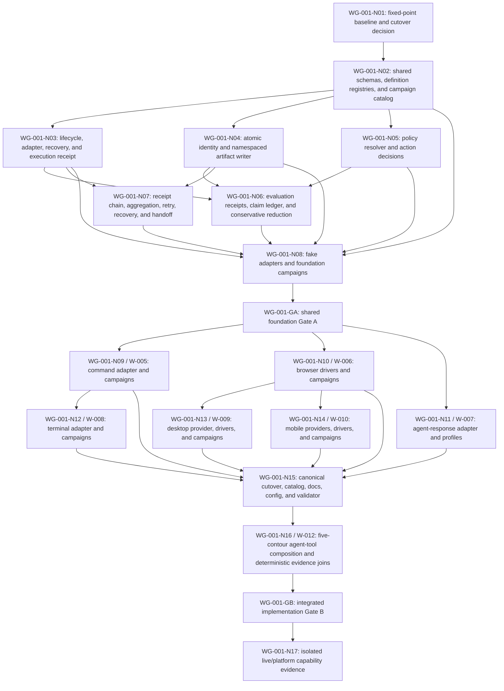

# Cross-Surface Simulation Work Graph

Date: 2026-07-27
Status: `ACTIVE`
Work Graph ID: `WG-001`
Plan Revision: `15`
Work Graph Revision: `11`
Owner: `agent-engineer` through W-004
Merge Owner: `W-004`
Scope: implementation sequencing for W-004 through W-010 plus W-012
Terminal Gate: `WG-001-GB` for deterministic implementation; `WG-001-N17` owns
capability-scoped live/platform dispositions

## Purpose And Authority

This work graph decomposes the cross-surface simulation program into bounded
work nodes, dependency gates, validation joins, and repair routes.
The program report owns architecture and shared decisions. W-004 through W-010
plus W-012 own acceptance criteria, behavior examples, and file ownership.
This graph owns only work ordering and readiness projection; it does
not duplicate those definitions.

The program previously contained only a lane-level Mermaid summary. `WG-001`
is the canonical work graph for this work and follows
`docs/work/work-graph-template.md`. Candidate-only Coordination Graph state is
not treated as current authority.

## Goal, Success, And Non-Goals

Goal:

Implement one canonical campaign system that supports command, terminal,
browser, agent-response, desktop, and mobile contours through typed drivers,
versioned claims and policies, independent oracles, self-contained immutable
run artifacts, exact identity, runtime handoff receipts, and conservative
coverage/release projection.

Success:

- Gate A freezes the shared schemas and adapter/lifecycle seams.
- Surface lanes implement against that exact Gate A identity.
- Gate B accepts the combined active-worktree implementation only after every
  required deterministic check and exact surface disposition is current.
- Authorship, implementation, deterministic validation, live execution,
  semantic judgment, platform coverage, and release eligibility remain
  separate.

Non-goals:

- automatic scheduling or dispatch, user-visible task/thread creation,
  worktree creation, merge, commit, push, deployment, or live-provider
  spending;
- importing the candidate branch wholesale;
- creating a second claim, policy, artifact, catalog, or handoff authority;
- treating fake-adapter or deterministic evidence as live Computer Use,
  model-effectiveness, desktop-platform, mobile-platform, or release proof.

## Current Preconditions

| Precondition | Current state | Required disposition |
|---|---|---|
| W-004 through W-010 plus W-012 plans | `OPEN`; authored | retain as criteria authority |
| Candidate campaign code | historical branch `agent/w003-integration-r4-g3` | do not import; WG-001-N03 uses current `master` source only |
| Current campaign source folders | deterministic framework roots implemented in the working tree | retain as current W-004 evidence; do not infer surface completion |
| Existing campaign artifacts | preserved immutable framework and candidate runs; key manifests differ from current `HEAD` | preserve as source-bound history; current-HEAD replay required |
| W-011 architecture-catalog work | `COMPLETE`; changed validator/docs/config surfaces | include its completed source state in the `WG-001-N01` fixed-point inventory before accepting |
| Current source | base `master@21ba5288b27700f94ecad92ec0cf3d1e5dca5f29`; accepted WG-001-N03 implementation diff `a964ee6a736727b13a7e25fef18fc87f13a8128b119f8863a42de2c620e71491`; N04/N05 repaired fixed point `0ccb25a3eb88d58289d47e920d5924e78390dd11b69e20b354c4ce53d069d940`; unrelated dirty work preserved | preserve current-source implementation and unrelated work; do not restore overwritten branch code |
| Next-frontier implementation | N04/N05 attempt-4 source digest `711d0ecf0881977d1fae9aa62371fe55a41c73c95f9bee15cdd681577c5c2876` plus deterministic run `wg001-n04-n05-repair-20260731-r3` | independent GF-004/GF-101 attempt-4 review failed; attempt budget exhausted and human replan decision required |
| Required runtime | exact Bun 1.3.3 available through ephemeral `npx bun@1.3.3` | use the exact declared runtime without adding repository or global dependencies |
| Work-graph mechanics | current template, workflow rules, dispatch contract, and validator | use `WG-001` and graph-scoped node/gate IDs as the only live work-graph namespace |

## Execution Surface And Dispatch Manifest

Graph readiness is eligibility, not authorization. This plan does not dispatch
itself. `internal-subagent` means a child agent inside the current task tree,
not a separate user-visible Codex task. A separate task may replace the
preferred surface only after the user explicitly asks to create, open, or fork
separate tasks or threads and the resulting task ID is recorded here.

| Nodes / Lane | Preferred Execution Surface | Dispatch State | Authorization Evidence | Runtime Handle | Eligible After | Merge Owner |
|---|---|---|---|---|---|---|
| `WG-001-N03` / W-004 | `root` | `COMPLETE` | user request `implement and fix`, 2026-07-30 | root task `019fb3c2-bd84-7282-9df0-5477a8321233` | accepted attempt 3; no further execution required | W-004 |
| `WG-001-N04` / W-004 | `root` | `BLOCKED` | attempt 4/4 exhausted at required GF-004/GF-101 review, 2026-07-31 | none | explicit human replan decision | W-004 |
| `WG-001-N05` / W-004 | `root` | `BLOCKED` | attempt 4/4 exhausted at required GF-004/GF-101 review, 2026-07-31 | none | explicit human replan decision | W-004 |
| `WG-001-N06` through `WG-001-N08` / W-004 | `root` | `AUTHORIZED` | user request to build all worklines, 2026-07-31 | none until prerequisites accept | typed prerequisites | W-004 |
| `WG-001-N09` / W-005 | `internal-subagent` | `NOT_AUTHORIZED` | none | none | `WG-001-GA ACCEPTED` plus explicit delegation authorization | W-004 |
| `WG-001-N10` / W-006 | `internal-subagent` | `NOT_AUTHORIZED` | none | none | `WG-001-GA ACCEPTED` plus explicit delegation authorization | W-004 |
| `WG-001-N11` / W-007 | `internal-subagent` | `NOT_AUTHORIZED` | none | none | `WG-001-GA ACCEPTED` plus explicit delegation authorization | W-004 |
| `WG-001-N12` / W-008 | `internal-subagent` | `NOT_AUTHORIZED` | none | none | accepted W-005 seam plus explicit delegation authorization | W-004 |
| `WG-001-N13` / W-009 | `internal-subagent` | `NOT_AUTHORIZED` | none | none | accepted W-006 seam plus explicit delegation authorization | W-004 |
| `WG-001-N14` / W-010 | `internal-subagent` | `NOT_AUTHORIZED` | none | none | accepted W-006 seam plus explicit delegation authorization | W-004 |
| `WG-001-N15` / W-004 | `root` | `NOT_AUTHORIZED` | none | none | all six exact surface dispositions | W-004 |
| `WG-001-N16` / W-012 | `internal-subagent` | `NOT_AUTHORIZED` | none | none | accepted `WG-001-N15` identity plus explicit delegation authorization | W-004 |
| `WG-001-N17` operator/evaluator runs | `internal-subagent` | `NOT_AUTHORIZED` | none | none | `WG-001-GB ACCEPTED`, runtime permission, and explicit delegation authorization | W-004 |

`max_threads` limits root-plus-subagent execution capacity. It does not create
these agents or determine how many user-visible tasks exist. At dispatch,
update only the affected row to `AUTHORIZED`, then `DISPATCHED`/`RUNNING`, and
record the agent ID or Codex task ID without changing unrelated node evidence.

## Status Reconciliation Audit

Checked: `2026-07-31`
Source identity: clean implementation base
`master@21ba5288b27700f94ecad92ec0cf3d1e5dca5f29`; accepted WG-001-N03
implementation diff
`a964ee6a736727b13a7e25fef18fc87f13a8128b119f8863a42de2c620e71491`;
N04/N05 implementation fixed point
`0ccb25a3eb88d58289d47e920d5924e78390dd11b69e20b354c4ce53d069d940`
Disposition rule: mark `COMPLETE` automatically only when current-source
implementation, dependencies, required validation, and closeout evidence all
pass.

| Lane | Current-source implementation check | Required evidence state | Reconciled disposition |
|---|---|---|---|
| W-004 | accepted WG-001-N03 plus repaired N04 artifact/platform and N05 policy/starter seams present in current source | 52 focused and 62 aggregate tests, current catalog/self-tests, validator, deterministic run `wg001-frontier-repair-20260731-r1`, and artifact verification pass; N04/N05 independent GF-004/GF-101 review `NOT_RUN`; N06 through N08 and Gate A remain open | `UPDATE`; `KEEP_OPEN` |
| W-005 | shared `direct-process` execution primitive present; command manifests, recovery fixtures, and accepted seam absent | deterministic command, recovery, and handoff gates `OPEN`/`NOT_RUN` | `UPDATE`; `KEEP_OPEN` |
| W-006 | isolated Playwright harness tooling present; browser campaign adapter/definitions absent | deterministic browser, isolation, and Computer Use gates `OPEN`/`NOT_RUN` | `UPDATE`; `KEEP_OPEN` |
| W-007 | provider-neutral agent task runtime, profiles, and tool-event composition seam absent | fake adapter and regression gates `OPEN`; live canaries `NOT_RUN` | `KEEP_OPEN` |
| W-008 | terminal PTY task, fixtures, transcripts, and cleanup runtime absent | PTY lifecycle, redaction, cleanup, and platform gates `OPEN`/`NOT_RUN` | `KEEP_OPEN` |
| W-009 | desktop provider, adapter, controlled fixture, and reset runtime absent | environment, deterministic desktop, safety, and platform gates `OPEN`/`NOT_RUN` | `KEEP_OPEN` |
| W-010 | Android/iOS provider, adapter, fixtures, and coverage runtime absent | provider and platform canaries `OPEN`/`NOT_RUN` | `KEEP_OPEN` |
| W-012 | composed profiles/manifests, five-contour fake matrix, and joined result runtime absent | definition, matrix, receipt, reduction, regression, and live gates `OPEN`/`NOT_RUN` | `KEEP_OPEN` |

Earlier `.artifacts/campaigns/` files remain immutable source-bound evidence and
do not satisfy the current-source gate. Fresh deterministic run
`wg001-n03-attempt3-20260730-r1` and the independent attempt-3 review bind and
accept WG-001-N03. Fresh run `wg001-frontier-repair-20260731-r1` validates the repaired
N04/N05 deterministic contracts but does not independently accept either node
or satisfy WG-001-N06 through WG-001-N08 or Gate A.
No lane meets the automatic-completion threshold.

## Work Topology



## Node Registry

| Node | Lane | Implementation outcome | Requires | Produces | State |
|---|---|---|---|---|---|
| `WG-001-N01` | W-004 | fixed-point current/candidate inventory, selected canonical runner base, dirty-work preservation map, W-011 overlap disposition, and direct-cutover decision | current checkout; candidate branch; W-011 fixed state or non-overlap receipt | accepted baseline and allowed-write map | `COMPLETE` |
| `WG-001-N02` | W-004 | task/campaign/claim/policy/oracle/rubric/simulation schemas, reference resolution, supported-version migration rules, contour/driver/tier rules, generated campaign catalog contract, and duplicate/stale rejection | `WG-001-N01` | versioned shared definition contract | `COMPLETE` |
| `WG-001-N03` | W-004 | bounded lifecycle, adapter interface, typed events, oracle interface, cleanup/recovery contract, unknown-outcome handling, result envelope, and operator/target-attributed execution receipt | `WG-001-N02`; Bun 1.3.3; explicit authorization | adapter and operator implementation seam | `ACCEPTED` |
| `WG-001-N04` | W-004 | atomic run/lease reservation, complete actor/role identity envelope, source manifest, append-only execution/specialized-evaluation/general-evaluation/aggregation namespaces, safe evidence freezing/content addressing, atomic finalization, and artifact verification | `WG-001-N02`; current Bun preflight | artifact and identity seam | `IN_PROGRESS` |
| `WG-001-N05` | W-004 | policy registry/resolver, applicability, allow/deny/confirmation decisions, budgets, redaction, and default-deny behavior | `WG-001-N02`; current Bun preflight | policy decision seam | `IN_PROGRESS` |
| `WG-001-N06` | W-004 | read-only simulation-evaluator contract, specialized harness-evaluator receipt input, actor/operator/evaluator identity separation, claim registry/resolver, evidence/oracle/policy linkage, split claim statuses, immutable evaluation receipt content, and non-compensating reduction | accepted `WG-001-N03`, `WG-001-N04`, `WG-001-N05` | evaluation receipt, claim ledger, and campaign reduction seam | `BLOCKED_ON_WG-001-N04/N05` |
| `WG-001-N07` | W-004 | identity-matched append-only execution/specialized/general/aggregation receipt chain; self-evaluation rejection; accepted/rejected/pending/stale/not-applicable handoff receipts; retry parentage; cancellation/crash cleanup recovery; unknown-outcome binding; and invalidation rules | accepted `WG-001-N03`, `WG-001-N04`, `WG-001-N06` | receipt chain, aggregation projection, runtime handoff, recovery, and retry seam | `BLOCKED_ON_WG-001-N04/N06` |
| `WG-001-N08` | W-004 | fake adapters, fake operator/evaluator receipts, `simulation-contract-smoke`, and `cross-contour-handoff-smoke`, including reservation race, recovery, unsafe-evidence, schema-version, role-separation, receipt-mismatch, and missing-specialized-receipt failure injection | accepted `WG-001-N02` through `WG-001-N07` | Gate A evidence set | `BLOCKED_ON_WG-001-N04..N07` |
| `WG-001-GA` | W-004 | shared foundation accepted for surface implementation | `WG-001-N08` and every required W-004 validation current | Gate A schema/interface digest and handoff packet | `OPEN` |
| `WG-001-N09` | W-005 | safe direct-process command adapter, scoped claims/policies/oracles, static smoke, failure/recovery campaign, and command-to-terminal handoff | `WG-001-GA` | W-005 accepted adapter/result seam | `BLOCKED_ON_WG-001-GA` |
| `WG-001-N10` | W-006 | Playwright and Computer Use browser drivers, isolated profile, scoped navigation/action policy, frozen visual evidence, and named browser campaigns | `WG-001-GA` | W-006 accepted visual action seam | `BLOCKED_ON_WG-001-GA` |
| `WG-001-N11` | W-007 | provider-neutral agent result, Codex adapter, standalone and Cascade profiles, claim analysis, deterministic hard gates, judges, and route receipts | `WG-001-GA`; fixed current harness catalog | W-007 accepted agent seam | `BLOCKED_ON_WG-001-GA` |
| `WG-001-N12` | W-008 | PTY/TUI terminal adapter, typed steps, raw/redacted transcript, screen oracle, cleanup, and optional Computer Use terminal driver | `WG-001-N09` accepted process-result seam | W-008 accepted terminal seam | `BLOCKED_ON_WG-001-N09` |
| `WG-001-N13` | W-009 | isolated desktop provider, Linux fixture, deterministic and Computer Use drivers, platform-scoped identity/policy/oracle evidence, and reset | `WG-001-N10` accepted visual action seam | W-009 accepted desktop/environment seam | `BLOCKED_ON_WG-001-N10` |
| `WG-001-N14` | W-010 | Android provider/canary, iOS Simulator provider/gate, exclusive environment leases, deterministic and Computer Use drivers, lifecycle, permissions, and scoped coverage | `WG-001-GA`; `WG-001-N10` accepted visual-action seam | W-010 accepted mobile seam | `BLOCKED_ON_WG-001-GA/N10` |
| `WG-001-N15` | W-004 merge owner | direct canonical source cutover, generated catalog, explicit selection, release projection, docs/config/validator wiring, and stale-path removal | `WG-001-N09` through `WG-001-N14` exact dispositions | one combined active-worktree implementation | `BLOCKED_ON_SURFACES` |
| `WG-001-N16` | W-012 implementation; W-004 merge owner | `agent-tool-composition-smoke` across fake command, browser, terminal, desktop, and mobile seams; composed profiles/manifests; artifact immutability; independently attributable agent/tool/policy/result joins; claim/handoff joins; harness regression; reviews; and failure attribution | `WG-001-N15`; accepted W-005 through W-010 surface seams and W-007 agent seam | Gate B evidence set | `BLOCKED_ON_WG-001-N15` |
| `WG-001-GB` | W-004 | integrated implementation accepted for exact combined source state | `WG-001-N16`; every required current check passes | implementation-complete receipt | `OPEN` |
| `WG-001-N17` | W-012 and W-006 through W-010 with W-004 aggregation | isolated browser/desktop/terminal/mobile Computer Use; standalone/Cascade agent; five composed agent-tool canaries for command, browser, terminal, desktop, and mobile; Android; and iOS live/platform evidence | `WG-001-GB`; per-campaign runtime, permission, environment, fixture, budget, cleanup, and cost gates | exact capability/coverage ledger; no umbrella pass | `BLOCKED_ON_WG-001-GB` |

## Gate Contracts

### WG-001-GA — Shared Foundation Gate A

Required inputs:

- accepted baseline/cutover decision from `WG-001-N01`;
- schema/reference/catalog checks from `WG-001-N02`;
- lifecycle/adapter/oracle/result, cancellation, recovery, and unknown-outcome
  contract tests from `WG-001-N03`;
- atomic reservation, retry, overwrite, safe content-freezing, namespaced
  receipt storage, finalization, digest, and source-manifest tests from `WG-001-N04`;
- allow, deny, confirmation, stale-policy, budget, and redaction tests from
  `WG-001-N05`;
- unresolved, conflicting, partial, non-compensating, and release-scope claim
  tests from `WG-001-N06`;
- accepted, rejected, pending, stale, retry, cleanup/recovery, aggregation,
  unknown-outcome, and invalidation receipt tests from `WG-001-N07`;
- operator/evaluator identity separation, matching execution/evaluation
  receipts, and required specialized harness-evaluator receipt tests;
- both W-004 fake-adapter campaigns passing from `WG-001-N08`.

Acceptance:

Every required input is current and passes against one shared contract digest.
No surface implementation may amend the contract independently after Gate A.
A required amendment reopens Gate A and every affected surface node.

### WG-001-GB — Integrated Implementation Gate B

Required inputs:

- exact surface dispositions for `WG-001-N09` through `WG-001-N14`;
- one canonical current-source cutover with no legacy fallback;
- current generated catalog and zero unresolved claim/policy/oracle references;
- combined active-worktree source/diff identity;
- required deterministic campaign and failure-injection results;
- passing `agent-tool-composition-smoke` with independently attributable agent
  and command, browser, terminal, desktop, and mobile results plus conservative
  composed-claim reduction;
- self-contained artifact verification and cleanup results;
- current harness catalog/self-test and agent-response regression evidence;
- Standards/Spec review plus repository validation against the same combined
  source state.

Acceptance:

Every required implementation and deterministic evidence input passes or has
an explicitly non-required platform/live disposition allowed by its lane. Gate
B proves integrated implementation only. It does not prove live Computer Use,
model effectiveness, unavailable platforms, real devices, or release
eligibility.

## Execution Waves And Parallel Safety

| Wave | Nodes | Parallel rule | Exit condition |
|---|---|---|---|
| 0 | `WG-001-N01` | serialized; shared dirty-work and W-011 reconciliation | fixed baseline, allowed writes, candidate cutover decision |
| 1 | `WG-001-N02` through `WG-001-N08` | W-004-owned; internal sectioning allowed, but one merge owner controls shared schemas and reducer/artifact contracts | `WG-001-GA ACCEPTED` |
| 2 | `WG-001-N09`, `WG-001-N10`, `WG-001-N11` | parallel only with disjoint adapter/fixture paths; shared changes return to W-004 | three exact surface dispositions |
| 3 | `WG-001-N12`, `WG-001-N13`, `WG-001-N14` | may run in parallel after their distinct producer seams accept; mobile and desktop providers do not depend on each other's implementation | terminal, desktop, and mobile dispositions |
| 4 | integration readiness check | W-004 verifies all six accepted surface/agent seams and their exact digests before cutover | exact `WG-001-N09` through `WG-001-N14` dispositions |
| 5 | `WG-001-N15`, then `WG-001-N16` | W-004 serializes canonical cutover; W-012 adds composition only after the integrated source and all accepted tool seams are fixed; W-004 remains merge owner | `WG-001-GB ACCEPTED` or exact blocker |
| 6 | `WG-001-N17` | campaigns are independent by runtime/platform; never substitute one result for another, including standalone-agent, direct-surface, and each named composed agent-tool canary | exact capability ledger with `PASS`, `FAIL`, `BLOCKED`, or `NOT_RUN` per campaign |

W-011 remains separate from this graph. Its completed validator, config,
pattern, and documentation changes are a Wave 0 overlap input, not a simulation
workline. `WG-001-N01` must inventory that completed source state before selecting
the campaign integration base.

## Planned Write Ownership

| Area | Owner node/lane | Consumers | Conflict rule |
|---|---|---|---|
| shared schemas, claim/policy/oracle/rubric registries, catalog schema/generator | `WG-001-N02` / W-004 | every surface | surface lanes read only; changes reopen Gate A |
| lifecycle, adapter, oracle, result events | `WG-001-N03` / W-004 | `WG-001-N09` through `WG-001-N14` | one merge owner |
| simulation operator/evaluator role and skill contracts | `WG-001-N03`, `WG-001-N06` / W-004 | every campaign and report | execution is mutable and evaluation is read-only; no self-evaluation |
| atomic reservation/lease manager, namespaced artifact writer, identity envelope, and finalizer | `WG-001-N04` / W-004 | every runner/adapter/report | no surface-local identity allocator or artifact writer |
| policy engine | `WG-001-N05` / W-004 | every adapter | surfaces contribute typed action vocabulary through W-004 |
| claim reducer | `WG-001-N06` / W-004 | campaigns, coverage, release projection | no semantic or surface override |
| execution/specialized/general/aggregation joins and handoff/retry/recovery/cleanup receipts | `WG-001-N07` / W-004 | all tasks and downstream gates | identity or receipt schema changes reopen affected evidence |
| command adapter/fixtures/manifests | `WG-001-N09` / W-005 | W-008; W-004 integration | must not edit shared contracts |
| browser adapter/fixtures/manifests | `WG-001-N10` / W-006 | W-009; W-004 integration | publishes accepted visual seam |
| agent adapter/profiles/fixtures/manifests | `WG-001-N11` / W-007 | harness and W-004 integration | preserves current harness authority |
| composed agent-tool profiles, manifests, five-contour fake matrix, tool-event linkage, and joined result fixtures | `WG-001-N16` / W-012 | W-005 through W-010 surface seams, W-007 agent seam, W-004 Gate B aggregation | no hybrid task kind, surface adapter, reducer, or artifact writer; surface lanes retain their own task results and policies |
| terminal adapter/fixtures/manifests | `WG-001-N12` / W-008 | W-004 integration | consumes command seam |
| desktop provider/fixtures/manifests | `WG-001-N13` / W-009 | W-004 integration and desktop composition | publishes an independent desktop environment seam |
| mobile providers/fixtures/manifests | `WG-001-N14` / W-010 | W-004 integration | no responsive-web substitution |
| canonical docs/config/validator/cutover | `WG-001-N15` / W-004 | repository | serialize with W-011 and existing dirty owners |

## Invalidation And Partial Repair

| Changed input or failure | Reopen | Preserve |
|---|---|---|
| shared schema, lifecycle, identity, policy, claim, execution/evaluation receipt, role-separation, or handoff contract after Gate A | `WG-001-GA`; every surface that consumes the changed contract; `WG-001-N15`, `WG-001-N16`, `WG-001-GB` | unaffected historical evidence only |
| command process-result seam | `WG-001-N09`, `WG-001-N12`, integration gates | browser, agent, desktop, mobile work whose inputs are unchanged |
| browser visual action seam | `WG-001-N10`, `WG-001-N13`, `WG-001-N14`, integration gates | command, terminal, agent work whose inputs are unchanged |
| desktop environment seam | `WG-001-N13`, integration gates, and affected desktop composition evidence | command, terminal, browser, mobile, and agent work whose inputs are unchanged |
| mobile environment seam | `WG-001-N14`, integration gates, and affected mobile composition evidence | command, terminal, browser, desktop, and agent work whose inputs are unchanged |
| harness scenario/catalog/source digest | affected `WG-001-N11` Cascade profile and integration evidence | standalone-agent and other surfaces if their inputs are unchanged |
| accepted command, browser, terminal, desktop, or mobile tool seam | its owning surface node, `WG-001-N16`, integration gates, and the matching composed `WG-001-N17` evidence | direct evidence and other compositions whose exact inputs are unchanged |
| agent tool-event or result-linkage seam | `WG-001-N11`, `WG-001-N16`, integration gates, and every affected composed `WG-001-N17` entry | direct surface and standalone-agent evidence whose exact inputs are unchanged |
| reservation, lease, artifact writer, receipt namespace, finalization, or evidence-copy behavior | every result produced with the changed mechanism; `WG-001-N16`, `WG-001-GB`, affected `WG-001-N17` entries | source definitions and accepted adapter code when unchanged |
| policy or claim definition | only referencing tasks/campaigns plus aggregation gates | unrelated contour evidence |
| W-011 or unrelated dirty-source overlap | `WG-001-N01`, affected shared node, integration gates | disjoint accepted surface results after identity is revalidated |
| one live/platform canary failure | that exact `WG-001-N17` campaign and its coverage/release claim | every independent campaign result |

## Validation Plan

Current structural and harness checks:

```bash
bun scripts/cascade.ts validate
bun scripts/cascade.ts eval catalog --check
bun scripts/cascade.ts eval self-test
bun scripts/cascade.ts target self-test
bun scripts/cascade.ts campaign catalog --check
bun scripts/cascade.ts campaign self-test
bun test scripts/cascade
git diff --check
```

Current and remaining implementation checks:

```bash
bun scripts/cascade.ts campaign catalog --check
bun scripts/cascade.ts campaign self-test
bun scripts/cascade.ts campaign run simulation-contract-smoke
bun scripts/cascade.ts campaign run cross-contour-handoff-smoke
bun scripts/cascade.ts campaign run agent-tool-composition-smoke
```

Surface campaign commands are added only with their owning node and must write
new immutable run IDs. Live/provider/platform commands remain `NOT_RUN` until
their explicit readiness and cost gates pass.

## Current Frontier

- Complete: `WG-001-N01`, `WG-001-N02`, and accepted `WG-001-N03`.
- Review: implemented `WG-001-N04` and `WG-001-N05`; deterministic validation
  passes, while independent GF-004/GF-101 review remains `NOT_RUN`.
- Blocked: `WG-001-N09` through `WG-001-N17` pending the required predecessor gates.
- Current implementation evidence: exact Bun 1.3.3 checks, 62 aggregate tests,
  deterministic run `wg001-frontier-repair-20260731-r1`, valid 72-file terminal
  manifest, and fixed-point digest
  `0ccb25a3eb88d58289d47e920d5924e78390dd11b69e20b354c4ce53d069d940`.
- Current live Computer Use/model/platform evidence: `NOT_RUN`.
- Dispatch authorization and runtime handles: both implementation attempts
  completed in root task `019fb3c2-bd84-7282-9df0-5477a8321233`.
- Next action: run independent GF-004/GF-101 review for N04 and N05 against the
  fixed-point digest; repair blockers or accept unchanged results.
- Commit, push, publication, or provider spending: not authorized by this
  graph.

## Lifecycle And Closeout

- Current lifecycle status: `ACTIVE`; WG-001-N03 is `ACCEPTED`, and implemented
  WG-001-N04/N05 are in `REVIEW`.
- Use `BLOCKED` when the current frontier lacks a required dependency,
  authority, runtime, permission, or evidence input.
- Deterministic implementation is complete only when `WG-001-GB` accepts the exact
  combined source identity.
- Live/platform capability remains a separate `WG-001-N17` ledger. It does not
  weaken or inflate the deterministic implementation result.
- After its required scope is `COMPLETE` or a named replacement makes it
  `SUPERSEDED`, retain this durable report and all receipts, then remove the
  terminal graph projection from the active registry.

## Planning Artifact Validation

| Check | Result | Evidence boundary |
|---|---|---|
| Work-graph identity and node registry | `PASS` | `WG-001` plus 19 unique graph-scoped node/gate IDs: `WG-001-N01` through `WG-001-N17`, `WG-001-GA`, and `WG-001-GB` |
| Cross-document wiring | `PASS` | program report, W-004 lane, active registry, and report index reference `WG-001` |
| Lane ownership | `PASS` | nodes reference W-004 through W-010 plus W-012 and preserve W-011 as an external overlap precondition; no additional workline is required for the integrity corrections |
| Harness catalog | `PASS` | 44 skills, 368 scenarios, digest `d6030bf0ea98a6bd26b431de50ac1b7ca909a19a289192d005403c514507897d` |
| Harness self-test | `PASS` | 20 cases |
| Bun tests and diff whitespace | `PASS` | exact Bun 1.3.3; 52 focused and 62 aggregate tests; `git diff --check` |
| Target self-test | `PASS` | 26 cases |
| Aggregate Cascade validator | `PASS` | current uncommitted source fixed point |
| Campaign/runtime implementation | `PARTIAL` | current seven-entry catalog digest `9fee3f183d458f56ff7f5d59eee7fbea9d45531b2a9cb2533d1a18bde8fce6ba`; N04/N05 deterministic run and manifest verification pass; independent review, N06 through N08, Gate A, and release eligibility remain open |
| Live Computer Use/model/platform execution | `NOT_RUN` | owned by `WG-001-N17` after `WG-001-GB` |

## Revision 9 Reconciliation And Resume Contract

- Revision delta: plan revision 8 -> 9. Topology, node IDs, owners, edges, Gate
  A, Gate B, and workline boundaries are preserved.
- Updated projections: current source/catalog identities, dispatch/runtime
  state, evidence freshness, validation commands, lane dispositions, and
  Current Frontier.
- Canonical survivors: W-004 through W-010 and W-012. W-004, W-005, and W-006
  are `UPDATE`; W-007 through W-010 and W-012 are `KEEP`. No merge,
  supersession, retirement, or deletion applies.
- Invalidated for current acceptance: prior W-004 Bun test, campaign,
  evaluator, validator, and 41-skill/319-scenario harness receipts.
- Preserved: implementation files, immutable run artifacts, completed
  architecture work, accepted WG-001-N01/WG-001-N02 planning knowledge, and all
  unrelated historical evidence.
- Coordination Graph action: `NO_CHANGE`. The next slice is lane-local W-004
  work; no worktree dispatch, materialization queue, batch join, or first-class
  Coordination Graph cutover is authorized. Reassess before Gate A opens the
  cross-workline surface wave.
- Graph action at that revision: `UPDATE`; revision-9 status and resume
  bindings remained authoritative until the revision-10 amendment below.

## Revision 10 WG-001-N03 Execution Amendment

- Revision delta: plan revision 9 -> 10. Node topology, dependencies, actors,
  ownership, Gate A, Gate B, and Coordination Graph disposition are unchanged.
- Current-source constraint: WG-001-N03 was implemented only from
  `master@21ba5288`; no candidate-branch commit, archived patch, overwritten
  source, or historical run artifact was imported.
- Scope amendment: `evals/campaigns/catalog.generated.json` is an actual
  generated output because campaign catalog entries bind
  `scripts/cascade/campaigns.ts`; its delta is limited to seven source digests
  plus the aggregate digest.
- Receipt: `WG001-N03-EXEC-20260730-A1`, attempt 1 of 2, proposes
  `PENDING -> IN_PROGRESS -> REVIEW`.
- Preserved: accepted WG-001-N01/WG-001-N02 knowledge, all other lane boundaries and
  states, unrelated implementation, and historical evidence.
- Invalidated: the prior catalog digest and any WG-001-N03 evidence not bound to
  implementation diff
  `028ffc47f743d95a3246ef574402c5f3e90f7ca86946d4d88261f764f6efb6d1`.
- Next gate: independent architecture/contract review followed by integrated
  validation; self-review cannot accept the GF-004 contract gate.

## Work Graph Revision 11 Namespace Cutover

- At cutover, plan revision remained 10; no outcome, workline boundary, dependency, actor,
  gate meaning, evidence requirement, or current node state changed.
- The graph, node, and gate namespace now follows the canonical graph-scoped
  ID shapes across every live planning/work reference.
- The current deterministic runtime run ID remains unchanged because it is an
  immutable evidence identity rather than a work-graph identifier.
- Validator checks now own work-graph filename, terminology, ID shape,
  uniqueness, graph scoping, and reference resolution.

## Plan Revision 11 WG-001-N03 Repair And Acceptance

- Plan delta: attempt 1 failed independent review because lifecycle phases could
  wait forever; attempt 2 closed that defect but failed review because parent
  cancellation during cleanup could still produce `PASS`. The declared
  two-attempt maximum was exhausted, so `plan-change` extended only
  WG-001-N03's maximum to attempt 3. Topology, dependencies, actor, owner,
  gates, workline boundaries, GF-004 v1, and Work Graph Revision 11 were
  preserved.
- Attempt-1 review evidence:
  `IG03-REVIEW-STANDARDS-20260730-A1` and
  `IG03-REVIEW-SPEC-20260730-A1`, required `FAIL`.
- Attempt-2 review evidence:
  `WG001-N03-REVIEW-STANDARDS-20260730-A2` and
  `WG001-N03-REVIEW-SPEC-20260730-A2`, required `FAIL`.
- Attempt-3 execution receipt: `WG001-N03-EXEC-20260730-A3`, base
  `master@21ba5288b27700f94ecad92ec0cf3d1e5dca5f29`, implementation digest
  `a964ee6a736727b13a7e25fef18fc87f13a8128b119f8863a42de2c620e71491`,
  catalog digest
  `5228269b97beac38bb77fb0e254bc1b2a1244404b0f69ea8685bca6c23f250a8`,
  and deterministic run `wg001-n03-attempt3-20260730-r1`.
- Attempt-3 independent evidence:
  `WG001-N03-REVIEW-STANDARDS-20260730-A3`,
  `WG001-N03-REVIEW-SPEC-20260730-A3`, and
  `WG001-N03-GF004-CONTRACT-20260730-A3`, all required `PASS`.
- Integrated validation evidence: `WG001-N03-VALIDATE-20260730-A3`; 31
  targeted and 44 aggregate Bun tests, catalog/self-tests, target self-test,
  Cascade validator, deterministic campaign, JSON, and diff checks pass.
- Transition owner: W-004 lane-state owner records attempt 3
  `REVIEW -> ACCEPTED`. Any change to the base, implementation digest,
  lifecycle contract, catalog source digest, GF-004 version, plan/work-graph
  revision, or producer/consumer binding reopens WG-001-N03.
- Recomputed frontier: WG-001-N04 and WG-001-N05 are dependency-ready but
  remain `PENDING`/`NOT_AUTHORIZED`; no automatic dispatch occurred.

## Plan Revision 12 Next-Frontier Preparation

- Preparation authority: user request to run preparation for the next
  frontier, 2026-07-30. This is planning-only authority.
- Prepared packet:
  `docs/work/reports/2026-07-30-wg001-next-frontier-preparation.md`.
- WG-001-N04 preparation receipt: `WG001-N04-PREP-20260730-R12`.
- WG-001-N05 preparation receipt: `WG001-N05-PREP-20260730-R12`.
- Preserved: node IDs, outcomes, dependencies, actor, state owner, merge
  owner, gates, accepted WG-001-N03 evidence, GF-004 v1, and Work Graph
  Revision 11.
- WG-001-N03 carry-forward: revision 12 changes no N03 source, lifecycle
  contract, catalog input, GF-004 binding, or producer/consumer contract, so
  its accepted attempt-3 evidence remains current. The revision-11
  invalidation wording is refined: a later plan revision reopens N03 only when
  one of its named inputs or contracts changes; a numeric planning revision
  alone does not invalidate accepted evidence.
- Added planning knowledge: current-source fingerprints, architecture and
  security findings, GF-101 v1 overlay, exact write allowlists, protected
  paths, public test seams, behavior/failure fixtures, attempt bounds, repair
  routes, and independent review gates for N04 and N05.
- Scheduling decision: implement N04 first and serialize N05 behind its
  acceptance because the nodes share integration files. This is a write-safety
  order, not a new semantic edge; graph topology remains unchanged.
- Preparation-time state: both nodes were `PENDING` and
  `IMPLEMENTATION_READY`; both dispatch rows were `NOT_AUTHORIZED`, with no
  runtime handle.
- Preparation validation:
  `WG001-FRONTIER-PREP-VALIDATE-20260730-R12`; 31 targeted and 44 aggregate
  tests, campaign and harness catalog/self-tests, target self-test, Cascade
  validator, JSON, and diff checks pass against the unchanged accepted
  implementation digest.
- Preparation-time `NOT_RUN`: all N04/N05 implementation, new focused tests,
  acceptance runs, independent implementation reviews, later graph nodes,
  Gate A, and live or platform evidence.

## Revision 12 Frontier Implementation Authorization

- Authorization evidence: user request `implement what is left`, 2026-07-30.
- Scope interpretation: implement prepared WG-001-N04 and WG-001-N05 only;
  N06 through N08, Gate A, surface lanes, and live/platform work are excluded.
- N04 transition: `PENDING -> IN_PROGRESS`, attempt 1 of 2, root task
  `019fb3c2-bd84-7282-9df0-5477a8321233`.
- N05 dispatch: `AUTHORIZED` but serialized; it remains `PENDING` with no
  runtime handle until N04 review and refreshed shared-file fingerprints.
- Bound inputs: `master@21ba5288b27700f94ecad92ec0cf3d1e5dca5f29`,
  accepted N03 implementation digest
  `a964ee6a736727b13a7e25fef18fc87f13a8128b119f8863a42de2c620e71491`,
  preparation receipts `WG001-N04-PREP-20260730-R12` and
  `WG001-N05-PREP-20260730-R12`, exact Bun 1.3.3, and the recorded source
  fingerprints.
- No graph topology, dependency, actor, owner, or gate changed; Work Graph
  Revision remains 11.

## Revision 12 N04/N05 Implementation

- Implementation report:
  `docs/work/reports/2026-07-30-wg001-n04-n05-implementation.md`.
- Receipts: `WG001-N04-EXEC-20260730-A1` and
  `WG001-N05-EXEC-20260730-A1`.
- Serialized handoff: N04 implementation and focused tests passed; shared-file
  fingerprints were refreshed; N05 then implemented in the same root task.
- State transitions: N04 `IN_PROGRESS -> REVIEW`; N05
  `PENDING -> IN_PROGRESS -> REVIEW`.
- Current fixed-point digest:
  `3d58dc883166880fc0c3499216a980c2af63cd5570153a6a3b3228f5df999598`.
- Deterministic evidence: 48 focused tests, 61 aggregate tests, all catalog
  and self-test gates, the Cascade validator, campaign run
  `wg001-frontier-20260730-r2`, and its valid 72-file terminal manifest.
- Independent GF-004/GF-101 review: `NOT_RUN`; neither node is `ACCEPTED`.
- N06 through N08, Gate A, surface lanes, live/platform work, commit, push, and
  deployment remain unopened or unauthorized.

## Plan Revision 13 N04/N05 Scenario-Building Repair

- Authorization evidence: user request `implement the gaps fixes`, 2026-07-31.
- Review findings routed to repair: generated starter policy/campaign mismatch,
  missing pre-provision zero-applicable-policy rejection, missing platform
  identity in frozen/source/execution evidence, and N04/N05 controls absent
  from the generated scenario-design prompts.
- Scope: repair WG-001-N04 and WG-001-N05 only. N06 through N08, Gate A,
  surface implementation, case-by-case trajectory expansion, and the
  SIM-020-through-SIM-024 campaign portfolio remain excluded.
- State route: both nodes `REVIEW -> PENDING -> READY -> IN_PROGRESS -> REVIEW`,
  attempt 2 of 2. No node is self-accepted.
- Receipts: `WG001-N04-REPAIR-EXEC-20260731-A2`,
  `WG001-N05-REPAIR-EXEC-20260731-A2`,
  `WG001-N04-N05-REPAIR-VALIDATE-20260731-A2`, and local findings-only review
  `WG001-N04-N05-REPAIR-REVIEW-20260731-A2`.
- Plan revision changes because the repair expands the allowed scenario
  initializer/skill/template writes. Node topology, dependencies, actors,
  ownership, acceptance gates, and Work Graph Revision 11 remain unchanged.
- Current fixed-point digest:
  `0ccb25a3eb88d58289d47e920d5924e78390dd11b69e20b354c4ce53d069d940`.
- Current campaign catalog digest:
  `9fee3f183d458f56ff7f5d59eee7fbea9d45531b2a9cb2533d1a18bde8fce6ba`.
- Evidence: 52 focused and 62 aggregate tests pass; initializer dry-run renders
  19 collision-free paths; catalog, campaign, harness, target, validator, JSON,
  and diff gates pass. Run `wg001-frontier-repair-20260731-r1` passes on
  `darwin-local`, records parent `wg001-frontier-20260730-r2`, remains
  `release_eligible=false`, and verifies a 72-file terminal manifest with
  digest
  `2c74f0b81c009cdee51743e873dc802a5bfa72e5ba55814955c025b891fd3960`.
- Local Standards and Spec review: `PASS` for the bounded repair, but it is not
  the independent GF-004/GF-101 acceptance authority.
- Remaining gate: independent GF-004/GF-101 review is `NOT_RUN`; both nodes
  remain `REVIEW`, N06 stays blocked, and Gate A remains open.

## Plan Revision 14 N04/N05 Independent-Review Repair

- Authorization evidence: user request to build the full implementation for all
  worklines and explicit authorization for the independent architecture and
  security reviewers, 2026-07-31.
- Required failed review receipts:
  `WG001-N04-GF004-REVIEW-20260731-A2`,
  `WG001-N05-GF004-REVIEW-20260731-A2`,
  `WG001-N04-GF101-REVIEW-20260731-A2`, and
  `WG001-N05-GF101-REVIEW-20260731-A2`. All bind source-set digest
  `34c4b495ab5e01d7c312e8e90e649295ea99ced22bac03e0f04a9f42f2dda065`
  and prevent acceptance.
- Attempt-exhaustion route: record attempt 2 `REVIEW -> BLOCKED`, extend only
  N04/N05 to a maximum of four attempts, then route attempt 3
  `BLOCKED -> PENDING -> READY -> IN_PROGRESS`. Work Graph Revision 11,
  topology, dependencies, owners, gates, and accepted N03 evidence are
  unchanged.
- N04 repair scope: remove same-run retry authority; fence every mutation by
  the reserved operator lease and expiry; restrict unknown-outcome finalization
  to the declared recovery identity; require status-appropriate terminal
  artifacts; reject symlinked artifact trees and unsafe path ancestors; bound
  evidence reads; and route execution, calibration, evaluation, aggregation,
  and task artifact writes through the artifact authority with an atomic
  terminal lock.
- N05 repair scope: validate confirmation schema and receipt identity; require
  a cryptographically verifiable configured confirmation authority; record
  campaign-wide consumed/remaining action and output budgets; share exact
  applicability rules between definition preflight and runtime; redact both
  advertised profiles; and bound process output while it is read.
- Allowed writes are limited to the existing N04/N05 modules and tests,
  `scripts/cascade/common.ts` and its tests for bounded process output,
  `scripts/cascade/evaluations.ts` and its tests for artifact-authority
  integration, the two public N04/N05 schemas and current policy definition,
  `scripts/cascade/simulation-definitions.ts` and its tests, the campaign
  orchestrator/tests, and generated campaign catalog when source digests
  change. Surface adapters, N06 through N08 behavior, historical artifacts,
  and unrelated dirty paths remain protected.
- Acceptance requires fresh focused and aggregate tests, deterministic
  campaign and artifact verification, independent GF-004/GF-101 re-review
  bound to the new source-set digest, and W-004 reconciliation. Self-review
  cannot accept either node.

## Plan Revision 15 N04/N05 Final Review Repair

- Required failed attempt-3 receipts:
  `WG001-N04-N05-GF004-REVIEW-20260731-A3` and
  `WG001-N04-N05-GF101-REVIEW-20260731-A3`. Both bind the expanded 25-path
  source-set digest
  `83094f89e10695a051fdc3c93095e2e945b8bc0304bc45fea86ed0e7f706aec0`
  and reject acceptance.
- Attempt route: N04/N05 `REVIEW -> PENDING -> READY -> IN_PROGRESS`, attempt
  4 of 4. N06 through N08 remain dependency-blocked; Gate A remains open.
- N04 repair scope: serialize every governed mutation and finalization through
  one cross-process lock; validate status-specific receipt identities and
  digest links before terminalization; require lifecycle plus recovery and
  cleanup disposition for `UNKNOWN_OUTCOME`; reject unsafe source and artifact
  symlink ancestors; and add deterministic race, placeholder, recovery, and
  containment tests.
- N05 repair scope: make runtime validation match the public policy schema;
  keep confirmation signing keys outside adapter contexts and child-process
  environments; redact configured authority values in output; scan structured
  artifacts before persistence; reject duplicate receipts; and regenerate the
  campaign catalog.
- Allowed writes remain the Plan Revision 14 N04/N05 implementation, schema,
  test, generated-catalog, and execution-state paths. No N06 behavior, surface
  adapter, live runtime, provider, deployment, or historical artifact is in
  scope.
- Acceptance requires the full deterministic matrix, a fresh immutable
  campaign run and verification, and new independent GF-004 and GF-101
  receipts bound to the attempt-4 digest. Work Graph Revision 11 and accepted
  N03 evidence remain unchanged.

## Attempt 4 Review Failure And Exhaustion

- Required receipts `WG001-N04-N05-GF004-REVIEW-20260731-A4` and
  `WG001-N04-N05-GF101-REVIEW-20260731-A4` are `FAIL` against source digest
  `711d0ecf0881977d1fae9aa62371fe55a41c73c95f9bee15cdd681577c5c2876`.
- Passing evidence retained: 74 aggregate tests; fresh campaign catalog digest
  `25bc8484ea084b0ddc962d0d28b21fefd2be19dbf1b489cd4f9171cf11feae84`;
  run `wg001-n04-n05-repair-20260731-r3`; valid 73-file manifest digest
  `c06489a4f3c433f722331dab9e13de6c407a2c4d737156a27bc09c7540aa7c01`.
- Blocking findings: ownership-unsafe stale-lock reclamation; incomplete
  terminal receipt schemas and producer-identity checks; unbounded lifecycle
  and structured JSON I/O; and confirmation-secret exposure to pre-task child
  processes.
- N04/N05 move `REVIEW -> BLOCKED`. Attempt 4 of 4 is exhausted. N06 through
  N08 remain dependency-blocked and no implicit attempt 5 is authorized.
- Next authority required: an explicit human decision to open a new plan
  revision and repair attempt with the same Work Graph topology.
