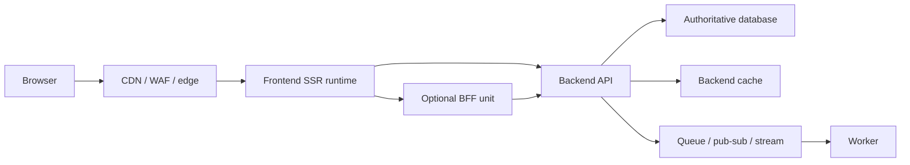
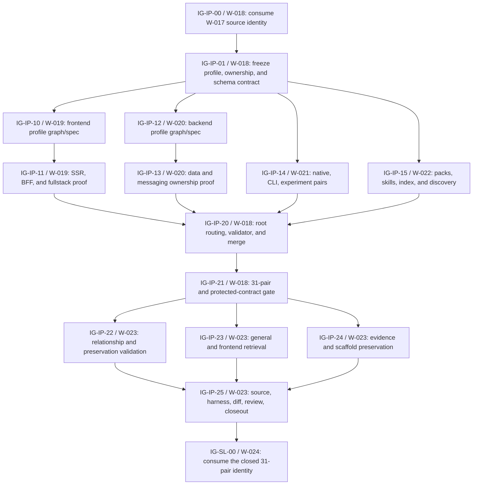

# Contour Infrastructure Profiles Implementation Graph

Status: `COMPLETE`
Created: 2026-07-28
Actualized: 2026-07-28
Revision: `4`
Scope: `EPIC`
Implementation evidence: `PASS`
Planning evidence: `CURRENT`
Coordinator: `orchestrator`
Merge owner: `W-018`
Validation owner: `W-023`

## Outcome

Extend the post-migration architecture-default tree with application-contour
infrastructure profiles while retaining one resource-selection authority:

```text
stack-selection
├─ app-stack
│  ├─ backend-stack
│  ├─ frontend-stack
│  ├─ native-stack
│  ├─ cli-stack
│  └─ experiment-stack
└─ infrastructure
   ├─ application profiles
   │  ├─ backend-infrastructure
   │  ├─ frontend-infrastructure
   │  ├─ native-infrastructure
   │  ├─ cli-infrastructure
   │  └─ experiment-infrastructure
   └─ resource extensions
      ├─ infrastructure-compute
      ├─ infrastructure-data
      ├─ infrastructure-messaging
      └─ infrastructure-delivery
```

Application profiles own contour-specific resource needs, coupling rules,
defaults, exceptions, and proof. Resource extensions remain the only owners of
compute, database/cache, queue/pub-sub/stream, network/edge, delivery, secrets,
observability, and infrastructure-provider selection.

## Sequencing Guardrail

W-017 has closed the stack-naming migration. Its completed 26-pair source
identity is
`e36113eba7d80c12ef1441569b69e8bd43e6cc5e909913a2da4f56993873398b`.
W-013-W-017 made a direct identity migration with no semantic additions and
preserved the evidence and scaffold contracts.

IG-IP-00 reproduced the W-017 baseline before section dispatch. W-018 then
merged W-019-W-022 and W-023 independently validated the exact 78-file source
identity
`sha256:597720223d136685fba2ca04c25f8de56e58d6af3f3a6b6cb340794c5fc1b6aa`.

## Intended Behavior

- Route each application unit to one contour infrastructure profile from its
  existing `app_type`.
- Route every operated resource independently to one of the four existing
  resource extensions.
- Allow resources to serve several application units only when owner,
  consumers, isolation, capacity, failure domain, recovery, lifecycle, and
  teardown are explicit.
- Keep browser and device code away from database, cache-service, broker, and
  infrastructure credentials.
- Treat fullstack as composition of frontend, optional BFF, backend service,
  and worker application units rather than a seventh application type.
- Keep source scaffolds and infrastructure/IaC generation out of this slice.

## Profile Responsibilities

| Profile | Owns | Routes to |
|---|---|---|
| `backend-infrastructure` | API, BFF, worker, consumer, scheduler, and batch resource roles; database/cache/messaging ownership; cross-resource failure rules | compute, data, messaging, delivery |
| `frontend-infrastructure` | static, SSR, streaming, edge, hybrid, embedded-BFF, CDN/revalidation, session, secret, and browser/server telemetry rules | compute, data when justified, delivery; messaging only through a separate backend role |
| `native-infrastructure` | signing, store delivery, build matrix, crash/RUM, remote config, push integration, and remote-backend boundary | delivery; backend-owned resources through separate units |
| `cli-infrastructure` | no-infrastructure default, artifacts, signing, registries, update channels, provenance, plugins, and remote-control-plane boundary | delivery; backend-owned resources through separate units |
| `experiment-infrastructure` | local/ephemeral default, batch or accelerator compute, artifacts, tracking, queues/schedulers, quotas, budget, TTL, and teardown | compute, data, messaging, delivery |

## Frontend, BFF, And SSR Boundary

`frontend-infrastructure` supports these modes:

| Mode | Default resources |
|---|---|
| Static client | artifact storage, CDN, DNS/TLS, WAF, browser errors/RUM |
| SSR or hybrid | server compute, CDN, revalidation cache, secrets, browser and server telemetry |
| Edge-rendered | edge compute, CDN, distributed cache where justified, placement and runtime-limit proof |
| Embedded BFF | frontend-owned server runtime only when build, deployment, owner, release, and UI-aggregation purpose are inseparable |
| Separate BFF | independent `backend-service` unit using `backend-infrastructure` |

An embedded BFF may adapt sessions, aggregate UI data, or shape responses. A
BFF becomes a separate backend unit when it owns domain workflows, durable
data, independent contracts, multiple clients, messaging consumers, scaling,
or release lifecycle. SSR and BFF code call owned application interfaces; they
do not bypass another service to access its database.

Fullstack composition is a section in `infrastructure` and
`frontend-infrastructure`, not a `fullstack-infrastructure` pair:



Add a dedicated fullstack pair only if later evidence identifies reusable
decisions that are not composition of existing frontend and backend profiles.

## Backend Resource Roles

| Concern | Required profile decisions | Resource authority |
|---|---|---|
| API/BFF runtime | ingress, concurrency, timeouts, identity, scaling, shutdown | `infrastructure-compute`, `infrastructure-delivery` |
| Worker/consumer | delivery contract, concurrency, drain, resume, downstream capacity | `infrastructure-compute`, `infrastructure-messaging` |
| Authoritative data | owner, access, consistency, migration, retention, backup/restore, residency | `infrastructure-data` |
| Cache | eligibility, key and invalidation policy reference, capacity, persistence, fallback, failure | `caching-strategy`, `infrastructure-data` |
| Queue | lease/visibility, retry, poison isolation, idempotency, dead letter | `event-driven`, `infrastructure-messaging` |
| Pub/sub | fan-out, subscription isolation, retention, schema compatibility, authorization | `event-driven`, `infrastructure-messaging` |
| Stream/log | partition, ordering scope, offsets, retention, replay, compaction | `event-driven`, `infrastructure-messaging` |
| Delivery/operations | network, artifacts, CI/CD, secrets, telemetry, IaC, rollback | `infrastructure-delivery` |

Application modules continue to own event meaning, use cases, and data
authority. Shared `src/libs` primitives and infrastructure products do not
become owners of module semantics.

## Evidence And Schema Contract

The current `stack-selection-evidence.v1` shape already records:

- `backend-service`, `backend-worker`, `web-frontend`, `native-app`, `cli`, and
  `experiment` application types;
- deployment scopes with application-unit consumers;
- compute, data, cache, messaging, network-edge, delivery, secrets,
  observability, and artifact-storage resource kinds;
- resource owners, lifecycle, claims, policies, candidates, and selections.

The default implementation derives the profile from `app_type` and keeps the
schema plus `validate_stack_selection_evidence.py` byte-identical. IG-IP-01
must stop and revise this plan before adding a profile ID, resource-role enum,
schema version, or record-shape field. Descriptive roles may remain resource
IDs, claims, and profile rules until machine enforcement proves necessary.

## Catalog And Preservation Contract

The expected post-program catalog is:

- 31 graph/spec pairs;
- five decisions;
- five archetypes;
- 21 extensions;
- five new contour infrastructure graph/spec pairs;
- the same four resource infrastructure extensions;
- the same evidence schema version;
- the same five application source scaffold profiles and 71 generated paths.

No provider catalog, IaC template, native/CLI source scaffold, combined
fullstack source scaffold, or live deployment is added by this program.

## Workline Model

Classification: `parallel-sectioning` with one coordinator, one merge owner,
four disjoint section owners, and independent validation.

| Lane | Execution role | Boundary | Exclusive writes | Start | Completion receipt |
|---|---|---|---|---|---|
| W-018 | root `orchestrator` coordinating an `agent-engineer` merge owner | contract, infrastructure root, shared validator, integration | post-migration `infrastructure` pair and shared architecture validator | IG-IP-00 now | integrated 31-pair source identity |
| W-019 | direct `agent-engineer` subagent | frontend and fullstack profile | `frontend-infrastructure` graph/spec | after IG-IP-01 | SSR/BFF/fullstack boundary and pair receipt |
| W-020 | direct `agent-engineer` subagent; conditional `security` review | backend profile | `backend-infrastructure` graph/spec | after IG-IP-01 | API/worker/data/messaging ownership receipt |
| W-021 | direct `agent-engineer` subagent | native, CLI, experiment profiles | three graph/spec pairs | after IG-IP-01 | six-file contour receipt |
| W-022 | direct `agent-engineer` subagent | retrieval and public routing | two packs, routing skills, index, stack spec, discovery docs, current architecture report | after IG-IP-01 | selective pack and documentation receipt |
| W-023 | independent `agent-engineer` validation instance | independent validation and closeout | work registry and report evidence only | after IG-IP-20 | final exact check matrix |

W-019-W-022 have disjoint write sets. W-018 freezes the contract before they
start and is the only source merge owner. W-023 never repairs implementation
sources.

## Agent And Skill Execution Contract

The repository has no separate generic `architect` role. Architecture work is
managed by `orchestrator`, implemented by `agent-engineer`, and governed by
the `architecture-review` skill.

| Phase | Role | Required skill route | Constraint |
|---|---|---|---|
| baseline and contract | root `orchestrator` plus W-018 `agent-engineer` | `context -> architecture-review -> orchestrate-work -> plan-change -> implement-change` | reproduce the W-017 receipt before dispatch |
| W-019 frontend profile | `agent-engineer` | `architecture-review -> implement-change` | pair files only; `designer` is conditional on UI/design-system changes, not SSR/BFF infrastructure alone |
| W-020 backend profile | `agent-engineer` | `architecture-review -> implement-change` | pair files only; use `secure-design` and `security` review if tenant, credential, secret, or trust boundaries change |
| W-021 native/CLI/experiment profiles | `agent-engineer` | `architecture-review -> implement-change` | six pair files only; no source scaffolds |
| W-022 retrieval and docs | `agent-engineer` | `docs-impact-map -> pattern-context -> implement-change` | graph/spec sources read-only |
| merge | root `orchestrator` plus W-018 merge owner | `orchestrate-work -> review-change -> validate-change` | accept only complete, identity-bound receipts |
| W-023 closeout | independent `agent-engineer` instance | `context -> review-change -> validate-change -> closeout` | read-only implementation sources; route failures to their owners |
| target-project application | `project-onboarder` | `adapt-harness -> pattern-context -> architecture-review` | begins only for a separately authorized target repository |

Subagents are direct children only. The repository limit is six total agent
execution slots (the `max_threads` configuration key) and depth one, so the
intended peak is the root coordinator, W-018 merge owner, and four section
agents. These slots are not user-visible Codex tasks and did not cause
automatic dispatch. If the runtime cannot provide that capacity, keep W-018 at
root and run W-019-W-022 in bounded waves. No subagent may spawn another agent,
change a sibling lane, or merge its own receipt.

## Implementation Topology



## Gates

| Gate | Required evidence | Current state |
|---|---|---|
| Gate IP-A | W-017 completion, exact source identity, post-migration consumer inventory, frozen five-profile IDs, no-schema-change rule | `PASS` |
| Gate IP-B | W-019-W-022 readiness receipts from disjoint files | `PASS` |
| Gate IP-C | integrated 31-pair catalog, relationships, validator registry, no duplicate authority | `PASS` |
| Gate IP-D | pair, pack, evidence, scaffold, source, harness, review, and diff checks against one source identity | `PASS` |

## Feature Impact Matrix

| Feature / Flow | Touched | Protected behavior | Required evidence | Status |
|---|---|---|---|---|
| Infrastructure pair routing | yes | resource extensions remain the only provider/resource owners | relationship and preservation checks | `PASS` |
| Frontend retrieval | yes | dedicated frontend pack excludes backend/native/CLI/experiment catalogs | focused frontend pack preview | `PASS` |
| Backend data and messaging | yes | caching and event-driven semantic authorities remain separate | graph ownership and marker checks | `PASS` |
| Evidence records | verification only | schema v1 and candidate semantics remain valid | byte digest and self-test | `PASS` |
| Source scaffolds | verification only | five profiles and 71 paths unchanged | scaffold validate/self-test and manifest comparison | `PASS` |
| Naming migration | no implementation overlap | W-013-W-017 receipts stay valid | W-017 prerequisite and scoped diff | `PASS` |
| Simulation program | no | W-004-W-010 and W-012 files remain untouched | ownership diff review | `PASS` |

## Validation Plan

```bash
python3 scripts/validate_cascade_codex.py
python3 scripts/scaffold_architecture_default.py validate
python3 scripts/scaffold_architecture_default.py self-test
python3 scripts/validate_stack_selection_evidence.py self-test
python3 scripts/build_pattern_context_pack.py \
  --pack architecture-defaults --query "backend infrastructure"
python3 scripts/build_pattern_context_pack.py \
  --pack frontend-architecture-defaults --query "frontend SSR BFF infrastructure"
python3 scripts/run_harness_evals.py catalog --check
python3 scripts/run_harness_evals.py self-test
python3 -m py_compile scripts/validate_cascade_codex.py \
  scripts/scaffold_architecture_default.py \
  scripts/validate_stack_selection_evidence.py
git diff --check
```

The source validator should also run against an isolated source-only tree when
the shared dirty checkout still contains unrelated generated artifacts.
Structural validation does not prove that a candidate provider or topology is
fit for a target project, has been provisioned, or is release-eligible.

## Invalidation And Repair Routing

| Failure or changed input | Reopen |
|---|---|
| W-017 source identity or canonical names change | IG-IP-00 and all downstream nodes |
| profile ID, ownership, or fullstack classification changes | IG-IP-01 and all profile/retrieval work |
| frontend SSR/BFF rule fails | W-019, then W-018 integration and W-023 validation |
| backend resource ownership rule fails | W-020, then W-018 integration and W-023 validation |
| native/CLI/experiment rule fails | W-021, then W-018 integration and W-023 validation |
| pack or public routing fails | W-022, then W-018 integration and W-023 validation |
| schema change becomes necessary | stop; revise scope, versioning, consumers, and validation plan before editing |
| scaffold output changes | stop unless a separate scaffold-expansion request and plan are approved |
| simulation source changes | stop and return ownership to its existing lane |

## Follow-On Boundary

W-024 consumed the closed W-023 identity and added the `library` application
contour, SDK/library archetype and stack, and library distribution
infrastructure. It remained outside the IG-IP 31-pair gate and produced the
additive 34-pair result only after Stage 2 completed.

## Completion Receipt And Current Frontier

W-018-W-023 are complete. The catalog contains 31 graphs and 31 specs:
five decisions, five archetypes, and 21 extensions. All 78 frozen source files
match their manifest; the evidence and scaffold authorities retain their
Gate IP-A hashes; scaffold validation remains five profiles and 71 generated
files; evidence and harness self-tests pass; and the isolated source validator
has zero findings. The direct checkout validator's 36 findings are confined to
generated Playwright `node_modules`.

This evidence proves authored structure and deterministic repository
contracts, not provider suitability, provisioning, runtime behavior,
deployment, package publication, or release eligibility. W-024 is also
complete: the current catalog has 34 pairs, and no architecture-default
implementation workline remains in this graph.

## Revision 2 Planning Evidence

These checks validate the plan refresh and routing consistency only. They do
not constitute Stage 2 or Stage 3 implementation evidence.

| Check | Result |
|---|---|
| W-018-W-024 status, next-gate, coordinator, owner, and dependency scan | `PASS` |
| repository agent capacity against the proposed topology | `PASS`; six total agent execution slots and depth one |
| isolated source validator | `PASS`; 9 agents, 41 skills, zero project-specific leakage, zero standalone-QA references |
| harness catalog | `PASS`; 41 skills, 319 scenarios, digest `f975c361819767d05319b7f4b636fa8b9e211e3c56b2005de930dd4d665d6552` |
| harness self-test | `PASS`; 15 cases |
| `git diff --check` | `PASS` |
| direct checkout validator | `FAIL_UNRELATED`; 36 findings, all under generated root or harness-tooling Playwright `node_modules` |
