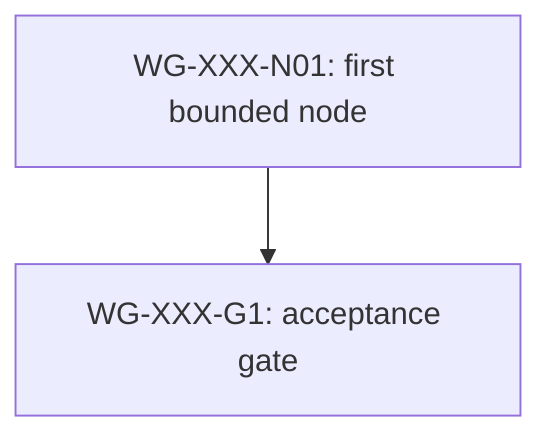

# Work Graph: WG-XXX

Status: `<DRAFT | PLANNED | ACTIVE | BLOCKED | COMPLETE | SUPERSEDED>`
Work Graph ID: `<WG-XXX>`
Work Graph Revision: `<INTEGER>`
Owner: `<ROLE_OR_WORKLINE>`
Merge Owner: `<ROLE_OR_WORKLINE>`
Scope: `<TASK | STORY | EPIC>`
Terminal Gate: `<WG-XXX-GX>`

A work graph coordinates non-atomic work across worklines, dependency gates,
execution surfaces, dispatch state, evidence joins, invalidation, and closeout.
It is not an architecture topology, an automatic scheduler, or authorization
to create agents, tasks, branches, worktrees, external actions, or spending.

ID contract:

- graph: `WG-XXX`;
- node: `WG-XXX-NXX`;
- gate: `WG-XXX-GX`;
- every ID is graph-scoped, unique, and never reused.

## Purpose And Success

- Purpose:
- Success criteria:
- Non-goals:

## Source Identity And Preconditions

| Input | Current Identity / State | Required Disposition |
|---|---|---|
| Request | `<REFERENCE>` | `<REQUIRED_ACTION>` |
| Current source | `<BRANCH_COMMIT_DIRTY_DIFF>` | `<PRESERVE_OR_CHANGE>` |
| Worklines | `<W-XXX>` | `<OPEN_COMPLETE_BLOCKED>` |
| Prior evidence | `<REPORT_OR_RECEIPT>` | `<CURRENT_HISTORICAL_REJECTED>` |

## Workline Registry

| Workline | Purpose | Owner | Writes | Requires | Produces | Status |
|---|---|---|---|---|---|---|
| `<W-XXX>` | `<BOUNDED_SLICE>` | `<OWNER>` | `<PATHS>` | `<INPUTS>` | `<RECEIPT_OR_SEAM>` | `<STATUS>` |

## Execution Surface And Dispatch Manifest

Work-graph readiness establishes eligibility only. It never authorizes or
performs dispatch.

| Nodes / Workline | Execution Surface | Dispatch State | Authorization Evidence | Runtime Handle | Eligible After | Merge Owner |
|---|---|---|---|---|---|---|
| `<NODE_OR_RANGE>` | `<root | internal-subagent | user-visible-task>` | `<NOT_AUTHORIZED | AUTHORIZED | DISPATCHED | RUNNING | BLOCKED | COMPLETE>` | `<REQUEST_OR_APPROVAL | none>` | `<AGENT_OR_TASK_ID | none>` | `<DEPENDENCY_GATE>` | `<OWNER>` |

## Work Topology

## Node Registry

| Node | Workline | Outcome | Requires | Produces | State |
|---|---|---|---|---|---|
| `<WG-XXX-NXX>` | `<W-XXX>` | `<IMPLEMENTATION_OR_VALIDATION_OUTCOME>` | `<DEPENDENCIES>` | `<ARTIFACT_OR_RECEIPT>` | `<OPEN_BLOCKED_RUNNING_COMPLETE>` |

## Gate Contracts

### `<GATE_ID>`

Required inputs:

- `<INPUT_AND_SOURCE_IDENTITY>`

Acceptance:

- `<MECHANICAL_ACCEPTANCE_RULE>`

## Invalidation And Repair

| Changed Contract Or Failure | Invalidates | Preserves |
|---|---|---|
| `<CHANGE_OR_FAILURE>` | `<NODES_GATES_EVIDENCE>` | `<UNAFFECTED_EVIDENCE>` |

## Validation Plan

| Check | Command Or Evidence | Status |
|---|---|---|
| `<CHECK>` | `<COMMAND_OR_RECEIPT>` | `<OPEN_PASS_FAIL_BLOCKED_NOT_RUN>` |

## Current Frontier

- Eligible node:
- Blocked nodes and reason:
- Dispatch authorization:
- Runtime handles:
- Next gate:

## Lifecycle And Closeout

1. `DRAFT`: topology or ownership is incomplete; do not register as active.
2. `PLANNED`: structure is validated and registered; every node remains
   declarative until separately authorized.
3. `ACTIVE`: at least one authorized node is dispatched or running.
4. `BLOCKED`: the current frontier cannot proceed; record the exact dependency,
   authority, runtime, or evidence blocker.
5. `COMPLETE`: the terminal gate accepts current-source implementation and
   required evidence; synchronize worklines and receipts.
6. `SUPERSEDED`: a named replacement owns the remaining scope; never rewrite
   unfinished or failed evidence as complete.
7. Historical projection: after `COMPLETE` or `SUPERSEDED`, retain the durable
   graph/report and receipts, then remove the graph and its terminal worklines
   from `docs/work/active.md` during the same closeout.

Closeout receipt:

- Terminal source identity:
- Accepted gates:
- Preserved reports and receipts:
- Active-registry cleanup:
- Remaining risk:
