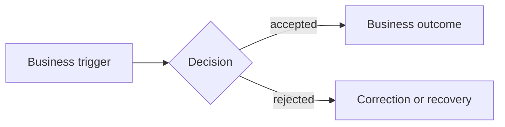
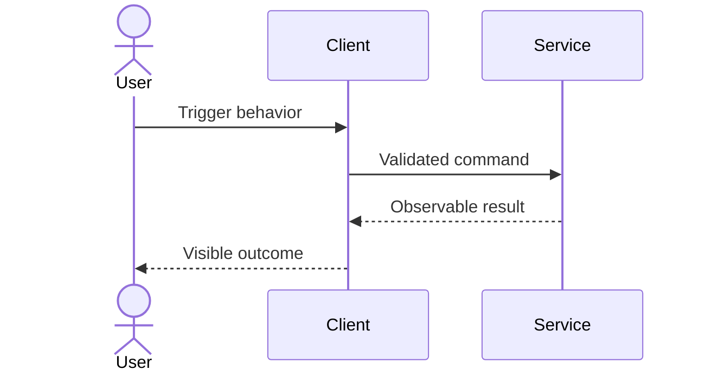
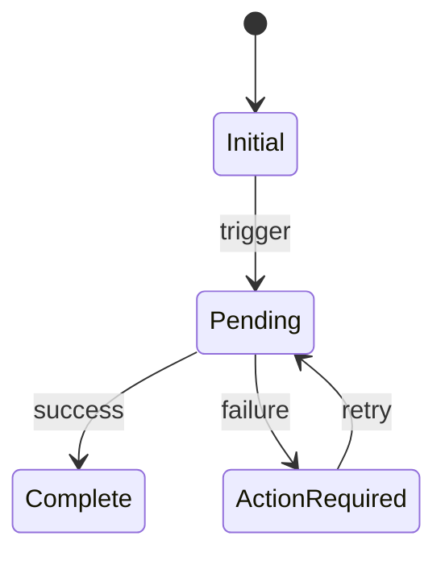

# {{Feature Or Change Name}}

> Remove guidance, unused sections, and all unresolved template placeholders
> before marking this document ready.

| Field | Value |
|---|---|
| Specification readiness | `READY_FOR_REVIEW / READY_FOR_IMPLEMENTATION / NEEDS_INPUT / BLOCKED` |
| Delivery state | `NOT_STARTED / IN_PROGRESS / COMPLETE / SUPERSEDED` |
| Validation evidence | `NOT_RUN / PASS / FAIL / BLOCKED` |
| Change type | `FEATURE / CHANGE / FIX / MIGRATION / DEPRECATION` |
| Owner | {{Accountable owner}} |
| Primary readers | {{Product, design, engineering, QA, operations, support}} |
| Source identity | {{Request, issue, research, or decision reference}} |
| Current implementation reference | {{Branch, version, paths, or NOT_INSPECTED}} |
| Last updated | {{YYYY-MM-DD}} |

## Readiness

**Status:** `READY_FOR_REVIEW / READY_FOR_IMPLEMENTATION / NEEDS_INPUT / BLOCKED`

**Why:** {{Concise basis describing the highest safe use of this packet.}}

**Evidence boundary:** {{What is OBSERVED, NOT_INSPECTED, NOT_RUN, PASS, FAIL,
or BLOCKED.}}

## At A Glance

**Outcome:** {{One sentence describing the user or business outcome.}}

**What changes:** {{Current behavior becomes target behavior.}}

**Who is affected:** {{Primary and secondary users or systems.}}

**Decision needed:** {{Decision, review, or “none.”}}

**Largest risk or unknown:** {{One material item.}}

**Truth summary:** {{Separate CURRENT versus TARGET behavior, DECIDED versus
PROPOSED authority, and OBSERVED/PASS/FAIL/NOT_RUN evidence.}}

## Product And Change

### Problem And Trigger

{{Describe the real problem, who experiences it, and when the need begins.}}

### Users And Value

| User Or Stakeholder | Need | Value Or Outcome | Evidence Or Source |
|---|---|---|---|
| {{Actor}} | {{Need in the actor's language}} | {{Observable benefit}} | {{Reference or ASSUMPTION}} |

### Product Rules

- `BR-01` — {{Unambiguous business rule.}}
- `BR-02` — {{Permission, limit, timing, or ownership rule.}}

### Success Measures

| Measure | Baseline | Target | Window | Evidence Owner |
|---|---:|---:|---|---|
| {{Measure}} | {{Known value or UNKNOWN}} | {{Target}} | {{Period}} | {{Owner}} |

### Non-Goals

- {{Behavior, user, system, or outcome intentionally excluded.}}

### Feature Or Change Contract

### Current Behavior

`CURRENT`

{{Describe what the current implementation and evidence show. Cite exact
paths, contracts, screens, or runs.}}

### Target Behavior

`TARGET`

{{Describe the intended behavior in user-visible and system-observable terms.}}

### Exact Delta

| Area | Current | Target | Preserved Behavior |
|---|---|---|---|
| {{Area}} | {{Current}} | {{Target}} | {{Must not regress}} |

### Preconditions And Completion

| Item | Condition |
|---|---|
| Entry trigger | {{User action, event, schedule, state transition, or external message}} |
| Preconditions | {{Permissions, state, data, configuration, dependency health}} |
| Successful completion | {{Observable result and durable state}} |
| Partial completion | {{What can be pending or incomplete}} |
| Failure completion | {{Terminal failure state and recovery path}} |

## Expected Outputs

| ID | Consumer | Trigger | Observable Output | Durable State Or Side Effect | Design Ref | Evidence Target |
|---|---|---|---|---|---|---|
| `OUT-01` | {{User or system}} | {{Trigger}} | {{Visible result, response, message, file, or event}} | {{Write, event, job, cost, or none}} | {{`DES-01:V01` or none}} | {{Scenario, test, metric, receipt, or NOT_RUN}} |

For each output, state what is not implied. For example, a recommendation does
not imply an order, a `200` response does not imply durable closeout, and a
screen transition does not imply persisted state.

## User Journeys

### Journey Summary

| Journey | Actor | Starting Trigger | Intended Outcome | Priority | Scenario IDs |
|---|---|---|---|---|---|
| `J-01 Main` | {{Actor}} | {{Trigger}} | {{Outcome}} | `REQUIRED` | {{IDs}} |
| `J-02 Alternate` | {{Actor}} | {{Trigger}} | {{Outcome}} | {{Required or optional}} | {{IDs}} |
| `J-03 Failure And Recovery` | {{Actor}} | {{Failure trigger}} | {{Safe recovery outcome}} | `REQUIRED` | {{IDs}} |

### J-01 — {{Journey Name}}

| Step | Actor | Trigger Or Action | System Response | Visible Result | Design Ref | State Carried | Alternate Or Recovery |
|---:|---|---|---|---|---|---|---|
| 1 | {{Actor}} | {{Action}} | {{Response}} | {{What the actor sees}} | {{`DES-01:V01` or none}} | {{Relevant state}} | {{Branch or none}} |

Cover permission-denied, duplicate action, stale state, dependency delay,
partial success, retry, cancellation, and resume only when reachable and
material.

## Sources And References (Compact Packets Only)

- `{{Source ID}}` — {{Exact path, URL, version, or “none supplied”}}:
  {{claim supported}}.

Use this short list only for compact packets. Standard and cross-boundary
packets use the ledger and manifest below; never include both forms.

## Source Ledger (Standard And Cross-Boundary Packets)

| Source ID | Owner And Version | Claims Supported | Behavior Time | Authority | Source Inspection | Behavior Evidence | Exact Reference |
|---|---|---|---|---|---|---|---|
| {{ID}} | {{Owner, date, version}} | {{Claims}} | `CURRENT / TARGET` | `DECIDED / PROPOSED / CONFLICTING / UNKNOWN` | `INTERACTION_INSPECTED / VISUALLY_INSPECTED / STRUCTURE_INSPECTED / REFERENCE_ONLY / NOT_INSPECTED` plus selected scope | `OBSERVED / NOT_INSPECTED / NOT_RUN / PASS / FAIL / BLOCKED` | {{Path, URL, heading, frame, operation}} |

## Artifact Manifest (Standard And Cross-Boundary Packets)

| Artifact ID | Artifact | Decision | Owner And Version | Behavior Time | Authority | Source Inspection | Behavior Evidence | Selected Scope | Exact Reference |
|---|---|---|---|---|---|---|---|---|---|
| `SPEC-01` | This spec | `CREATE / UPDATE` | {{Owner and version}} | `TARGET` | {{Authority}} | `STRUCTURE_INSPECTED` | {{Evidence}} | feature/change contract | {{Path}} |
| `DES-01` | {{Product, mockup, prototype, contract, context}} | `LINK / UPDATE / NO_CHANGE` | {{Owner and version}} | `CURRENT / TARGET` | `DECIDED / PROPOSED / CONFLICTING / UNKNOWN` | {{Inspection mode and exact states/viewports inspected}} | `OBSERVED / NOT_INSPECTED / NOT_RUN / PASS / FAIL / BLOCKED` | {{Selected sections, frames, or states only}} | {{Path or URL plus page, frame, node, anchor, viewport, and version}} |

## Business Process

**Question answered:** {{How work moves across business actors.}}

**Audience:** {{Product, operations, design, engineering, QA, or support.}}

**Scope and abstraction:** {{Roles and business handoffs in scope.}}

**Behavior time:** `CURRENT / TARGET`

**Render/syntax evidence:** `PASS / FAIL / NOT_RUN` — {{Tool and artifact
reference when run, or reason not run.}}

### Process Text Equivalent

| Step | Owner | Input Or Trigger | Rule Or Decision | Output Or Handoff | Failure Or Recovery |
|---:|---|---|---|---|---|
| 1 | {{Role}} | {{Trigger}} | {{Rule}} | {{Output}} | {{Recovery}} |

## Component Responsibilities

| ID | Component Or Actor | Responsibility | Accepts | Emits | State Owned | Integration IDs | Visible Effect |
|---|---|---|---|---|---|---|---|
| `CMP-01` | {{Component}} | {{One bounded responsibility}} | {{Commands, events, calls}} | {{Responses, events, jobs}} | {{State or none}} | {{INT IDs}} | {{User-visible result or none}} |

### Technical Process Or Interaction

**Question answered:** {{How participating components complete the behavior.}}

**Audience:** {{Engineering, QA, operations, or support.}}

**Scope and abstraction:** {{Components and one runtime interaction.}}

**Behavior time:** `CURRENT / TARGET`

**Render/syntax evidence:** `PASS / FAIL / NOT_RUN` — {{Tool and artifact
reference when run, or reason not run.}}

**Text equivalent:** {{Describe the ordered interaction, including relevant
guards, acknowledgment, state change, failure, and recovery.}}

## Integrations And Triggers

### Integration Inventory

| ID | Source | Destination | Kind | Purpose | Machine Contract | Owner |
|---|---|---|---|---|---|---|
| `INT-01` | {{Source}} | {{Destination}} | `HTTP / EVENT / JOB / FILE / DATA / PROVIDER` | {{Purpose}} | {{OpenAPI, AsyncAPI, schema, protocol, or UNKNOWN}} | {{Owner}} |

### INT-01 — {{Integration Name}}

| Concern | Contract |
|---|---|
| Initiating actor or event | {{Who or what starts it}} |
| Exact trigger | {{Action, endpoint, event, schedule, or state transition}} |
| Guards and preconditions | {{Validation, state, feature/config gates}} |
| Permission and scope | {{Auth, role, tenant, account, resource scope}} |
| Transport and operation | {{Protocol, method, channel, job, file, query}} |
| Inputs | {{Required fields, versions, validation, sensitive fields}} |
| Outputs or acknowledgment | {{Response, event, receipt, callback, or none}} |
| Completion semantics | {{What synchronous success, accepted, pending, and complete mean}} |
| Ordering and concurrency | {{Ordering, locks, races, stale-write behavior}} |
| Idempotency and duplicates | {{Key, scope, retention, duplicate result}} |
| Timeout, retry, and limits | {{Timeout, backoff, attempts, rate limits}} |
| State and side effects | {{Writes, events, notifications, costs, inventory, external mutation}} |
| Partial failure | {{What may have happened and how it is detected}} |
| Compensation or reconciliation | {{Rollback, repair, polling, manual action}} |
| User-visible states | {{Loading, pending, success, empty, degraded, failure, recovery}} |
| Error translation | {{Stable categories and prohibited raw details}} |
| Observability | {{Logs, metrics, traces, correlation IDs, receipts, alerts}} |
| Acceptance evidence | {{Exact test, scenario, provider proof, or NOT_RUN}} |

Repeat the detail block for every material integration. Do not combine
different completion or failure semantics into one generic row.

## State And Data

### Lifecycle

**Question answered:** {{Which durable transitions are legal?}}

**Audience:** {{Engineering, QA, operations, support.}}

**Scope and abstraction:** {{Lifecycle and state owner in scope.}}

**Behavior time:** `CURRENT / TARGET`

**Render/syntax evidence:** `PASS / FAIL / NOT_RUN` — {{Tool and artifact
reference when run, or reason not run.}}

### Transition Text Equivalent

| From | Trigger | Guard | To | State Owner | Side Effect | Visible Result |
|---|---|---|---|---|---|---|
| {{State}} | {{Trigger}} | {{Guard}} | {{State}} | {{Owner}} | {{Effect}} | {{Result}} |

### Data Changes

| Data Or Field | Owner | Read Or Write Path | Validation | Retention Or Sensitivity | Migration Or Compatibility |
|---|---|---|---|---|---|
| {{Data}} | {{Owner}} | {{Path}} | {{Rules}} | {{Rules}} | {{Plan or none}} |

State the source of truth. For duplicated data, name the update path, staleness
tolerance, reconciliation owner, and validation evidence.

## Invariants And Enforcement

| ID | Invariant | Durable Enforcement Point And Mechanism | Race Or Exception | Recovery Or Repair | Acceptance Evidence |
|---|---|---|---|---|---|
| `INV-01` | {{Rule that must always hold}} | {{Database constraint, transaction, durable receipt guard, state-machine guard, or other exact mechanism}} | {{Concurrent, stale, replay, transition, or external-outcome case}} | {{Deterministic repair or manual owner}} | {{Scenario, test, receipt, or NOT_RUN}} |

If a material invariant has no mechanism that survives its named races and
state transitions, stop at `NEEDS_INPUT` rather than completing this template.

## Experience And Design

Define each full design reference once in the Artifact Manifest. Reuse its
stable `DES-01:V01` identifier below and in journeys, acceptance, and
traceability. Read `references/mockup-guide.md` when a visual artifact is
supplied or material.

| Design Ref | Surface Or State | Role And Viewport | User Need | Required Behavior | Source Inspection | Gaps Or Conflicts | Accessibility And Content | Behavior Evidence | Acceptance |
|---|---|---|---|---|---|---|---|---|---|
| `DES-01:V01` | {{Screen, notification, file, or voice state}} | {{Role, viewport, theme/language}} | {{Need}} | {{Behavior}} | `INTERACTION_INSPECTED / VISUALLY_INSPECTED / STRUCTURE_INSPECTED / REFERENCE_ONLY / NOT_INSPECTED` — {{exact scope}} | {{`NONE`, `NOT_SHOWN`, or conflict}} | {{Keyboard, screen reader, focus, errors, wording, responsive behavior}} | `OBSERVED / NOT_INSPECTED / NOT_RUN / PASS / FAIL / BLOCKED` | `AC-01` |

Describe or link:

- entry and exit points;
- loading, empty, partial, permission, degraded, failure, recovery, and success
  states;
- responsive behavior and content hierarchy;
- focus, keyboard, screen-reader, motion, contrast, and error behavior;
- design decisions that differ from existing patterns.

For every visible control, map the design ID to its exact trigger, operation,
guard, completion, denied state, and recovery in the journey or integration
contract. Do not infer an approved global rule, unseen state, interaction,
responsive behavior, or implementation parity from one feature mockup.

## Acceptance And Evidence

| Criterion | Given | When | Then | Boundary | Design Ref | Evidence Type | Status |
|---|---|---|---|---|---|---|---|
| `AC-01` | {{Precondition}} | {{Trigger}} | {{Observable outcome and durable effect}} | {{UI, API, event, data, provider, job}} | {{`DES-01:V01` or none}} | {{Automated, manual, visual comparison, scenario, receipt}} | `PASS / FAIL / BLOCKED / NOT_RUN` |

Include:

- main outcome and every required expected output;
- material permission, validation, duplicate, timeout, partial-failure, and
  recovery behavior;
- preserved behavior at regression risk;
- durable-state or external-effect proof when visible success alone is
  insufficient.

## Rollout And Operations

| Concern | Decision Or Requirement |
|---|---|
| Compatibility | {{Clients, data, events, versions}} |
| Migration | {{Order, backfill, dual-read/write prohibition or need}} |
| Release control | {{Flag, cohort, environment, approval}} |
| Monitoring | {{Signals and expected ranges}} |
| Rollback | {{Safe reversal and irreversible effects}} |
| Support and runbook | {{User support, alerts, manual recovery}} |

## Decisions And Assumptions

### Decisions

| ID | Decision | Why | Owner | Source | Date |
|---|---|---|---|---|---|
| `DEC-01` | {{Decision}} | {{Rationale and tradeoff}} | {{Owner}} | {{Reference}} | {{Date}} |

### Assumptions

| ID | Assumption | Impact If False | Validation Or Owner |
|---|---|---|---|
| `ASM-01` | {{Assumption}} | {{Impact}} | {{Check or owner}} |

## Open Decisions And Risks

| ID | Type | Decision Or Risk | Why It Matters | Recommended Default Or Mitigation | Owner | Next Action | Readiness Effect |
|---|---|---|---|---|---|---|---|
| `OPEN-01` | `DECISION / RISK` | {{Item}} | {{Affected behavior or boundary}} | {{Default, mitigation, or none}} | {{Owner}} | {{Exact action}} | `BLOCKS_REVIEW / BLOCKS_IMPLEMENTATION / DOES_NOT_BLOCK` |

## Traceability

| Product Rule Or Output | Journey | Component Or Integration | Design Ref And State | Acceptance | Work Item |
|---|---|---|---|---|---|
| `BR-01 / OUT-01` | `J-01` | `CMP-01 / INT-01` | `DES-01:V01` — {{State}} | `AC-01` | {{Task ID or none}} |

## Next Owner Or Action

**Owner:** {{One accountable person, role, or team.}}

**Action:** {{Review, answer, design, implement, validate, or supersede one
exact artifact or gate.}}
