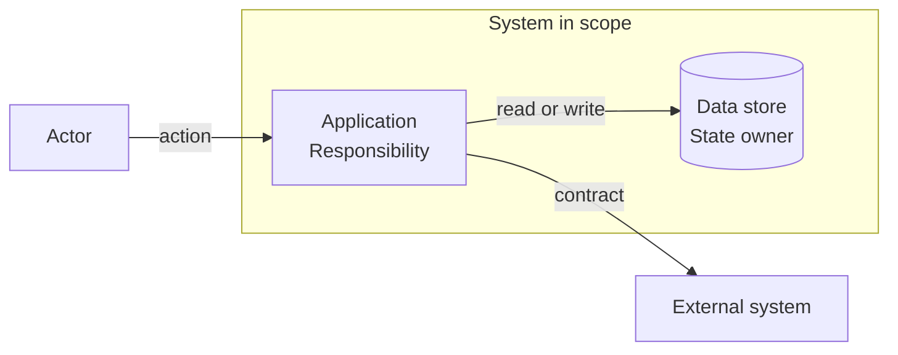
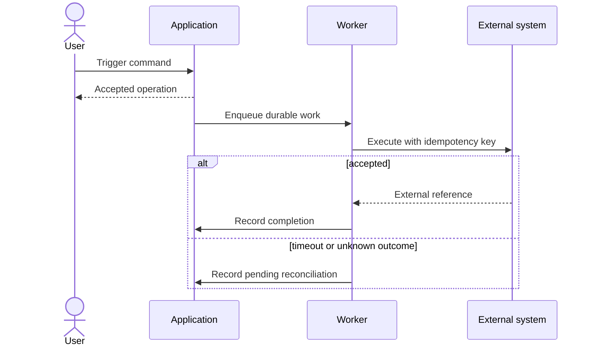
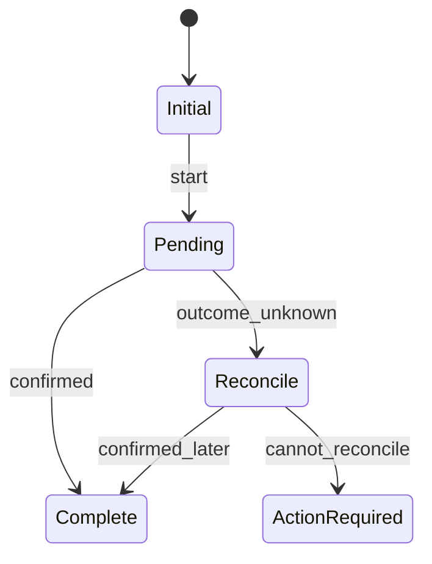

# Technical Design — {{Feature, Change, Or Task Name}}

> Create this companion only when the primary spec needs cross-boundary design,
> state, data, reliability, migration, security, or integration decisions.
> Link to product intent; do not repeat it.

| Field | Value |
|---|---|
| Specification readiness | `READY_FOR_REVIEW / READY_FOR_IMPLEMENTATION / NEEDS_INPUT / BLOCKED` |
| Delivery state | `NOT_STARTED / IN_PROGRESS / COMPLETE / SUPERSEDED` |
| Validation evidence | `NOT_RUN / PASS / FAIL / BLOCKED` |
| Parent spec | {{Exact reference}} |
| Design owner | {{Owner}} |
| Reviewers | {{Architecture, security, data, operations, design, QA as needed}} |
| Current implementation | {{Version and paths, or NOT_INSPECTED}} |
| Last updated | {{YYYY-MM-DD}} |

## Design Summary

**Decision:** {{One paragraph describing the selected design.}}

**Why this design:** {{Constraints and tradeoff that matter.}}

**What remains unchanged:** {{Preserved boundaries and contracts.}}

**Largest technical risk:** {{Risk or unknown.}}

## Goals, Constraints, And Quality

| ID | Type | Requirement | Measure Or Evidence |
|---|---|---|---|
| `TD-01` | `GOAL / CONSTRAINT / QUALITY` | {{Requirement}} | {{Latency, capacity, reliability, security, operability, maintainability, or test evidence}} |

## Current And Target Design

| Concern | Current | Target | Compatibility Or Migration Note |
|---|---|---|---|
| {{Boundary, state, call, job, data}} | {{Current truth}} | {{Target decision}} | {{Note}} |

## Context And Boundaries

**Question answered:** {{Which people, systems, and external dependencies are
inside or outside this design.}}

**Audience:** {{Architecture, engineering, security, data, or operations.}}

**Scope and abstraction:** {{System/context boundary in scope.}}

**Behavior time:** `CURRENT / TARGET`

**Render/syntax evidence:** `PASS / FAIL / NOT_RUN` — {{Tool and artifact
reference when run, or reason not run.}}

**Text equivalent:** {{Describe every relevant actor, boundary, responsibility,
and external relationship.}}

## Building Blocks

| ID | Component | Owns | Public Input | Public Output | State | Must Not Own |
|---|---|---|---|---|---|---|
| `C-01` | {{Component}} | {{Responsibility and invariants}} | {{Commands, calls, events}} | {{Responses, events, jobs}} | {{State or none}} | {{Boundary protection}} |

Explain new abstractions only when they hide a real invariant, costly boundary,
or repeated complexity. Name direct and hidden consumers of changed public
contracts.

## Runtime Interaction

**Question answered:** {{What happens in order across the material boundaries?}}

**Audience:** {{Engineering, QA, operations, or support.}}

**Scope and abstraction:** {{One runtime interaction and its failure path.}}

**Behavior time:** `CURRENT / TARGET`

**Render/syntax evidence:** `PASS / FAIL / NOT_RUN` — {{Tool and artifact
reference when run, or reason not run.}}

### Interaction Text Equivalent

| Step | Initiator | Trigger Or Message | Receiver | Guard | State Change | Failure Or Recovery |
|---:|---|---|---|---|---|---|
| 1 | {{Component}} | {{Trigger}} | {{Component}} | {{Guard}} | {{Change}} | {{Behavior}} |

## Integration Contracts

| ID | Boundary | Contract Reference | Auth And Scope | Completion | Idempotency | Failure Translation | Evidence |
|---|---|---|---|---|---|---|---|
| `I-01` | {{Source to destination}} | {{Schema or protocol}} | {{Rules}} | {{Success, accepted, pending, complete}} | {{Rule}} | {{Stable errors}} | {{Test or NOT_RUN}} |

For each material integration, record request or message versioning, required
fields, validation, timeout, retry, ordering, duplicate behavior, rate limits,
unknown-outcome recovery, compensation, observability, and user-visible state.

## State Model

**Question answered:** {{Which durable transitions are allowed?}}

**Audience:** {{Engineering, QA, operations, or support.}}

**Scope and abstraction:** {{Lifecycle and state owner in scope.}}

**Behavior time:** `CURRENT / TARGET`

**Render/syntax evidence:** `PASS / FAIL / NOT_RUN` — {{Tool and artifact
reference when run, or reason not run.}}

| From | Trigger | Guard | To | Owner | Transaction Or Atomicity | Side Effects |
|---|---|---|---|---|---|---|
| {{State}} | {{Trigger}} | {{Guard}} | {{State}} | {{Owner}} | {{Boundary}} | {{Effects}} |

## Invariants And Enforcement

| ID | Invariant | Durable Enforcement Point And Mechanism | Race Or Exception | Recovery Or Repair | Acceptance Evidence |
|---|---|---|---|---|---|
| `INV-01` | {{Rule that must always hold}} | {{Exact database, transaction, durable receipt, or state-machine mechanism}} | {{Concurrent, stale, replay, transition, or unknown-outcome case}} | {{Deterministic repair and owner}} | {{Test, scenario, receipt, or NOT_RUN}} |

Do not call this design implementation-ready when a material invariant relies
only on a UI guard, service intention, or diagram.

## Data Design

| Actor Or Component | Data Owner | Operation | Filter Or Key | Cardinality And Frequency | Freshness | Lifecycle | Evidence |
|---|---|---|---|---|---|---|---|
| {{Actor}} | {{Owner}} | {{Read or write}} | {{Key}} | {{Shape}} | {{Tolerance}} | {{Retention, deletion, migration}} | {{Check}} |

For every duplicated value, name the source of truth, copied target, update
path, staleness tolerance, reconciliation owner, and validation check.

## Security, Privacy, And Tenancy

| Concern | Boundary And Rule | Failure Mode | Evidence Or Review |
|---|---|---|---|
| Identity and permission | {{Authentication, authorization, role, resource}} | {{Denied or confused-deputy behavior}} | {{Check}} |
| Tenant or account scope | {{Propagation and filters}} | {{Cross-scope risk}} | {{Check}} |
| Sensitive data | {{Collection, minimization, storage, logs, retention}} | {{Exposure risk}} | {{Check}} |
| Abuse and limits | {{Rate, size, replay, bulk, cost controls}} | {{Abuse outcome}} | {{Check}} |

## Reliability And Operations

| Concern | Design | Signal | Threshold Or Decision | Recovery Owner |
|---|---|---|---|---|
| Timeout and retry | {{Policy}} | {{Metric or trace}} | {{Threshold}} | {{Owner}} |
| Partial or unknown outcome | {{Detection and reconciliation}} | {{Receipt or alert}} | {{Decision}} | {{Owner}} |
| Capacity and backpressure | {{Limit and queue behavior}} | {{Metric}} | {{Threshold}} | {{Owner}} |
| Support and diagnosis | {{Correlation, logs, runbook}} | {{Evidence}} | {{Decision}} | {{Owner}} |

## Alternatives And Decisions

| ID | Option | Advantages | Costs Or Risks | Disposition | Decision Source |
|---|---|---|---|---|---|
| `ALT-01` | {{Option}} | {{Advantages}} | {{Costs}} | `SELECTED / REJECTED / DEFERRED` | {{Reference}} |

Record architecture decision records separately when a decision must outlive
this feature. Link them here.

## Migration, Rollout, And Rollback

| Phase | Change | Entry Gate | Compatibility | Observation | Rollback Or Repair |
|---|---|---|---|---|---|
| {{Phase}} | {{Change}} | {{Gate}} | {{Clients, data, events}} | {{Evidence}} | {{Action}} |

Name irreversible external effects and any point after which rollback becomes
compensation or forward repair.

## Validation

| Design Claim | Test Boundary | Method | Required Evidence | Status |
|---|---|---|---|---|
| {{Claim}} | {{Module, API, job, event, data, provider}} | {{Automated, local substitute, contract, live}} | {{Artifact}} | `PASS / FAIL / BLOCKED / NOT_RUN` |

Distinguish in-process tests, local substitutes, owned remote services, and
true external providers. Do not call a mocked provider check live evidence.

## Open Decisions And Risks

| ID | Type | Item | Impact | Recommended Default Or Mitigation | Owner | Next Action | Readiness Effect |
|---|---|---|---|---|---|---|---|
| `TDQ-01` | `DECISION / RISK` | {{Item}} | {{Impact}} | {{Default or mitigation}} | {{Owner}} | {{Exact action}} | `BLOCKS_REVIEW / BLOCKS_IMPLEMENTATION / DOES_NOT_BLOCK` |

## Readiness

**Status:** `READY_FOR_REVIEW / READY_FOR_IMPLEMENTATION / NEEDS_INPUT / BLOCKED`

**Unresolved review gates:** {{Items or none.}}

## Next Owner Or Action

**Owner:** {{One accountable person, role, or team.}}

**Action:** {{Review, decision, implementation, experiment, or validation.}}
