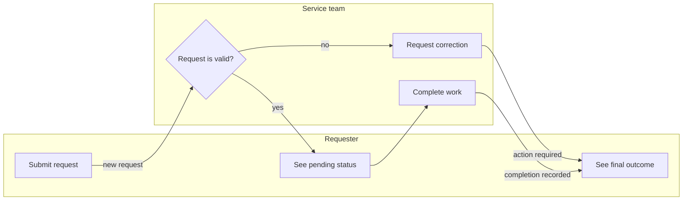
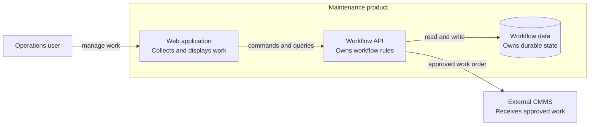
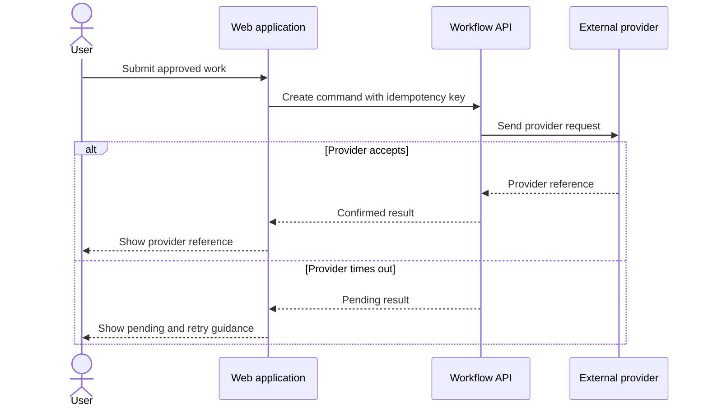
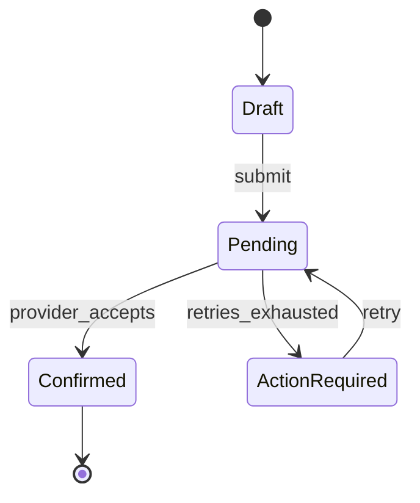

# Diagram Guide For Readable Software Specifications

Use a diagram only when it answers a reader question faster or more accurately
than a short paragraph or table. A diagram supplements the written contract; it
does not replace it.

## Select By Question

| Reader Question | Default Format | Use A More Formal Format When |
|---|---|---|
| What does the user do and experience? | journey table plus screen flow | a tested journey map already exists |
| How does work move across business roles? | Mermaid flowchart with actor lanes | timers, message events, gateways, compensation, or cross-organization semantics require BPMN |
| What is inside and outside the system? | C4-style system context diagram | the organization already owns another architecture notation |
| Which applications or data stores own responsibilities? | C4-style container diagram | deployment topology is the question, then use a deployment view |
| How do components or systems interact over time? | sequence diagram plus integration contract | a machine-readable workflow standard is already authoritative |
| What lifecycle states and transitions exist? | state diagram plus transition table | transition rules are better expressed as executable state-machine data |
| How does data relate? | compact entity-relationship diagram | the schema is unchanged or a field table is clearer |
| Which screens or states change? | screen map and annotated design references | pixel or spatial behavior needs a prototype or visual design file |
| What delivery work depends on what? | task dependency graph in the work plan | never place delivery dependencies in the business-process diagram |

## Default Notation Policy

- Prefer editable, versionable text diagrams for repository documentation.
- Use Mermaid flowchart, sequence, state, and entity-relationship syntax when
  the target renderer supports it.
- Use C4 concepts for architecture scope and abstraction even when the diagram
  is rendered as ordinary boxes and arrows.
- Use BPMN when formal business-process semantics matter. Do not imitate BPMN
  loosely with ambiguous symbols.
- Link to OpenAPI, AsyncAPI, JSON Schema, protocol, or provider contracts for
  machine-readable interface detail. A sequence diagram shows interaction and
  failure semantics; it is not the schema.
- Follow the target project's existing notation when it is current, legible,
  and understood by the intended readers.

## Contract For Every Diagram

Every diagram must include or sit beside:

1. a descriptive title;
2. the single question it answers;
3. intended audience;
4. scope and abstraction level;
5. behavior time: `CURRENT` or `TARGET`;
6. render/syntax evidence: `PASS`, `FAIL`, or `NOT_RUN`, plus the tool and
   artifact reference when a check ran;
7. a legend when notation is not self-explanatory;
8. domain labels and stable IDs where traceability matters;
9. verbs or data names on important arrows;
10. guards on conditional paths;
11. material timeout, failure, recovery, or compensation paths;
12. a complete text summary or canonical table;
13. source and evidence references.

The text or contract table is canonical when the rendered image and text
disagree.

Generated Mermaid text is not render evidence. When no renderer or syntax
validator ran against the exact block, report `NOT_RUN` rather than implying
that the diagram is valid.

## Clarity Rules

- One diagram answers one question at one abstraction level.
- Separate current and target diagrams. Do not encode the distinction only by
  color or line style.
- Keep business roles, software components, and delivery tasks in separate
  views.
- Name arrows with actions, messages, or data: “submit work order,” not “uses.”
- Name boxes by domain responsibility: “Scheduling service,” not “Backend 2.”
- Show only relevant neighbors. Link to a broader landscape instead of copying
  it.
- Prefer left-to-right for progression and top-to-bottom for hierarchy.
- Keep crossing lines and bidirectional arrows to a minimum.
- Quote Mermaid labels containing punctuation, parentheses, or reserved words.
- Avoid styling that carries unique meaning. Use labels and shapes as well as
  color.
- Break a diagram apart before shrinking labels or creating an unreadable wall.

## Business Process

Use a flowchart with actor lanes for an ordinary feature process. Include the
business trigger, decision points, handoffs, completion, and relevant failure
or recovery outcome.

Choose formal BPMN instead when the process needs precise message events,
timers, parallel or inclusive gateways, boundary events, compensation, or
collaboration across independent participants.

## System Context Or Component Responsibility

Use C4-style boundaries to show people, the software system in scope, and
direct external systems. Zoom to applications or data stores only when that
detail answers the current question.

Pair this with a component responsibility table. The diagram shows shape; the
table names accepted and emitted triggers, state ownership, and visible effects.

## Integration Sequence

Use a sequence diagram when ordering, acknowledgment, retries, callbacks,
timeouts, or partial completion matter.

Pair it with an integration contract that defines fields, auth, tenant scope,
completion semantics, idempotency, retries, state changes, failure translation,
observability, and evidence.

## Lifecycle State

Use a state diagram only for durable or behaviorally important states. Do not
turn every UI flag into a lifecycle state.

Pair it with a transition table:

| From | Trigger | Guard | To | Side Effect | Visible Result |
|---|---|---|---|---|---|
| Draft | submit | required fields valid | Pending | enqueue request | pending status |
| Pending | provider accepts | reference valid | Confirmed | store reference | confirmation |
| Pending | retries exhausted | no accepted response | ActionRequired | record failure category | retry action |

## User And Screen Flow

Keep a journey table canonical. Add a screen flow when navigation, branching,
or carried UI state is hard to see from the table. Link each screen node to an
annotated design or state definition when available.

Include loading, empty, partial, permission-denied, offline or degraded,
failure, recovery, and success states when they are reachable and materially
different.

## Accessibility

- Put a text summary directly before or after each diagram.
- For complex diagrams, provide a complete equivalent table or structured
  description, not only a short alt label.
- Do not use color, position, or line style as the only carrier of meaning.
- Use readable labels and meaningful link text.
- Keep source text available when a rendered image is also attached.
- Check that the document remains actionable if the diagram cannot render.

## Diagram Review

- [ ] The diagram answers one named question.
- [ ] Its audience, scope, and abstraction level are clear.
- [ ] It is labeled `CURRENT` or `TARGET`.
- [ ] Render/syntax evidence is `PASS`, `FAIL`, or explicitly `NOT_RUN`.
- [ ] Actors, systems, components, and tasks are not mixed carelessly.
- [ ] Important arrows have verbs, messages, or data labels.
- [ ] Conditions and relevant failure paths are shown.
- [ ] A complete text equivalent exists.
- [ ] The text and diagram agree.
- [ ] Labels work without color or visual styling.
- [ ] The diagram is small enough to read without zooming excessively.

## Primary Guidance Behind These Choices

- [C4 model](https://c4model.com/) defines audience-oriented system context,
  container, component, dynamic, and deployment views without requiring one
  notation or tool.
- [arc42](https://arc42.org/overview) separates goals, constraints, context,
  building blocks, runtime behavior, deployment, decisions, quality, risks,
  and glossary while encouraging proportional documentation.
- [OMG BPMN](https://www.omg.org/bpmn/) provides standardized business-process
  notation intended to bridge business and technical readers.
- [Mermaid flowcharts](https://mermaid.js.org/syntax/flowchart) and
  [sequence diagrams](https://mermaid.js.org/syntax/sequenceDiagram) provide
  editable text formats for common process and interaction views.
- [OpenAPI](https://spec.openapis.org/oas/latest.html) provides a
  machine-readable HTTP interface description for people and tools; diagrams
  should link to it rather than replace it.
- [W3C image guidance](https://www.w3.org/WAI/tutorials/images/) requires a
  complete text equivalent for complex diagrams.
